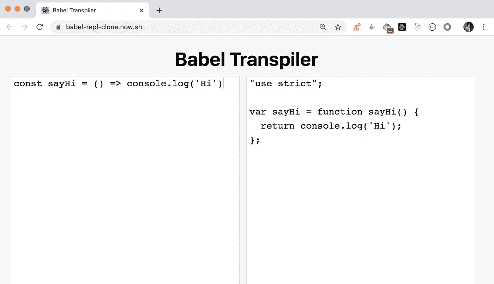
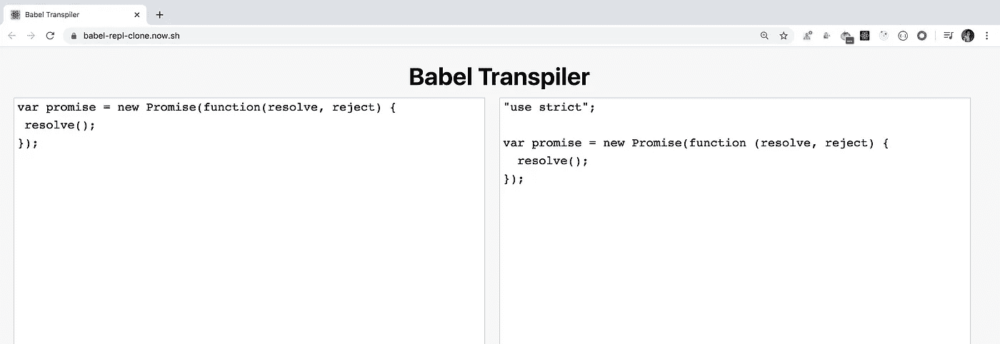
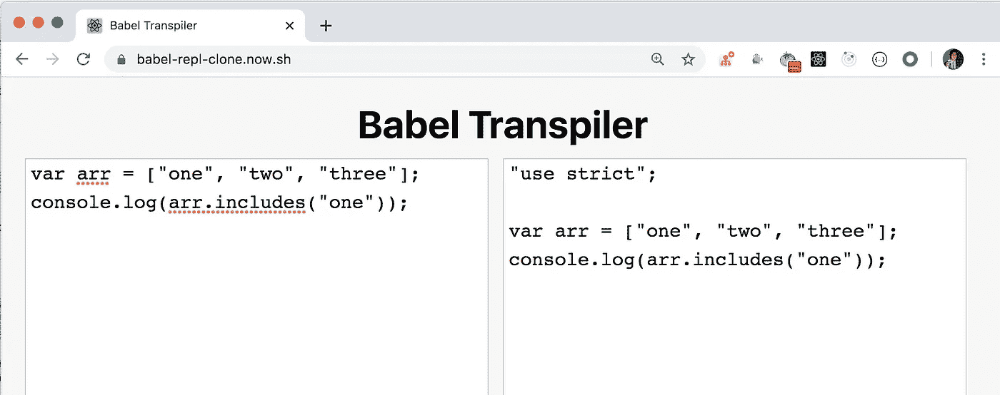
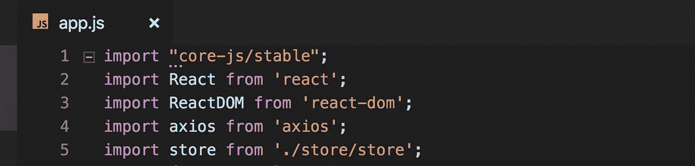
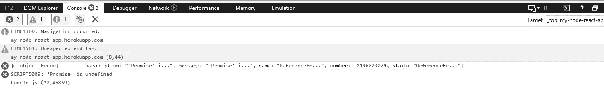
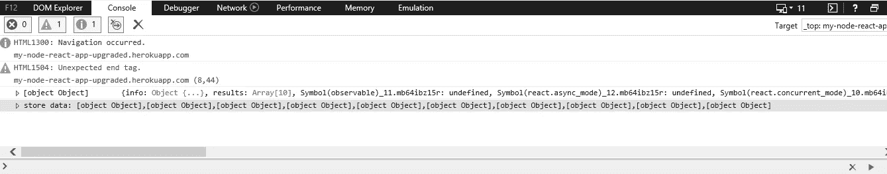

# 为什么您应该为每个 React 应用添加 babel polyfill

> 原文：<https://levelup.gitconnected.com/why-you-should-add-babel-polyfill-for-every-react-application-1997bdb8a524>

因为单独使用 babel 并不能保证你的代码能在所有浏览器上运行。


由 [Filiberto Santillán](https://unsplash.com/@filijs?utm_source=medium&utm_medium=referral) 在 [Unsplash](https://unsplash.com?utm_source=medium&utm_medium=referral) 上拍摄的照片

如你所知，最新的 ES6 特性如`promises`、`arrow functions`等可能不被旧的浏览器支持，所以我们使用`Babel`将代码转换成所有浏览器都能理解的 ES5 代码。

当我们使用`create-react-app`创建一个 React 应用程序时，它默认包含了`Babel`，用于 ES6 到 ES5 代码的转换。但是这不足以支持所有的浏览器。

打开[这个应用程序](https://babel-repl-clone.now.sh/)(在[这篇文章](/create-a-clone-of-babel-repl-site-to-convert-es6-react-code-to-es5-93cdc9ad98ea?source=friends_link&sk=517cfac3dfc4b451610eb298f36a428c)中创建)查看从 ES6 到 ES5 的转换，并粘贴以下代码

```
const sayHi = () => console.log('Hi')
```

您将看到 ES6 代码被转换为 ES5，如下所示



但是如果你粘贴下面的代码

```
var promise = new Promise(function(resolve, reject) {
 resolve();
});
```

你会看到巴别塔转换后的输出和输入完全一样。



因此，如果您的浏览器理解承诺，那么您的代码将正常工作，但对于 Internet explore 版本 11 或更低版本的旧浏览器，这些代码将不起作用。

因此，如果你的应用程序使用 promises 直接或间接使用`axios`或`superagent`库，那么你的应用程序将不能在 internet explorer 或更老的浏览器上工作。

让我们考虑一下`Array.prototype.includes`方法(ES7 中添加的),它用于检查数组中是否存在特定的元素。



如您所见，对于`Array.prototype.includes`方法，ES5 代码与输入相同，因此如果您在应用程序中的任何地方使用该方法，您的应用程序将无法在 Internet Explorer 上工作。

**长话短说**，仅仅使用 babel 还不足以让您的应用程序工作，因为并非所有浏览器都支持所有最新的 Javascript 特性。因此，要解决这个问题，我们需要使用一个聚合填充物。

如果您正在使用您自己的 webpack + babel 设置，如本文中的[或`create-react-app`所示，并且您正在使用高于或等于 7.4.0 的 **babel 版本，请通过从终端或命令提示符执行以下命令来安装 babel polyfill。**](https://medium.com/javascript-in-plain-english/webpack-and-babel-setup-with-react-from-scratch-bef0fe2ae3e7)

```
npm install core-js@3.6.5 --saveORyarn add core-js@3.6.5
```

> 因为这是一个多填充(将在你的源代码之前运行)，我们需要它是一个`*dependency*`而不是一个`*devDependency*`，所以我们添加了- save 标志

如果您使用的 npm 版本高于或等于 5.0.0，那么就不需要`--save`标志，因为它是默认隐含的。

*要找出你的* `*create-react-app*` *使用的是哪个版本的 babel，打开你项目文件夹中的* `*node_modules/react-scripts/package.json*` *文件，在* `*dependencies*` *部分查看* `*@babel/core*` *版本。*

一旦安装了 core-js 包，就在主`app.js`或`index.js`文件中的所有其他导入语句之前为它添加导入语句，如下所示

```
import "core-js/stable";
```



*就这样*。现在您的应用程序可以在 Internet Explorer 或任何其他旧浏览器上运行，即使您使用的是最新的 Javascript 特性，如`Array.from`方法、`Promises`或`Array.prototype.includes`等。

如果您正在使用自己的 webpack + babel 设置或`create-react-app`和

1.  如果您的 Babel 版本低于 7.4.0 且大于或等于 7.0.0

```
npm install @babel/polyfill@latest --saveORyarn add @babel/polyfill@latest
```

并且在主`app.js`或`index.js`中包括

```
import "@babel/polyfill";
```

2.如果你的 Babel 版本低于 7.0.0

```
npm install babel-polyfill@latest --saveORyarn add babel-polyfill@latest
```

并且在主`app.js`或`index.js`中包括

```
import "babel-polyfill";
```

就是这样。

如果你真的想确认这个行为，你可以在 Internet Explorer 11 中打开[这个应用](https://my-node-react-app.herokuapp.com/)(它是在[这篇文章](https://medium.com/javascript-in-plain-english/how-to-optimize-react-app-for-production-and-deploy-it-to-heroku-498fbf222de?source=friends_link&sk=9a2b48e4cafe7aaeca2cbd6f398d4f5d)中创建的)

您将看到页面是空白的，如果您打开控制台，您将看到一个错误消息`"Promise is undefined"`



现在，如果您在 Internet Explorer 11 中打开[这个应用程序](https://my-node-react-app-upgraded.herokuapp.com/)，它增加了对 babel polyfill 的支持，您可以看到该应用程序工作正常，redux 商店数据正确地显示在控制台中。



**所以一定要添加 babel polyfill 来支持老版本的浏览器。**

今天到此为止。我希望你学到了新东西。

**别忘了订阅我的每周简讯，里面有惊人的技巧、窍门和文章，直接在这里的收件箱** [**中。**](https://yogeshchavan.dev/)