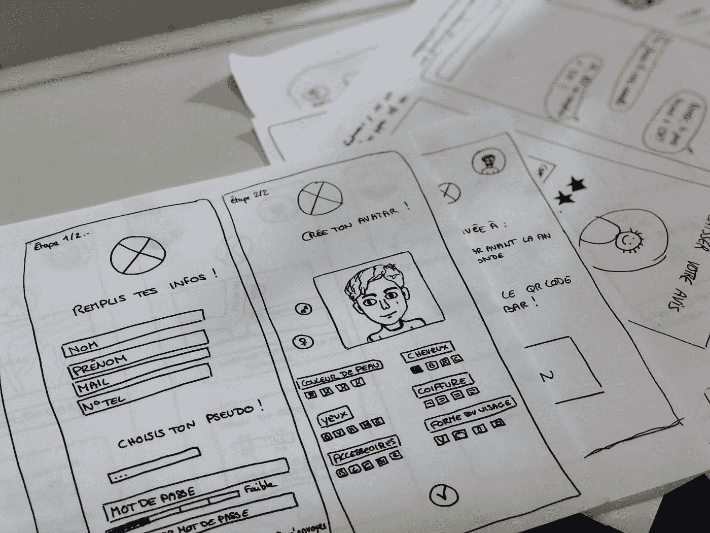
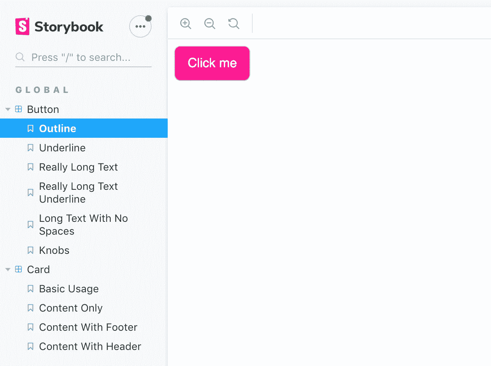
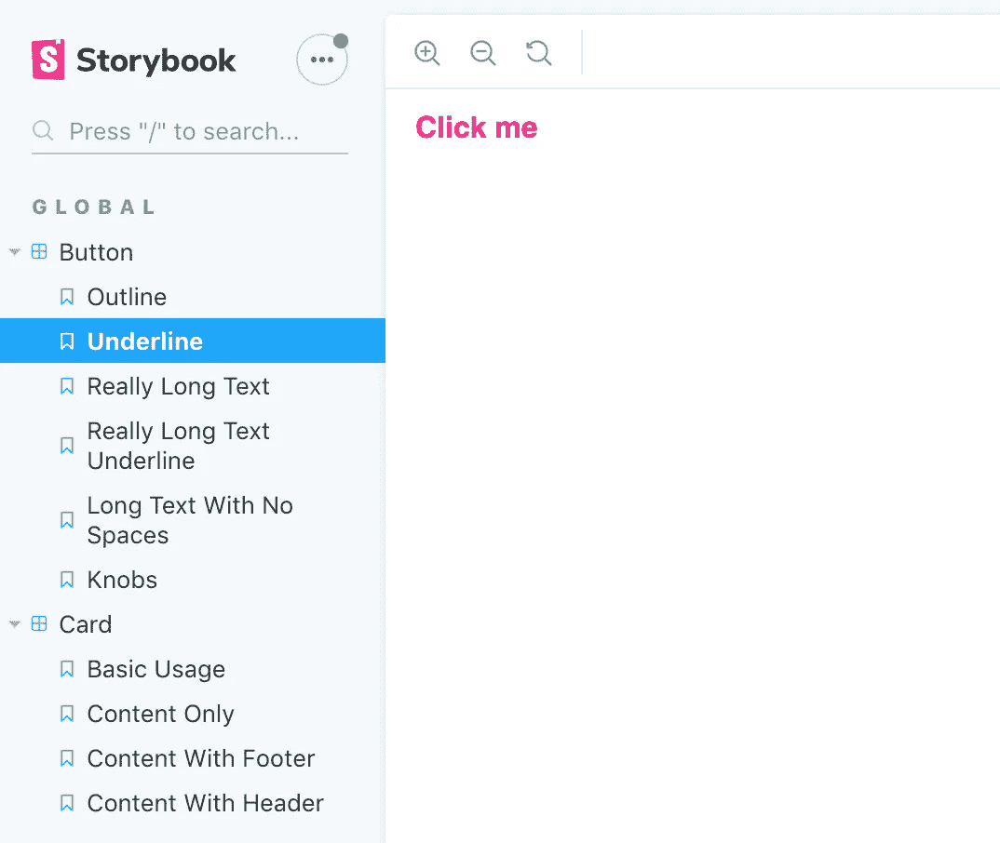
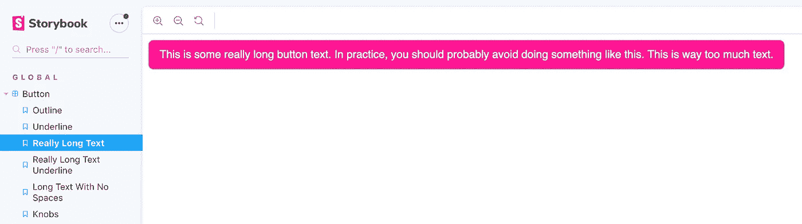
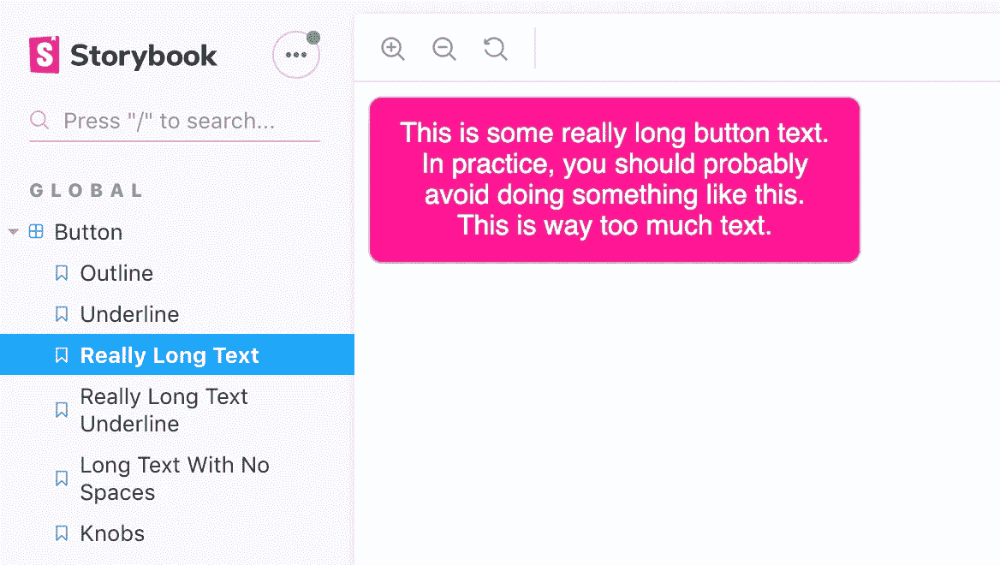
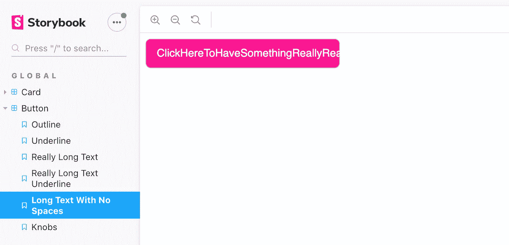
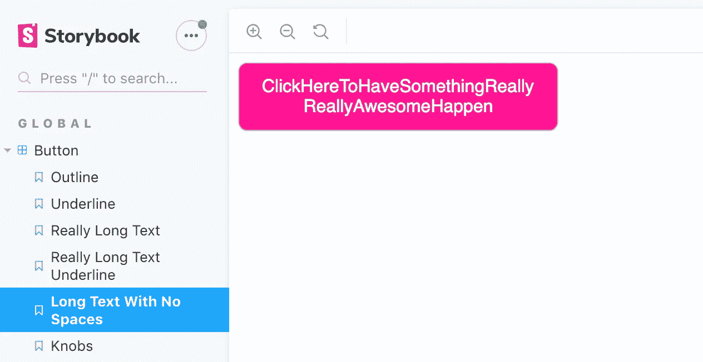

# 为什么在开发用户界面时应该总是使用故事书

> 原文：<https://levelup.gitconnected.com/why-you-should-always-use-storybook-when-developing-user-interfaces-4c69b93b2f65>

## Storybook 使测试、文档和知识共享变得容易

照片由 [Unsplash](https://unsplash.com?utm_source=medium&utm_medium=referral) 上的[艾米利·莫里雄](https://unsplash.com/@amayli?utm_source=medium&utm_medium=referral)拍摄

# 问题是

作为一名前端软件工程师，开发干净实用的用户界面是我工作的一大部分。确保 UI 完美地工作需要大量的测试:单元测试、手动测试、跨浏览器测试、移动响应测试、可访问性(a11y)测试等等。

还需要跨多个组件的设计一致性。所有的单个部分需要很好地协同工作，并且它们需要在视觉上取悦最终用户。此外，我们作为开发人员创建的组件需要符合我们团队的设计人员提出的设计和标准。

那么，我们如何以有效的方式实现这一切呢？

# 解决方案:故事书

进入故事书。他们的[主页](https://storybook.js.org/docs/basics/introduction/)以下面的文本片段开始:

> Storybook 是一个用户界面开发环境和 UI 组件的游乐场。该工具使开发人员能够独立创建组件，并在一个隔离的开发环境中交互展示组件。
> 
> Storybook 运行在主应用程序之外，因此用户可以独立开发 UI 组件，而不必担心应用程序特定的依赖关系和要求。

在我看来，故事书以四种主要方式提供解决方案:

1.  使得在应用程序之外独立构建组件变得容易。
2.  增加开发人员对现有组件的了解。
3.  充当生活方式指南和文件。
4.  使得直观测试边缘情况变得容易。

让我们详细讨论其中的每一个。

# 使得在应用程序之外独立构建组件变得容易。

你是否曾经开发过一个需要新 UI 组件的新功能，但是在你的应用程序中还没有一个位置来放置它们？也许主页还不存在。也许后端 API 端点还没有完全清空。也许你正在构建一个组件库，甚至没有一个应用程序来演示它们。

Storybook 是一个开发工具，它完全独立于你的实际应用程序运行。当进行本地开发时，您可以在本地主机上运行 Storybook。

在 Storybook 中，你创建了所谓的“故事”,它本质上只是一些小例子或演示。例如，如果您正在开发一个按钮组件，您可以为此创建一个故事。如果按钮组件有多种变体，那么也可以为其创建故事。例如，具有轮廓焦点样式的按钮的文章和具有下划线焦点样式的按钮的文章。

按钮组件的故事书示例

# 增加开发人员对现有组件的了解。

您是否曾经致力于创建一个新的组件，却发现在您的代码库中已经存在完全相同的组件(或者真正相似的组件)？然后发现三个月后另一个开发人员又创建了一个和前两个组件一样的组件？

这个问题很大程度上是由于缺少文档。不熟悉代码库的开发人员可能不知道已经有哪些资源可供他们使用。虽然他们可以向他们的同事询问这些信息，但是如果您的所有组件都被记录在某个地方不是很好吗？

故事书可以帮助你！

通过在 Storybook 中创建故事，您正在为您的软件工程师同事创建文档。任何浏览 Storybook 应用程序的人都可以鸟瞰你和你的团队已经创造了什么。

如果您在公司维护自己的组件库，这尤其有用。如果你使用 Storybook，向其他开发者展示你为他们创造的东西真的很容易:按钮、卡片、模态、菜单、工具提示等等。一切就绪，随时可供他们使用！

现在，开发人员可以浏览你的故事书应用程序，找到他们要找的东西，并使用现有的组件，而不是偶然创建许多做同样事情的组件。

带有下划线焦点样式的按钮！正是我需要的！

# 充当生活方式指南和文件。

大多数公司都有正式的风格指南，设计人员和开发人员都应该遵循。样式指南可以包括字体、认可的品牌颜色、图标和各种组件(例如，您公司的模态应该是什么样子)。

如果你的风格指南只是一个 PDF 的模型，那么设计和你实际交付的东西很容易产生分歧。没有人喜欢误导或过时的文档。

故事书示例是实际的代码示例，所以所见即所得。

如果你在故事书应用程序中看到一个模态组件，当你在实际应用程序中实现同样的模态组件时，这个模态组件看起来就像在故事书中一样。不再困惑！

# 使得直观测试边缘情况变得容易。

对我来说，这是最大的改变。你有没有遇到过一个复杂的组件，根据它的加载状态或给定的数据呈现不同的效果？您是否曾经不得不针对所有这些不同的状态手动测试应用中的组件？这些状态中有一些是几乎不可能复制的吗？或者在你的应用中涉及复杂的设置来让它们进入你想要测试的状态？

故事书有助于简化这一切！

回到按钮示例:您正在创建一个按钮组件。只是一个按钮。会有多难呢？嗯，事情可能比你最初想象的要复杂得多！

例如，如果你的按钮被传递了一个很长的文本字符串，会发生什么？

带有很长文本标签的按钮

哦不！这个按钮太宽了。也许我们应该设定一个`max-width`。

设置了最大宽度的按钮

这就对了，这样更容易控制。现在，如果出于某种原因，您认为确实需要这么多文本放入一个按钮中，用户实际上可以读取这个按钮(但是实际上，说真的，不要这样做)。

好的，另一个例子:如果你的按钮文本中没有空格会怎么样？(别问我为什么。)

假设你的按钮上有这样的文字:“点击此处，让某事真的发生”。

带有不带空格的文本的按钮

哦不！文本溢出了按钮！让我们通过使单词正确换行和换行来解决这个问题。

带有可正确换行文本的按钮

好多了！不再有文字溢出。

好吧，这个例子有点做作。但在现实中，如果你的应用程序被翻译成多种不同的语言，你可能会对你在德语或意大利语中看到的一些单词的长度感到惊讶，所以如果你的按钮宽度较小，你真的可能会遇到一些文本溢出问题。

# 奖励:故事书附件

除了我们到目前为止所看到的，Storybook 还有一个丰富的支持附加组件的生态系统，这些附加组件扩展了 Storybook 的功能。

一个真正有用的附件叫做[旋钮](https://github.com/storybookjs/storybook/tree/master/addons/knobs)。Knobs 允许你制作一些例子，让浏览你的故事书应用程序的人可以直接在 UI 中修改和配置，而不需要修改代码本身。这个附件把故事书变成了一个真正整洁的游乐场。

另一个方便的附件叫做[视窗](https://github.com/storybookjs/storybook/tree/master/addons/viewport)。这个插件的工作方式类似于谷歌 Chrome 开发者工具中的设备模拟器，允许你在不同的屏幕尺寸和布局下查看你的组件。这对于进行一些响应性测试来说非常有用。

还有很多附加组件，但我要提到的最后一个是 [a11y](https://github.com/storybookjs/storybook/tree/master/addons/a11y) 附加组件。这个附加组件对你的每个例子进行可访问性审核，并在 Storybook 中显示结果。它可以检查是否有足够的颜色对比度或使用适当的 aria 角色和标签。

# 结论

考虑到使用 Storybook 的所有好处，我再也不会不用 Storybook 进行 UI 开发了。它帮助测试、文档和知识共享的能力是我迄今为止见过的任何其他工具都无法比拟的。我强烈推荐它给任何想把他们的应用程序界面提升到一个新水平的前端开发者。