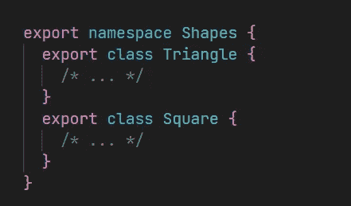
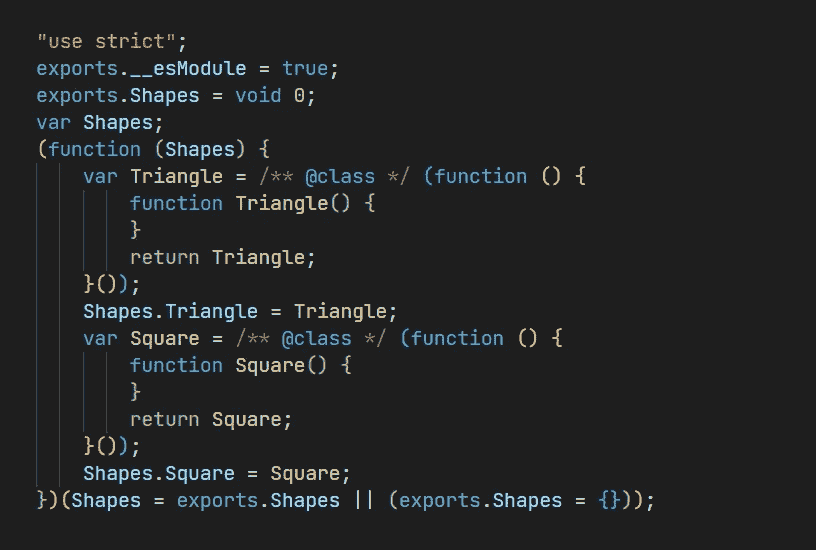
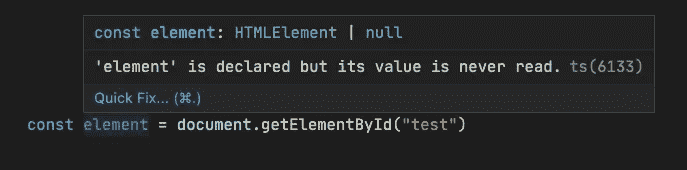
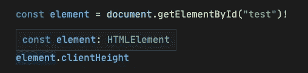
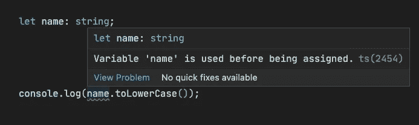
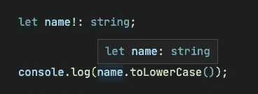
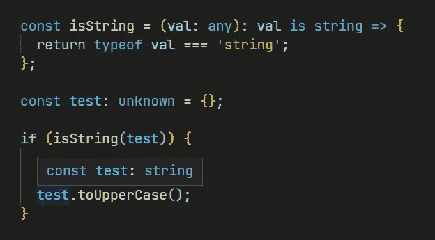

# 为什么应该避免这 4 种类型脚本特性

> 原文：<https://levelup.gitconnected.com/why-you-should-avoid-these-3-typescript-features-cdb89f82e91c>

## 如何把打字稿写得更好？


照片由[附身摄影](https://unsplash.com/@possessedphotography?utm_source=medium&utm_medium=referral)在 [Unsplash](https://unsplash.com?utm_source=medium&utm_medium=referral) 上拍摄

TypeScript 是一种不断发展的语言，随着时间的推移增加了许多功能。但是它兼容 JavaScript，这就导致了一些 JavaScript 没有的特性，一些特性是重复的。因此，为了使我们的代码更加严格和可靠，本文将介绍您应该尽量避免的 3 个特性。

# 1.避免使用私有关键字

在 TypeScript 中，我们有两种方法使类中的字段私有。还有旧的 private 关键字，只能在 TypeScript 中使用。然后是新的`#field`语法，ECMAScript 2022 的一个特性，我将在这里详细介绍:

[](https://blog.devgenius.io/new-features-in-ecmascript-2022-for-class-elements-b4a8f4a26659) [## ECMAScript 2022 中针对类元素的新功能

### 它带来了什么便利？

blog.devgenius.io](https://blog.devgenius.io/new-features-in-ecmascript-2022-for-class-elements-b4a8f4a26659) 

简单的例子:

```
class Test {
  private name: number;
  #age: number;
}
```

这两个特性大致相同，建议你用`#field`代替。由于它是 JavaScript 天生支持的特性，当不支持`#field`时，private 关键字只是一个类型脚本补丁。

# 2.避免自定义模块和命名空间

自定义 TypeScript 模块(`module foo {}`)和名称空间(`namespace foo {}`)与 JavaScript 中的模块非常相似。以下示例来自[官方文档](https://www.typescriptlang.org/docs/handbook/namespaces-and-modules.html#needless-namespacing):

这里是`shapes.ts`:

```
export namespace Shapes {
  export class Triangle {
    /* ... */
  }
  export class Square {
    /* ... */
  }
}
```

下一次使用它:

```
import * as shapes from "./shapes";
let t = new shapes.Shapes.Triangle(); // shapes.Shapes?
```

我们不应该命名模块内容，命名空间的主要目的是提供一个构造的逻辑分组，以防止名称冲突。因为模块文件本身已经是一个逻辑分组，并且它的顶级名称是由导入它的代码定义的，所以不需要为导出的对象使用额外的模块层。

修改后:

```
// shapes.ts
export class Triangle {
  /* ... */
}
export class Square {
  /* ... */
}// Usage
// import * as shapes from "./shapes";
// let t = new shapes.Triangle();
```

因此，只有在一个文件中使用多个名称空间才有意义，这就是它与常规 ES2015 模块语法(导入/导出)的不同之处。

此外，在编译时，它会生成原始 TypeScript 代码中不存在的新 JavaScript 代码:



所以在大多数情况下，我认为创建多个小文件并使用 ES2015 模块语法(导入/导出)是更好的做法，没有潜在的负面影响。

当然，仍然可以使用 TypeScript 模块声明来描述外部 API(`declare module ‘foo’ {}`)。ESLint 也有相应的规则`[no-namespace](https://typescript-eslint.io/rules/no-namespace/)`提醒我们不要这么做。

# 3.避免直接使用断言

编码时尽量避免断言，因为它会导致意想不到的情况。

典型的例子:



我们可以使用非空断言操作符`!`告诉编译器它的存在:



但是使用非空断言操作符是不安全的，在编译成 JavaScript 代码时会被移除。在这种情况下，如果元素不存在，就会发生错误。不建议使用非空断言操作符，除非您确实确保它存在。

类似于定义赋值断言



或者类型断言:

```
let num: unknown;// TypeError
(num as string).toLowerCase();
```

所以尽量避免直接使用断言，这是一个逃生出口。更好的方法是使用`is`关键字或断言函数。简单的例子:



要了解更多细节，请查看本文的技巧 5:

[](/5-typescript-coding-tips-you-might-ignore-ac16b1fe9699) [## 你可能忽略的 5 个打字稿编码技巧

### 希望对你有帮助

levelup.gitconnected.com](/5-typescript-coding-tips-you-might-ignore-ac16b1fe9699) 

此外，还建议使用常量断言:

[](https://medium.com/@islizeqiang/why-are-const-assertions-a-gem-in-typescript-e1d353f5d8ce) [## 为什么 Const 断言是 TypeScript 中的瑰宝？

### 用常量断言优化您的类型脚本编码

medium.com](https://medium.com/@islizeqiang/why-are-const-assertions-a-gem-in-typescript-e1d353f5d8ce) 

# 4.避免装修工(目前)

装饰器是修改或替换其他函数(或类)的函数。这里有一个例子:

```
[@sealed](http://twitter.com/sealed)
class BugReport {
  type = 'report';
  title: string; constructor(t: string) {
    this.title = t;
  }
}function sealed(constructor: Function) {
  Object.seal(constructor);
  Object.seal(constructor.prototype);
}
```

这是来自官方的例子，`sealed`函数接受一个类并修改它以防止继承。在一些开源库中会大量使用 decorators，但是我们在编码时应该尽量避免使用它们。为什么？

这是因为 decorators 目前仍然是 ECMAScript 的第二阶段提案，又名“草案”，自 2019 年 2 月以来，它一直处于第二阶段。这也意味着它还没有完全标准化，它的 API 很可能会发生变化，特别是在编译器目前依赖 TypeScript 的情况下，一些不兼容会导致我们在未来做更多的事情。

我的建议是等到阶段 3(“候选”)或者更安全的阶段 4(“完成”)再开始使用。

# 结论

总之，重叠的功能和不完全支持的功能值得在使用前考虑，我们不会主动绕过 TypeScript 编译器，这些都是很好的编码习惯。

你还有其他建议吗？请随意与我分享你的想法。

*感谢阅读。如果你喜欢这样的故事，想支持我，请考虑成为* [*中等会员*](https://medium.com/@islizeqiang/membership) *。每月 5 美元，你可以无限制地访问媒体内容。如果你通过* [*我的链接*](https://medium.com/@islizeqiang/membership) *报名，我会得到一点佣金。*

你的支持对我来说非常重要——谢谢。