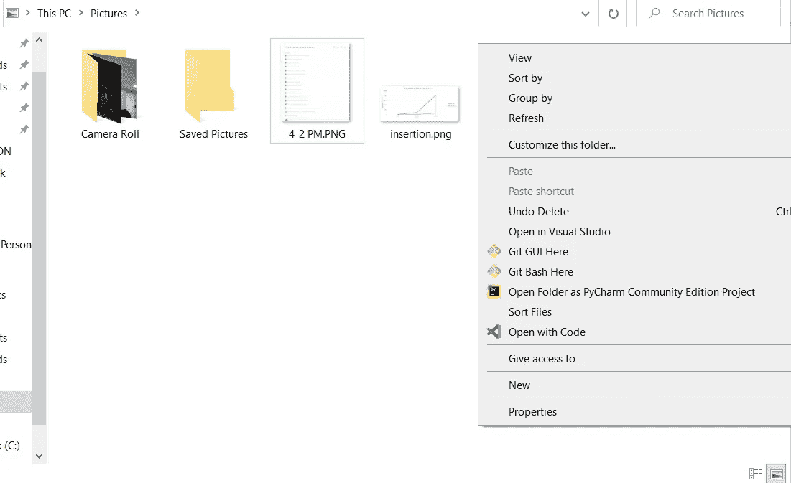
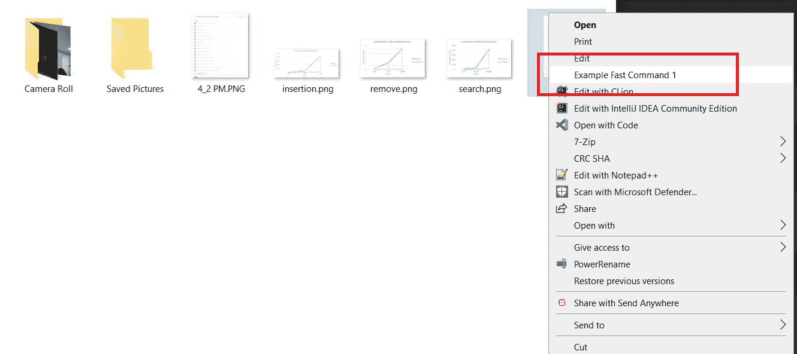
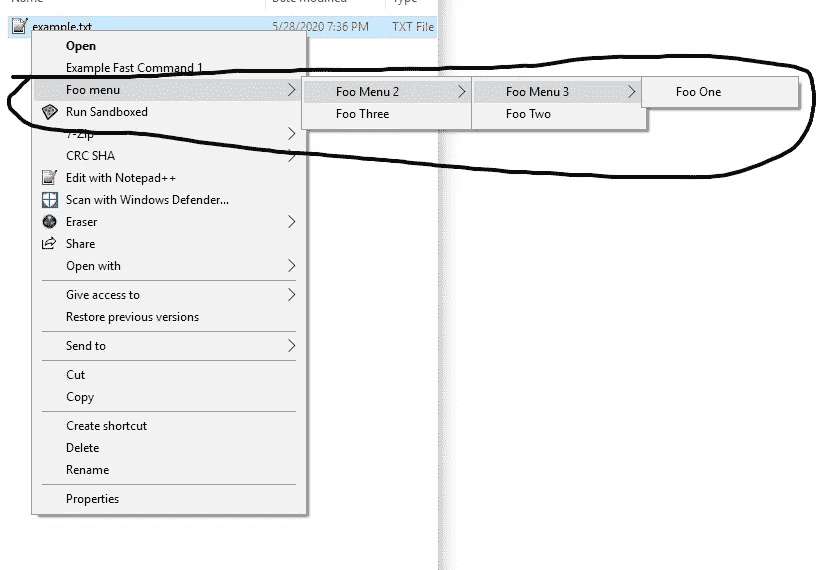

# 为什么您应该关注上下文菜单

> 原文：<https://levelup.gitconnected.com/why-you-should-care-about-the-context-menu-ea020316a29f>

## 了解为什么以及如何在 Windows 和 Linux 上从右键菜单中直接调用代码和程序


Artem Sapegin 在 [Unsplash](https://unsplash.com?utm_source=medium&utm_medium=referral) 上拍摄的照片

# 什么是上下文菜单？

**上下文菜单**就是右击时出现的菜单。

选项在很大程度上根据右键单击的内容而变化——如果右键单击文件夹而不是文件，您将获得不同的选项。



上下文菜单的示例

# 我为什么要在乎？

大多数开发人员经常忽略上下文菜单。对于一个与导航计算机同义的组件来说，令人惊讶的是几乎没有人支持它，特别是因为它仍然是几乎每个主要操作系统的典型组件。

但你越深入了解，就越觉得有道理。编辑上下文菜单并非易事，因为它充斥着**糟糕的文档和令人沮丧的设计选择**。

然而，在某些情况下，在右键菜单中添加**自定义条目会**非常方便**，例如让某个程序打开某些文件类型或从给定文件夹中调用某个程序。能够使用上下文菜单**为某些类型的软件**提供了*至关重要的功能*。**

# 解决方案

你总是可以手动创建上下文菜单条目，但是以编程的方式创建它们是一件非常痛苦的事情，尤其是当你想要发布一个程序的时候。

在对这个问题做了大量的研究之后，我创建了开源项目[上下文菜单](https://github.com/saleguas/context_menu)来处理这个问题。

[](https://github.com/saleguas/context_menu) [## GitHub-saleguas/上下文菜单:💻一个 Python 库，用于创建和部署跨平台的本机…

### 💻一个 Python 库，用于创建和部署跨平台的本地上下文菜单。💻文档可从…获得

github.com](https://github.com/saleguas/context_menu) 

## 装置

如果你还没有安装 Python，从官网下载并运行一个安装程序:[https://www.python.org/downloads/](https://www.python.org/downloads/)

一旦你有了 Python，*剩下的就超级简单*。只需在终端中运行以下命令来安装软件包:

```
python -m pip install context_menu
```

或者如果你在 Linux 上:

```
python3 -m pip install context_menu
```

*注意:如果你在 Windows 上，它说命令无法识别，请确保将* [*Python 添加到你的路径*](https://datatofish.com/add-python-to-windows-path/) *中，并以管理员身份运行命令提示符*

## 快速入门

假设您想在右键单击文件时创建一个基本的上下文菜单条目。**超级简单！**您可以创建少至 3 行的条目:

```
from context_menu import menusfc = menus.FastCommand('Example Fast Command 1', type='FILES', command='echo Hello')
fc.compile()
```



上面代码的结果

您所要做的就是导入库并定义您想要的上下文条目的类型。这些选项包括:

*   上下文菜单*(有更多条目的条目)*
*   快速命令*(启动运行脚本的单个上下文菜单条目)*
*   可以添加到菜单中的上下文命令，用于更复杂的命令

你可以结合使用这些来直观地制作界面。

```
def foo2(filenames, params):
    print('foo2')
    print(filenames)
    input()

def foo3(filenames, params):
    print('foo3')
    print(filenames)
    input()

if __name__ == '__main__':
    from context_menu import menus

    cm = menus.ContextMenu('Foo menu', type='FILES')
    cm2 = menus.ContextMenu('Foo Menu 2')
    cm3 = menus.ContextMenu('Foo Menu 3')

    cm3.add_items([
        menus.ContextCommand('Foo One', command='echo hello > example.txt'),
    ])
    cm2.add_items([
        menus.ContextCommand('Foo Two', python=foo2),
        cm3,
    ])
    cm.add_items([
        cm2,
        menus.ContextCommand('Foo Three', python=foo3)
    ])

    cm.compile()
```



以上代码的结果

哦对了，我提到过**你可以从上下文菜单中直接运行 Python 函数吗？**在制作`ContextCommand`时，只需使用`python`可选参数

```
menus.ContextCommand('Foo Three', python=exampleFunc)
```

该库具有超强的可扩展性，使用起来非常直观，并且可以跨平台支持许多操作系统。您可以在[项目页面](https://github.com/saleguas/context_menu)上找到更多详细信息。

# 最后的想法

上下文菜单是所有主流操作系统都使用的一个特殊但重要的 GUI。编辑它可能是一件痛苦的事，但是有了正确的信息和工具，你可以在开发时充分利用它。

感谢阅读！