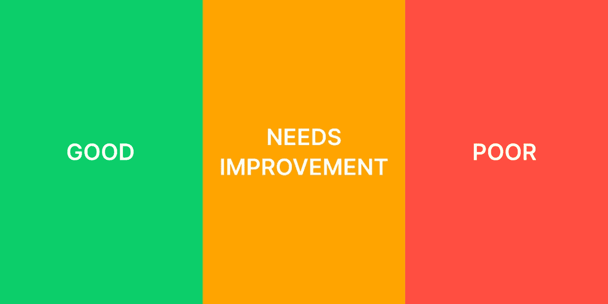
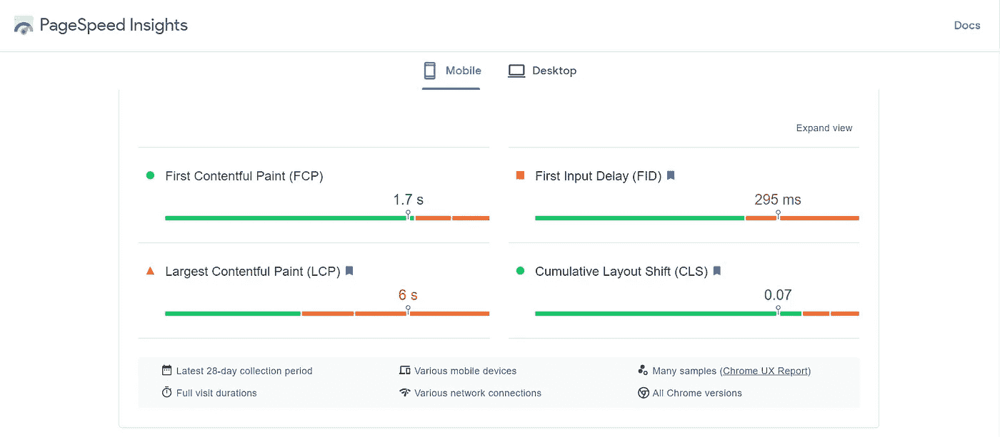
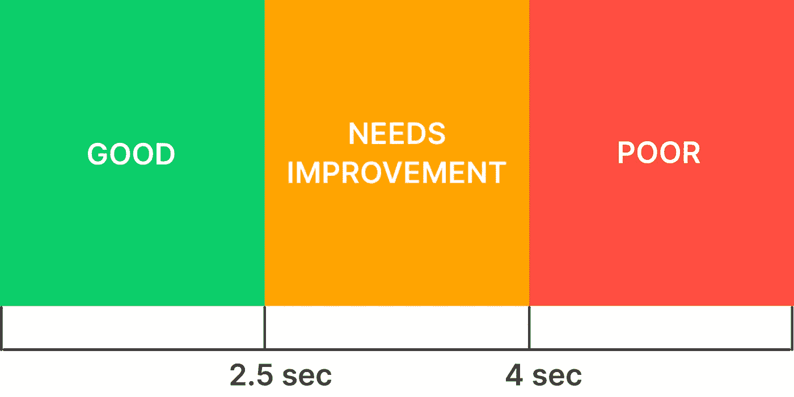
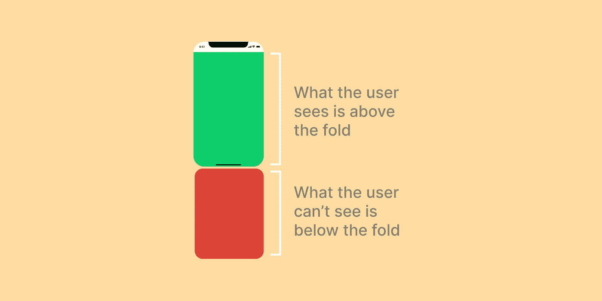
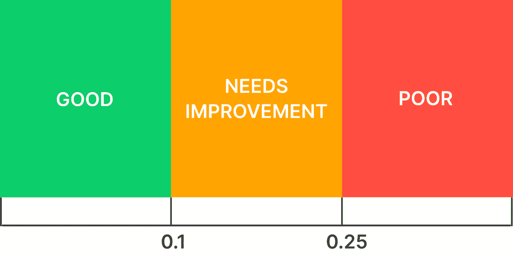
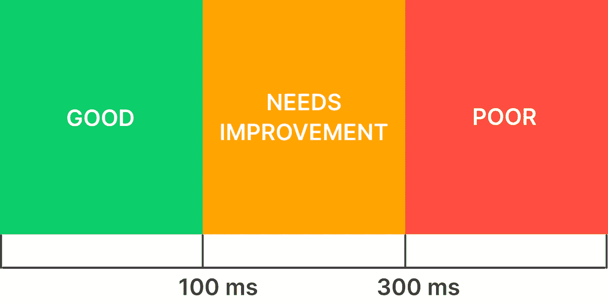

# 为什么你应该关心你的网站的速度

> 原文：<https://levelup.gitconnected.com/why-you-should-care-about-your-websites-speed-9a95d5bf0416>

## 以及改进的方法。

网络性能指标。作者插图。

你是否经常点击一个链接或访问一个网站，而页面却永远无法加载？

那不是很讨厌吗？

你不觉得沮丧，尽快离开网页吗？

如果你对所有这些问题的回答都是肯定的，那么你就理解了网站性能或速度在确保用户停留在你的网站上所扮演的重要角色。

你甚至谷歌都同意更快加载网站的重要性，这就是为什么它也是谷歌排名的一个因素。

**在其一项** [**的调研研究**](https://www.thinkwithgoogle.com/marketing-strategies/app-and-mobile/mobile-page-speed-new-industry-benchmarks/) **中，谷歌发现页面速度与收入直接相关。**

因此，如果你选择提高你的网站性能，谷歌会在搜索结果中给你更好的排名，从而给你的网站带来更多的流量。因此，通过提供更好的用户体验，访问者可能会在你的网页上停留更长时间，访问者成为潜在客户的可能性也会增加。

你不想这样吗？

如果你想提高你的网站的速度，继续阅读，找出如何衡量你的网站的性能，并使之更好。

# 三个火枪手

谷歌根据三个关键指标来衡量你网站的表现，这三个指标被称为核心网站活力。

提高这些指标将有助于使你的网站更快，从而在谷歌搜索结果中获得更好的排名，更多的流量，并最终获得更多的客户。

网络的核心要素是:

1.  最大含量涂料(LCP)
2.  累积布局偏移(CLS)
3.  第一输入延迟(FID)

您可以使用 [PageSpeed Insights](https://pagespeed.web.dev/) 来衡量您网站的这些指标。它会弹出一份核心网站重要信息的报告，您可以对其进行分析。

如果您在本地服务器上运行您的网站，您可以使用 [Google Lighthouse](https://developers.google.com/web/tools/lighthouse#devtools) 来获取指标。

页面速度洞察报告示例。作者截图。

为了理解性能报告，让我们来详细看看这些都意味着什么，以及如何使用它们来提高网站的速度。

## 最大含量涂料(LCP)

想象一下，你点击了一个链接，重定向到另一个网站。加载网页需要一些时间。

你看到网站的标题和 logo，网站还在加载。

你几乎要放弃并关闭标签页了，这时横幅图像出现了。

就在这一瞬间，你可能会想，网站几乎已经完成加载，你可能可以做你的任务了。

> 用户单击链接或输入 URL 到在视口的可视部分显示最大元素(图像或文本)之间的时间间隔称为最大内容绘画或 LCP。

LCP 指标旨在量化用户认为网站已经加载或几乎完成加载的时间。

减少它将有助于减少用户在解决“完成了吗？”这个问题时的期望

> 这里的教训是不要太拐弯抹角。用户到网站来做一些事情，你的工作就是让他们尽快去做。

## 如何提高 LCP

LCP 时间范围。作者插图。

上图显示了 Google 为 LCP 定义的时间范围，分为好、需要改进和差。

> 较低的 LCP 时间确保用户停留在您的网站上，而不是因为较长的页面加载时间而离开。

要达到 LCP 范围的“好”侧，您可以解决以下问题。

## 惰性装载

用户一进入页面就能看到的视区内容称为折叠上方内容，用户进入页面时看不到的部分称为折叠下方内容。

折叠上方。作者插图。

为了减少 LCP 时间，首先集中于加载上面的内容。

为视频、图像或文本块等文件夹下的内容添加延迟加载，这样只有当用户开始滚动时才加载这些内容。

## 推迟执行脚本

将 [defer](https://developer.mozilla.org/en-US/docs/Web/HTML/Element/script) 属性添加到<脚本>标签中，告知浏览器下载脚本文件，但仅在无需处理网页 HTML 时执行。

它允许更快地处理高于折叠的内容，从而减少 LCP 时间。

## 使用响应图像

响应式图像允许为不同大小的浏览器加载同一图像的不同版本。

浏览器决定为哪种视窗大小加载哪个版本的图像。

如果用户在手机上浏览你的网页，浏览器会下载一个比在桌面上浏览的网站更小的图片。

响应迅速的图像可以帮助您在移动和平板设备上以更短的 LCP 时间创建更快的网站。

## HTTP2

HTTP2 允许浏览器创建一个到源的连接并下载多个资源，而不是每次都创建一个新的连接来从相同的源下载资源。

HTTP2 减少了浏览器开销和下载 HTML 模板、字体、CSS 文件、脚本等资产所需的时间。

最小化浏览器开销可以使资源更快可用，从而减少 LCP 时间。

实现 HTTP2 协议的唯一先决条件是安全连接或加密。

## 贮藏

浏览器缓存是浏览器上的临时内存存储，它允许浏览器存储网页，以便在您多次访问这些网页时不会再次下载相同的网页。它允许更快地加载网页。

您可以在服务器端添加 cache-control、expires 和 etag 等响应头，以确保您的网站启用了缓存。

浏览器缓存不会让用户在第一次访问网页时受益，但后续访问会变得更快。

## 预加载

我们加载 CSS 的方式是在 HTML 文件中引用它。

这个 CSS 文件可能会导入其他 CSS 文件和一些字体。

浏览器逐行解析 HTML 内容。当它在 HTML 中遇到 CSS 或字体时，它只知道要下载它们。

如果一些不重要的外部脚本按照源代码的顺序被首先加载，该怎么办？它可能会拖延我们的关键资源。

好吧，那我们怎么解决这个问题呢？

如果我们事先告诉浏览器什么是关键资源，并要求它尽快下载它们，而不是等待浏览器自己发现它们，会怎么样？

[预压](https://developer.mozilla.org/en-US/docs/Web/HTML/Link_types/preload)就是这样。

将 preload 属性添加到字体链接或 CSS 链接中，可以确保浏览器立即开始处理它们，从而节省宝贵的加载时间。

## 累积布局偏移(CLS)

你有没有遇到过这样的情况，当你认为网站已经加载完毕，你继续点击一个链接或按钮，它向下移动，所以你最终会点击其他东西，比如广告？

这种内容的意外移动被称为布局移动，对于用户来说是非常令人沮丧的。

今天，许多网站在后台加载广告，并移动显示的内容，导致布局偏移。

这些变化破坏了用户体验。

谷歌引入了累积布局转移或 CLS 来减少这种情况。

> 累积布局偏移不仅在网页第一次加载时，而且在其整个生命周期中测量网页中引起的布局偏移。

CLS 度量是网页生命周期内所有布局变化的总和。它旨在减少用户在网页上显示内容后的挫折感。

> 这里的教训是，一旦显示了网页元素，即使其他元素正在后台加载，也不要连续改变它们的位置。

## 如何提高 CLS

CLS 得分范围。作者插图。

上图显示了谷歌为 CLS 定义的得分范围，分为“好”、“需要改进”和“差”。分数越低，浏览网页时的用户体验越愉快。

## 向 HTML 元素添加维度

1.  让浏览器知道为每个元素保留多少空间以减少移位。无论是图像、视频、广告、嵌入还是 iframes，给它们添加高度和宽度等维度是个好主意，这样浏览器就可以在下载之前保留空间。
2.  不要把广告放在视窗的顶部，因为与放在中间相比，它们会导致最大的布局偏移。

## 第一输入延迟(FID)

假设您希望在网页上填写表格。输入 URL，页面就会加载。

你点击其中一个文本字段，你不能输入。

你想不出为什么。

您尝试在其他字段中键入内容，也存在同样的问题。

猜猜这里发生了什么？

当浏览器刚刚加载完网页的 HTML 而不是可能负责处理输入或记录分析的脚本时，它会给你一种已经加载完网页的印象。

忙于在后台加载、编译和解析脚本的浏览器无法处理您填写输入字段的请求。

当今时代的这些额外脚本还可以包括添加营销相关的附加软件或分析脚本。

过去，网站常常这样做，给用户一种页面加载速度更快的印象。

如果用户不能完成他们的任务，网页加载更快有什么意义呢？

这就是为什么这个指标的引入？

> 第一个输入延迟是用户通过按钮或链接点击与页面交互时和浏览器开始处理对这些动作的响应时之间的时间差。

FID 旨在从用户的角度衡量网页的可用性或响应性。

> 这里的教训是只加载那些必要的脚本。如果你添加了太多，网页性能肯定会下降。

## 如何提高 FID

FID 时间范围。作者插图。

上图显示了 Google 为 FID 定义的分数范围，分为“好”、“需要改进”和“差”。降低这些时间将使浏览器对用户的交互反应更快。

## 评估您的脚本需求

1.  添加第三方分析和广告会增加浏览器响应用户输入的时间。小心地添加它们以避免膨胀。
2.  首先使用代码分割加载所有必要的脚本。
3.  对不必要的脚本使用 async 或 defer，比如底层内容或第三方脚本。
4.  使用 [Web Workers](https://developer.mozilla.org/en-US/docs/Web/API/Worker) 在后台加载非必要的脚本。

PageSpeed Insights 也首次报道了内容丰富的绘画或 FCP 度量。这是非核心的网络重要指标。如果你想了解更多，你可以点击[这里](https://web.dev/fcp/)。

我希望这篇文章能让你很好地理解为什么测量网站速度是必要的，以及你可以采取什么措施来提高它。

如果你有任何问题，建议，评论，欢迎在下面的评论区分享。

到那时，快乐的编码！

***参考文献:***

[web.dev](https://web.dev/)

[网络性能基础](https://frontendmasters.com/courses/web-perf/)