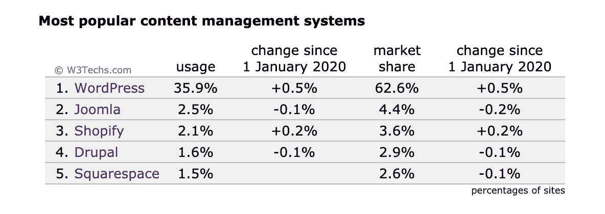

# 为什么你应该为你的创业选择 PHP

> 原文：<https://levelup.gitconnected.com/why-you-should-choose-php-for-your-startup-25b4d57a67ad>

让我们回顾一下在项目早期选择 PHP 的商业原因。

由[在](https://unsplash.com/@helloquence?utm_source=medium&utm_medium=referral) [Unsplash](https://unsplash.com?utm_source=medium&utm_medium=referral) 上拍摄的

自 1994 年以来，PHP 一直是 web 应用程序的主要编程解决方案之一。这是一种整合的技术，在各种规模的几家公司中都有使用。虽然它被斥责为无法实现其他选项的性能和质量的旧技术，但这不是真的。从 20 多年前 PHP 第 4 版开始，我就一直在列举预言家的声音，断言 PHP 将会消失。

让我们一起回顾一下在创业初期采用这项技术的原因。

来源:[https://w3techs.com/technologies/details/pl-php](https://w3techs.com/technologies/details/pl-php)

# PHP 开发人员有一个稳定的池

正如一种已经在市场上存在了 20 多年并且在后端领域占主导地位的语言所预期的那样，从初级到高级架构师，各个层次都有一些勤奋的 PHP 开发人员。在像 IT 领域这样竞争激烈的环境中，这意味着更容易招聘到人才。越来越多的人工作并了解一门编程语言，意味着你有更多的可能性找到合适的人，而不需要降低你的质量标准或融入你的公司精神，只是为了雇佣一个摇滚明星或忍者开发者。

此外，在某个时刻，你将面临减员。流失是任何依赖软件的公司经常遇到的问题之一。这对于一家初创公司来说非常重要。如果你有一个职位空缺，但你需要几个月的时间来找到合适的人选，那么你就有大问题了。在任何情况下，失去一个了解你的代码，同时又了解业务的关键开发人员都将是一种痛苦。这种档案总是有价值的，应该制定适当的保留策略。顶级的 PHP 开发人员在 IT 行业有很高的薪水，但是仍然有比其他选择更多的人可以利用。如果你有职位空缺，招聘会更快。

# 您的初始上市时间和成本将会更短

这一点对于任何创业都是至关重要的。一旦你能把你的产品发布出去，那就更好了，因为你可以开始测试你的商业模式，捕捉用户，进行额外的迭代，或者寻找 A 轮投资者。

由于 PHP 开发人员和已经建立的解决方案的可用性，招聘、构建您的应用程序和支持网站的初始成本将低于其他选择。

很可能有人会说，你会后悔最初的决定。这些人会说，当您需要扩展或升级应用程序时，您会遇到问题。如肯定是完全错误的。有些大企业——比如脸书——依赖 PHP 来构建他们的平台。PHP 生态系统几乎涵盖了你的公司需要的任何技术和情况。此外，可伸缩性更多地依赖于聪明的设计，即编程语言中的设计。

# 降低风险

我们已经提到了开发人员的可用性和解决方案。这两个因素都降低了纯技术风险。在确保节省开发某些答案的时间的同时，您还可以接触到大量的工作人员。

但是还有更多。因为 PHP 是一种在市场上已经存在多年的统一编程语言，所以有大量的社区支持它。您的开发人员可以搜索解决方案，利用社区优势，并将其应用于您的问题。节省时间，同样，你也在省钱，增长更快。

此外，如果你需要额外的资源来应对特殊时刻，或者快速推出第一个最低可行的产品，一些外包公司可以帮助你。虽然现在你可以将任何技术的开发外部化，但是在短时间内找到一个有 PHP 开发人员的可信赖的外包公司更容易。

# PHP 中已经构建了几个解决方案

对于大多数初创公司来说，用 PHP 开发的解决方案将是一个很好的起点。让我们回顾一些例子:

*   如果你需要一个发布产品和创建内容营销策略的网站，Wordpress 听起来是你的正确选择。
*   如果你在 B2C 模式下工作，Prestashop 或者 Wordpress 的 Woocommerce 插件将是一个很好的选择。
*   如果您正在构建一个移动应用程序，需要一些后端来存储信息或处理一些数据解决方案，您可以使用 Symfony 或 Laravel 等扩展框架来创建一个轻量级 RESTful API。

来源:https://w3techs.com/

市场上五大 CMS(Wordpress、Joomla 和 Drupal)中有三个是 PHP 应用程序。Wordpress 的统治地位在过去的十年里已经完全确立，它有一套广泛的插件，涵盖了从购物到个性化社交网络或 SEO 解决方案的几乎所有功能。

当然，所有这些选项都需要一些受过工具培训的专业人员，比如开发人员、设计人员或职员。但是无论如何，主要的搭建工作已经完成，节省了开发、测试和培训的时间。

# 稳定的未来

PHP-8 的下一个主要版本将于明年发布。它将包括几项改进，包括预期的 JIT 编译，这将提高应用程序的性能。

所有基于 PHP 的 CMS 都将带着它们的多种实现和已经可用的解决方案出现。Wordpress 将继续成为内容管理系统的王者，拥有 60%的市场份额和 25%的网站份额(去年增长了 2%)。此外，像 Symfony、Zend 或 Laravel 这样的 PHP 老牌框架还在继续发展，可以构建任何您在后端需要的特定解决方案。

从版本 7 开始，PHP 已经非常成熟了。它的发展和成长不依赖于一个创始人或明星开发者，而是依赖于一个经验丰富的开发者社区。这个社区——以及本文中揭示的其他要点——是 PHP 的最大优势之一，它确保了 PHP 的未来、对新时代的适应以及对特性的持续和有节制的整合。

 [## 批量使用 RESTful APIs

### 当我们使用 RESTful APIs 时，我们如何处理批量操作

itnext.io](https://itnext.io/bulk-with-restfull-apis-7c5e6be84ed3)  [## PHP-8 会有多快？

### PHP-8 将于今年年底发布。让我们看看它如何提高一个脚本的速度。

levelup.gitconnected.com](/how-fast-is-php-8-going-to-be-f7fdc111cd6)