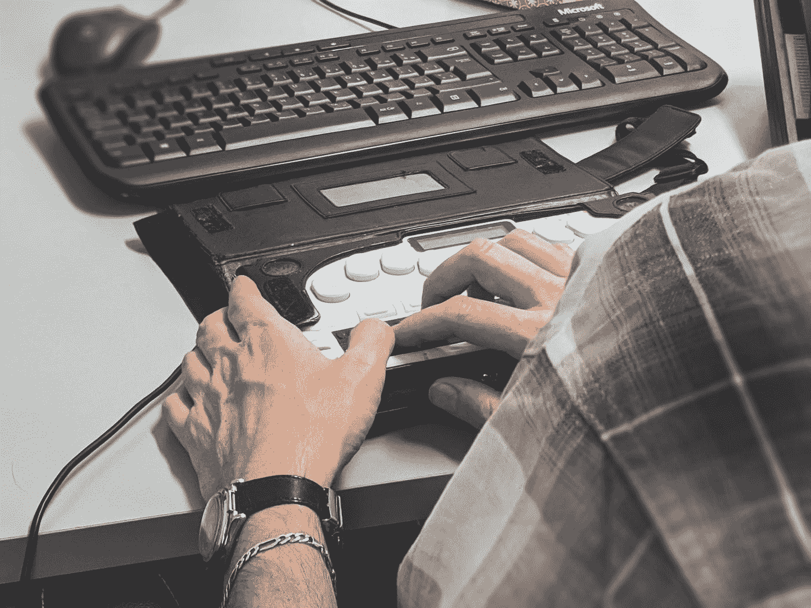

# 为什么开发网站时要考虑到可访问性和屏幕阅读器

> 原文：<https://levelup.gitconnected.com/why-you-should-develop-websites-with-accessibility-and-screen-readers-in-mind-2c864b49ceee>

照片由[西格蒙德](https://unsplash.com/@sigmund?utm_source=medium&utm_medium=referral)在 [Unsplash](https://unsplash.com?utm_source=medium&utm_medium=referral) 上拍摄

易访问性是网页设计的一个重要方面，但经常被忽视。屏幕阅读器是一种软件程序，允许视力受损的用户阅读网站上的文本。在这篇博文中，我们将讨论屏幕阅读器的重要性，以及如何让所有用户都能访问你的网站。通过让所有用户都能访问您的网站，您可以确保每个人都能平等地访问您的内容。

## 什么是屏幕阅读器？

屏幕阅读器是一种将网站上的文本翻译成语音的软件程序。这允许视障用户访问您网站上的信息。屏幕阅读器使视障用户能够使用键盘命令浏览网站。

有许多不同的屏幕阅读器可用，如大白鲨，NVDA 和画外音。每个屏幕阅读器都有自己的命令集，用户必须学习才能浏览网站。

虽然屏幕阅读器通常由盲人或视力低下的人使用，但也可以由有阅读障碍或其他阅读障碍的人使用。屏幕阅读器也可以被非英语母语的人使用。

## 为什么可访问性很重要？

可访问性很重要，因为它确保每个人都能平等地访问您的内容。通过使你的网站具有可访问性，你使每个人都有可能访问你的内容，不管他们的能力或残疾。

全世界有超过 10 亿的残疾人。其中，约有 2.5 亿人视力受损。这意味着有超过 2 . 5 亿人可以从使用屏幕阅读器中受益。

如果你的目标是给你的网站带来尽可能多的流量，你需要确保你的网站能被尽可能多的人访问。开发时不考虑可访问性，就剥夺了视障人士访问您的内容的机会，并缩小了您自己的潜在受众范围。

照片由[克里斯蒂娜@ wocintechchat.com](https://unsplash.com/@wocintechchat?utm_source=medium&utm_medium=referral)在 [Unsplash](https://unsplash.com?utm_source=medium&utm_medium=referral) 上拍摄

## 如何使你的网站具有可访问性

有很多方法可以让你的网站具有可访问性。第一步是使用无障碍设计原则开发你的网站。这意味着使用清晰简洁的文本、易于使用的导航，并提供访问内容的替代方式。

另一种使你的网站具有可访问性的方法是在图片中添加替代文本。Alt-text 是可以被屏幕阅读器阅读的图像的简短描述。通过在图像中添加替代文本，您为视障用户提供了另一种访问内容的方式。

您还可以给视频添加脚本或字幕。这允许失聪或听力困难的用户访问您的内容。文字记录和字幕对母语不是英语的人也有好处，因为它们提供了音频的书面记录。

让你的网站具有可访问性不仅是正确的事情，而且对商业也有好处。通过使您的网站具有可访问性，您可以确保每个人都能平等地访问您的内容。这将有助于你接触到更多的观众，为你的网站带来更多的流量。

我希望你喜欢这篇文章。享受开发项目的乐趣！