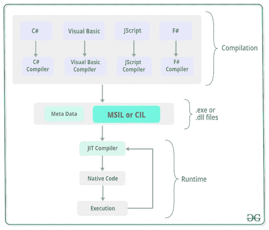

# 为什么你应该学习 CIL

> 原文：<https://levelup.gitconnected.com/why-you-should-learn-cil-2435b2b8d8ae>

## T 他常用的中间语言是你的语言。NET 应用程序编译成。

如果您是. NET 开发人员，您可能以前听说过它，但是知道学习它没有意义，因为它是一个“实现细节”。

这篇文章将提供一个例子，希望能让你相信缺乏 CIL 知识会导致 bug。

# “已检查”关键字

如果 artithmetic 操作导致溢出，C#的`checked`抛出一个`OverflowException`。

## 示例 1

在这个例子中，发生了溢出，您将得到一个`OverflowException`，因为已经达到最大可能值的`byte`加了 1。

# 虫子

现在你知道`checked` 做什么了，看看例子 2。

## 示例 2:

乍一看，这似乎应该做与示例 1 完全相同的事情，但事实并非如此。

**不** `**OverflowException**` **当你试图给** `**byte**` **加 1 时抛出！**

# 有什么不同？

为了理解这里发生了什么，我们需要看一下为例 1 生成的去掉了`checked` 关键字的 CIL。

## 示例 1 CIL，已取消选中:

不用太在意这些台词都是什么意思，看看`IL_0009: **add**`就知道了。

所有这些，就是把两个数字相加，255 和 1。

## 示例 1 CIL，已检查:

这几乎与移除`checked` 时生成的代码完全相同。唯一的区别是多了几条`nop` 指令，以及`add`之后的`.ovf`:

`IL_000a: add.ovf`

这和普通的`add`做的完全一样，但是如果有溢出，它也会抛出`OverflowException`。

# 结论

`**checked**` **只对直接在** `**checked**` **块内的表达式有效。**

# 十进制呢？

在这个例子中，我们使用了`unchecked`，这保证了`OverflowException` 不会被抛出。

发生这种情况时，数字会绕回最小值。

(您可以更改`[-checked](https://docs.microsoft.com/en-us/dotnet/csharp/language-reference/compiler-options/checked-compiler-option)`编译器选项来设置默认值是`checked` 还是`unchecked`)。

## 示例 3:

这到底会不会扔个`OverflowException`？

乍一看，它看起来不会扔一个`OverflowException`。

而如果是用`int`或者`byte`而不是`decimal`，确实不会抛出一个`OverflowException`。

**但是，它确实抛出了一个**

## 为什么？

这是生成的 CIL。

注意这里没有像`byte`那样的`add`或`add.ovf`指令。

代替 CIL 内置的`add`或`add.ovf`指令，它使用一种叫做`op_Addition`的方法(第 12 行)。

尽管在 C#中`decimal` 是一个基本类型，但是 CLR 不认为它是一个基本类型，因此没有 CIL 指令来操作它。

相反，`decimal` 类型有自己的加法、减法等方法。这意味着我们前面看到的`add` CIL 指令，不用于`decimal`。

因此，`checked` 和`unchecked` 对`decimal`类型没有影响。

# 摘要

对 CIL 有一个基本的了解，或者至少有足够的兴趣看看 CIL 从你的 C#代码中得到什么，可以提供对事情如何工作的难以置信的洞察力。

这些低层次的细节不仅令人满意地学习/理解，而且可以帮助您编写更好的、无错误的代码。