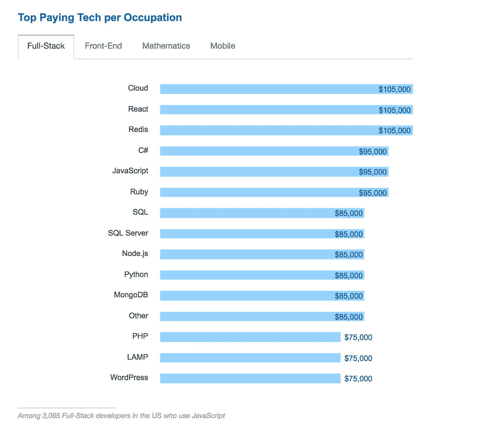

# 为什么你应该学习 JavaScript？

> 原文：<https://levelup.gitconnected.com/why-you-should-learn-javascript-b8a2c095ee85>

## 学习现在和未来最有前途的编程语言的五个理由

马库斯·斯皮斯克在 [Unsplash](https://unsplash.com/s/photos/starter?utm_source=unsplash&utm_medium=referral&utm_content=creditCopyText) 上的照片

# 介绍

经常有人问我，哪种编程语言是开始学习编程的理想语言。这个问题的答案非常简单，编程语言并不重要，但重要的是逻辑推理和对编程范式的第一次接触，其余的将随着您在这个行业中的深入而逐步进行。

然而事实是，我在学习 **JavaScript** 的时候遇到了很多反对者，因为它在业界的恶名。诚然，JavaScript 生来就有目的，业界通过解决它原本没有打算解决的问题来放置它。这导致它在资深开发人员或来自其他编程范例的开发人员中名声如此之差。但我们不能忽视 JavaScript 是一种活的语言，五年多来(2015 年)它每年都在更新，它有一个庞大的社区为它提供支持并审查可能的改进。

在这篇文章中，我将给出你应该学习 JavaScript 的理由。除了你不想把自己奉献给前端，那里是它的第一个执行环境。

# 1.世界上最流行的编程语言

这种说法可能会伤害异国语言的爱好者，他们与其他语言相比提高了性能或安全性，但属于少数。在我们的例子中，JavaScript 是世界上使用最多、最流行的编程语言，这使得它成为新手的绝佳选择。

这主要是因为在前端世界(在网络上)没有其他的竞争语言。编程语言存在垄断，过去它与 *VisualBasic 脚本*、*动作脚本(Flash)* 甚至与 *JAVA 小程序*竞争。但是这些语言都没有在 JavaScript 中存活下来。事实上，现在唯一开始在前端占据显著位置的语言是 *TypeScript* ，它是 JavaScript *超集*，因此，强烈建议事先深入了解 JavaScript 的工作原理。

Stackoverflow 调查

# 2.大量的 Javascript 工作

在任何领域或软件开发环境中，我们都可以找到几种解决同一类型问题的编程语言。然而，我们已经评论过 JavaScript 在 web 应用前端市场上的“垄断”。与其他语言相比，这一事实已经使它处于一种优越的地位。JavaScript 找工作最有意思的是，现在所有的前端工具/框架都是基于 JavaScript 的，强烈建议深入了解 JavaScript 的工作原理。也就是说，如果我们想选择 React、Vue 甚至 Angular(它使用 *TypeScript* 作为语言)的工作，你需要掌握 JavaScript 知识。

因此，学习和理解 JavaScript 会让你获得一份好的高薪工作。事实上，web 开发行业有一个很大的问题会让我们得到一份好工作:**缺乏对 JavaScript 语言有扎实知识的专业人士。**

使用 JavaScript 的顶级支付技术:React、JavaScript、Node.js

截至本文撰写之时(2020 年 8 月)，有近 40，000 个工作岗位需要 JavaScript(在美国)。

不仅是所需的工作数量，而且平均工资:**117，717 美元一年。**

# 3.到处都是

当我还是一名大学生时，我听说 Java 是一场革命，因为我们只需编写一次代码，它就可以在所有设备上运行，而且 Java 通过其虚拟机成功地将我们从操作系统中抽象出来。我爱上了 JAVA 背后的想法，今天，我们有了一个更容易、更舒适的“虚拟机”，即执行 JavaScript 代码的 Web 浏览器(FireFox、Edge 或 Chrome)。因此，在所有安装了 Web 浏览器的环境中，我们都将拥有 JavaScript，这意味着我们几乎可以拥有最终用户可以使用的所有设备。

这还没有结束，十多年来，多亏了 [**nodejs**](https://fossbytes.com/node-js-version-6-lts-released-features/) **，JavaScript 可以在服务器上执行。**事实上，这允许我们在小型设备上用 JavaScript 编写代码，而不需要图形环境。

# **4。B** 电子指纹友好

再次，我想谈谈我在计算机科学领域的开端。当我大约在 11 岁开始开发软件时，我第一次在没有工具的情况下学习 Pascal 和 C 编程语言，没有编译器的帮助来了解发生了什么。事实上，开始学习开发软件是非常困难的，你需要一个导师在这条道路上给你一点指导。

今天，有许多工具可以开始开发软件，但 JavaScript 是一种允许初学者开始开发软件的语言。当然，这个软件不会是要解决的问题的最佳解决方案，但是新手将会编写代码行，并且已经开始了他的软件开发生涯。

下一步**是不要停止学习**，想知道如何每天改进和提高，但你已经在发展的世界里了。也就是说，JavaScript 是一种新手友好的语言，这允许新的开发人员进入。

最有经验的开发人员的任务是引导新来者走上正确的开发道路；新手也可以倾听和学习其他老手的经验。但那是另一个话题，我们可以在另一个时间讨论。

由[马库斯·斯皮斯克](https://unsplash.com/@markusspiske?utm_source=unsplash&utm_medium=referral&utm_content=creditCopyText)在 [Unsplash](https://unsplash.com/s/photos/starter?utm_source=unsplash&utm_medium=referral&utm_content=creditCopyText) 上拍摄的照片

# 5.社区

在世界上独一无二是人类多年来一直追求的。事实上，在时尚、汽车或珠宝行业，这对用户来说是一种额外的成本。

在我们的背景下，独一无二或孤独是一种危险。我们的工作是协作性的。在这项工作中，你必须与你的同事完全同步，这也是人多的优势所在。也就是说，如果使用编程语言的人组成的社区，创建库，解决疑问，通过修订帮助语言保持活力，这些都是优势。

现在，你会发现社区的规模非常重要，与其他语言相比，JavaScript 社区可能是世界上最大的(我没有关于它的统计研究，但几乎可以肯定它应该是前 3 名)。

下面的一些数据可以帮助我们推断出 JavaScript 社区是世界上最大的社区之一:

*   **最大的 StackOverflow 社区。StackOverflow 是最大的编程平台，在这里你可以看到社区如何帮助解决其他同事的问题。**
*   **最大的 Meetup 社区。Meetup 是一个平台，可以让你联系有相同兴趣的人。在编程语言方面，处理 JavaScript 的社区数量是平台上最多的(全球大约有 3600 个，超过 150 万成员)。**
*   GitHub 上标签最多的语言。 GitHub 是现存的主要开源库(已被微软收购)。在这个平台上，JavaScript 是这个平台上托管的所有项目中标签最多的编程语言。

由[沙恩·朗斯](https://unsplash.com/@shanerounce?utm_source=unsplash&utm_medium=referral&utm_content=creditCopyText)在 [Unsplash](https://unsplash.com/s/photos/community?utm_source=unsplash&utm_medium=referral&utm_content=creditCopyText) 上拍摄的照片

# 结论

这篇文章并不是在分析 JavaScript 编程语言是否是解决你的问题的最佳选择。无论它是否需要转型，但我们正在考虑为什么你应该在 2020 年甚至未来几年学习 JavaScript。

这是一个分析，着眼于作为软件开发人员的你的优点，当然，也许几年后会有另一种语言或环境取代 JavaScript，但是你在这种语言中学到的东西可以移植到下一种语言。

在我看来，你不应该错过学习 JavaScript 的机会，因为它比其他语言更有优势。