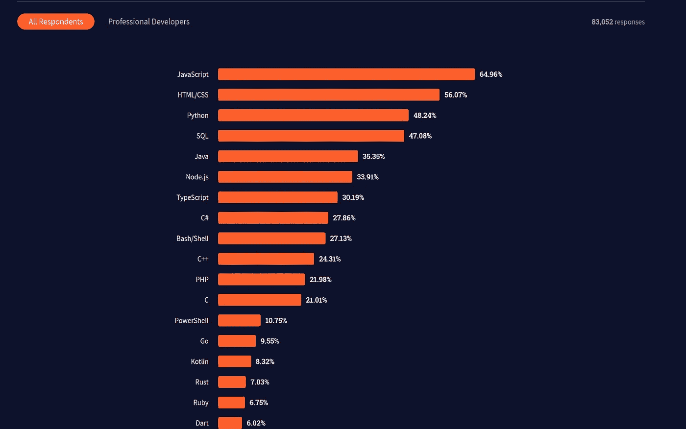

# 为什么在称自己为数据科学家之前应该掌握 SQL

> 原文：<https://levelup.gitconnected.com/why-you-should-master-sql-before-calling-yourself-data-scientist-5b2982b7ff97>

## 我不称自己为数据科学家，但我非常了解 SQL

卢卡斯·布拉塞克在 [Unsplash](https://unsplash.com?utm_source=medium&utm_medium=referral) 上的照片

数据科学已经流行了很多年了。这是一个很大的话题，有很多技术。你需要获得其中一些技术的专业知识。SQL 是最重要的数据科学技能之一。

对于与数据库系统密切相关的开发人员来说，SQL 是一项不可选择的技能。

# SQL，必备技能

> 数据科学是对大量数据的研究和分析。它是从数据中提取有意义信息的科学。

随着 SQL 成为查询数据库和数据仓库的标准语言，它已经成为数据科学的一项基本技能。

# SQL 的采用

毫无疑问，NoSQL 数据库的使用率正在上升。大型平台和产品根据自己的需求使用 SQL 和 NoSQL 数据库的组合。

SQL 仍然是数据科学家最受欢迎的选择，因为大多数商业智能工具、数据仓库和可视化工具都使用 SQL。

下面是一些流行的数据仓库的例子，它们使用 SQL 或类似的查询语言进行查询

*   亚马逊红移
*   Azure Synapse 分析
*   雪花
*   谷歌大查询
*   Oracle 自治数据仓库

不仅仅是数据仓库，Apache Spark 和 Hadoop 等流行的数据系统都使用 SQL 进行查询。SQL 也用于查询内存中的数据帧。

# SQL 的值

SQL 在数据科学领域之外也有价值。我们将讨论 SQL 在您的数据科学之旅中带来的附加值

*   SQL 使您能够查询大多数数据库。业务分析和报告不仅是从数据仓库创建的，也是从数据库创建的。
*   很适合脚本语言。数据科学领域中其他最常用的语言是 Python 和 r。这两种语言都可以很好地与 SQL 集成。
*   SQL 是数据操作/查询最常用的语言。根据 [Stack Overflow 2021 开发者调查](https://insights.stackoverflow.com/survey/2021#overview)，SQL 在开发者使用的流行语言中排名第四。

图片来自 [Stack Overflow 2021 开发者调查](https://insights.stackoverflow.com/survey/2021#technology-most-popular-technologies)

*   SQL 是通向数据科学的门户。要想得到一份数据科学的工作，你需要掌握 SQL。SQL 使处理大型数据库和仓库变得容易。

数据科学家应该存储、操作和查询大型数据存储。这需要深入了解如何在数据存储中存储和检索数据。

# 我是如何掌握 SQL 的

我以前很喜欢 ORM 库，比如 Ruby 的 Active Record，Golang 的 GORM，Python 的 SQLAlchem 等等。每当我不得不查询数据库时，我更习惯使用 ORM 库。我不太精通 SQL，也不愿意做连接。

对于产品和业务团队，我建立了一个分析管道。这些数据是在亚马逊红移收集的。我不擅长编写 SQL 查询。

我为产品和业务团队提供了可视化工具。我不想参与创建仪表板，因为我不精通 SQL。产品和业务部门开始编写查询，很快他们意识到他们也不精通 SQL。

没有别的办法，我必须介入并为产品和业务团队创建视图。开始的时候很艰难，但是慢慢的我慢慢学会了，获得了自信，创造了无数的可视化仪表盘。

 [## 每当 Amrit Pal Singh 发布内容时，您都会收到一封电子邮件。

### 每当 Amrit Pal Singh 发布内容时，您都会收到一封电子邮件。通过注册，您将创建一个中型帐户，如果您还没有…

singhamrit.medium.com](https://singhamrit.medium.com/subscribe)