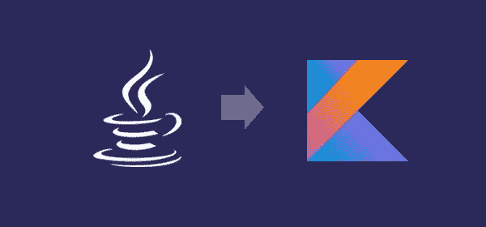
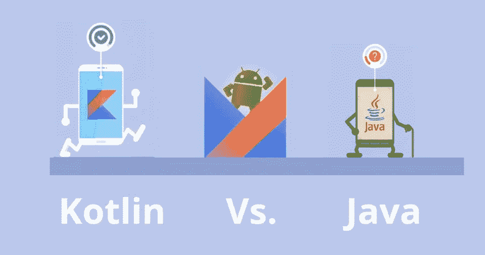
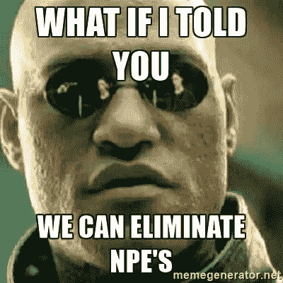
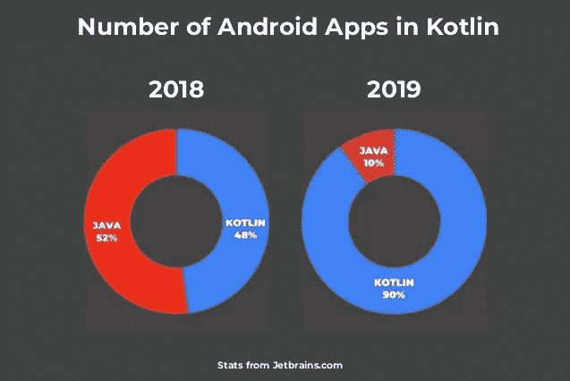
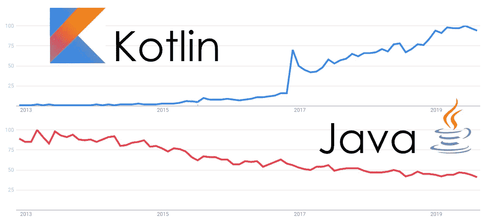
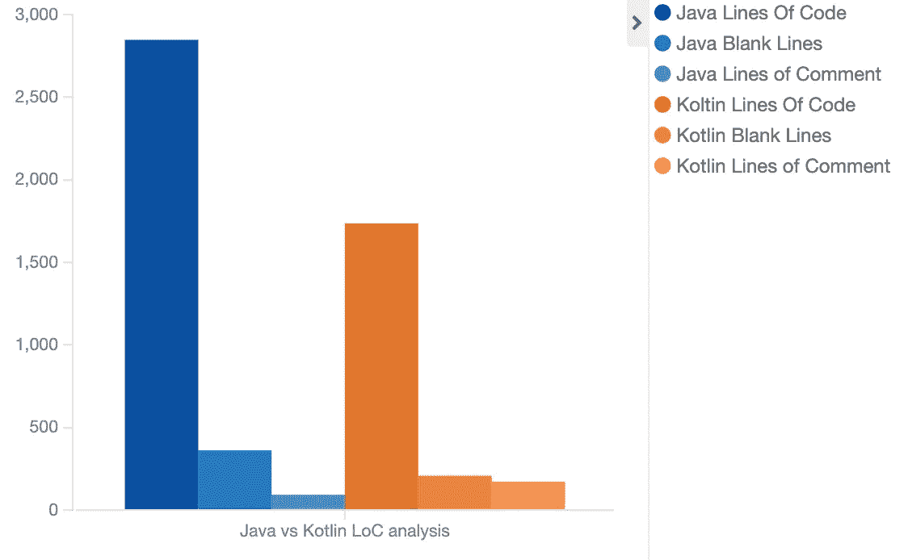
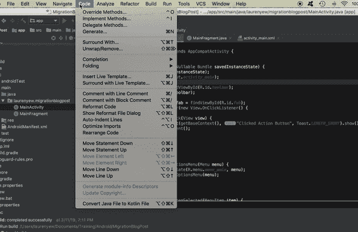
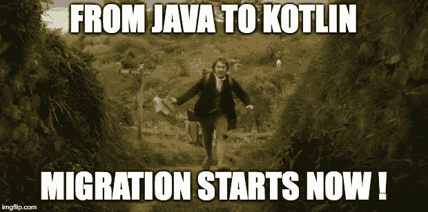

# 如果你还没有把你的应用程序迁移到 Kotlin，为什么要这样做

> 原文：<https://levelup.gitconnected.com/why-you-should-migrate-your-apps-to-kotlin-if-you-havent-already-30fec1b05be9>



三年后，Kotlin 作为一种新的官方 Android 开发语言首次在 Google I/O 上推出，我决定我需要写这篇文章，因为尽管 Google 已经宣布 Kotlin 是主要的 Android 开发语言，而且大多数公司已经在他们的大多数项目上从 **Java** 转向 **Kotlin** ， 我在不同公司的项目中分享了尚未进行迁移的情况，在一些更糟糕的情况下，经理们甚至不想听到 Kotlin 迁移，因为对他们来说“这似乎是浪费时间，因为应用程序在 Java 中运行得一样好”。

我一直是 Kotlin Android 开发的倡导者，自从我还是一名初级开发人员，Kotlin 刚刚起步时，我就一直与我的同事和导师谈论我对 Kotlin 和可能的迁移有多么兴奋。**主要原因**是:

1.  **这是新事物，我总是很兴奋，渴望学习新东西，提高我的开发技能**
2.  Kotlin 开发似乎比 Java Android 开发有更多的好处。

本文讲的是第二个原因。但是首先…


# **什么是科特林？**

这一切都始于 2011 年夏天，当时提供最令人惊叹的 IDE 的公司 **Jetbrains** 首次公布了**kot Lin 项目。Kotlin 背后的想法是开发一种语言，提供其他语言无法提供的好处。**

虽然这种新语言的主要目标之一是促进 IntelliJ IDEA 在 T21 的销售，但主要的里程碑是在 2017 年谷歌宣布他们在 Android 上为 Kotlin 提供一流支持。而在 2019 年谷歌宣布 Kotlin 编程语言成为其安卓应用开发者的**首选语言**时。

Kotlin 主要针对 **JVM** ，但也编译为 **Javascript** ，它甚至可以用于在 **Android** 和 **iOS 应用**之间共享业务逻辑。对于跨平台开发**来说，我们能离一种伟大而全能的语言更近一步吗？我们只能回避它。**

# ****为什么 Java Android 已经不够用了？****

**其中一个主要原因是，与**科特林**相比， **Java** 没能达到它最初的目的。最初，Java 的本意是**简单易懂**，并且由于其**简单性**而成为一种突破性的语言。很长一段时间 Java 都是这么做的。然而，与 Java 相比，Kotlin 使开发变得更简单，更容易理解。你可以用 Kotlin 做任何 Java 能做的事情，只是更快更容易。**

**第二个原因是百万美元的错误。没错，在我们自己面对 palm 之前，我们要看到的一件事是:**空指针异常****

****

**在 Java 中，你需要手动空检查所有的东西。嗯…几乎所有的事情。关键是，你花了很多时间调试你的应用程序为什么会崩溃，等着遇到挑战你智力的复杂问题，结果只是为了阅读**

```
java.lang.NullPointerException
```

**另一个原因是 Java for Android 还停留在 Java 8 上，而且看起来不会很快改变，因为由于甲骨文对谷歌提起诉讼，谷歌与甲骨文**关系不太好。甲骨文仍然提供对 Java 8 的支持，但只到 2030 年，对 Java 7 的支持只到 2022 年。所以从技术上来说，在 Java 8 不再受益于扩展支持之前，我们只有大约 10 年的时间，如果你问我，当你希望使用它作为你的 Android 开发的主要语言时，这是一种交易破坏者****

**现在有了 Kotlin，Java 对于 Android 开发来说已经过时了，还有很多其他原因。然而，让我们把重点放在两者之间的明显差异上。**

# ****Kotlin VS Java****

****

****扩展功能****

**假设你需要对一个" **Date** "类型的对象做很多操作。在 **Java** 中你要做的主要事情是创建一个**DateUtil.java**类，每当你需要对一个“**日期**类型的对象执行操作时，你将注入并调用这个类**

```
public class DateUtil {
     public boolean isATuesday(Date date) {
          return date.getDay() == 2;
     }
}....public void doSomething(Date date) {
     if (dateUtil.isATuesday(date)) {
          // Do something
     }
}
```

**在 Kotlin 中，我们可以通过使用**扩展函数**来避免这种情况。您可以为任何**数据类型**创建一个自定义方法，这样您就不再需要那个 Util 类，并且当涉及到**封装**和**数据隐藏时，您会得到更多的帮助。**此外，扩展函数提高了**表达能力**并给了我们**私有的、上下文特定的类型视角**。**

```
fun Date.isATuesday(): Boolean {
     return day == 2
}....fun doSomething(date: Date) {
     if (date.isATuesday()) {
          // Do something
     }
}
```

****POJO vs 数据类****

**我认为没有一个项目不需要创建或修改一个 **POJO** 。这个过程本身在难度上非常简单，但是在编写拥有一个干净良好的 POJO 所需的所有代码时却非常复杂。你需要声明**参数**，可能需要创建一个**构造器**来初始化所有这些参数，**getter**，**setter**， **hashCode** 方法， **toString** 方法， **equals** 方法，而没有意识到你有一个超过 100 行代码的类，只需要成为一个**

```
public class Person {
     private String name;
     private int age;
     private String email; public Person(String name, int age, String email) {
          this.name = name;
          this.age = age;
          this.email = email;
     } public String getName() {
          return name;
     } public void setName(String name) {
          this.name = name;
     } public String getEmail() {
          return email;
     } public void setEmail(String email) {
          this.email = email;
     } public int getAge() {
          return age;
     } public void setAge(int age) {
          this.age = age;
     } // toString ... // hashCode ... // equals ...
```

**如果我告诉你我们可以用 Kotlin 只用一行代码就完成上面用 Java 写的所有事情，会怎么样？我们可以在 Kotlin 中使用**数据类**来实现。在 Kotlin 中声明类定义时，数据类由关键字 **data** 指定，这就像在 Java 中定义 pojo 类一样。**不同的是，Kotlin 会为你处理所有这些 getter 和 setter 以及 equals 和 hashCode 方法。****

```
data class Person(val name: String, val age: Integer, val email: String)
```

****不再有 NPE 症？****

****

**是的，你没看错。Kotlin 的目标是**从我们的代码中消除** `NullPointerException`，让我们几乎没有办法真正得到这个异常。唯一的方法是:**

*   **显式调用`throw NullPointerException()`；**
*   **在错误的情况下使用`!!`操作符；**
*   **关于初始化的一些数据不一致，例如在构造函数中泄漏“this”**
*   **java 互操作**

**默认情况下， **Kotlin 假设没有一个值可以为 null** 。用“null”赋值也会导致编译错误。唯一的方法是将该变量声明为可空的变量。**

```
var value: String = null           //compilation error
var value: String? = null          // works
```

**当我们想要**访问**一个可空的引用时，我们必须显式地处理**空**的情况，以避免编译错误，因为 Kotlin 知道这个变量可以是空的。**

```
value.toUpper()               // compilation errorif (value != null) {
     value.toUpper()         // works
} 
```

**Kotlin 内置的空安全系统极大地减少了任何可能的 NPE，因为如果它认为您可能访问空对象，它甚至不会让您通过编译状态。**

# ****统计数据****

**Kotlin 有比我描述的更多的优势，许多开发者看到了这些优势，并认为它们值得**从 Java 转换到 Kotlin。如果您是这些开发人员中的一员，并且想要说服您的经理或老板，迁移到 Kotlin 对业务最有利，那么下一节将会做到这一点。****

****

**由 Jetbrains 提供**

**如果说在 Android 为 Kotlin 提供全面支持一年后，Kotlin 应用的数量几乎与 Java 应用持平，那么在 2019 年，当谷歌宣布 Kotlin 作为 Android 应用开发的主要编程语言时，Kotlin 应用的数量飙升至惊人的 90%。在这种节奏下，Java Android 应用将成为**灭绝**。**

****

**Kotlin 的受欢迎程度在不断增长，而 Java 的受欢迎程度在慢慢下降。如果你的应用程序仍然是 Java 的，你获得**新人才**来开发这些应用程序的机会正在变得越来越低**。统计数据显示，Android 开发人员更有可能选择以 Kotlin 为主要编程语言的工作，而不是 Java。你不仅很难找到新的开发人员来开发你的 Java 应用，而且你现在的开发人员可能会想开始使用 Kotlin，而把留给那些要求是标准的项目。****

********

****优步的好意****

****科特林以用更少的代码做更多的事情而闻名，优步也想在他们的应用上测试这一点。对于这个实验，**优步**测量了每个项目每种语言的代码、空白和注释行的平均数量，并确定对于功能相当的代码， **Kotlin 项目比 Java 项目小 40%左右**。更少的行数意味着花在编码上的时间更少，这导致更快的产品交付，从而为公司带来更多利润。****

# ****从 Java 迁移到 Kotlin 既简单又安全****

********

****如果到目前为止你所读到的一切使你确信你想迁移到 Kotlin，但是你害怕这会极大地影响你的发展，或者这非常困难，那你就大错特错了！从 Java 迁移到 Kotlin 是**容易**和**安全**。****

******Kotlin 代码**与 **Java 代码**兼容，这意味着你可以在一个**项目**中同时拥有 Kotlin 和 Java 类，而且由于 Kotlin 和 Java 都面向 **JVM** ，你可以通过从 Kotlin 类调用 Java 方法让它们协同工作，反之亦然，没有任何问题。****

********

****此外，Android Studio 现在有一个内置工具，可以自动将 Java 类转换为 Kotlin 类。这不是一个最佳实践，因为它在准确性方面有点像谷歌翻译，但在你这样做之后，你可以在这里和那里调整新转换的 Kotlin 类，以使用 Kotlin 的最大容量****

# ******开始迁移！******

********

****你还在等什么？开始吧！开始这一令人敬畏的旅程，你会发现这将是你职业生涯或事业的一个惊人的决定。****