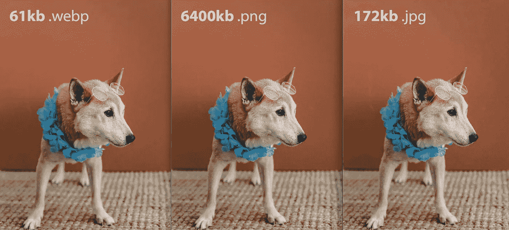
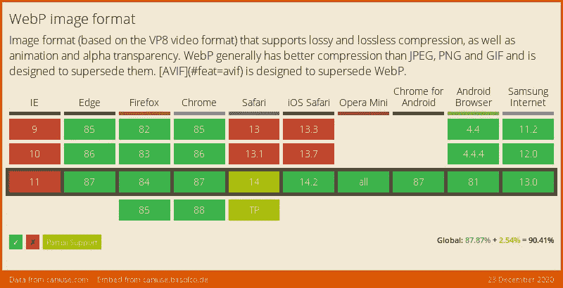

# 为什么你真的应该使用 WebP

> 原文：<https://levelup.gitconnected.com/why-you-should-really-be-using-webp-and-how-to-do-it-4cd6218a95d7>

WebP 是一种网络格式，似乎在浏览网络时不时会弹出。在过去，我已经把它作为一种不会给我带来任何真正好处的小众文件格式而放弃了。我把它注销了，直到我开始使用它。WebP 可能是网络上最具创新性的文件格式之一，但是相对于它的价值来说，它的接受度仍然很低。那么，你为什么应该使用 WebP 呢？



。WebP 有巨大的规模优势

# ⛏网络公司要小得多

WebP 比你现在用的要小得多，这是肯定的。WebP 平均比. png 小 22%,比. jpeg 小 25–34%。WebP 透明通道使用的数据少 22%,因此您可以。png 级别的透明度，文件更小。

# 🐷WebP 是动画

你还在网页中嵌入动画图片吗？gifs？由于其有限的颜色范围。gif 动画通常被认为质量较低。也许你正在使用。但是 WebP 给你的图像质量和你在图像编辑器中的一样，只是尺寸更小。更少的负面影响！

# 🩺 WebP 得到了很好的支持

WebP 现在已经达到一个成熟的水平，大多数浏览器和设备都支持它。[谷歌甚至在 Youtube 上使用它](https://developers.google.com/web/shows/google-io/2014/webp-at-youtube)。有关支持的完整综述，请查看下表。Safari 仍然是 WebP 的最后一大障碍，但现在 Big Sur 和更高版本都支持它:



无论如何，如果你想在传统浏览器上得到完全的支持，你总是可以加入一个带有多个来源的图片标签:

# 🚪这将会增加访问量

你知道页面速度比以往任何时候都重要吗？谷歌搜索结果会考虑到你网站的庞大和缓慢。到处都是大的 png 和 gif 图片意味着你的内容越来越低。WebP 甚至被[谷歌的页面速度洞察](https://developers.google.com/speed/pagespeed/insights/)推荐。因此，如果你想在竞争中获得优势，WebP 是一个不错的选择。

# 如何使用它

也许你认为这很好，但是..

> 我不想为每个图像维护两个图像版本，我只是等待。我们没有时间打开所有的图片并保存为。webp 文件。

别担心！如果要自动生成**。webp** 文件你可以创建一个 githook 来自动完成**后合并**。你的 git 钩子可以在你的。git 目录，并且在每次合并后运行后合并。**在 linux 上，用这个命令安装 webp:**

```
sudo apt install webp
```

然后使用下面的代码自动将您的所有图像直接转换为 webp，同时保留原始图像。现在你没有额外的处理！

现在你有高质量，低文件大小的图像，这将增加你的搜索排名，让你晚上睡得安稳。

*感谢阅读，* [*关注我的推特*](https://twitter.com/smpnjn) *获取更多。*