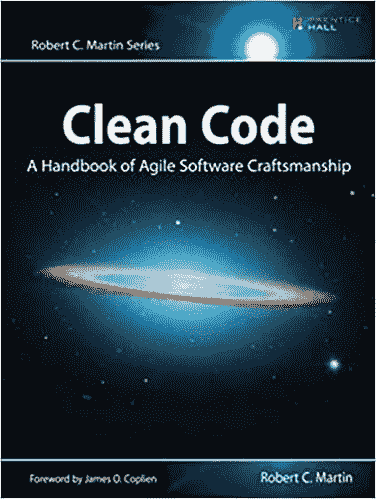
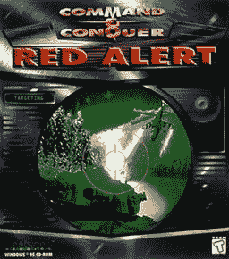

# 为什么您应该花更多的时间阅读代码

> 原文：<https://levelup.gitconnected.com/why-you-should-spend-more-time-reading-code-b2285fc5bb92>

照片由[卡勒姆·肖](https://unsplash.com/@callumshaw?utm_source=unsplash&utm_medium=referral&utm_content=creditCopyText)在 [Unsplash](https://unsplash.com/s/photos/read?utm_source=unsplash&utm_medium=referral&utm_content=creditCopyText) 上拍摄

当你阅读别人的代码时，神奇的事情就会发生。我不是在谈论工作中强加给你的代码审查，我是在谈论真诚地阅读其他“完整的”(如果有这种东西的话)代码。你进入了另一个开发人员或开发团队的思维。您可以看到他们如何进行逻辑思考，以及他们选择做出什么样的架构决策。阅读其他代码迫使你从新的角度看待问题是如何解决的。

作为一名开发人员，你花在阅读外国代码上的时间越多，你就会变得越好。你不仅获得了一个新的视角，而且通过这个视角你学到了新的想法。如果你呆在自己的泡泡里，你可能永远也想不到的想法。如果你总是在同一群同事中工作，或者看相同的编程语言，你将永远看不到这些想法。

虽然当你审查你同事的代码时，你仍然会得到一个新的视角，但这并不像在一个真正的外国知识库中导航那样有启发性。可能会有仔细审查或仔细检查代码的压力。完成代码评审可能有时间限制。所有这些因素都会影响新思想的吸收。如果你花时间*阅读*其他代码，而不仅仅是回顾它，你就能更有效地成长。

与其搜索随机代码并查看它，不如对内容和目的真正感兴趣。我已经收集了一些项目和一些读物的很好的例子，它们将帮助你提高你的代码阅读能力，进而提高你的整体编程能力。

## 干净的代码:敏捷软件工艺手册

Amazon.com 上有干净的代码[。](https://www.amazon.com/Clean-Code-Handbook-Software-Craftsmanship/dp/0132350882/ref=sr_1_2?dchild=1&keywords=clean+code&qid=1591756233&sr=8-2)

这是一个程序员神圣的重构文本。本书中的优秀建议得到了现实世界项目的支持，这些项目就在你面前被一行一行地重构。这本书面向实践学习，提供了大量的代码示例供您学习和尝试。你将会花大量的时间阅读本书中的代码，并且会有一个经验丰富的向导带你了解你将要学习的每一个原则。

作者 Robert“Bob 叔叔”Martin 是敏捷软件开发领域的一个有影响力的人物。在整个 20 世纪 90 年代，他深入参与了企业软件开发，并在 2001 年成为实际开发敏捷的团队的一员。他写干净代码的彻底、实用和规范的方法让你想知道在读这本书之前你是如何写一行代码的。

这本书在亚马逊[这里](https://www.amazon.com/Clean-Code-Handbook-Software-Craftsmanship/dp/0132350882/ref=sr_1_2?dchild=1&keywords=clean+code&qid=1591756233&sr=8-2)有售，或者你也可以从他的网站[这里](https://sites.google.com/site/unclebobconsultingllc/home/clean-coder-gear)订购签名本。

## 命令与征服:源代码

[https://en.wikipedia.org/wiki/File:Cncra-win-cover.jpg](https://en.wikipedia.org/wiki/File:Cncra-win-cover.jpg)

如果你是《命令与征服》系列游戏的粉丝，那么这个项目将正合你的胃口。近日，游戏 [*红色警戒*](https://en.wikipedia.org/wiki/Command_%26_Conquer:_Red_Alert) 的原始源代码向公众发布。如果你不熟悉，这是一款在 20 世纪 90 年代广受好评的即时战略游戏。虽然它最初是在 PC 上发布的，但它已经被移植到许多其他平台上，并且已经有了许多成功的续集。

通读这个项目为早期 PC 游戏开发者的思维提供了一个惊人的窗口。您开始理解早期的软件开发约束，以及经验丰富的开发人员如何解决以前从未解决过的复杂问题。不得不为某些平台上的故障硬件做出让步，不得不为平台的最低公分母进行开发，以及其他一些困难都可以在发布的代码中看到。

Eric Urban 发表了一篇精彩的博客文章，详细介绍了代码中有趣的部分，请点击[这里](http://www.hydrogen18.com/blog/peeking-under-the-hood-of-command-conquer.html)查看。

源本身可以在 GitHub [这里](https://github.com/electronicarts/CnC_Remastered_Collection)获得。

## Linux 内核

企鹅燕尾服。

这很简单。如果你能通读 Linux 内核，你就能阅读任何东西。Linux 有一些最杰出、最有成就的工程师定期从事这项工作，包括[莱纳斯·托沃兹](https://en.wikipedia.org/wiki/Linus_Torvalds)本人。这个项目显然非常庞大和复杂，但是我强烈建议你选择一个你感兴趣的领域。也许您对驱动程序开发或网络堆栈感兴趣。也许你喜欢打印机？(为什么 tho？)只要选择一些你至少会产生一些阅读兴趣的东西。

我想在这个项目中指出的另一个要素是阅读提交消息、注释和其他开发人员注释。这个社区已经存在很长时间了，并且有一个很好的讨论和添加代码的方式。您可能会了解到一些存储库在文档方面有多严格。

你可以在这里访问 Linux 内核代码。

Linus Torvalds 在他的 GitHub 上也有代码。

## 你的旧代码

当你阅读你的一些旧项目时会发生什么。

> “但我记得你说过我需要阅读别人的代码！?"

有时候，通读你的一个旧项目*就像阅读另一个人的代码一样*。取决于你多久前写的，它可能对你来说完全陌生。你可能想知道为什么你决定写一个 200 行的函数，或者这是你第一次尝试函数式编程。

除了质疑过去的自己是否疯狂之外，你还学会了如何应用新概念，并在阅读旧代码时更熟练地重构。当时你可能没有完全理解某些概念，但现在你已经牢牢掌握了。你可以看到自己的进步和发展就在你面前。

通读这些旧项目也提供了自我检查。你不能轻易抱怨别人不知道自己在做什么，因为那个人就是你。在编程生涯中提供这些检查是很重要的，因为它会让你变得谦卑，并向你展示每个人都有能力写出好代码和坏代码。

## 最后的想法

阅读代码不一定是一项令人疲惫不堪的任务，也不一定是分配给你的任务。阅读代码可能是一次冒险。你可以回顾过去，了解事物过去是如何建造的。你回顾过去，也了解了为什么有些事情会变成今天的样子。阅读其他代码会给你新的视角，给你新的想法，让你不仅通过过去的视角，而且通过其他人的伟大思想来解决当前的问题。

没有读过许多其他书的伟大作家是不存在的。程序员也是如此。为了写出更好的代码，你必须阅读更好的代码。

*感谢您的阅读！我希望你喜欢了解花时间阅读代码的重要性。这些项目和书籍只是一个起点。我敦促你找到一些你感兴趣的其他项目，并开始通读它们，以了解另一个开发人员的想法。*