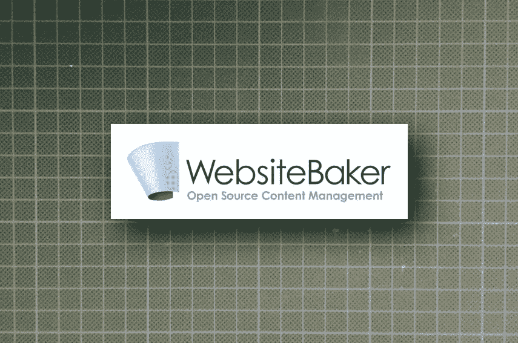
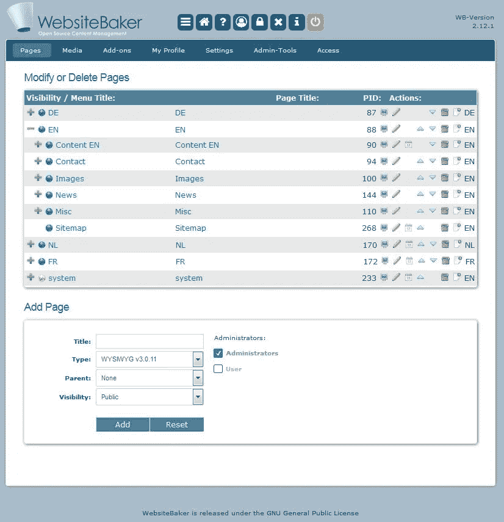
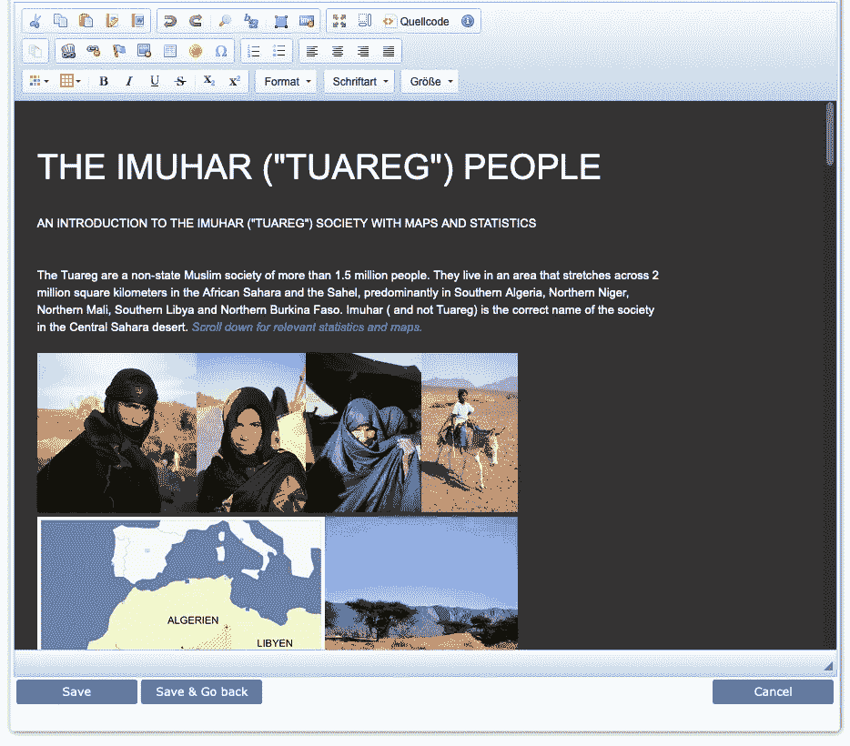

# 为什么你应该尝试 WebsiteBaker 如果你需要一个易于使用的，伟大的 CMS

> 原文：<https://levelup.gitconnected.com/why-you-should-try-websitebaker-if-you-need-an-easy-to-use-great-cms-b39a73a954be>

## 这是流行的内容管理系统的一个真正的替代品

图文作者[作者](https://medium.com/@the_tech_maker)

几年前，我在为小型网站寻找一个轻量级的内容管理系统。

我的第一个经验是:所有这些流行的 CMS 都非常复杂，你需要很多时间去理解它们，然后才能创建一个简单的，比如说 10-20 页的网站。

因为我是自由职业者，所以我的任何一个客户都不会为我学习它是如何工作的付出。因此，对于我尝试过的每一个 CMS，我都要花一个多小时来安装它，并让一个简单的“Hello World”网站运行起来。

第二个标准是后端的可用性。很多为网站写内容的人，实际的用户，不太懂电脑和应用的使用方法。所以我测试了创建一个新页面并在其中填充内容的简单程度。

# 我从测试 CMSs 中学到了什么

对于众所周知的 CMS 来说，一个小时的安装是不够的，后端通常非常复杂，并且加载了你从来不需要的功能。

这些简单的、不为人知的系统功能很少甚至没有，有时还有一个可怕的后端，我不能把它放在我的客户手中。

# 网站面包师

我的第一次安装花了大约 30 分钟，包括“Hello World”页面。相当酷！

预装了几个设计模板，我最喜欢的是“空白模板”。作为一名经验丰富的 web 开发人员，我喜欢从头开始编码设计，而不是“逆向工程”一个现成的模板。

WebsiteBaker 已经为典型的页面类型安装了一些模块，比如博客/新闻、表单，也许还有最重要的模块 WYSIWYG。这是带有许多格式工具的文本编辑器，类似于 Microsoft Word。

# 页面管理

截图自 websitebaker.org

首先，我将解释页面管理，CMS 的心脏。

在左侧有一个页面树，如果你看“EN”，你会看到它是展开的，“de”，“NL”，“FR”是折叠的。在“EN”下面有“内容”、“联系人”、“图片”等子页面。这就像网站地图一样代表了整个网站，即使对于没有经验的用户来说也很容易理解。

中间是页面标题。这将自动用于页面导航菜单中的标题，但您可以更改它。因此，在 CMS 后端的页面标题可以不同于首页的菜单标题。

在右边你会发现很多图标

*   铅笔:编辑页面参数
*   日历:安排页面在某个日期和时间内在线
*   向上/向下箭头:在树内移动一页
*   bin:删除页面(带撤销)
*   带加号的文件图标:添加子页
*   关于页面语言的信息

## **添加页面部分**

要添加页面，您必须输入标题并选择页面类型。您可以在此选择父页面并设置可见性。

*   “公开”意味着每个人都可以在导航菜单中看到首页的页面。
*   一个页面可以被“隐藏”起来，这样它就不会出现在导航菜单中，但是如果你知道它的网址，你就可以看到它。例如，这是下载页面的一个很好的选项，该页面只对你给了链接的特定用户开放。
*   对于注册用户，可见性可以设置为“已注册”。是的，这个小 CMS 支持注册用户前端登录！

## **一些单词要进行语言选择**

正如您所看到的，几种语言被组织为首页。这一开始可能会有点混乱，但是很有道理。如果你看一个网站的站点地图，语言在页面树的顶端。

# 页面类型

查看 WYSIWYG 编辑器的示例(“所见即所得”):

作者截图

WebsiteBaker 对文本页面使用 CKEditor。这是一个非常酷的编辑器，有许多配置选项，并提供了为编辑器使用自定义 CSS 的可能性。

在这个截图中，你可以看到字体，颜色，甚至是我为首页设计设置的编辑器的宽度，这是真正的所见即所得。

在工具箱中，CKEditor 提供了更多的工具，但是我将它们配置为只显示真正需要的工具。这使得我的客户可以更清晰、更容易地进行编辑。

其他页面类型包括:

*   博客/新闻模块
*   表单模块，主要用于提交时发送电子邮件的联系人表单
*   用于在 iframe 中嵌入任何页面或网站的包装模块
*   我最喜欢的代码模块之一。它允许你为一些非常特殊的页面插入单独的 PHP 代码。我用它访问过一次 PayPal API。

更多的模块可以在互联网上找到。编写自己的模块并不复杂。WebsiteBaker 提供了一个开发者模块，用它你可以很容易地发现模块是如何工作的。

# 用户和组

您可以创建具有特殊访问权限的组，并将用户添加到组中。

如前所述，您可以为前端用户设置注册和登录功能。然而，这种组/用户模型不仅用于前端页面，还可以用于 WebsiteBaker 后端。

几乎可以对 CMS 中的任何操作或模块授予或拒绝访问权限。我通常只给编辑器用户访问所见即所得编辑器的权限。

另一个很好的例子是代码编辑器。如果我为一个非常特殊的目的写一个复杂的 PHP 代码，只有我(=管理员)可以访问代码模块。

# 结论

这个 CMS 有常用页面类型的页面模块，多语言和组/用户访问功能，以及一个易于使用的后端。

如果像我一样，您正在寻找一个功能丰富的 CMS，可以快速配置，而无需花费数小时或数天时间来理解基本功能，WebsiteBaker 可能也是您的一个好选择。

这只是对 WebsiteBaker CMS 的一个简短介绍。如果你现在想了解更多，请随时联系我，我会写更详细的 WebsiteBaker 故事。

这里是官方网站:【https://websitebaker.org 