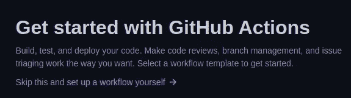
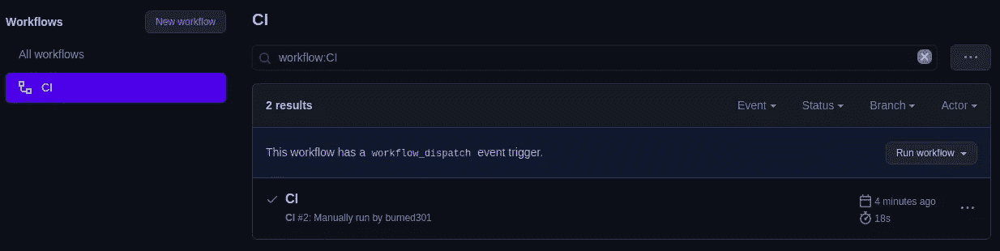

# 为什么您应该使用 CI

> 原文：<https://levelup.gitconnected.com/why-you-should-use-ci-df1adc0c5145>

## 以及如何用 GitHub 动作做到这一点


照片由 [JJ 英](https://unsplash.com/@jjying?utm_source=medium&utm_medium=referral)在 [Unsplash](https://unsplash.com?utm_source=medium&utm_medium=referral)

我曾经参与了一个涉及几个开发人员的项目。所述项目包括为应用程序构建和设计前端页面。在项目开始时，一切都很顺利——每个人都知道他们的任务是什么，以及如何解决它们。

于是时间一分一秒过去，每个人都努力工作，按时交付项目。于是有一天我们不得不将所有的代码合并成一个单一的代码库。很少有开发人员将他们的更改提交到主分支，而其余的人决定最好在本地进行他们的更改，并在以后处理合并他们的结果代码。

你无法想象合并所有代码是一种多么可怕的体验。这完全是一片混乱。到处都是同名的函数，威胁性的全局变量，合并代码时比我想处理的冲突还要多。

事后看来，如果我们只是定期向主分支提交我们的变更，这一切都是可以避免的。但是问题是，我们如何知道我们的提交没有破坏任何现有的代码？

# 输入 CI

CI 代表“持续集成”,可以定义为一天几次将所有开发人员的工作代码副本合并到主分支的实践。不要每隔很长一段时间就进行大的修改，对代码库的修改应该是逐步的，一点一点的。当与**测试驱动开发****【TDD】**结合使用时，CI 处于最佳状态。

潜在的想法是:在项目的开始，人们应该编写适当的单元测试，可以验证当前的代码库是否如预期的那样工作。这样，每次对代码进行更改时，都可以运行单元测试来检查在此过程中是否出现了任何问题。

通过组合 **CI** 和 **TDD** 我们得到了一个工作流，在这个工作流中，开发人员频繁地提交对代码库的更改，并且可以通过运行单元测试过早地识别他们的任何更改是否破坏了现有的代码。如果对工作基础的更改不是小规模的和有规律的，那么识别代码的哪一部分导致了现有的 bug 将会变得更加困难。除了**之外，**CI**TDD**使得开发过程更加敏捷，对每个参与的人来说更加容易。

但是您可以开始想象，每次提交代码时都必须手动运行几次单元测试会变得重复和乏味。幸运的是，GitHub 已经覆盖了我们！

# GitHub 操作

[GitHub Actions](https://docs.github.com/en/free-pro-team@latest/actions) 是 GitHub 提供给我们的工具，用于在 GitHub 存储库中创建工作流和运行命令。工作流可以在某些事件上触发，如推送或合并到给定的分支。

使用 GitHub actions，我们可以设置一个工作流，在每次有人提交或者合并到主分支时运行我们的单元测试！对开发人员来说，完全自动化的单元测试使 CI 变得真正独特和强大。不要担心，因为这样做很简单，但是请允许我指导您完成这个过程。

# **实施 CI**

首先，创建或导航到您希望在其中实现 CI 的 GitHub 存储库。在那里，搜索顶部菜单上的*动作*选项卡。


***动作*** *选项卡顶部菜单*

一旦到了那里，让自己舒服！GitHub 已经为您提供了大量的工作流:从几乎每一种现代语言的 CI 到构建和部署，稍后还会有更多！您可以随意选择一个预先存在的工作流，但是对于本演练，我将继续从头创建一个工作流。点击*自己设置一个工作流程*。



**自己设置一个工作流**链接

一旦出现，GitHub 将向您展示一个用于创建工作流的出色的文档化模板，它应该看起来像下面这样:

让我们开始吧。工作流是从`.yaml`文件创建的，如果你对它们更熟悉的话，它的工作方式有点像 JSONs。首先，在`name`中，我们给正在创建的工作流命名。在标签`on`上，我们可以指定我们希望在什么条件下执行我们的工作流。

此示例在向主分支发送推或拉请求后触发。我们可以添加`workflow_dispatch`来允许我们手动运行这个动作，而不必等待我们刚刚定义的任何触发器。

GitHub 动作是在它们的**虚拟机(VM)** 中执行的，所以我们需要告诉 GitHub 我们希望将要执行我们工作流的 VM 使用什么操作系统。这是用`runs-on`用 ubuntu 完成的——latest 指的是 Ubuntu 的最新稳定版本。

现在我们可以告诉 GitHubs 我们想要执行什么操作。这是在`steps`中用`name`和`run`完成的，最后一个包含我们希望运行的实际命令。

# CI 示例

既然我们已经知道了如何创建 GitHub Actions，我们还等什么去尝试呢？我用以下 python 代码创建了一个小型 GitHub 存储库:

这是一个判断一个数是否是质数的简单函数。现在我们有了代码，我们需要运行单元测试。这可以用`unittest`库来完成，如下所示:

要在本地运行这些单元测试，请执行以下简单操作:

```
$ **python tests.py** ......
--------------------------------------------------------------------
Ran 6 tests in 0.000sOK
```

其中`tests.py`是包含单元测试的 python 文件。

现在我们有代码要测试，也有单元测试要做，让我们创建 CI 工作流。它最终应该看起来或多或少像下面这样:

我指示 GitHub 在每次有对资源库的推或拉请求时运行`python3 tests.py`。我也可以手动运行测试，因为我已经启用了`workflow_dispatch`。我们来试试吧！

导航到存储库中的*操作*，如果您已经创建了工作流，您应该会看到类似这样的内容:



**仓库内的动作**

我们现在可以看到我们的行动了！要运行它，我们可以提交到主分支，或者通过单击*运行工作流*来手动运行工作流。如果操作失败(并非所有单元测试都成功)，您将会收到电子邮件通知。此外，GitHub 可以与 Slack 或 Discord 集成，让您的开发人员了解代码库的最新状态！如果单元测试的最后一次运行成功与否，您的存储库也会出现在它的首页。


# 最后的想法

CI 的用途绝不仅限于此！CI 通常与**连续交付(CD)** 一起使用，其中对成功通过单元测试的代码库的每个提交都被部署到生产中。多亏了 GitHub Actions，这也可以完全自动化，值得拥有自己的文章，如果你想让我报道它，现在就让我来报道吧！

一如既往，如果需要，请随时联系我。本教程中的所有代码都可以在 GitHub 上免费获得。

[](https://github.com/PaburoTC/CI-CD) [## PaburoTC/CI-CD

### 在 GitHub 上创建一个帐户，为 PaburoTC/CI-CD 的开发做出贡献。

github.com](https://github.com/PaburoTC/CI-CD) 

快乐连续集成！

谢谢你