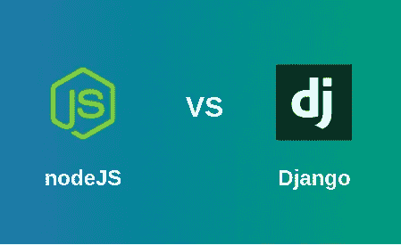
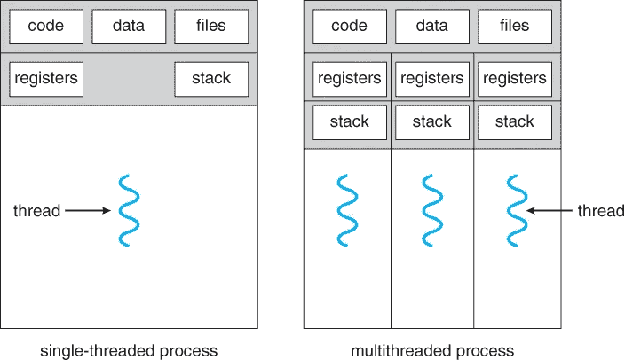
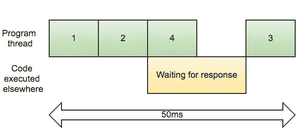
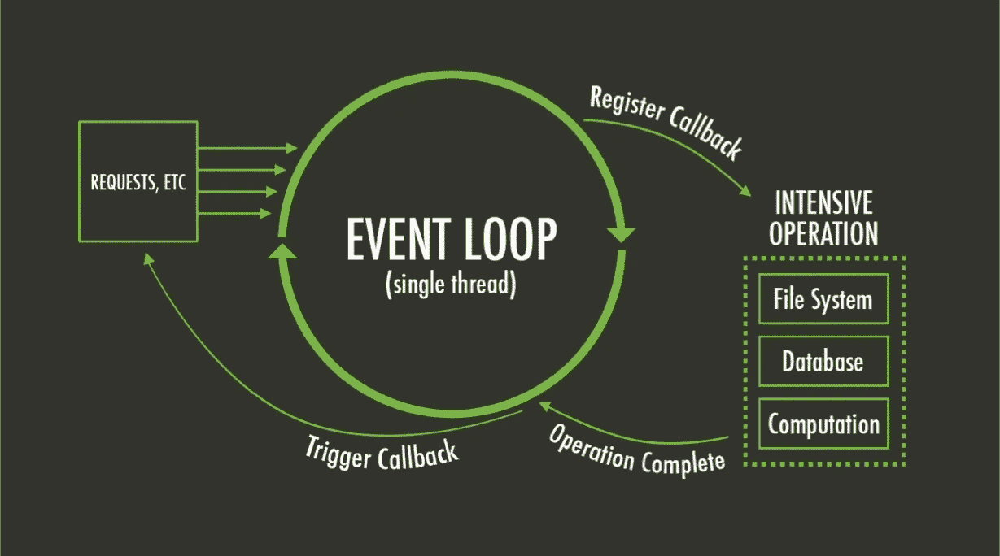

# 为什么应该使用 Node.js 而不是 Django

> 原文：<https://levelup.gitconnected.com/why-you-should-use-node-js-over-django-f6870dd8dac0>



关于为什么语言“X”比语言“Y”更好的争论由来已久，如果这个话题进一步扩展到不同的框架，竞争列表将变得相当压倒性。说到 Web 开发，well Node.js 和 Django 就是其中两个有争议的例子。

老实说，根据服务器的用途，两者的用法是不同的，每一个都有自己的意义，但是在这里，我们将讨论为什么你应该更喜欢 Node.js 而不是 Django。

# **Node.js 有单线程执行模式**

Node.js 具有单线程、非阻塞的 I/O 执行模式，而 Django 作为 Python 的一个框架，具有多线程的执行模式。一开始，这可能看起来很难理解，多线程可能看起来比单线程更好，但同样，这要视情况而定。

单线程意味着只有**一个线程在 Node.js** 中运行，该线程与其事件循环交互，尽管它在池中有助手线程，但这是 Node.js 工作的 V8 引擎(由 Chrome 开发)的一部分。

因此，无论何时发出新请求，主线程都会接受请求并将其放入事件循环中，因此主线程总是可以自由地接受新请求，而之前的请求则在事件循环中执行。

另一方面， **Python 作为多线程模型**工作，这意味着它在每次发出新请求时都会从线程池中分配一个新线程。**在一个流量很大的服务器上，线程的数量很容易超过**，因此用户必须等待线程空闲才能处理他们的请求。



因为我们有两种主要的操作类型，一种是 **CPU 密集型操作**，它包括大量的计算和 CPU 能力(例如渲染一个高图形游戏),另一种是 **I/O 操作**，它使用少量的 CPU 能力，但是还有许多其他事情，例如等待用户输入、与数据库交互等。现在说到网站，大多数基于 CRUD 的网站严重依赖于数据库交互、请求处理等。因此，对于 Node.js 来说，在 I/O 密集型过程中，就像一个繁忙的交互式网站一样，这是一个双赢的局面。

# **Node.js 是异步的**

现在，异步编程指的是一种将程序结构化为调用的风格，这些调用在功能上触发一个动作，该动作又被允许在程序的正在进行的流程之外继续，在我们的例子中，是主单线程。



当程序等待响应时，进程 4 被执行(异步)

用简单的语言来说，当异步时，代码的执行行不等待一个特定的函数或宏完成执行就跳到下一步，而是直接把指令推到事件循环中，一直执行到程序结束。在它的旅程中，如果前面的任何任务完成了，回调被调用，结果显示在那一刻，执行行再次继续做它的工作。为了清楚起见，我们假设以下伪代码:

```
get user_input1
for every x in array:
      x=x*99
get user_input2
copy array1 to array2
```

在同步情况下，程序将首先等待用户输入，然后开始处理数组，再次等待输入，然后处理另一个复制指令。如果使用异步，时间效率可以提高。在这种情况下，当程序忙于等待用户输入时，数组将开始被处理，复制指令也将在用户给出输入之前被处理。因此，它大大提高了速度，减少了程序的总执行时间。异步是我们的单线程模型优于 Python 的多线程模型的主要原因之一。



事件循环的图示

异步行为是通过事件循环实现的，在事件循环中，几个工作线程在一个共享资源上并发工作。主线程将任何给它的请求/任务推给事件循环，因此总是准备好接受新的请求。反过来，当任务完成时，事件循环触发回调，然后任务被推出队列，由主线程处理。

因此，Node.js 比 Django 快得多。

# Node.js 使用 JavaScript

根据 Stack Overflow 2018 年的年度调查，JavaScript 连续第六年成为最常用的编程语言。此外，JavaScript 对初学者非常友好，由于它的广泛使用，它有一个巨大的友好社区。有一个“node_module ”,可以处理任何事情，后端和前端都只需要一种语言，即 JavaScript。


# **结论**

虽然在选择学习一门新语言时，必须记住上面讨论的所有好处，但同时，也应该记住每个软件项目都有自己的需求和要求，您应该根据这些需求选择您的技术。

> 一种适用于一个项目的语言可能根本不适用于另一个项目。

以上是你应该使用 Node.js 而不是 Django 的原因。

附注:我同样爱他们俩

*邪恶的微笑

[](https://skilled.dev) [## 编写面试问题

### 一个完整的平台，在这里我会教你找到下一份工作所需的一切，以及…

技术开发](https://skilled.dev)