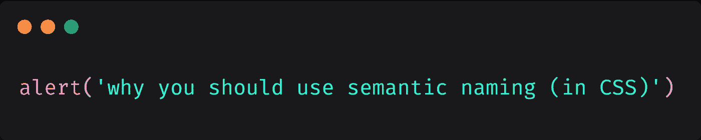

# 为什么应该在 CSS 中使用语义命名

> 原文：<https://levelup.gitconnected.com/why-you-should-use-semantic-naming-in-css-901e3324cc4>

*本帖(* [*为什么要在 CSS 中使用语义命名*](https://www.sargalias.com/blog/why-you-should-use-semantic-naming-in-css/) *)原载于*[*sarg alias*](https://www.sargalias.com/)。

本文视频版:[https://youtu.be/4Oo04kyM1Yg](https://youtu.be/4Oo04kyM1Yg)。

在这篇文章中，我想谈谈为什么语义命名很重要。一般来说，它在编程中很重要，但我特别想讨论它在 CSS 中的重要性。

# 什么是语义命名

基本上，如果你有一个类`.color-red`或者甚至是`.color-primary`，那是没有语义命名的。

它描述了元素的风格或外观，而不是它的用途。

更有语义的名字可能是`.page-heading`或者`main-sidebar`。描述元素用途的东西。

# 为什么语义命名很重要

它带来了两个重要的好处:

*   可维护性
*   程序员的标签/注释

# 问题—可维护性

所以对于你的`.color-red`类，显然你应用它的`h1`会是红色的。

但是设计师明天回来告诉你把它做成蓝色。

现在你必须去你的 HTML 和 CSS 来做改变。

在 HTML 中你需要改变类，因为如果它有类`.color-red`并且看起来是蓝色的，这将是最大的混乱。您还需要在 CSS 中添加一个新的类:`.color-blue`这次。

它可以工作，但是很快就会变成维护的噩梦。代码应该针对可维护性进行优化。

不得不改变两个东西(HTML 和 CSS)而不是一个更容易出错。

# 解决方案—可维护性

相反，请考虑:

如果它只是被命名为`.page-heading`，那么你只需要在一个地方改变颜色(在 CSS 中)。

这有很多好处:

*   更改只在一个地方进行，所以过程更简单(读作:更难出错)。
*   它为白标开辟了道路(有一个网站，你可以纯粹从 CSS 中改变样式)。
*   维护就容易多了。该元素现在有了类`.page-heading`，一年后也可能有同样的类。

# 解决方案—标签

带着类回到 HTML`.color-red`...

除非 HTML / JavaScript 文件有一个惊人的名字，否则看到`
`并不能告诉你这个组件是什么。

是边栏吗？页面标题？评论框？很难判断。

将此与`
`或`
`进行比较。

您会立即知道该组件的用途。您可以在网站上找到它(即使在开发工具上进行简单的搜索)，也可以在代码库中找到它。

请记住，对于一个大型网站来说，你没有 5 个组件，你有 100 个组件。

# 这是一个编程标准

你肯定听过这句话“计算机科学有两个难点:命名和缓存失效”。

是的，命名是困难的，程序员花大量的时间为某个东西想一个好名字并不少见。

这是必要的，因为代码必须为可维护性而优化。你将会阅读代码并修改它很多次。即使前期编写代码要花 3 倍的时间，如果代码易于理解，也会带来效率上的好处。写它不会多花 3 倍的时间，只需要 1.2 倍。

# 结论

使用描述元素用途的语义命名，而不是它的外观。

它提供了许多好处:

*   可维护性
*   变化只发生在一个地方，所以不容易出错。
*   变化只发生在 CSS 中(+打开白色标签)。
*   易于识别元素的标签。

请记住，明天的项目将有 100 多个组件，因此您今天由于非语义名称而遇到的任何问题都将在明天被大大放大。