# 为什么应该在 git 分支工作流中使用 git-flow 工具集

> 原文：<https://levelup.gitconnected.com/why-you-should-use-the-git-flow-toolset-in-your-git-branching-workflow-413a1583fa69>


照片由[摄影师](https://unsplash.com/@ffstop?utm_source=unsplash&utm_medium=referral&utm_content=creditCopyText)在 [Unsplash](https://unsplash.com/s/photos/programming?utm_source=unsplash&utm_medium=referral&utm_content=creditCopyText) 上拍摄

H ey 朋友们，如果你正在使用 **git** 作为你的源码控制管理(SCM)工具，你的 git 工作流策略是什么？您使用什么工具来实现您的 git 工作流策略？

在这篇文章中，我想分享我的一些经历。首先，我想说的是，我喜欢并在日常工作中使用的 git 工作流就是 Vincent Driessen 在他 2010 年的文章中提到的:

[](https://nvie.com/posts/a-successful-git-branching-model/) [## 一个成功的 Git 分支模型

### 这个模型是在 10 多年前的 2010 年构思的，当时 Git 刚刚诞生不久。在…

nvie.com](https://nvie.com/posts/a-successful-git-branching-model/) 

在本文中，他详细介绍了这个 Git 分支模型。这里我只做一个简单的回顾，简单来说，它给不同的分支分配了特定的角色，并定义了那些分支应该如何以及何时交互。因此，在这篇文章中，我们将介绍如何使用工具来处理以下分支。

*   **基地分支**:
    -`master/main`分支
    -`develop`分支
*   **支持分行**:
    -`features` 分行
    -`release` 分行
    -`hotfix` 分行

既然已经明确了我要分享的经验与这种分支模型有关，那么接下来，我将分享如何使用工具在我们的日常工作中更轻松地应用这种策略。让我们继续前进！

# git-flow 工具集以及如何安装它

这里我要介绍和分享的工具叫做 **git-flow** 工具集，是一个 **Git 扩展**的集合，为 Vincent Driessen 的分支模型提供高层的存储库操作。

你可以在这里找到它的 GitHub repo:

[](https://github.com/nvie/gitflow) [## GitHub - nvie/gitflow: Git 扩展为 Vincent 提供高级存储库操作…

### Git 扩展的集合，为 Vincent Driessen 的分支模型提供高级存储库操作。对于…

github.com](https://github.com/nvie/gitflow) 

安装这个工具也很容易，如果你使用的是 Windows，尤其是 **Git for Windows** ，那么你已经成功安装了 **git-flow** 工具集，因为 **Git for Windows** 包含了它。

另一方面，如果你使用的是 macOS，那么你可以通过自制软件来安装。

```
$ brew install git-flow
```

正如我们前面提到的， **git-flow** 工具集是 git 扩展的集合，是 Git 的包装器。所以我们可以在我们的项目中运行`**git flow init**`来初始化一个空的 Git 仓库，就像普通的`**git init**`命令一样，此外，`**git flow init**`还会为我们创建两个基础分支，如下图所示。

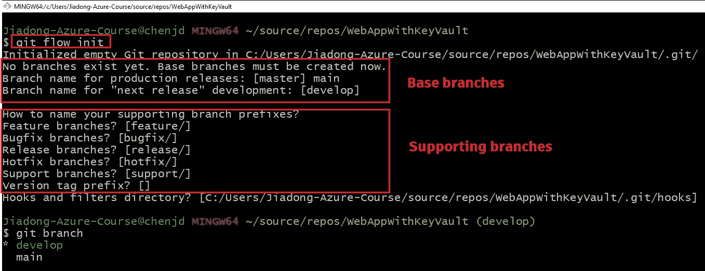

我们可以重命名这两个基础分支，默认命名为“ **master** ”和“ **develop** ”。此外，我们还可以在这里决定如何命名其他支持分支前缀。

接下来，让我们看看如何使用 **git-flow** 工具集将 git 流分支模型应用到我们的日常工作中。

# 基础分支

在 Git-Flow 模型中，我们使用两个基础分支来记录项目的历史。

## 主要/主分支

✅ ***目的*** :一个**主/主**分支存储官方发布历史。

中的 ***:运行`**git flow init**` 命令时会自动创建**主/主**分支。***

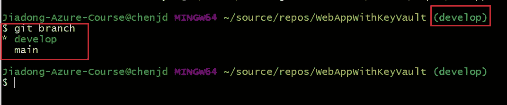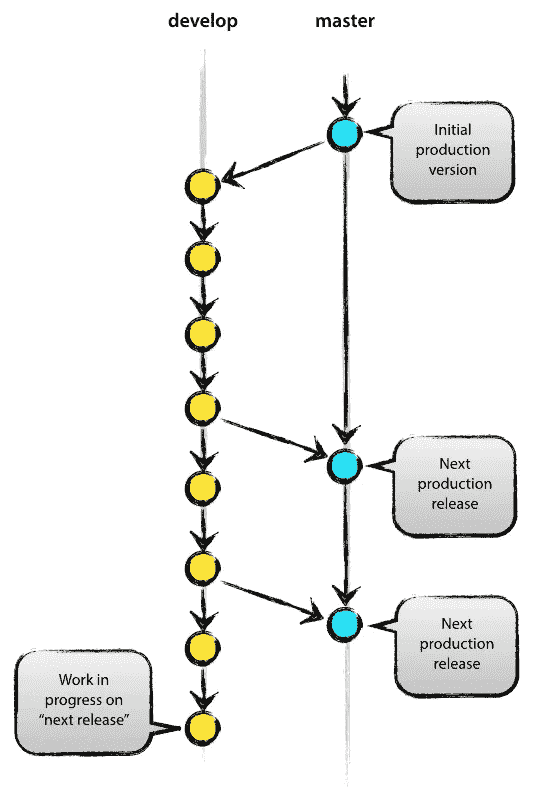

## 开发部门

✅ ***目的*** :一个**开发**分支作为特性的集成分支。

来自 的⬅️ ***:运行`**git flow init**` 命令时会自动创建**开发**分支。此外，当前工作分支将切换到**开发**分支。***

➡️ ***到***:**main/master**分支，当 **develop** 分支中的源代码达到稳定点，准备发布时。


# 支持分支

除了上面提到的运行`**git flow init**` 命令后自动创建的两个基础分支，我们还可以使用其他`**git flow**` 命令来创建扮演不同角色的分支，比如**特性**分支、**发布**分支、**热修复**分支。

## 特征分支

✅ ***目的*** :应该为每个新特性创建一个新的**特性**分支，并且该特性的开发工作应该在那个**特性**分支上进行。

⬅️ ***从*****发展为**分支

➡️ ***到*****发展**分支

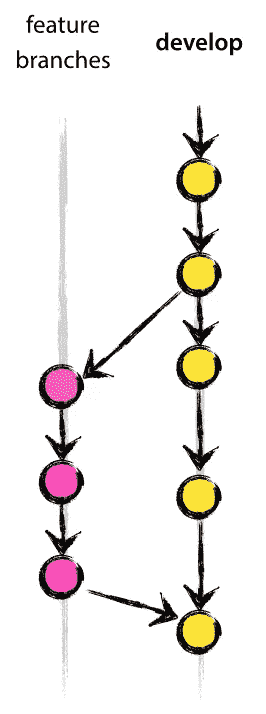

## git 流功能启动<feature_name></feature_name>

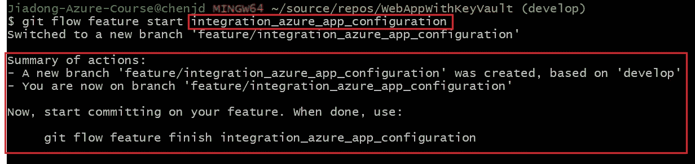

git 流特征开始特征 _ 分支

现在，让我向您展示如何创建一个名为"***integration _ azure _ app _ configuration***"的新特性分支，并使用 **git-flow** 工具对其进行处理。

```
git flow feature start **integration_azure_app_configuration**
```

在上面的例子中，我们使用`git flow feature start`命令创建一个基于**开发**分支的新分支，并自动切换到新创建的特征分支。

如果您不使用 **git-flow** 工具，您会使用下面的命令来实现类似的东西，这更复杂，而且经常会事与愿违(我的意思是，因为`checkout`是一个常见的操作，您可以出于不同的原因创建一个分支)。

```
git checkout develop 
git checkout -b **integration_azure_app_configuration**
```

## git 流功能完成<feature_name></feature_name>

当你完成了那个特性，这意味着你应该将代码合并到开发分支中，你不必再维护特性分支了。所以你可以运行`git flow feature finish`命令，如下所示:

```
git flow feature finish **integration_azure_app_configuration**
```

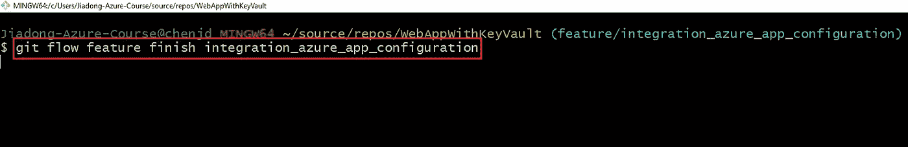

执行该命令时，您可以在终端窗口中看到摘要，包括:

*   特征分支被自动合并到“开发”中
*   本地特征分支已被删除
*   而你现在正在分支'**发展**

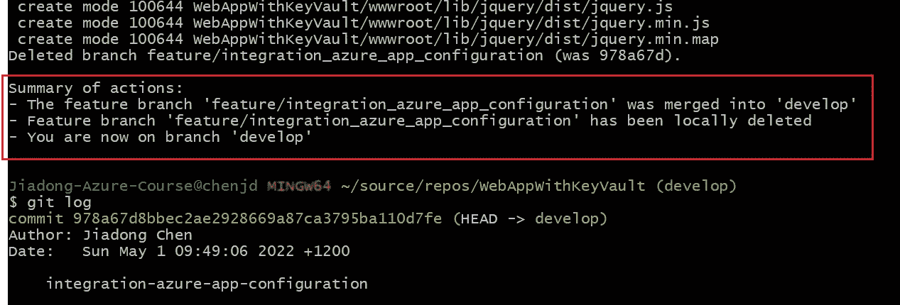

同样，如果您没有使用 **git-flow** 工具，您可以使用以下命令来实现类似的功能:

```
git checkout develop 
git merge **integration_azure_app_configuration**
```

可以看出，第二种方法不仅命令更复杂，而且要求所有开发人员记住合并到正确的分支，即“ **develop** ”，而不是其他任何分支。显然，在这种情况下，如果团队成员在合并分支时不小心做了什么，可能会扰乱团队的开发过程。

另一方面，如果你的团队正在使用 **git-flow** 工具，这保证了团队成员使用 git 时的一致性，团队的新成员即使不熟悉工作流也不会扰乱团队的开发过程。

## 释放分支

✅ ***目的*** :一旦**开发者**分支获得了足够的发布特性，发布分支支持新的生产发布的准备。

⬅️ ***从*****发展为**分支。(下图中的红框)

➡️ ***至*** :主**分支**和**发展**分支。(下图中的红框和蓝框)。

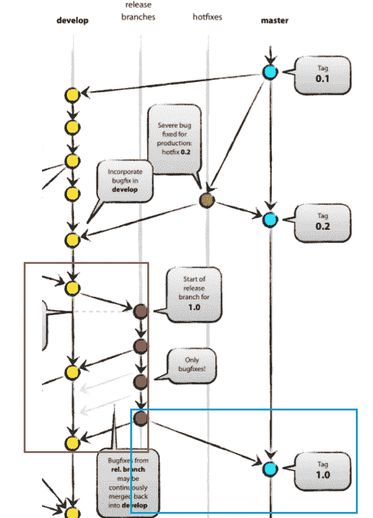

## git 流释放开始

就像创建一个新的特性分支一样，我们也只需要使用一个 git-flow 命令`git flow release start`，来创建一个新的 **release** 分支，我们需要在这里提供版本号。

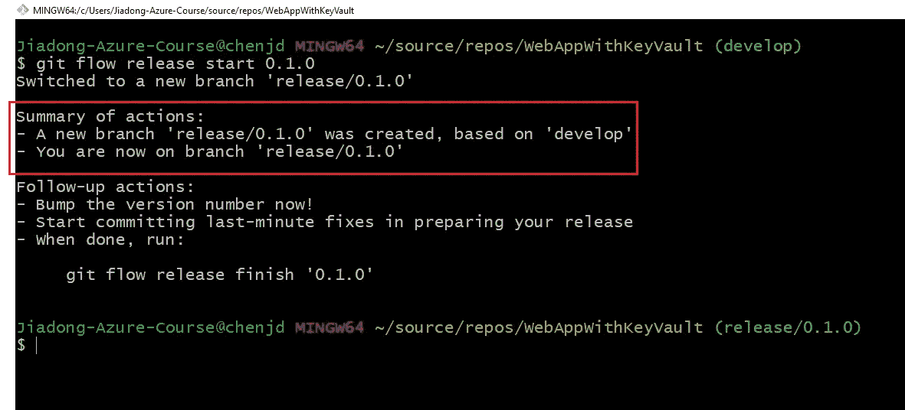

如上图所示，`git flow release start`命令在 develop 分支的基础上创建了一个前缀为“ **release/** 的新分支。此外，我们现在在新创建的发布分支上。

如果没有 git-flow，我们可以使用基本的 git 命令创建一个新的发布分支，如下所示:

```
git checkout develop 
git checkout -b release/0.1.0
```

## git 流释放完成

当 **release** 分支的状态准备好发布时，我们需要将 **release** 分支合并到 **main/master** 中，因为 **main/master** 上的每一次提交根据定义都是一次新的发布。

同时，**发布**分支也将被合并到开发分支中，以保持在其中所做的变更。

这两个动作将由`git flow release finish`命令自动完成，如下图所示。

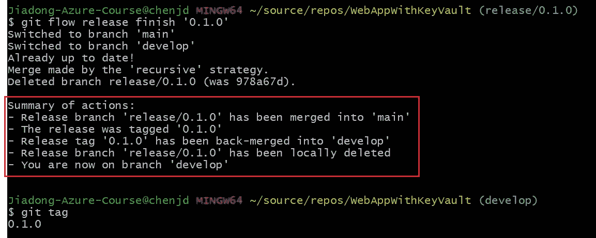

## 修补程序分支

✅ ***目的*** : **热修复**分支非常类似于**发布**分支，因为它们也是为新的产品发布做准备。但是它们被用来修补生产版本，并且它们基于**主/主**分支，而不是**开发**分支。

中的 ***:主**分支/主**分支。只有**分支**应该直接从**主/主**分叉。***

➡️ ***到*** :主**分支和**发展**分支。**

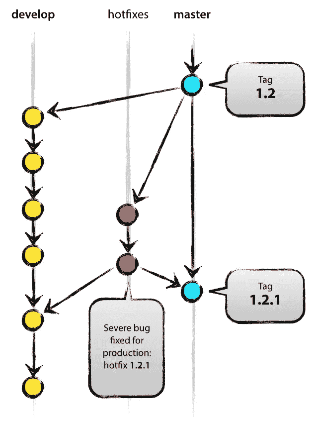

## git 流热修复启动<hotfix_name></hotfix_name>

如果你阅读了上面关于如何使用 **git-flow** 工具创建一个新的 **feature** 分支和一个新的 **release** 分支的讨论，那么你一定已经猜到了如何创建一个新的 **hotfix** 分支，是的，使用`git flow hotfix start`命令。

```
git flow hotfix start **hotfix_example**
```

执行上述命令后，我们将在下面的截图中看到类似的内容。

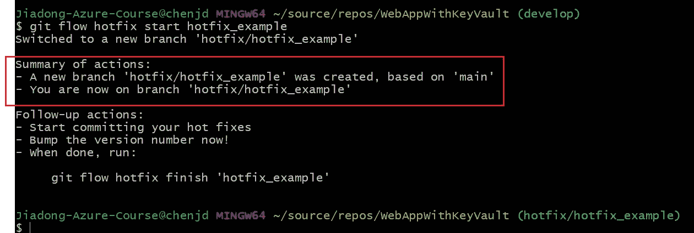

创建了一个新的修补程序分支，我们就在这个分支上。

## git 流热修复完成<hotfix_name></hotfix_name>

一旦错误修复完成，该错误修复需要合并回**主/主**分支，也需要合并回**开发**分支，以确保该错误修复也包含在下一个版本中。

我们只需要一个`git flow hotfix finish`命令来实现它。

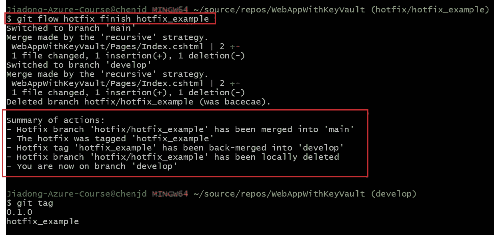

如果没有 **git-flow** ，我们将不得不做一些乏味且容易出错的事情，如下所示。

```
// be merged back into the **main/master** branch
git checkout main 
git merge hotfix_branch// be merged back into the **develop** branch
git checkout develop 
git merge hotfix_branchgit branch -D hotfix_branch
```

# 摘要

希望这篇文章让您对 Git 流分支模型有了更好的理解，至少说服您考虑在日常工作中使用 **git-flow** 工具集。

# 我的新书！

嘿，朋友们，我非常兴奋地宣布，我的新书已经可以在亚马逊上预购了！

[](https://www.amazon.com/Game-Development-Unity-NET-Developers-ebook-dp-B09P5R4QPS/dp/B09P5R4QPS) [## 游戏开发与统一。NET 开发者:用 Unity 创建游戏的终极指南…

### Amazon.com:使用 Unity 进行游戏开发。NET 开发者:用 Unity 和…创建游戏的终极指南

www.amazon.com](https://www.amazon.com/Game-Development-Unity-NET-Developers-ebook-dp-B09P5R4QPS/dp/B09P5R4QPS) 

在本书中，我们将探索如何使用 **Unity 游戏引擎**和**微软游戏开发**，包括**微软 Azure 云**和**微软 Azure PlayFab** 服务来创建游戏。

跟上我:

[](https://www.linkedin.com/in/chenjd/) [## 陈家东-高级软件开发人员-X 公司| LinkedIn

### 陈家东是国际上公认的 3000 名微软最有价值职业(MVP)获奖者之一

www.linkedin.com](https://www.linkedin.com/in/chenjd/)