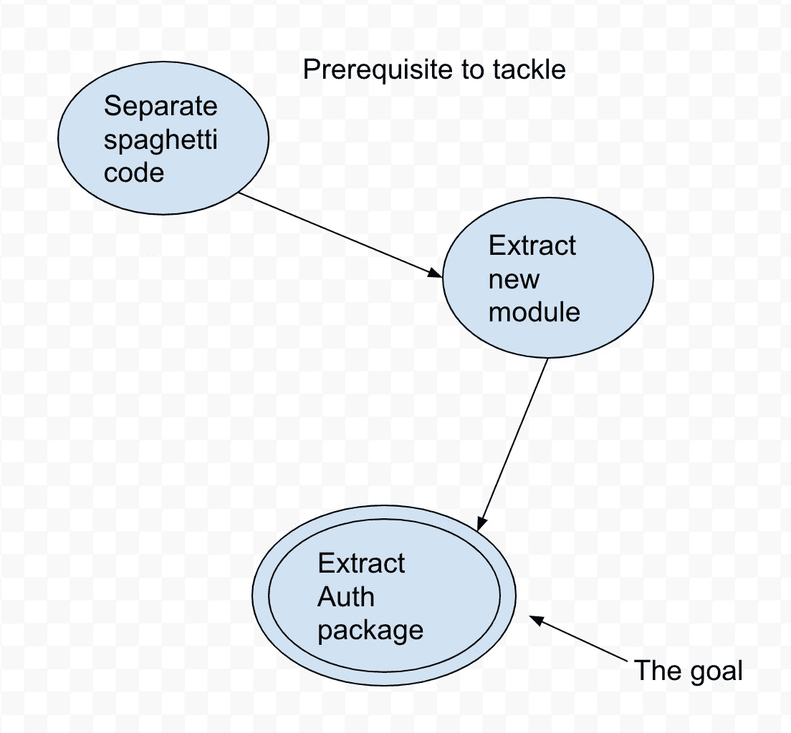

# 为什么你今天应该使用天皇的方法

> 原文：<https://levelup.gitconnected.com/why-you-should-use-the-mikado-method-today-c87e4bd6c493>

如果你没有听说过天皇方法，那么这是你的幸运日！您将学习一个易于学习和共享的过程，这将帮助您处理大型重构或其他代码库改进，而不会迷失方向。如果你已经知道这个方法，那么我希望这是一个复习和提醒，尽可能利用这个工具，让你的生活更轻松，压力更小。

# 天皇方法

简而言之，Mikado 方法是一种对复杂代码进行重大修改的结构化方法。这个过程有四个部分，按照这个特定的顺序来执行是很重要的。

**设定目标**

想想你未来想要什么。这可能是任何事情，从小的重构到大规模迁移到多个微服务或基于事件的架构。弄清楚你到底想要实现什么，如果你是团队成员的话，就和你的团队成员讨论这个问题。创建一个共享文档(米罗或谷歌图纸是两个建议)，其他人可以访问和写下目标，并围绕它画两个圆圈。这是你的北极星和最终目标。

**实验**

接下来，从实验或小的改变开始，让你学习一些关于代码库的新东西。尝试将几个文件移动到不同的包中，看看有什么问题。一旦你学到了会影响你实现目标之路的东西，抓住它并继续想象。

**可视化**

这是你从实验中学到的东西，并把它们形象化为实现目标前必须满足的先决条件的图表。下面是一个可视化的例子。

**撤销**

这是整个过程中最关键的部分，也是最困难的部分之一。撤消您所做的工作，并返回到系统的一个已知工作状态，以便再次执行该过程。天皇方法允许你学习和发现，而不引入可能导致你走上未知的工作道路和错误的突破性变化。

# 利益

这些步骤中的每一步本身都不重要，但是将它们整合到流程中会让大型迁移或增量改进成为第二天性。这里有一些天皇方法的好处。

**代码库的稳定性**

您的团队和您的利益相关者将会喜欢上 Mikado 方法，因为它提供了代码库的稳定性，同时对它进行了重大的修改。变革之路从许多小的变革变成了非破坏性的，而不是最终的大爆炸式整合。因为有了可视化组件，其他非技术团队成员可以跟进，并查看正在取得的进展和还需要做的工作。

**加强沟通与协作**

通过分享可视化和交流变化，可以在整个团队中分享成果。共同努力利用整个团队的能力、现有知识和能力来实现目标。

**轻量级，专注目标**

这个过程只有 4 个简单的步骤，所以很容易学习，也很容易与他人分享和传播。没有什么仪式，除了数字白板或普通的旧纸笔，你不需要任何额外的工具。

# 结论

感谢你的阅读，现在你应该明白如何开始使用天皇方法，并开始一点一点地实现那些总是难以开始的长期目标。如果你有兴趣进一步阅读这个话题，拿起[的书](https://amzn.to/3Pp05ea)继续阅读！

如果你喜欢这篇文章，考虑[订阅媒体](https://medium.com/@ascourter/membership)！

如果你或你的公司有兴趣找人进行技术面试，那么请在 Twitter ( [@Exosyphon](http://twitter.com/Exosyphon) )上给我发 DM，或者访问我的[网站](https://andrewcourter.com/)。如果你喜欢这样的话题，那么你可能也会喜欢我的 Youtube 频道。如果你想支持更多这样的内容 [buymeacoffee](https://www.buymeacoffee.com/andrewcourter) 。祝您愉快！

# 分级编码

感谢您成为我们社区的一员！在你离开之前:

*   👏为故事鼓掌，跟着作者走👉
*   📰查看[升级编码出版物](https://levelup.gitconnected.com/?utm_source=pub&utm_medium=post)中的更多内容
*   🔔关注我们:[Twitter](https://twitter.com/gitconnected)|[LinkedIn](https://www.linkedin.com/company/gitconnected)|[时事通讯](https://newsletter.levelup.dev)
*   🚀👉 [**软件工程师的顶级工作**](https://jobs.levelup.dev/jobs?utm_source=pub&utm_medium=post)