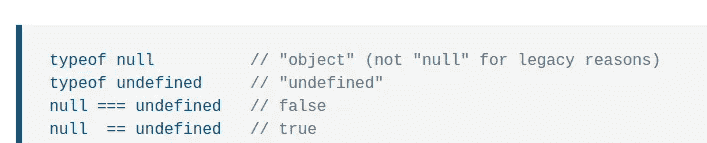

# 为什么不应该责怪 JavaScript

> 原文：<https://levelup.gitconnected.com/why-you-shouldnt-blame-javascript-f6b3a81fc5f0>

## 找到 JavaScript 的好的部分来隐藏 JavaScript 的不好的部分


由 [Unsplash](https://unsplash.com/s/photos/computer?utm_source=unsplash&utm_medium=referral&utm_content=creditCopyText) 上的 [Clément Hélardot](https://unsplash.com/@clemhlrdt?utm_source=unsplash&utm_medium=referral&utm_content=creditCopyText) 拍摄，Canva 编辑。

JavaScript 是最伟大也是最讨厌的编程语言之一。世界上大多数程序员每天都在编写 JavaScript 代码，用于构建企业级 web、桌面、移动、CLI、物联网和智能电视应用。与其他编程语言相比，GitHub [拥有更多的 JavaScript 源文件。许多基于 JavaScript 的框架/运行时通过即时编译(JIT)和提前编译(AOT)等技术进一步提高了它们的性能。JavaScript 正变得越来越流行。](https://madnight.github.io/githut)

另一方面，对于类似 C++的 JavaScript 有很多批评。JavaScript 不提供原生整数类型，但提供了通用浮点类型来存储所有数字。类型强制会在源代码中隐藏问题。此外，全局变量、作用域逻辑和基于弱类型原型的风格有点令人困惑。JavaScript 中有许多怪异和令人困惑的行为。是的，JavaScript 有不好的部分。

在这篇文章中，我将解释为什么你不应该批评 JavaScript 的不好的部分。此外，我将解释如何解决 JavaScript 中的常见问题。

# 为什么 JavaScript(仍然)有不好的部分？

JavaScript 作为一种简单的脚本语言开始了它的旅程，使静态网页从客户端(从浏览器)交互。Web 浏览器嵌入了 JavaScript 解释器，允许用户在他们的计算机上运行 JavaScript 代码。Web 浏览器有不同的 JavaScript 解释器。因此，ECMAScript 为 JavaScript 创建了一个规范，让 web 开发人员编写跨浏览器脚本。后来，Node.js 帮助 JavaScript 从浏览器沙箱跳到操作系统层。

尽管现在程序员在任何地方都使用 JavaScript 它的主要目标是从客户端安全地运行简单的脚本。客户端脚本不应该破坏整个网站的功能。弱类型行为和类似类型强制的特性试图执行 JavaScript 代码，而不会因错误而暂停特定的脚本。

早先，JavaScript 支持程序员使他们的网页具有交互性。客户端脚本不包含业务逻辑——web 开发人员在 web 服务器上实现业务逻辑。后来，程序员倾向于用 JavaScript 写所有东西。因此，许多程序员开始将简单的脚本语言与功能齐全的成熟编程语言进行比较。

由于 JavaScript 出人意料的流行，新的 ECMAScript 版本开始发布一些好的部分来替代 JavaScript 的坏部分。但是，ECMAScript 不能反对坏的部分，因为它可能会破坏互联网上一半的网页。

# 改进你的代码——而不是批评语言

ECMAScript 引入了新的特性来升级 JavaScript，并使 JavaScript 与其他现代语言竞争。另一方面，web 浏览器开发人员使他们的 web APIs 保持一致，以使 web 开发人员的生活更加轻松。可悲的是，大多数程序员通过抱怨几十年前实现的一些特性来批评 JavaScript。在每个流行的平台中，功能移除无疑比功能实现更难。在 JavaScript 中，核心特性的移除实际上是不可能的——因为人们仍然需要用新的浏览器来查看旧的网页。开发者不会用新的特性重写所有的 JavaScript 代码库。

与其批评 JavaScript 的问题，不如用新的解决方案和[干净的代码](https://betterprogramming.pub/5-clean-code-practices-for-every-software-project-479443b31c3c)。JavaScript 的内部数字系统无疑是糟糕的，因为它甚至将整数值存储为浮点数。

```
console.log(9999999999999999) // 10000000000000000
```

以上行为看起来很恶劣吧？请改用内置的 BigInt 类。

```
console.log(9999999999999999n) // 9999999999999999n (Note "n")
```

如果您需要一个基于 JavaScript 的货币值表示，可以考虑使用 [Dinero.js](https://github.com/dinerojs/dinero.js) ，它提供了特定于货币的特性，不像原生 BigInt。

这是另一个。JavaScript 的类型强制有时令人困惑，如下所示。

```
console.log(true + true) // 2 .. but why?
```

即使上面的操作没有实际的用例，它看起来也很糟糕，对吗？尝试使用 TypeScript 将 JavaScript 作为一种(伪)静态类型语言——作为一种解决方案。

```
console.log(true + true) // Operator '+' cannot be applied....
```

还有，`typeof null`有一个众所周知的 bug。现代 JavaScript 引擎不得不将这个 bug 作为一个特性来实现，以保持向后兼容性。



[MDN Web Docs](https://developer.mozilla.org/en-US/docs/Web/JavaScript/Reference/Global_Objects/null#examples) 解释为什么 null 的类型是对象，作者截图。

因此，如果您需要检查某个特定变量是否包含对象引用，现在您也必须检查`null`。

```
let isObject = typeof objRef == "object" && ObjRef != null
```

与 JavaScript 一样，C++编程语言也因其复杂的规范和标准库而受到批评。但是，你为什么不用你[只需要](https://google.github.io/styleguide/cppguide.html#Exceptions)的特性呢？C++是编写轻量级、高性能和操作系统级软件系统的好语言。C++和 JavaScript 语言都比现代的、最小的、较少被批评的语言如 Go 更古老、更流行。

JavaScript 和 Python 一样，是初学者友好的编程语言。学习 JavaScript 有很多好处:不仅可以构建 web 应用，还可以构建任何东西，随时可以轻松转换职业。学习 JavaScript 新的好的部分，而不是责备几十年前实现的特性。

# JavaScript 是不朽的——没有替代品！

WebAssembly 不是 JavaScript 的替代品，它是一种跨浏览器的字节码格式，用于运行 JavaScript 无法在浏览器中有效处理的 CPU 密集型计算。Web 开发人员永远不会使用 C++或 Rust 来编写 web 应用前端——但他们可能会使用 WebAssembly，通过将一些数据处理任务移交给用户的计算机来减少他们的服务器工作量。例如，WebAssembly 是编写客户端视频编辑或图像处理 web 应用程序的好选择。

早先，由于用户计算机中有限的硬件资源，每个程序员都编写本机桌面应用程序。但是，现在，由于开发和功能交付速度的原因，即使是大型科技公司也用 JavaScript 构建桌面应用程序。只需对比一下用 C/C++和 JavaScript 构建一个语法高亮器的开发时间(比如说，hi [highlight.js](https://github.com/highlightjs/highlight.js) )。下面的故事讨论了本机桌面应用程序发生了什么变化。

[](https://shalithasuranga.medium.com/goodbye-native-apps-2ffcbd2773e7) [## 再见，本地应用

### 混合应用正在取代在低端和高端电脑上都能流畅运行的原生应用

shalithasuranga.medium.com](https://shalithasuranga.medium.com/goodbye-native-apps-2ffcbd2773e7) 

我们生活在一个 Web 3.0 和 Web 4.0 混合的时代。如果您禁用 JavaScript 代码执行功能，web 浏览器将变得无用。此外，由于丰富的库生态系统，大多数程序员倾向于使用 JavaScript 来编写 web 后端。像 React Native 这样的框架使得 JavaScript 在移动开发者社区中更受欢迎。

多亏了 V8、Node.js 和 Hermes，JavaScript 成为了一种通用语言。此外，除了 JavaScript，您不能在浏览器上运行任何其他语言。

# 结论

程序员使用各种编程语言来构建软件系统。我们根据自己的偏好、社区支持、内置特性、第三方库支持和性能来选择编程语言。没有完美的编程语言——每种语言都有不同的优点和缺点。JavaScript 的现代版本(ES6 或更高版本)是构建应用程序的良好编程语言。

JavaScript 仍然有一些不好的部分，因为 ECMAScript 由于向后兼容问题无法删除语言特性。但是，作为一个解决方案，你可以用新的好的部分隐藏它的不好的部分，而不用批评整个语言。还有，不要把浏览器兼容性问题、浏览器 API 不一致、NPM 的安全问题、电子公司臃肿的应用捆绑包，或者 React Native 缓慢的移动应用归咎于 JavaScript——那些组件根本不属于 ECMAScript (JavaScript)。