# JavaScript 日期完全指南

> 原文：<https://levelup.gitconnected.com/why-your-javascript-date-is-off-by-1-day-a-complete-guide-to-javascript-dates-10a973fb9b1f>

## 又名:为什么你的 JavaScript 日期总是差一天

JavaScript 日期令人困惑。此外，它们可能是 JavaScript 编程中最不令人兴奋的事情。

但是，如果你正在构建一个 Todo 应用程序——你知道，这是现存最被过度使用的 web 应用程序，并且你想添加日历提醒功能，会发生什么呢？

如果你的约会对象没有正确处理时区，你最终会得到一个“差 1 分”的错误，**你错过面试的用户会对你的应用程序非常生气。**

## 我关于 JavaScript 日期的自白

我花了**至少 3 年的编程时间才最终坐下来理解这个话题。如果我不得不猜测的话，你们中的一些人正在阅读这篇文章，所以为此干杯！🍻**

## 剧透警报

JavaScript 日期**实际上并没有那么难。**当你阅读这篇文章时，你会意识到 JavaScript 日期的难点在于非 JavaScript 概念，如时区和格式标准。

大多数人搜索关于 JavaScript 日期的教程，而他们所需要的只是回顾时间是如何工作的！(包括我自己)

## 在我开始阅读之前 MomentJS 怎么样？

似乎现在所有酷的孩子都在用 MomentJS(或者如果你更酷的话——Luxon)。

别担心，我不是什么 JavaScript 纯粹主义者，我只是告诉你要始终使用普通的 JS 日期对象——我只是想通过核心概念来让你的 Moment/Luxon 生活变得更加容易。

## 最后，我们开始吧。

想象一下——你已经写了 8 个小时的代码，你的大脑有点累了，你在一次紧张的调试会议中遇到了一个约会对象:

```
new Date('2020-09-30')// Output: Tue Sep 29 2020 20:00:00 GMT-0400 (Eastern Daylight Time)
```

什么？？？

等等，事情会变得更混乱。这是我的本地电脑(我现在站在美国东部的电脑):

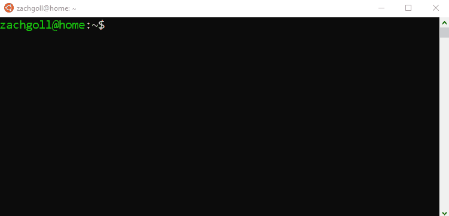

这里是**我在**上运行高尔夫训练应用程序的网络服务器:

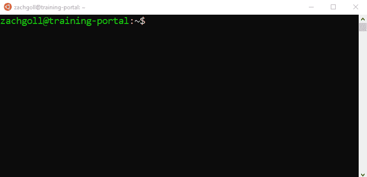

注意到什么了吗？在我的本地电脑上，`.toDateString()`的结果是`Tue Sep 29 2020`，而在我的服务器上，`.toDateString()`的结果是`Wed Sep 30 2020`。此外，两台计算机对`toISOString()`方法返回了相同的结果！

要么是我疯了，要么是我们在两台不同的电脑上输入了完全相同的内容，却得到了完全不同的答案——更不用说其中一台电脑完全弄错了我的日期！！还是……

我想我们不应该感到惊讶，因为 JavaScript 是一种充满惊喜的语言。无论如何，是时候解决另一个 JavaScript 之谜了。

# 这是你最后一次被 JavaScript 日期弄糊涂了

如果我们想一劳永逸地了解这一点，我们需要从了解计算机的时区开始。

这里是我的**本地计算机的**时区:

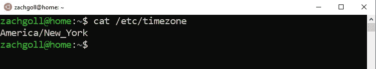

这是我的**服务器的**时区:

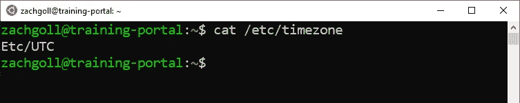

如您所见，本地计算机的时区是 EST/EDT，而服务器的时区是 UTC。这一点，加上 JavaScript 的一些怪癖，就是为什么我们会得到上面这样意想不到的结果。但是在我们更深入地探索这个过程的内部之前，这是没有意义的。

虽然我同意 JavaScript 有时会造成不必要的混乱，但当涉及到日期时，**整个系统都是混乱的**——尤其是当我们开始谈论时区的时候。但是有了一点历史教训，我想我们可以把事情控制在一个可控的范围内。

# 什么是 UTC？(理解 JavaScript 日期的关键)

UTC 代表“协调世界时”，顾名思义，它是计时的基础。嗯…算是吧。

在我们的手腕上、口袋里、墙上和价格昂贵的咖啡机上有时间记录之前，人们需要一种可靠的方法来计算当前时间。他们是怎么做到的？太阳。

警告:我们在这里会分心几分钟，但是如果我们真的想记住这些讨厌的 JavaScript 日期是如何工作的，我们需要一些历史背景。如果你不喜欢读我简短的历史课，跳到这篇文章的下一部分。

想象一下，在一个阳光明媚的日子里，把一根完全垂直的杆子插在地上。当太阳升起时，那根杆子会向西投下阴影，反之，当太阳落下时，会向东投下阴影。如果你要计算影子从一点移动到另一点需要多长时间，你就可以(在某种程度上)记录时间。

**但是有一个问题…** 如果我在我居住的美国把一根垂直的柱子放在地上，影子不会像有人在爱尔兰的某个地方把一根柱子放在地上一样同时投射到同一个方向。

为了解决这个问题，我们需要一个**公共参考点**和一个**时间标准**。在某种程度上，一些科学人士认为，使用 0 经度(又名“本初子午线”，恰好是英国的格林威治)将是一个很好的“通用参考点”，以将谚语中的“极点”放在地上。

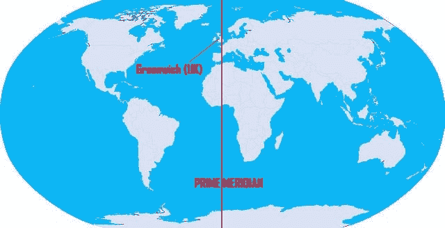

下一个挑战实际上是根据“地上的杆子”计算“时间”。它过去是用格林威治标准时间(GMT 标准——始于 1847 年)来计算的，但是在 20 世纪 60 年代初的某个时候，一些工程师认为我们需要一个新的标准，它的计算方式比 GMT 更加一致。

1970 年， **UTC 标准**最终确定，但在 1972 年，为了使 UTC 与[平均太阳时](https://en.wikipedia.org/wiki/Solar_time#Mean_solar_time)(由于地球自转的不规则性，稍有不精确)保持一致，对其进行了修正，定期添加了[闰秒](https://en.wikipedia.org/wiki/Leap_second)。

今天，有 3 个主要的“时间”计算方法(当我写这篇文章时，它对我来说越来越没有意义):

1.  平均太阳时(UT1)
2.  世界协调时间(UTC)
3.  国际原子时

TAI 最准，由[原子钟](https://en.wikipedia.org/wiki/Atomic_clock)计算。

UTC 的*来源于* TAI，但为了与 UT1 保持同步，它加入了闰秒。

在 JavaScript 中，你会经常看到 GMT，但它只是一个从未消失的传统术语，可以被认为是 UTC 的等价物。

**有趣的事实**

最后一个闰秒是在 2015 年 6 月 30 日添加的，2023 年的世界无线电通信大会上，将会有一场关于可能从 UTC 时间标准中删除*闰秒的讨论，该标准自 1972 年以来就没有改变过。*

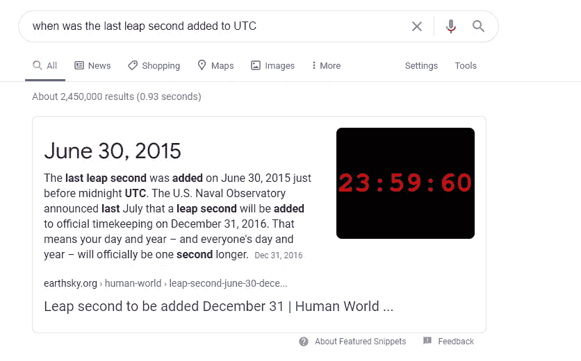

## 一切都围绕着 UTC

自 1972 年以来，世界一直基于这一 UTC 标准运行，当谈到时区时，它被认为是+/- 0:

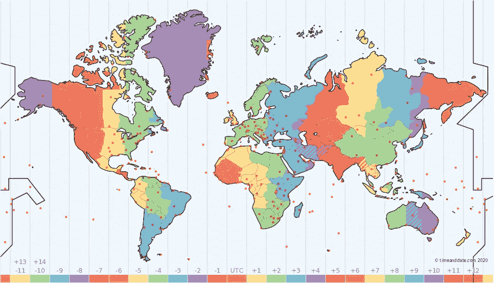

请注意图片底部的值

如果我们向西移动 UTC 时区，每个连续的时区会变得负 1 小时，而向东移动时则相反。

正如你可能已经猜到的那样，由于世界是一个球体，向东移动最终会到达一个“西部”时区，因此，例如，-10 时区相当于+14 时区。

## 时区可以用两种方式定义(那么夏令时呢？)

我们可以用两种方式谈论时区:

1.  作为对“零点”的数字引用，零点是 UTC 时区
2.  作为一个常见的名称，如“UTC”或“EST”

**我们必须记住的一件事是，UTC 不会改变。永远不会。**

我住在美国东部，所以从 2019 年 11 月 4 日→2020 年 3 月 7 日，我住在美国东部时区或官方时区列表[中的“东部标准时间(北美)”区。美国东部时区也可以称为“UTC-05 ”,因为它位于 UTC 时区以西 5 小时。](https://en.wikipedia.org/wiki/List_of_time_zone_abbreviations)

但是，2020 年 3 月 8 日——美国“夏令时”的第一天——会发生什么呢？

如果 UTC 从不改变，那我们怎么知道现在是夏令时呢？

2020 年 3 月 8 日(美国夏令时第一天)，**我的时区从 EST → EDT，**变为“东部标准时间(北美)”→“东部夏令时(北美)”。

EDT 也可以被称为“UTC-04 ”,因为我们由于夏令时而“向前冲”,现在，我只比 UTC 晚 4 个小时。

明白这是怎么回事了吗？？UTC 从不改变，但你所在的时区会改变。对大多数人来说，这并不重要，因为当我说“活动在东部时间上午 10 点开始”时，没有人会问我是在说东部时间还是东部时间。没人在乎，因为我们的智能手机负责“幕后”转换。

但是作为 JavaScript 开发人员，我们是编写这些转换的人，因此，应该理解这些东西！

## 但是…我的 JavaScript 日期是“GMT-0400”

记住——JavaScript 很奇怪。奇怪的是，它仍然使用“GMT”或“格林威治标准时间”来表示日期。

在你的大脑里，当你看到“GMT”的时候，就想着“UTC”。

当您看到“GMT-0400”时，这与我们在上一节中定义的“UTC-04”、“EDT”或“东部夏令时(北美)”是一回事。

JavaScript 是在 90 年代发明的，所以我真的不确定他们为什么不用“UTC-0400”而不用“GMT-0400 ”,但这是另外一个问题了。

## 但是 UNIX 时代呢？

所以让我们回到电脑上来。你肯定听说过这个术语，“UNIX 纪元”，它被定义为 1970 年 1 月 1 日。

这是 ISO 8601 的格式(后面会详细介绍):

```
1970-01-01T00:00:00Z
```

当《时代》杂志的工程师在 20 世纪 70 年代早期努力定义 UTC 标准时，计算机工程师也在努力制造计算机。当你制造一台计算机时，你必须给它一个参考点和一个“滴答”频率，以便它能记住现在是什么时间。而那个参考点被任意选择为**1970 年 1 月 1 日午夜。**

几个来源争论这个日期背后的真正原因，但最终，这并不重要。它只是一个**参考点。请在评论中留下你对此的理论(或故事)——我很乐意阅读它们。**

# 那么什么是 JavaScript 日期呢？

> JavaScript 日期是自 1970 年 1 月 1 日午夜(UTC 时区)以来经过的毫秒数。

嗯…那个日期听起来很熟悉…

当处理 JavaScript 日期时，您必须始终记住这个定义。Date 对象上有很多原型函数，比如`getDate()`、`getUTCDate()`和`toISOString`，但是只有一个方法可以给你一个 JavaScript 日期的**真实表示**:

```
const myDate = new Date('2020-01-01');console.log(myDate.valueOf()) // 1577836800000
```

`valueOf()`方法告诉我们，2020 年 1 月 1 日(UTC 时区)的午夜是 1970 年 1 月 1 日(UTC 时区)午夜之后的`1577836800000`毫秒。

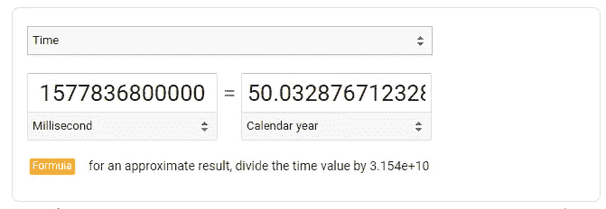

如果你像我一样，你可能会对第**部分感到疑惑。这代表闰年。自 1970 年以来，我们在接下来的几年里有闰年:**

```
1972, 1976, 1980, 1984, 1988, 1992, 1996, 2000, 2004, 2008, 2012, 2016, 2020
```

由于我们使用的是 2020 年 1 月 1 日，额外的一天是在 2 月增加的，我们需要*在计算中排除*2020 闰年，这样我们就有了自 1970 年 1 月 1 日以来的 **12 个闰年**。如果我们把年转换成天:

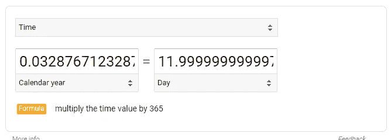

这就是我们如何得到这些额外的小数😆

因此，如果我们想计算一个日期在 1970 年 1 月 1 日之前，可能吗？

当然啦！值将会是负的。

```
const d = new Date('1912-06-23');console.log(d.valueOf()) // -1815350400000
```

## 可能的日期对象输出值

当我们打印上面的`valueOf()`日期时，您可能已经注意到输出是一个数字。这是日期对象的三种可能输出中的第一种:

1.  日期对象的原始值(数字)
2.  ISO 8601(字符串)
3.  JavaScript 标准格式(字符串)

以下是每种方法的示例:

```
const myDate = new Date('2020-09-30');// Primitive value (number)
myDate.valueOf() // 1601424000000// ISO 8601 (string)
myDate.toISOString() // "2020-09-30T00:00:00.000Z"// JavaScript Standard Format (string)
myDate.toString() // "Tue Sep 29 2020 20:00:00 GMT-0400 (Eastern Daylight Time)"
```

JavaScript 日期的原始值很简单。正如我们所讨论的，它表示自 1970 年 1 月 1 日午夜(UTC 时区)以来的毫秒数，这是一个数字值。

ISO 8601 的格式有点令人困惑，但是一旦你把这些片段分开，它看起来就不那么吓人了。ISO 8601 实际上与 JavaScript 毫无关系——它是时间和日期的全球标准(如果你感兴趣，可以在附录中找到更多相关信息)。

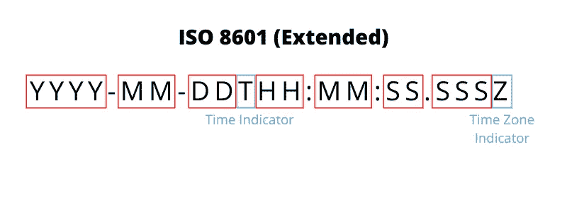

JavaScript ISO 8601 格式

我们稍后会详细讨论这种格式，但是现在，只要记住`T`是时间指示器，而`Z`是时区指示器。在这种情况下,“Z”来自“祖鲁时间”,这是针对 **UTC 时区**的[军事时区参考。所以请记住:](https://en.wikipedia.org/wiki/List_of_military_time_zones)

```
Z === “Zulu Time” (military) === UTC time (JavaScript)
```

每当您在 JavaScript Date 对象上使用`toISOString()`时，您将总是获得日期的 UTC 表示，由`Z`表示。

**最后但同样重要的是——**JavaScript 标准日期格式。

在我看来，这是所有输出中最令人困惑的。原始值打印从 epoch 开始的毫秒数，这很容易掌握。ISO 8601 值打印以从不改变的标准化格式表示的日期值。但是 JavaScript 标准格式呢？它不仅打印了一个我们还没有谈论很多的时区，而且还产生了如上所示的意外结果(Sep 30 输入更改为 Sep 29 输出)！

让我们一劳永逸地解决这个 JavaScript 之谜。

# 两台计算机的故事(以及为什么它们似乎不能在日期上达成一致！)

在这篇文章的开始，**在我们对 UTC** 有所了解之前，我展示了一个 JavaScript 日期如何根据你使用的计算机和计算机的时区而*显示*不同的例子。

在这一部分，我们将使用两台电脑和一个日期(2020 年 9 月 30 日——写作的那一天),来说明为什么你的约会“晚了 1 分钟”。

这里有两台**不同时区的电脑**，如下图截图所示。请注意，打印的时区看起来与我们之前讨论的时区有些不同。这是因为有两个官方时区列表——一个是[“普通”时区列表](https://en.wikipedia.org/wiki/List_of_time_zone_abbreviations)和一个是[“计算机”时区列表](https://en.wikipedia.org/wiki/List_of_tz_database_time_zones)。在文章的第一部分，我们使用“常规”列表，而在下面，我们使用“计算机”列表。没有实质上的区别，只是语义上的。

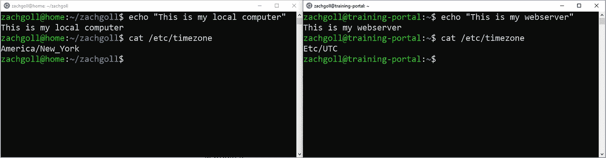

本地计算机(左)，web 服务器(右)

所以**记住，当我们看这些例子的时候:**

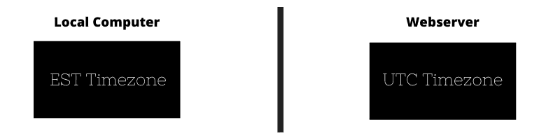

这两台计算机有不同的时区

让我们从一个简单的日期开始，获取它的原始值。

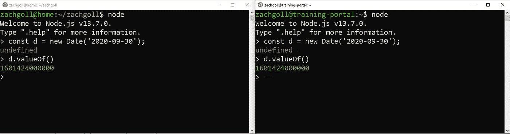

记住，这是自 1970 年 1 月 1 日午夜以来的毫秒数

到目前为止，一切顺利。我们将值`'2020-09-30'`作为输入传递，并得到相同的输出— `1601424000000`。

现在，让我们看看当我们以 UTC 时间打印时会发生什么:

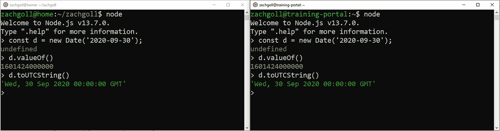

这里看起来还不错。正如所料，它们显示了相同的值。让我们把它看作一个 ISO 字符串，它应该和一个 UTC 字符串是一回事。

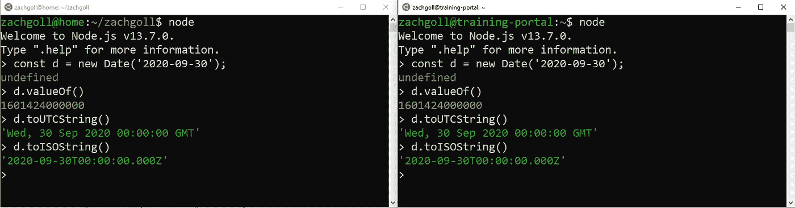

同样，我们得到了和预期一样的值。但是现在是真正有趣的时候了:

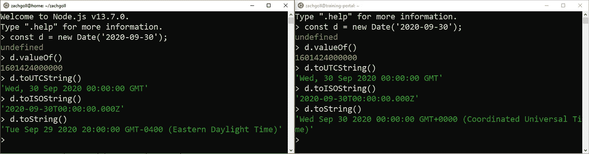

这就是为什么 JavaScript 日期迷惑了这么多人(包括我以前的自己)。

让我们仔细想想…我们知道以下事情:

*   我们使用了一个输入值`2020-09-30`
*   JavaScript 日期的原始值是从 1970 年 1 月 1 日午夜(UTC 时间)开始的`1601424000000`毫秒
*   如果我们将原始值转换为 UTC 时间，它表示 2020 年 9 月 30 日午夜。

因此，我们在这里可以得出的结论是，**一些 JavaScript 日期方法**输出内部存储日期**的**“真”值**，而其他方法**基于打印值的计算机的时区输出内部存储日期**的**“相对”值**。**

记住，左边的计算机处于美国东部时间时区，也就是“UTC-04”。

所以如果这个日期的内部值是`160142400000`(UTC 时间 2020 年 9 月 30 日午夜)，那么如果我们把这个值转换成 EDT 时间，就要减去 4 个小时。如果我们从午夜开始减去 4 个小时，那么这个日期的“相对”时区值是 2020 年 9 月 29 日下午 8 点(即 20:00)。

# 好吧，我明白了，但是为什么 JavaScript 要这样做呢？

所以 JavaScript 日期是这样工作的:

1.  您输入一个值，例如`2020-09-30`
2.  JavaScript 假设这个值是 UTC 时间
3.  JavaScript 将其存储为 UTC 时间
4.  当使用`toString()`方法或者当您`console.log`日期时，JavaScript 以您的当地时间输出它

真正的问题是…如果 JavaScript 假设您输入的是一个 UTC 值，那么它为什么不假设您想要一个 UTC 值输出呢？

好吧，在 JavaScript 的眼里，当你输入`2020-09-30`的时候，你不够具体。

所以我们来谈谈如何避免这个问题。

# 如何看待 JavaScript 日期

当使用 JavaScript 日期时，我们需要问自己以下问题:

1.  我的**输入值**是什么，我是否指定了时区？(即`2020-09-30`对`2020–09–30 GMT-0400`)
2.  我约会的 UTC 值是多少？(你总是可以使用`.toISOString()`找到它)
3.  我使用什么 JavaScript 方法来显示日期，它会以什么时区输出我的值？

假设您正在构建一个应用程序，允许您的用户在他们的用户资料中指定他们的生日。假设我们的用户的生日是 1971 年 6 月 28 日，他们住在佛罗里达州(东部时区)。

所以你很快编写了一个应用程序，并询问用户的生日:

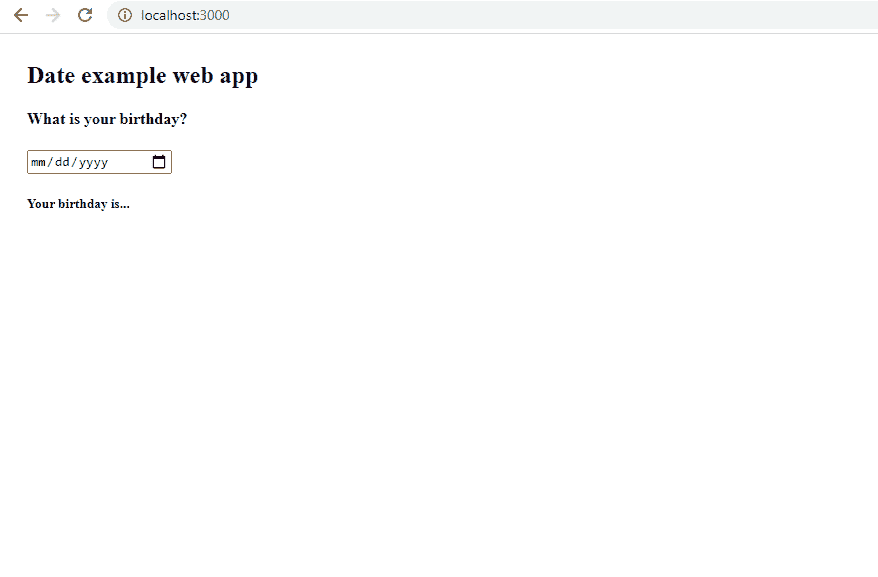

JS 中显示日期的不正确方式

用户选择了 6 月 28 日，但您的 web 应用程序显示的是 6 月 27 日(以字符串形式打印)😢

以下是该 web 应用程序的代码，让我们看看您是否能发现错误:

让我们回顾一下之前的清单:

1.  什么是输入值，我是否指定了时区？—默认情况下，HTML5 输入将以 UTC 格式记录日期选择。所以从技术上讲，我们指定了一个时区，但它是默认的——UTC。
2.  **这个日期的 UTC 值是多少？** —如果您要打印`console.log(dateValue.toISOString())`，您将得到`1971-06-28T00:00:00.000Z`，它代表 UTC 值。
3.  **我使用了什么 JavaScript 方法来显示日期？这就是我们出错的地方。我们的输入值是用 UTC 记录的，但是由于我们使用了`getDate()`、`getMonth()`和`getFullYear()`方法，这些方法会将原始日期转换成用户的本地时区，即东部标准时区(北美)！**

**那么我们如何解决这个问题呢？**

有两种方法:

1.  最简单—以 UTC 时间显示日期(与输入方式一致)
2.  更难—询问用户的时区，并在保存日期时指定时区

对于第一种方法，您需要做的只是更改以下内容:

```
const day = dateValue.getDate();
const month = dateValue.getMonth() + 1; // Return Value is 0 indexed
const year = dateValue.getFullYear();
```

对此:

```
const day = dateValue.getUTCDate();
const month = dateValue.getUTCMonth() + 1; // Return Value is 0 indexed
const year = dateValue.getUTCFullYear();
```

经过这些改变，瞧！有用！

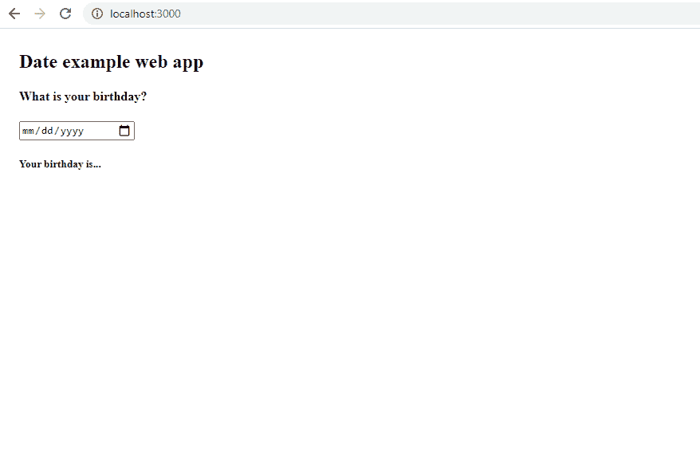

正确的日期示例

第二种方法更复杂，但仍然可行。假设您要求该用户选择他们的时区，他们选择了“EDT —东部夏令时(北美)”时区。

一旦有了这些信息，就可以使用下面的 JavaScript 代码(尽管我不推荐):

如您所见，这是更多的代码行，有点重复——绝对不推荐。

# 使用 JavaScript 日期的多种方式

上一节中的例子强调了一个特定的“gotcha”场景，但是还有许多其他方式来处理 JS 日期。

例如，您可以将几乎任何内容传递给 Date 对象:

```
// EXAMPLE #1
// Inputs as arguments
// Date(year, month, day, hour, minute, second, millisecond)
// Note: the month is 0-indexed (I have no clue why...)
new Date(2020, 11, 2, 7, 10);// EXAMPLE #2
// Inputs as various strings
// This works with pretty much anything you can think of
new Date('Jan 20 2020');
new Date('January 20 2020');
new Date('Jan-20-2020');
new Date('Jan 20 2020 02:20:10')// EXAMPLE #3
// Inputs as numbers (milliseconds)
new Date(102031203)// EXAMPLE #4
// Inputs as ISO 8601 (we are about to talk about this)
new Date('2020-01-20T00:00Z')// EXAMPLE #5
// Inputs with timezone specifications
new Date('Jan 20 2020 02:20:10 -10:00') // SPECIAL CASE
new Date('Jan 20 2020 02:20:10 -1000') // SPECIAL CASE
new Date('Jan 20 2020 02:20:10 (EDT)') // SPECIAL CASE// EXAMPLE #6
// The current moment, specified in the user's local timezone
new Date(Date.now()) // SPECIAL CASE
```

请记住，始终注意您的输入值！在示例 1–4 中，我们用 UTC 时间指定这些日期！示例 5 和 6 是我们根据特定时区指定日期的唯一例子。在示例 5 中，我们明确地这样做了。在示例 6 中，`Date.now()`静态方法将自动计算计算机本地时区的当前日期和时间。该方法返回一个本地日期值——自 UTC 1970 年 1 月 1 日午夜以来的毫秒数，因此我们需要将其传递给`Date()`构造函数以获得一个实际的 Date 对象。

换句话说，如果您计划在 2020 年 8 月 10 日(记住，这是夏令时)晚上 8 点在加利福尼亚州举行的直播活动，那么您需要将其输入为(其中 PDT 是太平洋夏令时):

```
const myEventDate = new Date('Aug 10 2020 08:00:00 PDT');
```

并显示为:

```
myEventDate.toString();
```

这将确保从个人电脑(在不同时区)读取此内容的任何人都能以当地时间显示此直播活动的时间和日期。你可以自己尝试一下！`myEventDate.toString()`的输出应该打印转换到您的时区的事件的时间和日期。

# 一定有更简单的方法做到这一点(MomentJS 和 LuxonJS)

不，您不会被 JavaScript 中的普通日期对象所束缚。有像 [Moment 和 Luxon](https://momentjs.com/) (Luxon 是 Moment creators 的最新项目)这样的库，给你提供快速简单的方法来创建和格式化日期。

也就是说，我建议在使用这些库之前，至少要通读一两遍这篇文章，因为尽管这些库有很多处理 JavaScript 日期的帮助方法，但它们并没有改变 JavaScript 日期的内部工作方式，如果你不理解核心概念，仍然会让你大吃一惊！

这是之前用 MomentJS 演示的相同问题。记住:

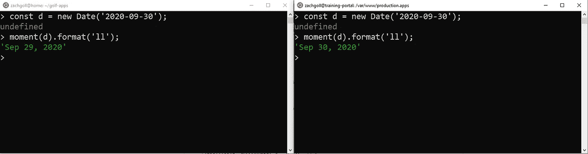

如你所见，我们也有同样的问题。但是……Moment 比 JavaScript Dates 更聪明一点。如果您直接在 moment 对象中键入日期，它会起作用:

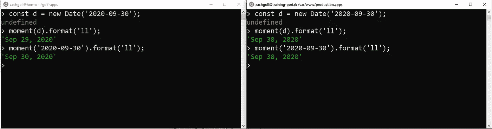

Moment 不仅防止了常见的日期陷阱(在大多数情况下)，还提供了格式化日期的简单方法！

这绝不是使用 MomentJS 或 Luxon 的教程——请自行查阅它们的文档。我在这里的意图是指出，尽管这些库提供了处理 JavaScript 日期的简单方法，但它们并没有改变 JS 日期的工作方式，您仍然应该努力理解它们！

# 附录:ISO 8601 入门(可选)

记住，JavaScript 日期的 3 种可能的输出格式是:

1.  日期对象的原始值(数字)
2.  ISO 8601(字符串)
3.  JavaScript 标准格式(字符串)

在本附录中，我们将深入研究 ISO 8601 标准格式。

就像 UTC 不是 JavaScript 特有的概念一样，ISO 8601 也不是。

T2 是一种国际标准，有两种主要版本:

1.  基础
2.  延长

JavaScript 使用“扩展”变体，这仅仅意味着不同类型的值之间有分隔符。例如，让我们看看日期和时间的“基本”版本:

```
20200930T000000.000Z
```

这代表世界协调时 2020 年 9 月 30 日午夜，使用 ISO 8601 标准的“基本”格式。但是可读性不是很好，JavaScript 也不接受:

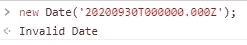

ISO 8601 的“基本”和“扩展”变体之间的唯一区别是分隔符的使用。以下是“扩展”格式的相同日期:

```
2020-09-30T00:00:00.000Z
```

在这种情况下，JavaScript 认为它是有效的。结果是 9 月 29 日，因为我的浏览器正在将 UTC(9 月 30 日午夜)转换为 EST(9 月 29 日晚上 8 点)。它进行这种转换，因为我生活在美国东部时区(解释主要职位)。


以下是一些片段:


JavaScript ISO 8601 格式

这大部分是不言自明的。`YYYY`代表全年，`MM`代表必要时用零填充的月份(即`01`代表一月)，而`DD`代表必要时用零填充的日子。

`T`仅仅是一个指示器，表明“我们将要输入时间值而不是日期值”。

同样，`HH`、`MM`、`SS`和`SSS`分别代表小时、分钟、秒和毫秒。

`Z`代表 UTC 时区。每当你在你的 ISO 日期字符串的末尾加上那个`Z`，你的日期将被解释为 UTC 时间。如果您关闭它，日期将被解释为当地时间。

关于 ISO 8601 琴弦，你需要知道的最后一件事是它们是有弹性的。你可以*降低*与他们的特异性。例如，以下所有 ISO 字符串都有效:

```
new Date('2020Z') // 2020-01-01T00:00:00.000Z
new Date('2020-05Z') // 2020-05-01T00:00:00.000Z
new Date('2020-05-10T00:00Z') // 2020-05-10T00:00:00.000Z
```

如果我们删除`Z`，日期仍然有效，但是它们被解释为当地时间(如果您现在不理解这一点，没关系，因为我们将在稍后详细介绍)

```
// Adding the Z interprets dates as UTC time
new Date('2020-05-10T00:00Z') // 2020-05-10T00:00:00.000Z// Dropping the Z interprets dates as local time
new Date('2020-05-10T00:00') // 2020-05-10T04:00:00.000Z
```

# 4000 字之后…

如果你在 JavaScript 约会上写了超过 4000 字的帖子，👏

如果你想读一些更无聊的话题，比如 JavaScript 日期，这里有一些我写的:

[JavaScript 中最令人困惑的事情:](https://medium.com/javascript-in-plain-english/the-most-confusing-thing-in-javascript-the-this-keyword-3436f451fca) `[this](https://medium.com/javascript-in-plain-english/the-most-confusing-thing-in-javascript-the-this-keyword-3436f451fca)` [关键字](https://medium.com/javascript-in-plain-english/the-most-confusing-thing-in-javascript-the-this-keyword-3436f451fca)

[了解 IP 地址和家庭网络](https://medium.com/@zach.gollwitzer/understanding-ip-addresses-and-subnet-masks-d3083396799f)