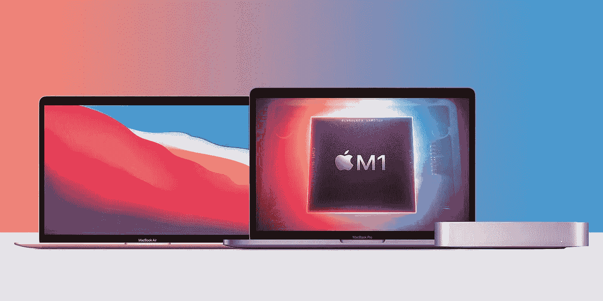
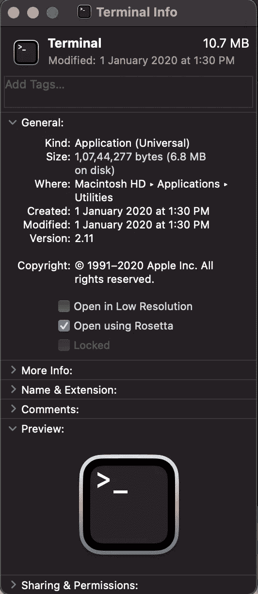

# 为什么你的 Python 版本(或其他应用)不能在苹果 MacBook M1 上运行

> 原文：<https://levelup.gitconnected.com/why-your-python-version-or-other-apps-dont-work-on-the-apple-macbook-m1-416af07de57b>

等等，不要后悔你的购买！



来源: [9to5Mac](https://www.google.com/url?sa=i&url=https%3A%2F%2F9to5mac.com%2F2020%2F11%2F11%2Fapples-m1-chip-analysis%2F&psig=AOvVaw3S5WNLXL1ZdzWndnpjkxJ9&ust=1626349970947000&source=images&cd=vfe&ved=0CAoQjRxqFwoTCJCrlPS_4vECFQAAAAAdAAAAABAE)

苹果 MacBooks 太神奇了。在过去几年中，它们提供了一致的性能和效率，使它们成为开发人员的首选(尽管它们有点💰昂贵的💰比其他选择更好)。这篇文章不会深入比较不同的选择，但是如果你买了新的苹果 MacBook 和 M1 芯片，你可能想通读一下。

昨天，我买了一台装有新 M1 芯片的苹果 MacBook Pro，在为我的开发项目进行设置时，我立即遇到了一个问题。我的一个项目使用 Python 3.6 &因为它是一个已部署的项目，仅仅为了与我时髦的新伙伴兼容而改变 Python 版本将是一个灾难💥！

在我们开始解决这个问题之前，让我们更详细地了解一下新的 M1 芯片。

# 什么是新的 M1 芯片&是什么让它与众不同？

苹果硅 M1 芯片是该公司的第一个片上系统(SoC)，也是苹果硅芯片家族中第一个基于 ARM 的芯片。

M1 是一款 8 核 5 纳米处理器，采用统一内存架构。这使得使用 M1 的 Mac 电脑比使用单独的 CPU、GPU、RAM 和其他组件的 Mac 电脑性能更快。M1 还声称在使用过程中具有更高的性能和更好的能效。此外，该芯片将首次允许 iPhone 和 iPad 应用程序在 Mac 上运行。

到目前为止，您可能已经使用了基于 Intel 的 MAC 或基于 x86_64 架构的笔记本电脑。这意味着您可能习惯使用的所有应用程序或软件都是使用针对这些英特尔或 AMD (x86_64)处理器编写的指令编写的。

但是有了 M1 芯片，事情就变了。处理器无法再理解 x86_64 指令，因此，您的一些程序可能无法使用 M1。

*尽管值得注意的是，越来越多的应用程序正在与新的 M1 芯片兼容。*

# 你现在可以在装有 M1 芯片的苹果 MacBook 上运行 Python 了

Python 3.9.1 成为第一个支持 macOS 11 Big Sur 的语言版本，进而支持 M1 驱动的 MacBooks。

我完全知道你在想什么:

> 但是等等，Python 3.9.1 还挺新的，我升级的话我的 app 可能会坏。这是否意味着我的新 MacBook 不好？

绝对不行。

# 你好，罗塞塔 2 号！

Rosetta 2 是一款仿真器，旨在为英特尔和苹果处理器之间的过渡搭建桥梁。简而言之，它翻译为英特尔构建的应用程序，以便它们可以在苹果芯片上运行。

耶！所以我的旧应用&我将来可能开发的任何应用，无论如何都能在新芯片上运行？别急，伙计。以下是苹果对 Rosetta 的评价:

> Rosetta 旨在简化向 Apple silicon 的过渡，给你时间为你的应用程序创建一个通用的二进制文件。它不能替代创建应用程序的本地版本。

那么，罗塞塔到底是做什么的？据苹果公司称，

> 如果可执行文件只包含英特尔指令，macOS 会自动启动 Rosetta 并开始翻译过程。翻译完成后，系统会启动翻译后的可执行文件来代替原始文件。然而，翻译过程需要时间，因此用户可能会感觉到翻译后的应用程序启动或运行速度有时会变慢。

更多关于 Rosetta 翻译环境[的信息请点击这里](https://developer.apple.com/documentation/apple-silicon/about-the-rosetta-translation-environment)。

您可以通过运行以下命令来安装 Rosetta 环境:

```
softwareupdate —-install-rosetta
```

值得一提的是，您可以在 Rosetta 下运行整个终端，尽管我不确定这样做是否明智。

前往 Finder >应用程序>实用程序>右键单击终端应用程序并选择“显示简介”。选中“使用 Rosetta 打开”复选框，然后关闭。



来源:我的 MacBook Pro

*在文章的最后，我有一个关于罗塞塔的有趣事实要告诉你。让我们专注于让我们的 Python 3.6 环境在新的 MacBook 上工作。*

# 创建 Python 3.6 虚拟环境

为了实现这一点，我们将使用 Nix 包管理器。Nix 是一个跨平台的包管理器，它利用了一个纯粹的功能性部署模型，在这个模型中，软件被安装到通过加密哈希生成的唯一目录中。

让我们按照下面的步骤。

## 1.启用 Rosetta

通过运行上面给出的几行命令来安装 Rosetta。

## 2.安装 Nix

这将在您的 Mac 上安装 Nix。下一步是在您的`.zprofile`中创建一个条目——您的 shell 的环境配置。这使我们能够通过 shell 使用 nix。

```
sh <(curl -L [nixos.org/nix/install](https://nixos.org/nix/install)) — darwin-use-unencrypted-nix-store-volume
```

## 3.设置 Nix 以用于您的 shell

如果您的主目录中还没有`.zprofile`，请使用 touch 命令创建一个。执行此操作时，请确保您在主目录中。

```
touch .zprofile
```

然后打开它，将这一行添加到文件中。

```
source ~/.nix-profile/etc/profile.d/nix.sh
```

很好，现在您应该能够从 shell 访问 nix 了。我建议重新启动终端，以确保一切正常！

## 4.用 Nix 获得一个临时的 Python 3.6 Shell

使用以下命令启动 Python 3.6 的 Nix Shell。

```
nix-shell -p python36
```

这将创建一个 Python 3.6 环境，您可以使用它来安装包。还有最后一步！

## 5.在您的 IDE 中配置 Python 解释器

一旦你安装了这些包，剩下唯一要做的事情就是将你的 IDE Python 解释器指向我们在上一步中创建的那个。

我使用 PyCharm，所以我按照下面的步骤配置了 python 解释器。

```
PyCharm > Preferences > Project > Python Interpreter > Add New > Existing Environment
```

如果您需要额外的帮助来为 PyCharm 配置 Python 解释器，这里有到[文档](https://www.jetbrains.com/help/pycharm/creating-virtual-environment.html)的链接。

对于 Visual Studio 代码，请查看这篇[文章](https://code.visualstudio.com/docs/python/environments)。

好了，这就是这篇文章的全部内容。等等，我之前答应过你一个关于罗塞塔的有趣事实，不是吗？对…

# 罗塞塔，我以前听过这个名字！

苹果以前用过 Rosetta 这个名字。当它将 Mac 从 PowerPC 处理器迁移到英特尔芯片时，它使用相同的名称来执行相同的功能——使 PowerPC 应用程序能够在英特尔芯片上运行。

虽然名称和目标保持不变，但旧版本的 Rosetta 和我们今天使用的版本之间有很大的不同，因为苹果已经开发了目标处理器，这意味着它完全知道 Rosetta 需要做什么。

是不是很牛逼？😍