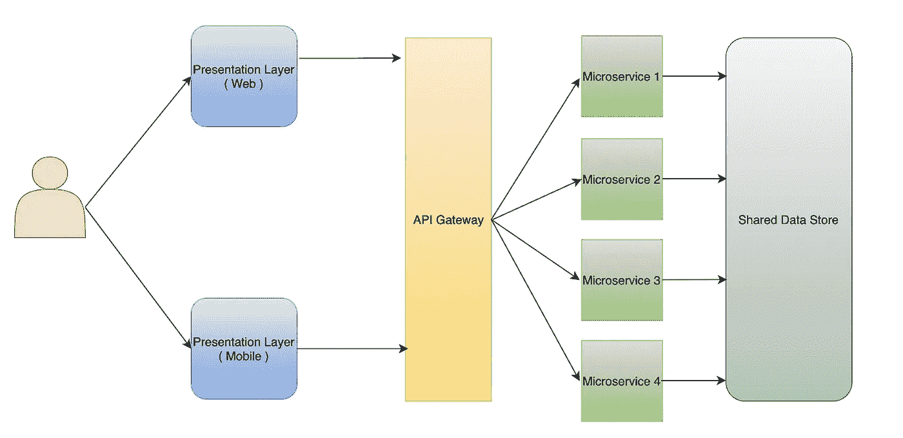
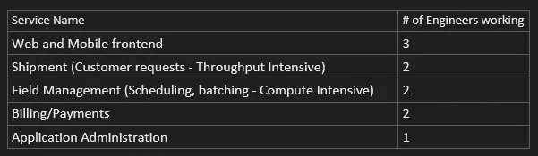

# 为什么你的科技创业需要架构评估？

> 原文：<https://levelup.gitconnected.com/why-your-tech-startup-needs-an-architecture-review-7f57840f0c4d>

*您的架构选择是否有助于提供更好的客户价值？一个真实的故事。*

[阿德利·瓦希德](https://unsplash.com/@adliwahid?utm_source=medium&utm_medium=referral)在 [Unsplash](https://unsplash.com?utm_source=medium&utm_medium=referral) 上的照片

如果我必须选择一个创业公司成功的最重要的方面，那就是接受早期客户的反馈。这给了一个调整创业方向的机会，而不需要花费大量的时间和资源。事实上，精益创业模式的首要原则是快速失败，快速学习和迭代。我坚信同样的类比也适用于初创公司选择采用的技术架构。作为初创公司的技术顾问，我敦促团队在投入时间和资源构建应用程序架构之前，对其进行全面的审查。

为了说明这一点，我想与一家资金雄厚的科技初创公司分享我的经验，这家公司正在努力解决印度各地的交通和物流挑战。我的一个密友是这家初创公司的投资者，去年他找到我，让我帮忙评估这个架构。

在我与产品经理最初的交流中，我被告知他们承诺在接下来的两个月里向他们的潜在客户发布 MVP 版本。他们的 10 名开发人员工程团队已经花了一个月的时间在云上构建这个应用程序。

以下是共享以供审查的体系结构的高级表示:

分布式整体架构(反模式)

在离线审查架构后，我希望确保团队在继续下一步之前，已经在这些方面做了尽职调查:

*   深入挖掘他们的共享数据存储，确保数据库不会在多个微服务之间共享。
*   确保在选择基于微服务的架构之前，针对交付/时间限制评估了所有权衡因素，并进行了适当的评估。

以下是我与团队工程负责人(引用为 EL)后续对话的摘录

我回顾了你用来构建应用程序的架构。你能提供更多关于这些服务的细节吗？

**EL** : *我们正在使用基于微服务的架构来构建我们的产品。我们希望我们的工程师专注于特定领域，而不会被整个应用程序的复杂性所淹没。下面是我们应用程序中的服务:*

**VA** :

***EL** : *我们也确实考虑了未来的规模需求。例如，我们的现场管理(计划和调度)服务需要更多的计算，运输服务需要更多的 I/O 吞吐量，而管理服务可能不需要太多的计算或吞吐量。我们认为这些服务独立扩展会更好。**

***VA** :您预计未来 3 年的每秒请求规模(RPS)是多少？*

*对于 MVP，我们的计划是支持多达 200-300 个 RPS。在未来 3 年，我们的计划是支持全国所有主要城市，我可以看到我们扩展到 5K-10K RPS。*

***VA** :据我所知，现场管理服务需要经过策划的数据输入，以便进入一个新的地点。这是否意味着您的扩展能力受限于装载时间？*

***EL** : *是的，目前任何地方都需要 2-3 个月的时间来部署一个新地点及其周边地区。随着我们在这方面做得越来越好，我们计划将它缩短到 2-3 周。**

***VA** :你的 MVP 还有 2 个月，你如何考虑微服务架构将带来的自动化成本？*

***EL** : *过去一个月，我们一直致力于建立公共平台基础设施，如容器注册、Kubernetes 集群、CI/CD 管道和遥测存储。将这些组件作为服务产品放在云上简化了我们的入职流程。为了在遥测客户端、配置客户端、数据库客户端和模型等服务之间共享代码，我们目前正在构建一个公共库。**

*你能更详细地描述一下跨军种共享的公共模型库吗？*

*我们的服务需要来自多个数据库的数据。对我们来说，创建一个公共模型库以避免代码重复是很重要的。例如，运输服务将从由管理服务创建和更新的位置数据库中获取位置信息。*

*我认为这不是正确的方法。考虑这样一个场景，您需要更新一个由所有服务使用的数据库模式。*

***EL** : *我必须更新和部署每一个相关的服务，并确保整个应用程序正常工作。**

***VA** :没错，这将增加您的运营成本，并违背您从微服务架构开始的整体目标。这是一种常见的反模式，团队通常倾向于在实现后期意识到这一点，称为“**分布式整体模块**”。正如你所看到的，它导致了一系列的问题，使它成为两个世界中最糟糕的。*

***埃尔** : *我明白问题所在了。所以我不能因为这个分享任何公共代码？**

***VA** :代码可以通过公共库共享，只要它是向后兼容和版本控制的。在数据库的情况下，这可以通过在微服务“拥有”的数据上包装 REST 包装器来实现，并让其他服务通过该 API 层检索该数据。*

*这将完全改变我们的服务检索数据的方式。我们的团队需要为其他服务消费所需的数据构建 REST API。*

***VA** :是的，这也意味着无论何时涉及到直接的服务对服务的通信，您的服务都必须对故障具有弹性。如果实施不当，这可能会导致连锁故障，最终导致整个系统瘫痪。我在这里 写过团队在微服务 [**之间沟通所遵循的模式，你的团队可以参考。**](/practical-approach-to-microservices-architecture-part-1-52488c32df58)*

***EL** : *你在这里有什么建议，因为所有这些使我们的微服务架构正确的改变将会推迟我们的 MVP 发布？**

*VA :老实说，我认为对于 MVP 阶段，你的团队最好采用三层架构，包括前端、公共中间层和公共数据库。这将利用您的团队在过去一个月中构建的所有库。通过适当的代码审查和自动化单元测试，您总是可以阻止团队弄乱彼此的代码。独立构建您的专有算法，以便它可以更好地扩展。*

*会议结束时，我告诉大家*技术应该是实现客户成功的手段，而不是路障*。我建议团队采用 3 层架构，这将有助于应用程序更快上市，并使团队能够在时间和资源有限的情况下快速迭代 MVP。*

*几个月前，我的朋友告诉我，他们有一个非常成功的 MVP，并能够在印度的一家大型电子商务公司进行试点。我也惊喜地听到工程负责人的反馈，他们搁置了选择微服务架构的最初计划，继续采用分层方法，这使他们能够满足向潜在客户承诺的最后期限。*

*这整个经历促使我写了这篇文章，希望和这个高增长的初创公司处境相同的其他初创公司能够看到在投入资源和执行之前对他们的系统进行架构审查的价值。*