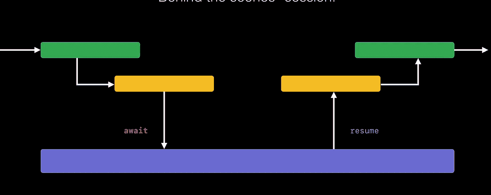
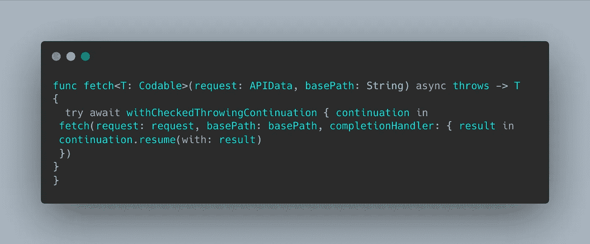
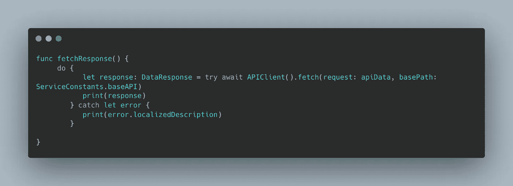
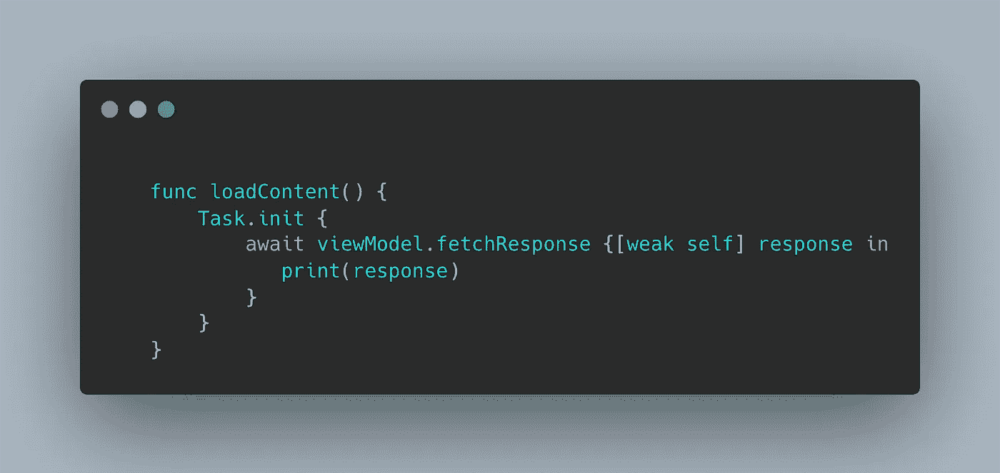

# 将异步/等待替换结果类型🤔

> 原文：<https://levelup.gitconnected.com/will-async-await-replace-result-type-4a14069cf36a>

## 它可能不会完全取代，但很快你就会在代码库中很少使用结果类型



信用:[苹果 WWDC](https://developer.apple.com/videos/play/wwdc2021/10132/)

之前我们在一个闭包里写了两个可选值，在消费者端需要检查哪个有值，然后使用 if else 条件进行处理。

```
func fetchContent(completion: ([Model]?, Error?) -> Void) {    
 // .. perform data request }
```

有了结果类型，这个样板文件就减少了，我们可以优雅地处理成功和失败。当我们有另一个基于当前 api 响应的未决请求时，代码看起来仍然很混乱。随着调用一次又一次地嵌套…..，当涉及到可读性时，它会成为一个问题。你可以采取行动，将每一个“金字塔底层”移动到它自己的功能中，但这更多的是一个补丁。到目前为止，我们讨论了基于回调的并发性，让我们看看如何使用异步/等待 api 来实现 iOS 13 支持的并发性。

Async/await 允许我们像编写常规代码一样编写异步代码。

# 异步/等待事实:

*   `**async**`使功能暂停
*   `**await**`标记异步函数可以暂停执行的地方，其他工作可以在暂停期间发生
*   一旦等待的异步调用完成，在 await 之后继续执行。

# **async/await 什么时候更有用？:**

假设您有一个复杂的异步代码块，在成功或失败时，您必须调用完成块。在这种情况下，async/await 可以简化代码，并且忘记调用完成块的可能性会更小。

# 如何使用结果类型将 async/await 合并到现有的闭包代码库中？？

```
**func** fetch<T: Codable>(request: APIData, basePath: String, completionHandler: **@escaping** ((Result<T, Error>) -> Void)) {}
```

可以成为



这里我们只是将现有的闭包包装在`withCheckedThrowingContinuation`中以返回 t。这里有多个`resume`的变体

使用`Continuations`的条件是**继续**必须在每条路径上恰好恢复**一次。**

```
**public** **func** resume<Er>(with result: Result<T, Er>) **where** E == Error, Er : Error**public** **func** resume(returning x: T)**public** **func** resume(throwing x: E)
```

如果您只想处理快乐案例，那么您也可以在`withCheckedContinuation`中包装闭包。

在消费者方面，我们可以有这样的东西:



如果我们有嵌套的依赖 API，那么代码看起来也会更简单。

现在让我们看看如何从控制器/视图模型中调用这个函数



任务**允许我们从非并发方法创建并发环境，使用 async/await 调用方法。**

一些有用的文章，如果你想进入细节:

[](https://www.avanderlee.com/swift/async-await/) [## Swift 中的异步等待用代码示例解释

### Async await 是 WWDC 2021 期间 Swift 5.5 中新的结构化并发变化的一部分。并发性…

www.avanderlee.com](https://www.avanderlee.com/swift/async-await/) 

[https://developer.apple.com/videos/play/wwdc2021/10132/](https://developer.apple.com/videos/play/wwdc2021/10132/)

 [## Swift 中的现代并发性:简介

### 本系列文章最初是使用 Xcode 13 beta 1 创建示例。该系列的文章，代码…

www.andyibanez.com](https://www.andyibanez.com/posts/modern-concurrency-in-swift-introduction/) 

# 您可以通过以下方式联系我:

**领英:** [阿艾娜·贾恩](https://www.linkedin.com/in/aaina-jain/)

**推特:** [__aainajain](https://twitter.com/__aainajain)