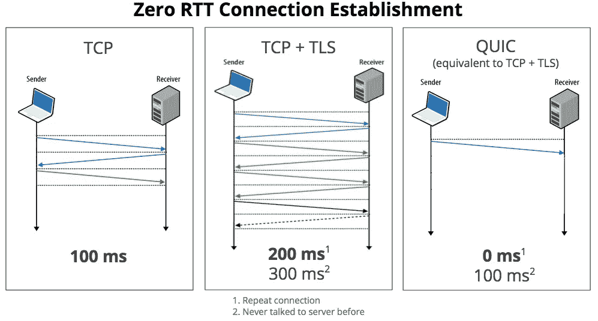

# Google 的 QUIC 协议会取代 TCP 吗？

> 原文：<https://levelup.gitconnected.com/will-googles-quic-protocol-replace-tcp-6ed991a0ca1e>

## 你需要知道的关于未来协议的一切

美国宇航局在 [Unsplash](https://unsplash.com?utm_source=medium&utm_medium=referral) 拍摄的照片

在过去的几年里，QUIC 已经成为 Google 服务网络通信的默认协议。正如这里的[所说](https://techcrunch.com/2015/04/18/google-wants-to-speed-up-the-web-with-its-quic-protocol/)，现在从 Chrome 浏览器到谷歌服务器的所有连接中，超过一半使用 QUIC。它还受到微软 Edge、Firefox 和 Opera 的官方支持。

谷歌开发它时考虑到了网络安全，并用更先进和最新的技术取代了几个过时的标准。换句话说，QUIC 可能代表着互联网的未来，这就是为什么理解它如此重要。

所以，让我们深入研究一下谷歌的 QUIC 协议，介绍一下你需要了解的关于它的一切。

# QUIC 的历史

QUIC 最初代表“*快速 UDP 互联网连接”，*尽管该术语不再作为首字母缩写使用。现在，“QUIC”被用来描述谷歌设计的一种通用传输层网络协议。

*   2012 年，它最初被实施和部署。
*   2013 年，随着实验范围的扩大，IETF 在一次会议上公开宣布了这一计划。
*   2015 年 6 月，一份针对其规范的[互联网草案](https://en.wikipedia.org/wiki/Internet_Draft)被提交给 IETF 进行标准化。
*   2016 年成立了 QUIC 工作组。
*   2018 年 10 月，HTTP 映射 over QUIC 开始被称为*[*HTTP/3*](https://en.wikipedia.org/wiki/HTTP/3)*，*使得 QUIC 势必成为世界性的标准。*
*   *2021 年 5 月，IETF 最终在 [RFC 9000](https://datatracker.ietf.org/doc/html/rfc9000) 中将其标准化。*

# *什么是 QUIC？*

> *Google 的 QUIC 是 UDP 上的低延迟互联网传输协议，游戏、流媒体和 VoIP 服务经常使用该协议。
> […]*
> 
> *UDP 明显比 TCP 更轻量级，但反过来，它的纠错服务比 TCP 少得多。*
> 
> *[…]*
> 
> *通过 QUIC，Google 旨在将 UDP 和 TCP 的一些最佳特性与现代安全工具相结合。— [谷歌希望通过其 QUIC 协议加快网络速度](https://techcrunch.com/2015/04/18/google-wants-to-speed-up-the-web-with-its-quic-protocol)*

# *QUIC vs TCP*

*与 T2 的 TCP 不同，QUIC 协议只允许加密形式的通信。由于 QUIC 中的未加密通信形式在设计上是被禁止的，因此隐私和安全是 QUIC 数据传输的固有部分。对于网络安全来说，这无疑是一个优势，但在不严格要求加密的情况下，这也可能是一个无用的开销。*

*但是真正的突破是与 TCP + [TLS](https://en.wikipedia.org/wiki/Transport_Layer_Security) 相比，QUIC 建立安全连接所需的时间。换句话说，QUIC 的主要目标是大大减少连接建立期间的开销。*

*多亏了 QUIC 的设计，这才成为可能。事实上，QUIC 使交换配置密钥和支持的协议成为初始握手过程的一部分，速度更快。具体来说，当发送方打开一个连接时，响应数据包还包括将来需要使用加密的数据包所需的数据。这个步骤消除了建立 TCP 连接，然后通过其他数据包协商安全协议的需要。这导致更高的连接速度和响应的显著下降，甚至在主机间重新连接期间下降到 0 毫秒，这被称为*“零 RTT 连接建立”*。*

**

*TCP vs TCP+TLS vs QUIC[[Source](https://techcrunch.com/2015/04/18/google-wants-to-speed-up-the-web-with-its-quic-protocol/)]*

*如您所见，典型的安全 TCP 连接需要两到三次往返，发送方才能真正开始接收数据。这可能需要 300 毫秒。而通过使用 QUIC，发送者可以立即开始与之前已经交谈过的接收者交谈。*

*当与 [UDP](https://en.wikipedia.org/wiki/User_Datagram_Protocol) 相比时，QUIC 脱颖而出成为赢家，因为它具有 UDP 所没有的几个 TCP 特性，如[拥塞控制](https://en.wikipedia.org/wiki/TCP_congestion_control)和[自动重传](https://en.wikipedia.org/wiki/Retransmission_(data_networks))。这使得它本质上比纯 UDP 更可靠。详细来说，虽然 QUIC 使用 UDP 作为其基础，但它涉及到丢失恢复。这是因为 QUIC 的行为类似于 TCP，当数据丢失时，它会单独检查每个流并重新传输数据。*

*此外，如果一个流发生错误，QUIC 可以继续独立地为其他流提供服务。此功能对于提高易出错链路的性能非常有用，因为在 TCP 注意到丢失的数据包之前，可能会收到大量的额外数据。在 QUIC 中，当流被修复时，该数据可以自由处理。*

*QUIC 还提高了网络切换事件期间的性能，例如当移动设备用户从 Wi-Fi 网络移动到移动网络时。当同样的事情发生在 TCP 上时，会执行一个很长的过程，每次断开一个现有的连接，然后根据需要重新建立连接。为了解决这个问题及其在性能方面的后果，QUIC 包括一个到接收方的连接 ID，而不考虑来源。这允许简单地通过重新发送单个分组来重新建立连接，该分组总是包含该 id，并且即使发送方的 IP 地址已经改变，接收方也将认为该 ID 是有效的。*

*那么，这是否足以让 QUIC 取代 TCP 呢？*

# *结论*

*在这里，我们看了谷歌的 QUIC 协议是什么，它是如何工作的，以及为什么它可能代表互联网协议的未来。QUIC 是由谷歌设计的，用来取代许多过时的标准，可能会成为未来几年真正的游戏规则改变者。这就是为什么理解它是至关重要的，而深入研究它正是本文的目的。*

*感谢阅读！我希望这篇文章对你有所帮助。如果有任何问题、意见或建议，请随时联系我。*