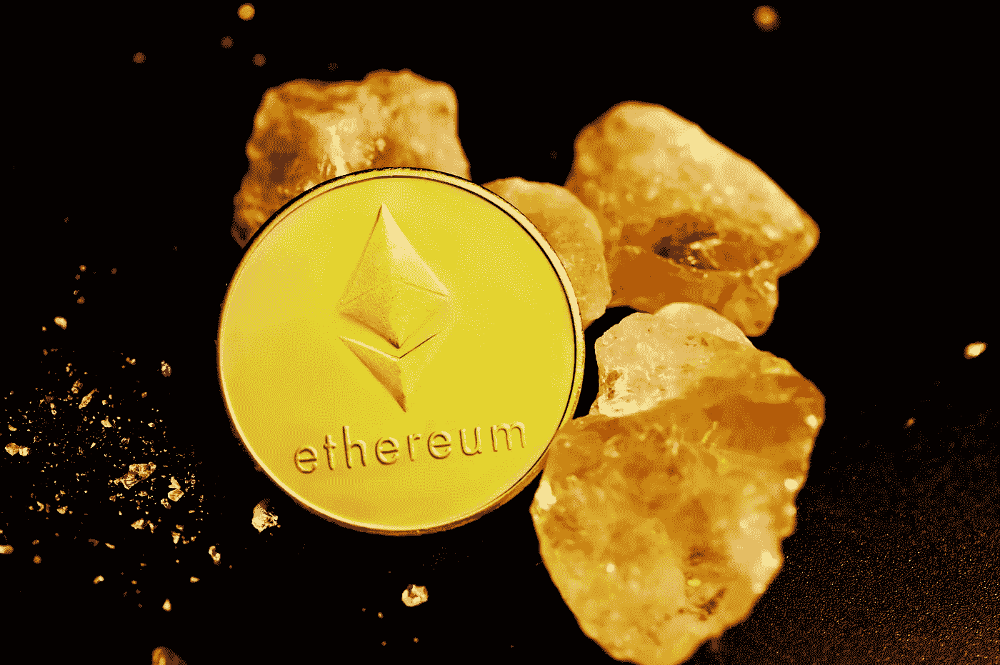
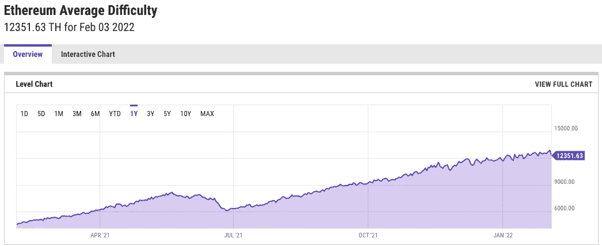

# 采矿会随着以太坊 2.0 消亡吗？

> 原文：<https://levelup.gitconnected.com/will-mining-die-with-ethereum-2-0-ff6fe851755d>

## 以太坊转投股权证明，矿工会怎样？

[行政长官](https://unsplash.com/@executium?utm_source=unsplash&utm_medium=referral&utm_content=creditCopyText)在[广场](https://unsplash.com/s/photos/ethereum-mining?utm_source=unsplash&utm_medium=referral&utm_content=creditCopyText)拍照

# 以太坊的转变

一年多来，以太坊一直走在从工作共识协议证明向利益证明转变的漫长道路上。尽管一再推迟，以太坊开发团队似乎终于要做出改变了。以太坊将在 2022 年正式转向股权证明，更新称为“合并”，将加入主网的信标链。信标链是使 ETH 能够下注的东西，它自 2020 年底以来一直在运行，许多人下注他们的 ETH 来支持过渡并从他们的股份中赚取利息。合并发生后，开采难度将由于“难度炸弹”而飙升，这是一种消除开采以太坊的激励而支持赌注的机制。

几个月前，以太坊基金会部署了 Kintsugi 测试网络，它将合并的变化带到了公共测试网络中。这个测试网是为应用程序开发人员设计的，他们可以在合并后的环境中开始更新他们的应用程序，这意味着开发团队在公开发布上取得了进展。关于以太坊 2.0 的讨论由来已久，尤其是在过去的一年中一再推迟，然而，Kintsugi testnet 的发布是朝着今年正式发布迈出的一大步。自 2020 年 12 月推出以来，信标链上的赌注已超过 350 亿美元，占整个 ETH 供应的近 7.5%。可以肯定的说，这次更新已经投入了大量的资源，开发人员似乎已经接近完成了。

## 矿工会怎么样？

随着最近的市场下跌，开采加密货币不像 2021 年的大部分时间那样有利可图。单个 Nvidia 3080 仍然可以根据当地的能源成本每天产生大约 3.5 美元的利润，这是 2021 年底利润的一半。然而，即使以太坊的价值再次上升，合并仍将结束有利可图的开采。

难度炸弹将使开采以太坊变得毫无价值，这意味着任何目前开采以太坊的人将不得不转换到不同的硬币或出售他们的显卡以支持赌注。还有其他加密货币的工作证明，可以通过消费硬件来获利；然而，随着许多以太坊矿工寻求新的硬币来采矿，这些替代选项可能不会保持盈利。很可能很难继续盈利地挖掘加密货币，除非某些硬币的受欢迎程度发生重大变化，让我们讨论一下。

# 工作硬币的替代证明

除了以太坊，还有几种加密货币可以利用消费类硬件盈利。它们包括以太坊经典，拉文币，费罗，梁，等等。虽然这些硬币目前对我来说是有利可图的，但它们远不如以太坊有利可图，市值也小得多。在撰写本文时，几枚硬币的 24 小时盈利能力如下，适用于单个 Nvidia 3080，没有超频，电费设置为每千瓦时 0.07 美元:

2022 年 2 月 4 日 RTX 3080 号煤矿的盈利能力(由作者创建，数据来自 whattomine.com)

我们可以看到以太坊目前比任何替代物都更有利可图。开采这些替代硬币(altcoins)的盈利能力有所波动，但在任何给定时间，它们通常比以太坊采矿的盈利能力低 30-50%。开采较小硬币的最大缺点之一是其价值比以太币更不稳定，这意味着它们的涨跌往往比较大硬币更剧烈。它们在更少的交易所上市，这使得出售它们获利更加麻烦；在这个列表中，Crypto.com 支持以太坊、以太坊经典和拉文币。

因为较小的硬币不太稳定，所以这个列表的顺序经常改变。几个月前，Ravencoin 会是明显的赢家，而以太坊经典会远远落后于名单。这种波动会增加选择开采哪种硬币的难度。这是 NiceHash 有优势的一个领域，它根据需求和利润选择开采什么。

不考虑目前的盈利能力，最大的问题是，当以太坊突然过渡到股权证明时，这张图表会发生什么变化？有几种可能的情况，让我们逐一介绍。

## **场景 1: GPU 采矿消亡**

每一个挖掘加密货币的 GPU 都对网络的总哈希值有贡献。我们可以在上表中看到每种顶级硬币的总哈希值，以太坊远远超过了其他的。这意味着目前有比任何替代选项更多的 GPU 来承担挖掘以太坊的任务。以太坊经典目前有第二高的 hashrate，但它仍然比以太坊的小 40 倍以上。

由于目前有如此多的 GPU 在挖掘以太网，一旦以太坊的过渡发生，将会有大量的矿工寻找下一个最佳选择。这些硬币似乎不太可能升值到足以吸收这么多的 hashrate 而不破坏盈利能力。如果一旦所有以太坊矿工开始转换，没有以太坊的有利可图的替代品，GPU 采矿可能会消亡。

**挖掘难度**

你可能想知道为什么突然涌入的矿工会毁掉盈利能力。这跟一个叫挖矿难度的东西有关。困难是一种相当简单的机制，它确保以相对稳定的速度生成块。如果网络的散列率上升，则网络增加求解每个块的难度，以补偿增加的散列率。另一方面，如果由于某种原因，大量散列率突然消失，那么确保块继续以一致的速率被解决的难度将会下降。

资料来源:ycharts.com

在过去的一年中，以太坊区块链上的挖掘难度一直在稳步增加，因为积极挖掘以太坊的 GPU 总数一直在稳步增加。2021 年 6 月出现大幅跳水，这是中国突然禁止加密货币开采的结果。中国禁令是一个很好的方式来想象如果 hashrate 突然下降，难度会如何降低。这也有助于表明，突然减少采矿电力不会破坏网络的功能；虽然有更多的矿工增加了网络的安全性，但这对保持网络运行并不重要。

当以太坊过渡到股权证明时，将有大量矿工涌入目前有利可图的替代硬币。同时获得如此多的新矿工将迫使采矿难度大幅上升。由于网络不能提高它们制造积木的速度，更多的人将会为同样的奖励而竞争，解决积木并获得奖励的可能性将会急剧下降。

## 场景二:GPU 挖矿找到新宠

如果说过去几年我们学到了什么，那就是加密货币市场是不可预测的。有很多矿工渴望继续从他们已经拥有的硬件中赚钱，并且有一些猜测认为这些替代硬币可能会随着它们的哈希值上升而升值。这个想法是，来自采矿社区的足够关注可能会导致硬币价值的增加；这是可能的，但它可能高估了矿商的市场支配力。

我个人认为这种情况发生的可能性比较小。一枚硬币的价值远比其采矿盈利能力复杂。考虑到这些其他选项都是相当小的硬币，仅仅因为它们已经成为矿工转向的唯一可行硬币，它们的价值是否会大幅增加似乎是值得怀疑的。这些硬币中的一些确实有一些有趣的想法，将它们与其他项目区分开来，然而，它们都不是很受欢迎。

榜单上市场份额最大的是以太坊经典，这是一个有争议的硬币。我将在下面的参考资料部分链接一篇深入讨论以太坊经典的文章。名单上唯一受 Crypto.com 等主要交易所支持的另一种硬币是 Ravencoin，这是比特币的一个分支，旨在轻松创建和交换定制令牌，有点像 NFT。我对这些选择的最大问题是，它们都没有提供比其他市值更大的区块链更多的好处。

我愿意相信一枚硬币的价值与它的有用程度有关，但对于投机性资产来说，情况并非总是如此。如果有足够多的人将注意力转移到这些硬币上，并开始购买和持有它们，它们就有可能保持盈利。只要矿商能够在合并后保持 60-70%的盈利能力，我预计 GPU 采矿将继续下去。即使利润没有那么高，每个运行的 GPU 将继续带来比运行成本更多的钱；由于采矿是一项相当不费力的工作，我预计只要有利润，就会有许多矿工继续参与。

## 我最大的猜测

这两种情况都是极端的选择，要么 GPU 挖掘继续，要么结束。然而，我猜想这两者的某种混合实际上会发生。

我预计，当合并即将发生或不久之后，大多数矿商会简单地清算他们的硬件。2021 年全年，显卡市场竞争异常激烈，二手显卡在网上的售价远高于新品。对于矿商来说，在二级市场被淹没之前，利用这些虚高的价格进行投资或干脆继续前进，将是明智的。我认为，通过在以太坊区块链上运行一个验证器节点来将焦点转移到赌注上，是许多人会选择的最明智的选择。

一旦一部分 ETH 矿工出售他们的 GPU，剩下的矿工可能会尝试替代硬币。起初，盈利能力可能会消失，但随着硬币价格赶上采矿难度，较小的采矿社区有可能继续盈利。这一切都取决于像 Ravencoin 这样的硬币是否增长到足以支持矿工的涌入，我不指望看到以太坊在整个 2021 年产生的采矿奖励。

# 比特币呢？

如果你想知道为什么比特币不在挖掘的硬币列表中，那是因为比特币不能像以太坊一样使用消费显卡进行挖掘。比特币是使用 ASIC 矿工挖掘的，ASIC 矿工代表特定应用集成电路矿工。ASIC 是一种专用硬件，旨在挖掘特定的加密货币。这些矿工是从头开始开发的，可以非常高效地开采一种加密货币，这意味着他们可以用更少的电力生产更多的散列率。

有几个原因，为什么我们没有看到为每一个工作证明硬币开发的 ASICs。一是一些区块链，如以太坊，被设计成“抗 ASIC”。虽然 ASIC 可以提高采矿效率，但它们往往会增加采矿的中心地位，因为大型企业可以购买许多 ASIC，其唯一目的是开采比特币。然而，当使用消费显卡时，人们有更多的机会挖掘，而无需购买专门用于挖掘加密货币的昂贵硬件。这种中心地位可以从中国的秘密采矿禁令中再次看到；虽然以太坊下跌了约 20%，但比特币失去了近 50%的总购买力，这表明比特币的总挖掘量中有很大一部分来自中国的某些地区。

我们没有看到其他工作证明硬币的 ASICs 的另一个主要原因是，它们需要大量的时间和资源来开发。人们没有太多兴趣为一种长期盈利能力存疑的硬币开发 ASIC，因此他们大多只在比特币上看到，因为比特币是一种相对稳定的硬币。

# 有利的方面

加密货币挖掘是一个有争议的话题，可能是年轻人对加密货币的情绪复杂的最大原因之一。虽然工作证明是确保分散网络安全的一种非常可靠且经过充分测试的方法，但它非常耗费能量。你可以在网上找到很多讨论比特币挖矿大量用电的文章；中国禁止采矿的原因之一是它给电网带来的压力。有些人会争辩说，所有的金融系统都需要大量的资源来运作，这是事实；然而，也确实有替代的方法来保护分散的网络，使用更少的能量。

以太坊 2.0 带来的主要变化是过渡到了一个叫做利益证明的协议。股权证明几乎不需要电力，几个大型区块链——卡尔达诺——已经使用股权证明好几年了。以太坊是遥遥领先的第二大区块链，从工作证明过渡到不使用能源的协议将对环境产生巨大的好处。以太坊开发团队所做的大量工作也将有助于为其他区块链在未来实现类似的变化铺平道路。

以太坊的动机也不仅仅是为了保护环境。股权证明将更适合以太坊已经成为的那种网络，并有望帮助降低交易费用。

以太坊远离采矿也意味着消费者将最终能够以零售价购买显卡。在过去的一年半时间里，游戏玩家、创意专业人士和工程师一直在努力获得 GPU，以太坊采矿是多么有利可图，这一转变应该会对该市场有巨大的帮助。

> **注意:**如果你喜欢在 Medium 上阅读我和其他人的内容，考虑使用下面的链接订阅，以支持这样的内容创作，并解锁无限的故事！

 [## 用我的推荐链接加入媒体-威尔·诺里斯

### 作为一个媒体会员，你的会员费的一部分会给你阅读的作家，你可以完全接触到每一个故事…

medium.com](https://medium.com/@willmnorris/membership) 

# 资源

*   [了解股权证明](/how-to-earn-money-staking-crypto-c190f466d2bc)
*   [中国的秘密采矿禁令](https://www.theblockcrypto.com/post/109629/ethereum-hash-rate-sink-china-mining-shutdown)
*   [ASIC 解释](https://www.investopedia.com/terms/a/asic.asp#:~:text=An%20ASIC%20miner%20refers%20to,of%20%22mining%22%20digital%20currency.&text=One%20way%20to%20think%20about,to%20solve%20the%20mining%20algorithm.)
*   [以太坊经典讲解](https://capital.com/etc-coin-price-prediction-2021-2030)

***免责声明*** *:我不是理财顾问，本文所写的任何内容都不应被视为理财建议。我所有的内容都是个人研究和经验的结果。Crypto.com 赞助了这篇文章的创作，然而，他们并没有影响文章的内容，在向公众发布之前，他们也没有得到批准的副本。*

# 分级编码

感谢您成为我们社区的一员！升级正在改变技术招聘。 [**在最好的公司**找到你的完美工作](https://jobs.levelup.dev/talent/welcome?referral=true) **。**

 [## 升级—转变技术招聘

### 升级—转变技术招聘🔥使软件工程师能够找到完美的角色…

作业. levelup.dev](https://jobs.levelup.dev/talent/welcome?referral=true)