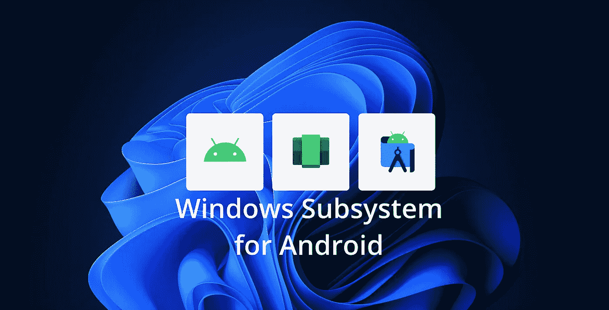

# 如何使用 Android 的 Windows 子系统作为开发工具

> 原文：<https://levelup.gitconnected.com/will-windows-subsystem-for-android-replace-emulators-d93ab4dbcb14>

如何使用 Windows 子系统进行 Android 和 Flutter app 开发…但是应该吗？

# 介绍

微软最近发布了面向内部人士的 Android Windows 子系统(又名 WSA)，该功能允许 Windows 在不需要任何仿真器的情况下运行 Android 应用。在应用程序开发中，这可能是仿真器的一个很棒的替代品，但是我们应该使用它吗？

# Android 的 Windows 子系统是什么？

嗯，android 的 Windows 子系统(又名 WSA)是一种新的平台技术，允许 Android 应用程序在 Windows 上运行，它的工作方式类似于它的表亲 Linux 的 Windows 子系统，允许不同的操作系统与 Windows 一起运行。微软刚刚发布了它的第一个预览版，它有**许多限制**，但是如果他们做得好，它可以为 Windows 用户提供一个伟大的开发者体验。

# 如何使用 WSA 进行应用程序开发

首先，你需要安装 WSA，如果你还没有安装，看看我之前关于如何安装的故事:

 [## 在 Windows 11 中为 Android 安装 Windows 子系统

### 查看如何在任何版本的 Windows 11 上安装和使用 WSA，以及在没有任何仿真器的情况下运行 Android 应用程序！

levelup.gitconnected.com](/installing-windows-subsystem-for-android-in-windows-11-c33e98c4071c) 

## 安装 ADB

ADB (Android Debug Bridge)是一个与 Android 设备通信的调试工具，它与 Android Studio 一起安装，但你可以从[这里](https://developer.android.com/studio/releases/platform-tools)单独下载。

现在我们需要在 path 系统变量中添加 ADB，找到 android SDK 安装的位置(如果是用 Android Studio 安装的，位置通常是`%LOCALAPPDATA%\Android\Sdk\platform-tools`)。复制 ADB 可执行文件所在的路径。

现在，在 Windows 上搜索“编辑系统环境变量”，打开它，然后单击“环境变量”

双击“用户变量”下的“路径”，然后将 ADB 的位置粘贴到那里。

环境变量

将 adb 添加到路径

现在按 ok，ADB 应该安装好了。

## 在 WSA 中启用开发人员模式

在 WSA 中启用开发者模式出奇的简单，你所要做的就是打开 WSA 设置(搜索 Android 的 Windows 子系统并打开)并启用开发者模式。

WSA 设置

默认情况下，启用该选项已经启用了 USB 调试，所以我们不需要在这里做任何其他事情，但如果你想，你可以通过点击“管理开发者设置”来检查所有的开发者模式设置。

## 将 ADB 连接到 WSA

一旦你启用了开发者模式，点击 IP 地址下的“刷新”,如果它仍然显示为“不可用”, WSA 目前是关闭的，所以你需要打开任何 android 应用程序来启动它，然后再次点击刷新。

打开 PowerShell 或 CMD 并键入:`adb connect YOUR_IP_ADDRESS`，按 enter 键，ADB 应该会连接到 WSA。

## 运行 Android Studio 应用

Android studio 会识别 WSA，通常它会默认构建 WSA，但如果不是这样，您需要做的就是选择设备并运行您的构建。

在 Android Studio 上选择 WSA

## 运行 Flutter 应用

对于 flutter，您有一些选项，如果您使用 Android Studio，您可以像上一节一样选择设备，如果您使用 Visual Studio 代码，您可以选择右下角的设备或在构建开始后选择它。

选择 VSCode 上的 WSA

最后一个选项是从命令行使用它，用`flutter devices`列出设备，然后用-d 标志运行您的构建来选择 WSA。

在颤振指令中选择 WSA

就是这样！现在你有了作为开发工具运行的 WSA！

在 WSA 中运行的 Flutter 示例应用程序

# 当前的问题和限制

Android 的 Windows 子系统处于其第一个预览版，因此，错误，问题和缺失的功能是意料之中的，对于第一个预览版来说，它是相当可靠的，直到现在我只在我尝试使用蓝牙时遇到了一次崩溃，蓝牙还不支持，性能有点粗糙，调整窗口大小需要几秒钟才能调整好，不要指望在它上面运行要求高的游戏，它对绝大多数应用程序来说已经足够好了，但需要针对更高要求的应用程序进行优化。WSA 目前只支持 Android 11，我不确定微软是否计划拥有自己的 Android 版本并随着时间的推移进行更新，或者他们是否会允许在商店中添加其他版本(就像 WSL 的工作方式一样)，我个人更喜欢有多个版本可供选择，但我不确定这是否可能，因为优化和维护这些版本需要大量的工作。

缺少功能是目前最大的限制，谷歌服务完全缺失，这基本上扼杀了任何使用谷歌 API 实现的应用程序，社区已经找到了这个问题的解决方案，虽然这不是最简单的解决方案，但至少你只需要做一次，你可以在下面的链接中查看。

 [## 让 Windows 11 运行谷歌 Play 商店安卓应用

### 在 Windows 11 上，你现在可以安装 Android 的 Windows 子系统(WSA)来运行 Android 应用程序。问题是…

www.windowscentral.com](https://www.windowscentral.com/how-run-google-play-store-android-apps-windows-11) 

# WSA 是一个有前途的工具吗？

确实是！因为它的目标是终端用户，它应该拥有我们在物理设备中拥有的大多数功能，并且应该像一个设备一样运行，你可以把 WSA 想象成你的 pc 是一个 Android 设备。目前它不支持蓝牙，但我希望它在正式发布前可用，因为 Android 模拟器不能使用蓝牙，它是 WSA 作为开发工具的一个很好的用例，它真正有用的另一个场景是当你必须在不同的屏幕大小和纵横比下验证你的应用程序时，为了用模拟器做到这一点，你需要多个模拟器，每个模拟器需要 7 到 15 GB，而 WSA 只需要其中的一小部分，你可以调整窗口大小来测试它。

# 结论——你应该使用 WSA 作为 Android 模拟器的替代品吗？

简而言之，没有，至少现在没有。WSA 仍处于预览阶段，它有许多缺陷和缺失的功能，你可以用来测试它，也许可以创建一个简单的应用程序，但不要取代你的模拟器，它可能是未来真正强大的开发工具，但现在，它有太多的缺陷。