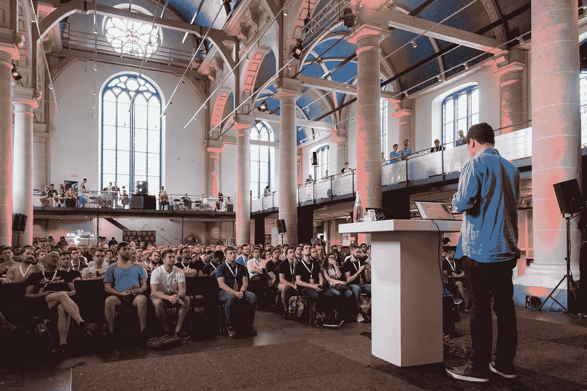

# 赢取 2019 年阿姆斯特丹 JSNation 大会的免费门票

> 原文：<https://levelup.gitconnected.com/win-a-free-ticket-to-amsterdam-jsnation-conference-2019-b9544fcc5b22>

[JSNation](https://jsnation.com/) ( [阿姆斯特丹 JSNation](https://medium.com/u/e4f9077177b9?source=post_page-----b9544fcc5b22--------------------------------) )已经与[gitconnected.com](https://gitconnected.com)联系上了 2019 阿姆斯特丹 JSNation 大会的免费门票！阅读下面的图纸和会议的详细信息。

> 亲提示:如果你没有赢得一张门票，JSNation 仍然给我们的社区所有门票 15%的折扣，直到大会售罄！使用此链接申领您的折扣—[https://www . eventbrite . com/e/Amsterdam-js nation-conference-2019-tickets-53358526790？折扣=升级](https://www.eventbrite.com/e/amsterdam-jsnation-conference-2019-tickets-53358526790?discount=levelup)

# 如何赢得一张票

你有 4 次机会赢得一张票！对于您完成的每个方法，您将在绘图中获得一个附加条目。抽奖将于 2019 年 5 月 27 日或之前进行。

1.  在[gitconnected.com](https://gitconnected.com/)上创建一个账户，并对[赠品帖子](https://gitconnected.com/post/win-a-free-ticket-to-amsterdam-jsnation-conference-2019-2fa662948a34)进行投票或评论
2.  请关注媒体上的 [gitconnected 出版物](https://levelup.gitconnected.com/)并为本文鼓掌
3.  喜欢脸书 [gitconnected 页面](https://www.facebook.com/gitconnectednetwork/)并喜欢或评论[赠品帖子](https://www.facebook.com/gitconnectednetwork/posts/2290512104600953?__xts__[0]=68.ARD6o7C5081qPh0ZbuW695yTh7XxXYI8EaBxHpNVwuN89a43Ymnek213uPu5UXq8pRVNVZt-k7hPS8ISaj52KUkGPoW-0QsZfyZHXVeVFAeJC9e02QC5g-CTMPzhS_dbOHBLMQMjaiMQpNX09GuzjHAkcQdRWWuBEFBpgjY5-FimgRonTiRNo6BdtEe2P9-aU_GhaBIJOluxXEQ7v9LLwlVn0WWM-ZBdkgxxDTb1iEf5szmc5DhAMq1D-67AE1OlZt43cv3zde4YTPab3h9z-MT6nEWJMkMFvS_ZcJh6h0GPB-5HoLrAGwVQ6F8-17fVzKC9ua6OP6fWkT8LLfalznD9MhMQ&__tn__=-R)
4.  在 Twitter 上关注[@ git connected](https://twitter.com/gitconnected)并转发该图片的帖子

# 关于会议

核心 JavaScript 库作者，动手学习，暑期阿姆斯特丹。这就是 JSNation 的意义所在！

JavaScript 是世界上排名第一的按需编程语言，背后有 2500 万开发人员。在 2019 年 6 月 6 日至 7 日的 JSNation 大会上，与塑造繁荣国家的现在和未来的人见面。

作为一个为期两天的活动，会议专门关注 JavaScript 开发。在活动中，鼓舞人心的谈话遇到了新鲜的想法和好人，背景是夏季阿姆斯特丹。头条人物包括《你不知道的 JS》系列丛书的作者[凯尔·辛普森](https://twitter.com/getify)，以及[近距](https://www.nearform.com/)的技术总监[马特奥·科里纳](https://twitter.com/matteocollina)。

JSNation 认为 JavaScript 开发是一门工程艺术，这就是为什么会议在 Rembrand 参加的前教堂举行。场地直接位于市中心，紧邻阿姆斯特丹最好的地方。