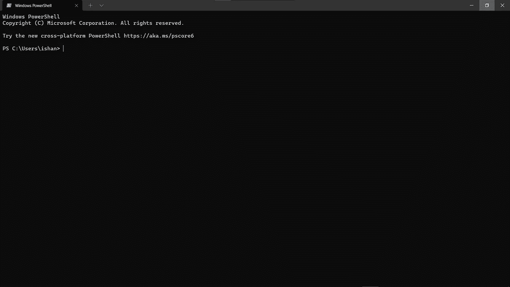

# Windows 终端|让 PowerShell 变得更好

> 原文：<https://levelup.gitconnected.com/windows-terminal-making-powershell-better-561f2cab27f3>

在今天的博客中，我将展示如何定制 PowerShell，使其看起来更好。我们将改变它:


对此:


对于这个博客，你需要从微软商店安装 windows 终端，因为我们将使用它。它看起来像这样:



windows 终端有一系列非常酷的功能。首先，你不仅可以打开 powershell，甚至可以打开命令提示符和 azure cloud shell。此外，您还可以添加其他控制台。比如我加了 Git Bash。

现在让我们开始吧。首先，如果你收到这条信息:

```
Windows PowerShell
Copyright (C) Microsoft Corporation. All rights reserved.Try the new cross-platform PowerShell [https://aka.ms/pscore6](https://aka.ms/pscore6)
```

最重要的是，让我们阻止这一切发生。打开 windows 终端，然后按“Ctrl”+“，”显示设置。或者，您可以单击顶部的下拉箭头，然后单击设置


然后点击“打开 JSON 文件”:


Settings.json 应该会在默认的文本编辑器中打开。对我来说，它是 visual studio 代码:


导航到文本“列表”，它应该在“配置文件”下:


将 powershell.exe 替换为:

```
powershell.exe -nolog
```

不需要重启整个 windows 终端。单击顶部的下拉箭头并选择 powershell，即可打开另一个 powershell 选项卡:


信息将不再出现。


下一步，我们将安装和导入一些模块。为此，首先我们需要为当前用户更改执行策略。所以执行策略是一种安全特性，只允许特定类型的脚本运行。在我们的例子中，我们希望将“当前用户”的执行策略更改为“绕过”，这意味着我们从 powershell 安装和运行的脚本不需要对**进行签名。为此，请关闭 windows 终端，然后以管理员身份运行它:**


然后，在 powershell 窗口中键入以下命令:

```
Get-ExecutionPolicy -Scope CurrentUser
```

你将得到“未定义”或“全部签名”或“远程签名”或“无限制”。所以对我来说，是:


要将执行策略更改为“Bypass ”,我们只需编写:

```
Set-ExecutionPolicy -Scope CurrentUser Bypass
```

除非您不是管理员，否则它应该不会出现任何错误。现在如果你跑:

```
Get-ExecutionPolicy -Scope CurrentUser
```

同样，你会得到“绕过”:


现在安装我们需要的模块。您可以在新的 windows 终端中分割屏幕，如下所示:


或者:


所以这只是一个快速的特征。现在，您可以打开三个分割终端并运行这三个命令来安装模块。或者，您可以一个接一个地运行命令:

```
Install-Module windows-screenfetch
Install-Module oh-my-posh
Install-Module posh-git
```


对于出现的每个提示，键入“a”并按 enter 键:


如果该命令运行时没有任何错误，这意味着所有东西都已安装。现在，我们将导入已经安装的模块。键入以下命令:

```
Import-Module windows-screenfetch
Import-Module oh-my-posh
Import-Module posh-git
```


现在好戏开始了！

只需关闭所有终端。然后打开一个新的，它**不一定要以管理员**身份打开。在我们继续之前，你会注意到一个小问题，在重启你的计算机后，你将不得不一次又一次地导入模块。为了解决这个问题，我们需要创建一个脚本，PowerShell 将在启动后执行这个脚本。

为此，请在 PowerShell 中键入以下内容:

```
$PROFILE
```


然后导航到作为输出得到的文件夹。


如你所见，我没有微软。PowerShell_profile.ps1 文件。如果有，那么你可以用记事本打开它。

要创建这个文件，只需回到终端并键入:

```
notepad $PROFILE
```

您应该得到这样的结果:


只需点击是。这将创造出微软。PowerShell_profile.ps1 脚本，将在启动时运行。现在，我们将在这里输入我们想要运行的所有命令。键入:

```
Import-Module oh-my-posh
Import-Module posh-git
Import-Module windows-screenfetch
Screenfetch
```

如果你想让下划线看起来和我的一模一样:


然后在启动文件中键入以下内容:

```
Set-PoshPrompt -Theme powerlevel10k_rainbow
```

但是，如果您想要其他主题，只需进入您的终端，然后键入:

```
Get-PoshThemes
```


输出将采用以下格式:

```
THEME NAME
THEME LOOK
```

要想知道你喜欢哪个时髦的主题，只需写下:

```
Set-PoshPrompt -Theme THEME_NAME
```

这就是我的配置文件的样子:

```
Import-Module oh-my-posh
Import-Module posh-git
Import-Module windows-screenfetch
Screenfetch
Set-PoshPrompt -Theme powerlevel10k_rainbow
Set-ExecutionPolicy -Scope CurrentUser RemoteSigned
```

我将执行策略重新设置为远程签名，这样未经授权的人就无法在我的设备上运行病毒脚本。这只是为了安全起见，没有必要这样做。

现在只需保存并关闭文件。关闭所有打开的终端，并打开一个新的终端。


一切看起来都很好，但是，有些小盒子上有“？”在他们身上。这是因为我们选择的字体不包含这些符号。要改变这一点，去[**Delugia-Code**](https://github.com/adam7/delugia-code/releases)**网站，然后从那里下载 Delugia-Complete:**

****

**完成后，解压缩 zip 文件:**

****

**然后双击 DelugiaComplete.ttf 文件。**

****

**这将打开，只需点击安装按钮，一旦安装完成，关闭应用程序。现在打开 windows terminal settings.json，就像我上面演示的那样。然后导航到 powershell 配置的“fontFace ”:**

****

**现在用“Delugia”代替 Consolas:**

****

**保存并关闭文件，然后返回 windows 终端:**

****

**所有丢失的盒子都不见了！您可以打开 git 存储库来查看所有迹象。**

****

**这就是这篇博客的内容！我希望你真的喜欢这个。如果您认为其他 windows 用户可能会觉得这很方便，那么一定要与他们分享。在这一点上，感谢阅读！**