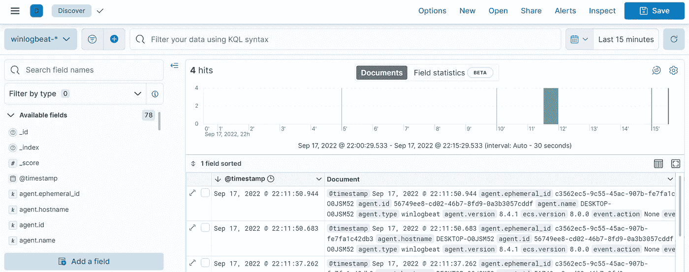
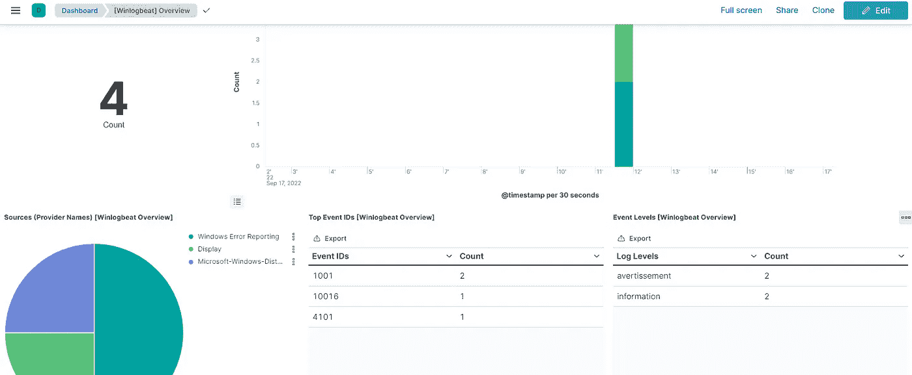

# Winlogbeat 与本地 Elasticsearch 和 Kibana

> 原文：<https://levelup.gitconnected.com/winlogbeat-with-local-elasticsearch-and-kibana-bcf8d6c64af3>


卡斯帕·卡米尔·鲁宾在 [Unsplash](https://unsplash.com/s/photos/windows-informatic?utm_source=unsplash&utm_medium=referral&utm_content=creditCopyText) 上的照片

很高兴看到你回来参加我们的弹力栈冒险😊。今天我们要谈谈 Winlogbeat 以及如何在我们的 Windows 系统上安装它。

Winlogbeat 是一个轻量级的 Windows 事件日志发送器，是大型弹性 beat 家族的一部分。这是一个专门为提供基于 *libbeat* 框架的 Windows 事件日志流而设计的工具。Winlogbeat 会自动将收集到的原始数据上传到 Elasticsearch 或任何其他已配置的输出，这些数据随后会被编入索引以供将来使用。它作为一个安全增强应用程序，允许用户监控其 Windows 主机上发生的几乎任何事情，例如:

*   应用程序事件
*   硬件事件
*   安全事件
*   系统事件

## 安装和配置

在我们开始之前，您需要部署 Kibana 和 Elasticsearch。如果你还没有读过这篇文章，请阅读这篇文章。

一如既往的去[官方弹性网站](https://www.elastic.co/downloads/beats/winlogbeat)下载 Winlogbeat。一旦下载了归档文件，解压并打开`winlogbeat.yml`文件进行一些配置。首先，导航到*输出部分*，在这里我们将按如下方式配置 Elasticsearch:

```
output.elasticsearch:   
  hosts: ["https://localhost:9200"]   
  username: "elastic"   
  password: "*TYPE_HERE*"  
  *# If using Elasticsearch's default certificate* ssl:
      enabled: true
      ca_trusted_fingerprint:  "your_fingerprint"
```

请注意，本教程是针对 Elasticsearch 的安全部署编写的，因此这里应该提到 *ca_trusted_fingerprint* 。*指纹*是第一次启动 Elasticsearch 时生成的 CA 证书的十六进制编码 SHA-256。如果您丢失了它，不要惊慌，您总是可以使用以下命令找回它:

```
openssl x509 -fingerprint -sha256 -in config/certs/http_ca.crt
```

这个命令不能在 Windows 终端上运行，你需要下载并安装 [Git](https://git-scm.com/download/win) ，打开 *Git CMD* 并从 Elasticsearch 根文件夹运行这个命令。

完成后，转到 *winlogbeat.event_logs* 部分，指定要监控的事件日志列表。默认情况下，Winlogbeat 监控*应用*、*安全*和*系统*日志。您可以使用所有可用事件日志的列表，只需在 Powershell 中运行以下命令:`Get-EventLog *`

Winlogbeat 附带了一组实用程序来检查配置或连接是否就绪。保存配置文件，并从根文件夹中依次运行以下命令:

```
./winlogbeat test config
./winlogbeat test output
```

此外，要设置**资产**来解析、索引和可视化您的数据，您可以运行以下命令:

```
./winlogbeat setup
```

注意:`-e`是可选的，将输出发送到标准错误，而不是配置的日志输出。

剩下的工作就是用下面的命令启动 Winlogbeat:

```
./winlogbeat -e
```

点击 Kibana 侧面导航中的**发现**。确保选择了预定的`winlogbeat-*`索引模式，以便查看 Winlogbeat 数据。



setup 命令建立了许多仪表板，然后可以在其中浏览数据。在**仪表板**部分，从其中一个仪表板，您可以验证您的安装是否正常工作，如下所示:



今天就到这里，请随意查看关于这个主题的[官方文档](https://www.elastic.co/guide/en/beats/winlogbeat/current/winlogbeat-installation-configuration.html#winlogbeat-installation-configuration)了解更多细节。感谢您的阅读，如果您对本文有任何问题或评论，请在下面留下您的评论。

我们下次再见，看更多的帖子🚀。

阿卜杜尔-巴吉