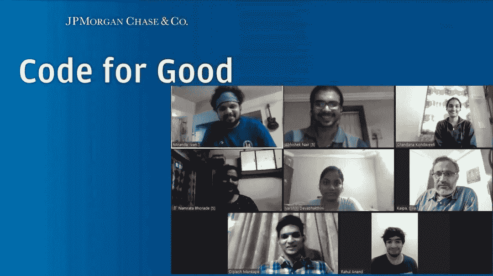

# 赢得优秀黑客马拉松的代码

> 原文：<https://levelup.gitconnected.com/winning-the-code-for-good-hackathon-24f6be90c718>

想知道什么是好的代码吗？给你:

 [## JP 摩根大通公司的优秀黑客马拉松代码。

### TLDR:这将为你提供黑客马拉松的简要概述。我会把我的经历和其他细节写在…

medium.com](https://medium.com/@dipleshmankape/code-for-good-hackathon-by-jp-morgan-chase-co-8e64db8ce079) 

# **一些背景故事:**

这始于我的第二年，当时我们的培训和安置小组通知我们，将对 JPMC 的优秀黑客马拉松代码进行编码测试。我对什么是编码测试，什么是黑客马拉松有一点点概念。所以，我脑子里只有疑问，没有期望，我和我的室友 Ketan 讨论“让我们把这次考试当作一次经历，我们会学到一些东西”。像他们说的那样休息是历史！

# 编码测试:

第一轮筛选是一个编码测试，有 2 个中等难度的编码问题和几个基于 C 语言和基本编程知识的 mcq。

*提示/建议:数据结构和算法的基础* *的坚实基础是你所需要的。为了练习，你可以在 GeeksforGeeks，Leetcode 上获得资源，或者在 Codechef，Codeforces 等网站上进行竞争性编程。*

接下来是 HireVue 上的虚拟采访。

# 虚拟面试:

这一轮，你要在 HireVue 的平台上记录你对 HR 类型问题的回答。对于每个问题，在记录和提交答案之前，你都有一些时间来准备。

一些示例问题:

*   请给出一个你向非技术人员解释技术概念的例子。
*   解释一个你表现超出预期的情况

提示/建议:试着给出诚实的答案，而不是编造故事。这样你会听起来更自信，更好地表达你的想法。

虚拟面试结束后，我们被要求提交更新后的简历，这些简历将被进一步用于入围名单。最后，大约 600 名学生被选中参加黑客马拉松。

一旦进入候选名单，你需要填写一份表格，在表格中你可以提到你的技能和熟练程度，这样他们就可以利用这些信息来组建一个拥有良好多元化技能的团队。

# 黑客马拉松:

这是一个为期 3 天的活动，前两天是一般介绍和专家会议，主题包括使用版本控制、团队建设等。

**组队:**

规模为 5-6 的团队是多样化的，成员来自不同的学院。所以你事先并不了解你的队友！这导致了一个非常不同和棘手但有趣的经历。你还会分配到两位导师，他们不仅会指导你，还会关注你的表现和贡献。

**问题陈述:**

所有非政府组织和 SGOs 代表解释他们的组织做什么，他们如何帮助社会，以及他们面临什么问题。

在黑客马拉松日的开始，这些组织发布了问题声明。你的团队必须决定你想做什么，并为问题陈述填写一份偏好表。基于这些回答，在 FCFS 的基础上给团队分配问题陈述。对于每个问题陈述，分配相同数量的团队，每个问题陈述有一个单独的获胜团队。

一些问题陈述示例:

*   CARPE:他们在固体废物管理领域工作。你必须为他们设计一个平台，在这个平台上，所有收集到的垃圾数据都可以显示出来，并进行分析，以便制定策略和决策。
*   轻微与生命基金会:他们致力于帮助农村地区的孩子提供基本的营养。他们试图通过实施创新的、气候智能的鸡蛋生产和消费方法来确保鸡蛋的普及。你将如何利用基于技术的解决方案为他们的事业做出贡献？
*   塔塔社会科学研究所:他们通过自己的项目为人们提供更好的就业技能。由于疫情病毒导致教室关闭，设计一个平台来帮助学习者获得培训、评估和认证。

注意:这些不是确切的问题陈述，但是我已经尽力回忆了基本的细节，这样你就可以知道会发生什么。

**期待什么？**

24 小时对于制作一个完整的应用程序来说是很短的时间，但是我们也不期望你这样做。你需要创建一个能够简单有效地代表你的想法和解决方案的 **MVP** 。记得找出问题陈述到底要求什么，并相应地设计你的解决方案。就问题陈述提出问题，澄清你的疑问，在需要的时候向你的导师寻求帮助。

**评判:**

你将有两轮评审，其中第一轮是淘汰赛，然后前 3 名的团队入围最后介绍。每个问题陈述选出一名获奖者。

*提示/建议:我们会根据您的想法、新颖性、实施和您使用的技术来评估您的解决方案。尽你所能参与、贡献和协调。这不仅有助于你的团队，也能给评估你的导师留下好印象。*

 [## LinkedIn 上的 Diplesh Mankape 黑客马拉松| 12 条评论

### 参加各种黑客马拉松后的一些感悟。这些点真的帮助我赢得了 JPMC 的代码

www.linkedin.com](https://www.linkedin.com/posts/diplesh-mankape_hackathons-activity-6832575241294766080-6YhR) 

# 我的经历:

对我的团队来说，这是一次过山车之旅。

**我们做错的事情:**

*   **不选择大家都知道的技术组合:**记住解决方案是最重要的。如果每个人都没有贡献，事情会变得很困难，所以在与您的团队进行适当的讨论后选择一个堆栈。
*   当事情不顺利时缺乏沟通:如果你面临问题，立即让你的队友知道。中场休息时，我们几乎失去了希望，因为什么都没有实现。

**我们做对的事情:**

*   **像每一个伟大的故事一样，我们没有放弃！我们敢于中途改变技术栈。重新开始，分工，坚持要求，最终做出了 MVP。**
*   询问需求:由于 SGO 人是我们的最终用户，我们询问了他们所有的疑虑和期望。这有助于解决方案实现的清晰性。

最后，我的团队是赢家之一！

# 如果你还在读这篇文章

如前所述，我没有期待任何东西，但结果恰恰相反。我们不仅赢得了比赛并获得了一台 iPad 作为奖品，我还获得了 JP 摩根的实习机会。不管你知道的有多少，你只需要有学习的意愿和参与任何挑战的勇气。你要么赢，要么学习。没什么可失去的:)

**万事如意！**