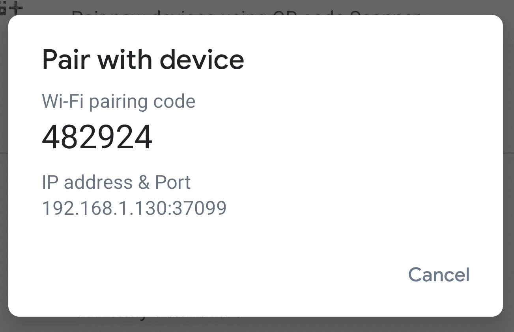
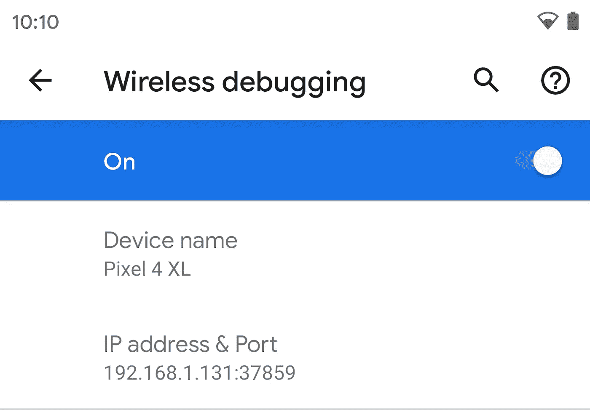

# Android 11 中的无线调试

> 原文：<https://levelup.gitconnected.com/wireless-debugging-in-android-11-7169d2596a81>


Android 11 开发者预览版提供了许多令人惊叹的新功能，专注于 5G 集成、范围存储、改进的隐私和安全性等。我个人最喜欢的功能之一是**无线调试**。这是一种从工作站无线部署和调试应用程序的新方法。

# 要求:

1.  运行 Android 11 的设备
2.  SDK 平台-版本≥ 30.0.0 的工具。
3.  Android 设备和您的 PC 使用相同的 Wi-Fi 网络

# 无线调试

Android 11 支持通过 Android Debug Bridge (adb)从工作站无线部署和调试应用程序。例如，您可以将可调试的应用程序部署到多个远程设备，而无需通过 USB 物理连接您的设备，也无需解决常见的 USB 连接问题，如驱动程序安装。

要使用无线调试，您需要使用配对代码将设备与工作站配对。您的工作站和设备必须连接到同一个无线网络。要连接到您的设备，请执行以下步骤:配对步骤:

-进入设备设置>开发者选项>**启用无线调试**

-选择**用配对代码配对设备。**(目前有两种选择可以和电脑配对。使用 QR 码或使用六位数字码配对设备。)



1.  在您的工作站上，更新至最新版本的 [SDK 平台工具](https://developer.android.com/studio/releases/platform-tools)。
2.  在设备上，启用[开发者选项](https://developer.android.com/studio/debug/dev-options)。
3.  启用**无线调试**选项。
4.  在询问**是否允许在该网络上进行无线调试的对话框中？**，点击**允许**。
5.  使用配对代码选择**配对设备。记下设备上显示的配对代码、IP 地址和端口号(见图片)。**
6.  在您的工作站上，打开终端并导航至`android_sdk/platform-tools`。
7.  运行`adb pair ipaddr:port`。使用步骤 5 中的 IP 地址和端口号。
8.  出现提示时，输入您在步骤 5 中收到的配对代码。将显示一条消息，提示您的设备已成功配对。

```
Enter pairing code: 482924
Successfully paired to 192.168.1.130:37099 [guid=adb-235XY]
```

11.(仅适用于 Linux 或 Microsoft Windows)运行`adb connect ipaddr:port`。使用**无线调试**下的 IP 地址和端口(见下图)。



呆在家里！保持安全