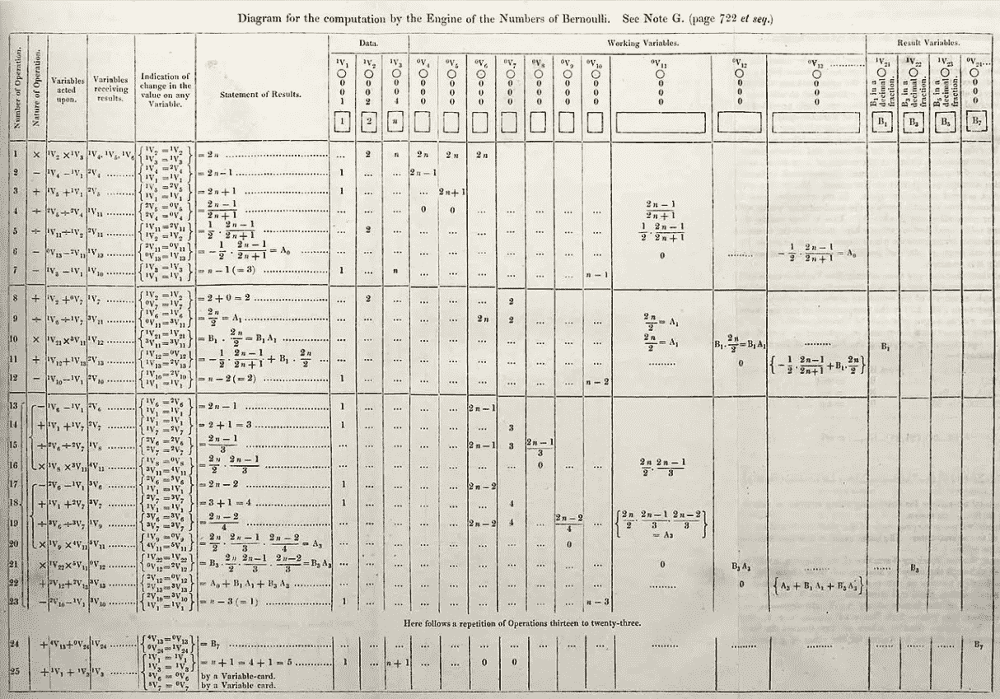
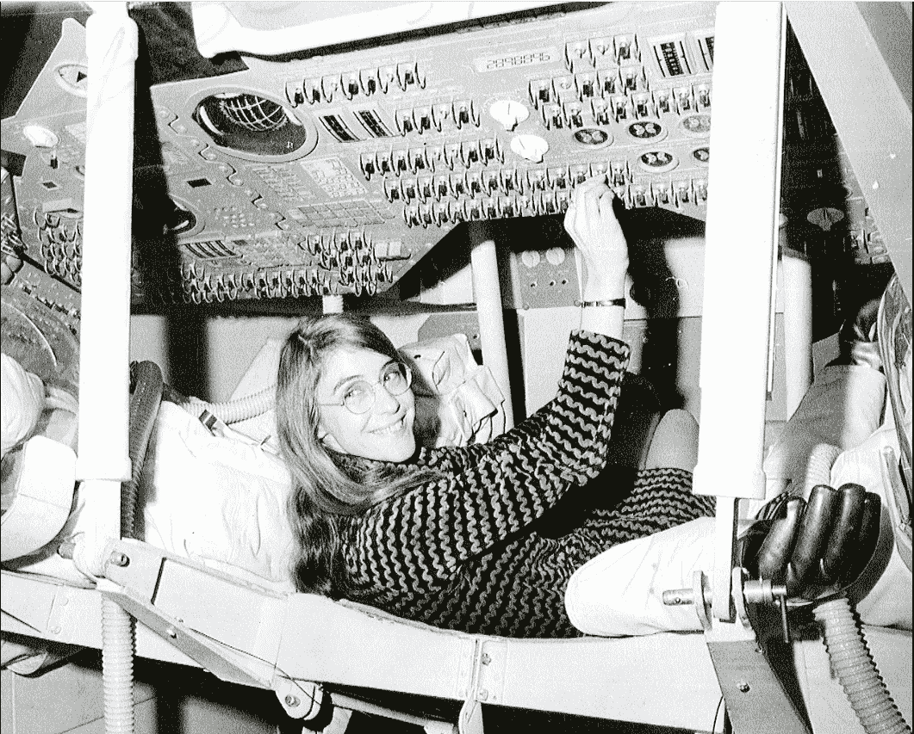

# 编码的女人

> 原文：<https://levelup.gitconnected.com/women-who-code-44804b1dc6d0>

## 这不是一个男人的世界

图片由[皮克斯拜](https://pixabay.com/?utm_source=link-attribution&utm_medium=referral&utm_campaign=image&utm_content=2167836)的 Gerd Altmann 提供

因为大多数科技公司都是由男性运营和拥有的，而且女性程序员仅占美国程序员的 26%，你可能会认为杰出的女性程序员少之又少。你就错了。

事实是，在过去，女性在程序员中的地位比现在更突出。第一个计算机程序经常被认为是由女性编写的。

如果女性能像那些在*之前的人一样被激励从事艺术，将会有更多杰出的女性程序员。如果你是一名程序员或者想从事编码工作，这里有一组女性程序员的选择，过去的和现在的，无论你是什么性别，她们的成就都会给你灵感和惊喜。*

# 1.阿达·洛芙莱斯——第一个计算机程序员

阿达是英国诗人拜伦和拜伦女士的独生女。她正式成为了伯爵夫人，尊敬的奥古斯塔·爱达·拜伦伯爵夫人。【1815 年 12 月 10 日出生于英国伦敦。

她经常被认为是第一个计算机程序员和计算机时代的预言家。回到大约 1843 年，在她做的一些笔记中，她描述了一台计算机和软件。

维基百科说，在她的笔记中，“她描述了分析引擎计算伯努利数的算法。它被认为是第一个专门为在计算机上实现而发布的算法，因此阿达·洛芙莱斯经常被认为是第一个计算机程序员

[阿达·洛芙莱斯](https://commons.wikimedia.org/wiki/File:Ada_Byron_daguerreotype_by_Antoine_Claudet_1843_or_1850.jpg)(约 1843 年)来自[维基共享资源](https://commons.wikimedia.org/wiki/Commons:Reusing_content_outside_Wikimedia)

用她自己的话来说，“[分析引擎]可能会作用于除了数字 T14 之外的其他事物，被发现的对象的相互基本关系可以用那些抽象运筹学的关系来表达……”听起来是不是很熟悉？听起来像现代计算机操作吗？她有远见地意识到，计算不仅仅可以应用于与数字相关的计算。

下面是有史以来发表的第一个计算机算法，指的是“注 G”。(1843 年 9 月版泰勒的*科学回忆录)*

第一个公布的计算机算法([阿达·洛芙莱斯【注 G】](https://en.wikipedia.org/wiki/Ada_Lovelace#/media/File:Diagram_for_the_computation_of_Bernoulli_numbers.jpg)来自[维基共享资源](https://commons.wikimedia.org/wiki/Commons:Reusing_content_outside_Wikimedia))

洛夫莱斯于 1852 年 11 月 27 日死于子宫癌，年仅 36 岁。

# 格蕾丝·赫柏

格蕾丝·赫柏于 1906 年 12 月 9 日出生于美国纽约，原名格蕾丝·布鲁斯特·默里。

她被认为创造了第一个编译器。这是一件大事。编译器使程序员能够用 Javascript 等简单语言编写代码，然后在运行时将它们编译成机器代码。没有编译器，程序员将不得不直接用机器代码编写。有志愿者写机器码吗？

根据[维基百科](https://en.wikipedia.org/wiki/Grace_Hopper#World_War_II)“当霍普建议开发一种完全使用英语单词的新编程语言时，她很快被告知【她】做不到，因为计算机不懂英语”

她使用编译器的想法导致了像 FLOW-MATIC 这样的第一种编译语言的诞生。COBOL 语言也是这个想法的直接结果。

海军上将[格蕾丝·赫柏](https://en.wikipedia.org/wiki/Grace_Hopper#/media/File:Commodore_Grace_M._Hopper,_USN_(covered).jpg)来自[维基共享资源](https://commons.wikimedia.org/wiki/Commons:Reusing_content_outside_Wikimedia)

二战期间，霍普于 1943 年加入美国海军预备役。1983 年 12 月 15 日，罗纳德·里根总统特别任命她为海军上将。

美国海军导弹驱逐舰 USS *Hopper* 以她的名字命名。2016 年 11 月 22 日，巴拉克·奥巴马总统追授她总统自由勋章。

霍普于 1992 年元旦在睡梦中去世，享年 85 岁。她被安葬在阿灵顿国家公墓，以最高军事荣誉安葬。

# 3.玛丽·艾伦·威尔克斯

玛丽·艾伦·威尔克斯 1937 年 9 月 25 日出生于美国伊利诺伊州的芝加哥。她是一名退休的计算机程序员、逻辑设计师和律师。她最著名的工作是使用 LINC 电脑，这是现在公认的世界上第一台“个人电脑”。

她在 LINC 的工作包括编写能让用户操作电脑的软件，即操作系统。她的工作还包括为原型设计控制台和共同编写操作手册。

根据维基百科的记载，她在数字计算机集团的韦斯利·a·克拉克手下的工作还包括“设计‘宏模块’，即计算机构建模块。威尔克斯设计了乘法宏模块，这是最复杂的一个。

1965 年，玛丽·艾伦·威尔克斯在巴尔的摩的父母家与 LINC 电脑合影。电脑在威尔克斯身后，楼梯脚下。她是世界上第一批在家里拥有“个人电脑”的人之一。([玛丽·艾伦·威尔克斯在家](https://en.wikipedia.org/wiki/Mary_Allen_Wilkes#/media/File:Mary_Allen_Wilkes_-_LINC_at_Home_-_1965.jpg)来自[维基共享资源](https://commons.wikimedia.org/wiki/Commons:Reusing_content_outside_Wikimedia))

威尔克斯于 1972 年离开计算机领域，去哈佛法学院学习法律。毕业后，她在退休前从事了 40 年的法律工作。她住在美国马萨诸塞州的剑桥。

# 4.玛格丽特·哈米尔顿

玛格丽特·哈米尔顿于 1936 年 8 月 17 日出生于美国印第安纳州的保利，原名玛格丽特·伊莱恩·希菲尔德。

汉密尔顿职业生涯的顶点是帮助人类登上月球，担任阿波罗飞行计算机编程主任。根据维基百科的说法，在阿波罗 11 号将第一个人送上月球的三分钟前，“几个计算机警报被触发”，“阿波罗导航计算机和机载飞行软件一起避免了一次(不必要的)登月中止。”

用汉密尔顿自己的话说，“如果计算机没有发现这个问题并采取恢复措施，我怀疑阿波罗 11 号是否会成功登月。”

汉密尔顿是阿波罗飞行软件首席设计师([玛格丽特·哈米尔顿](https://en.wikipedia.org/wiki/Margaret_Hamilton_(software_engineer)#/media/File:Margaret_Hamilton_in_action.jpg)来自[维基共享](https://commons.wikimedia.org/wiki/Commons:Reusing_content_outside_Wikimedia))

人们认为汉密尔顿提出了“软件工程”这个术语。她的目标是使软件作为工程学科合法化，因为她有远见认识到有一天它会变得不可或缺。关于这个新术语，她说“当我第一次提出这个术语时，没有人听说过它，至少在我们的世界里。这是一个持续了很长时间的笑话。他们喜欢拿我的激进想法开玩笑。”

2016 年，汉密尔顿被巴拉克·奥巴马授予总统自由勋章([玛格丽特·哈米尔顿](https://en.wikipedia.org/wiki/Margaret_Hamilton_(software_engineer)#/media/File:Hamilton_Medal_of_Freedom_from_Obama.jpg)来自[维基共享](https://commons.wikimedia.org/wiki/Commons:Reusing_content_outside_Wikimedia)

汉密尔顿住在美国马萨诸塞州的剑桥。

# 5.拉迪亚·帕尔曼

拉迪亚·乔伊·帕尔曼 1951 年 12 月 18 日出生于美国弗吉尼亚州的朴茨茅斯。

她是生成树协议(STP)的发明者。[它是](https://youtu.be/i_q-kIgz9Wk?t=7)一种第二层网络协议，用来防止计算机竞争使用局域网上的共享电信路径时出现的问题简而言之，当同一网络上的太多计算机试图同时发送数据时，该协议可以避免网络变慢。

[维基共享资源](https://en.wikipedia.org/wiki/Radia_Perlman#/media/File:Radia_Perlman_2009.jpg)[的 Radia Perlman](https://commons.wikimedia.org/wiki/Commons:Reusing_content_outside_Wikimedia)

她拥有 100 多项专利。2016 年，她入选了国家发明家名人堂。其他奖项包括互联网名人堂奖、SIGCOMM(计算机器协会数据通信特别兴趣小组)奖(2010 年)、USENIX(支持操作系统研究的协会)终身成就奖(2006 年)等。

帕尔曼住在美国华盛顿州雷蒙德市。

# 最后的想法

自从第一行代码被编写以来，杰出的女性人物就一直存在。在男人把计算机看做不太重要的学科的时代，女性人物有意识到它的潜力。他们在推动软件工程发展到今天的受人尊敬的地位方面发挥了关键作用。

关于早期女性程序员的一个值得注意的事实是，她被雇用是因为她是这项工作的最佳人选，没有其他原因。这也是一个女人的世界。

如果你是一个对开始编码犹豫不决的女人，从那些在你之前和现在的人那里获得灵感。你可能会惊讶于对编码世界的热烈欢迎。

感谢阅读。如果你喜欢这篇文章，可以考虑[订阅这里的](https://craftedwebpages.medium.com/membership)成为中级会员，以获得数以千计的其他文章。

这里有一些 YouTube 的女性导师和人物，你可以学习和鼓励他们: [blondiebytes](https://www.youtube.com/watch?v=LFa9fnQGb3g&ab_channel=blondiebytes) ，[与 Ania Kubów 一起编码](https://www.youtube.com/watch?v=2UR8gSnRU28&ab_channel=CodewithAniaKub%C3%B3w)， [TiffInTech](https://www.youtube.com/watch?v=zZM9b2XFG8M&ab_channel=TiffInTech) ， [CodeBeauty](https://www.youtube.com/watch?v=iBG0fN8lY8Y&ab_channel=CodeBeauty) ， [Layout Land](https://www.youtube.com/watch?v=hs3piaN4b5I&ab_channel=LayoutLand) ， [mayuko](https://www.youtube.com/watch?v=6ptI5B4a-ag&ab_channel=mayuko) ，[法拉第学院](https://www.youtube.com/watch?v=8wDGw6rEp_I&ab_channel=FaradayAcademy)

**来源:** [阿达·洛芙莱斯](http://Ada Lovelace)，[格蕾丝·赫柏](https://en.wikipedia.org/wiki/Grace_Hopper)，[玛丽·艾伦·威尔克斯](https://en.wikipedia.org/wiki/Mary_Allen_Wilkes)，[玛格丽特·哈米尔顿](https://en.wikipedia.org/wiki/Margaret_Hamilton_(software_engineer))，[拉迪亚·帕尔曼](https://en.wikipedia.org/wiki/Radia_Perlman)

***你可能也喜欢我的另外一篇文章:***

 [## 你将成为成功程序员的 9 个早期迹象

### 不要放弃

levelup.gitconnected.com](/9-early-signs-you-will-be-a-successful-programmer-1a604f04be39)  [## 首先学习的最佳编程语言——犹豫不决的初学者的路线图

### 最省时、最具成本效益的学习方式以及免费和付费课程

medium.com](https://medium.com/technology-hits/the-best-programming-languages-to-learn-first-a-roadmap-for-the-indecisive-beginner-f242e5ffeac5)  [## 一系列让你发笑的编程笑话

### this . jokes array . foreach(joke = > medium . log(joke))

levelup.gitconnected.com](/an-array-of-programming-jokes-to-make-you-smile-e5bbb0cb42ed)  [## 7 个习惯…等等等等

### 停止阅读“习惯”点击诱饵——培养真正的习惯来帮助提高生产力

medium.com](https://medium.com/unicorn-startup/7-startup-habits-that-blah-blah-blah-5106f4ce3a9)