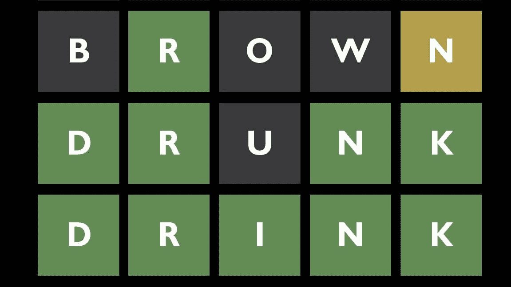
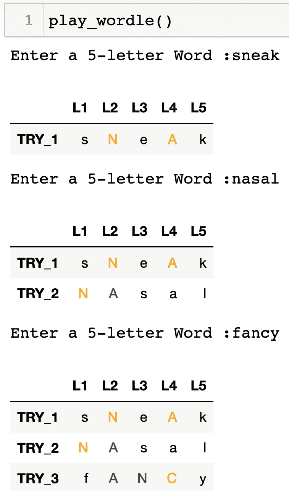
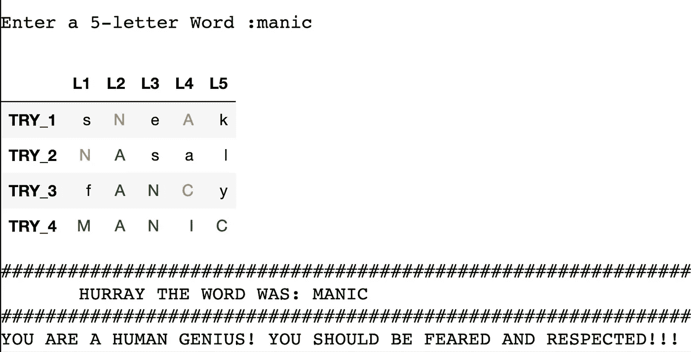

# Python 中的 WORDLE

> 原文：<https://levelup.gitconnected.com/wordle-in-python-a3bbc9df5fbf>

## 简单的 Jupyter 笔记本代码，玩不完的 WORDLE！

来源:[https://www . the times . co . uk/article/wordle-how-to-win-at-the-hot-new-online-word-game-r 962 BH 0 LG](https://www.thetimes.co.uk/article/wordle-how-to-win-at-the-hottest-new-online-word-game-r962bh0lg)

## 沃尔多是什么？

如果你还没有听说过，WORDLE 是最新的在线字谜游戏，它正在互联网上掀起一场风暴。程序员乔希·沃德尔(谢谢，乔希！！！)在 2021 年 10 月创建了这款游戏，这样他和他的搭档——帕拉克·沙阿——就可以一起玩了。这是如此简单，但如此上瘾和令人满意！

## **游戏规则**

1.  每天，代码将从英语词典中随机选择一个 5 个字母的单词
2.  你有六次机会猜对这个单词
3.  如果你猜对了 ***确切的位置*** 一个字母在单词中它会把*变成绿色*
4.  如果你猜对了单词中的一个字母，但是它的位置错了，它就会变成橙色
5.  如果字母不存在，它将保持灰色

## 为什么要写我自己的版本？

嗯，就像乔希和他的搭档一样，我妻子和我也很喜欢和沃尔多呆在一起。问题是你每 24 小时只能*玩一局！因此，最终每天玩更多游戏的需求变得如此强烈，以至于我自己决定用 Python 编写自己的版本。它不像真实的游戏那样漂亮和流畅，但是因为我只能用 Python 来编码——我找到了一种方法来使用熊猫数据帧的条件颜色格式使它工作。请看下面的截图:*

****

## *链接到代码*

*如果你是一个 WORDLE 爱好者，知道如何在 Jupyter 笔记本中执行简单的 Python 代码，那么请随意下载下面链接的 Repo 并进行测试。感谢您的阅读，请让我们知道您的想法，如果它对您有用并且您喜欢它，请在评论中给我们一个快速的欢呼！*

## *[https://github.com/Botafogo1894/Wordle](https://github.com/Botafogo1894/Wordle)*

# *分级编码*

*感谢您成为我们社区的一员！升级正在改变技术招聘。 [**在最好的公司找到你最理想的工作**](https://jobs.levelup.dev/talent)**。***

*** [## 提升——改变招聘流程

### 🔥让软件工程师找到他们热爱的完美角色🧠寻找人才是最痛苦的部分…

作业. levelup.dev](https://jobs.levelup.dev/talent)***