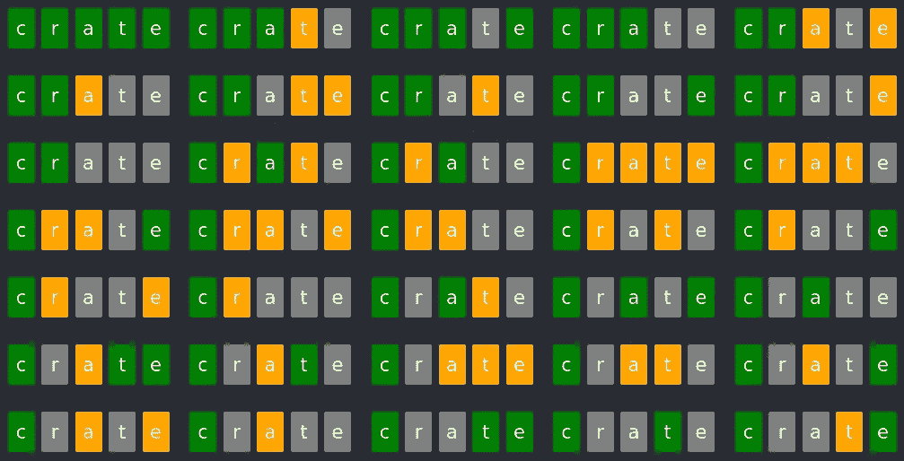

# 沃尔多求解器

> 原文：<https://levelup.gitconnected.com/wordle-solver-31601a5dbb42>

## 用α-β剪枝法求解单词

## TL；博士；医生

我为 wordle 创建了一个解算器，你可以在这里玩:[https://bekyblog.tech/wordle-solver/](https://bekyblog.tech/wordle-solver/)

代码可在 https://github.com/bec-ca/botle[获得](https://github.com/bec-ca/botle)

## 介绍

当我碰到沃尔多的时候，我有各种各样的问题。最佳策略是什么？最难的单词是什么？我听到人们谈论一些策略，比如根据英语中字母的分布来选择第一个单词。我知道这是非常近似的，并没有真正回答我的问题。我想知道*可能的*最佳策略。所谓最佳策略，我指的是在最坏的情况下最小化猜测次数的策略。所有的英语单词都可以猜 6 次吗？为了回答这些问题，我决定写一个能找到最佳策略的程序。

也许有人会说这破坏了游戏，但我发现这种游戏方式更有趣。实际的最佳策略取决于你个人知道的单词，我不可能知道。

## 谜题

如果你住在岩石下，还没有玩过 wordle，去看看这里的。

## 词表

第一步是定义什么是有效猜测的单词集，什么是单词集。英语单词有很多来源，我们可以从中挑选一个。但是，如果我们检查 wordle 的 javascript，我们可以找到有效单词的列表。我们甚至可以找到一个单独的密语列表。值得注意的是，有效猜测的列表非常全面，包含了大多数人可能不知道的极不寻常的单词。然而，这个秘密单词列表包含了很多更熟悉的单词。我对拥有单独的单词列表的理解是，他们愿意接受任何有人想猜的单词，但是，选择一些模糊的单词作为秘密单词，会使游戏不那么有趣。

我不确定利用有效猜测单词和秘密单词列表不同的事实是否会被认为是作弊。一个人类玩家，甚至不能访问任何一个列表，他们必须依靠他们自己的英语知识。我认为最公平的做法是选择一个普通玩家更容易理解的单词列表。但是，构建这样一个列表有点乏味，我对这方面的问题不太感兴趣。我尝试使用维基百科上最常见的单词，但最终效果很好，因为即使是 10k 个最常见的单词仍然会遗漏秘密列表中的一些单词。

## 初始贪婪方法

首先我们需要一些数据。我们能猜到的单词是什么？原来，可能的单词列表嵌入在页面的 javascript 中。如果你仔细看，甚至秘密都是按出现的顺序排列的。虽然这能告诉你答案，但这并不能说明什么是最佳策略。所以我只是从 javascript 中取出单词列表。

一旦我们有了可以猜测的单词列表，我最初的想法是一种贪婪的方法，如下所示:

1.  从列表中选择一个单词作为可能的猜测
2.  从列表中选择第二个单词作为潜在的秘密
3.  计算一下如果那一对猜测和秘密单词，我们会得到什么样的模式。
4.  现在，对于列表中的每个单词，我们计算假设单词是秘密时得到的模式，如果这与步骤 3 不同。我们从可能的秘密列表中排除了这个词。
5.  记下剩下的秘密数量
6.  对列表中的每个单词重复步骤 2 到 5，作为潜在的秘密，并取导致最少淘汰的潜在秘密，这是该猜测的最差秘密，让我们称之为剩余秘密的数量
7.  现在重复第 1 步到第 6 步，选择不同的单词进行猜测，并选择产生最少剩余秘密的单词。

所以这给了我们一些合理的猜测。也就是说，我们做一个猜测，在最坏的情况下排除最多的可能秘密。但是，这仍然是一个贪婪的解决方案，如果我们看看在 2 次猜测后我们进行了多少次淘汰，这可能不是最优的。

## 双人游戏方法

接下来，我决定将 wordle 建模为一个双人游戏。一方面，我们试图以尽可能少的猜测找到秘密单词，但另一方面，我们希望确保最困难的秘密不需要额外的猜测。因此，我们可以把它想成一个游戏，在这个游戏中，我们试图找到一个秘密词来减少猜测的次数，同时我们的对手试图选择一个秘密词来增加猜测的次数，只要这个秘密词与目前为止的猜测一致，他们就可以在我们的每一次猜测中这样做。与在游戏开始时选择一个固定的秘密相比，这个模型没有失去任何通用性。

这种建模很酷，因为我们可以将同样的方法应用于其他双人游戏，比如国际象棋。也就是说，我们可以执行一个最小最大搜索，用 alpha-beta 剪枝等方法找到最佳解决方案。

这个模型的缺点是，一个最小最大搜索随着我们可以做出的选择的数量的一个因子的步骤数呈指数增长。我们有 12000 个不同的单词可以选择。不像国际象棋，通常有几十步棋在任何位置都是合法的。但是，最终，这并不是一个大问题。通过一些仔细的优化，我仍然能够在合理的运行时间内找到最佳策略。

许多优化与国际象棋引擎上所做的非常相似，我碰巧对国际象棋引擎有点熟悉。此外，还有一些利用 wordle 特殊属性的优化。以下是其中的一部分:

1.  阿尔法-贝塔剪枝，这是最小最大搜索最基本的优化
2.  缓存，又名，转置表。不同的选择会把我们带到相同的状态，例如，选择一个单词 X，然后是 Y，和选择 Y，然后是 X 是一样的，缓存可以用来避免重新计算那个状态
3.  预计算模式匹配单词，虽然模式匹配并不太慢，加速也只是给了我们一个常数因子的加速，但我还是发现程序大部分时间都花在了计算模式匹配上，所以最终还是值得的
4.  请注意，对手并不真的需要选择一个秘密词，他们只需要选择一个模式，因为多个秘密词将产生相同的模式，我们只需要为每个不同的模式选择一个秘密。
5.  排序，阿尔法-贝塔剪枝如果我们先尝试最佳选择效果最好。当然，我们还不知道，但是一个近似的最佳优先也要好得多。所以，在每一步，我都根据上面的贪婪方法对单词进行排序。

有了这些优化，也许还有其他一些东西，我的程序运行得足够快，可以找到最佳策略。

我还实现了 wordle 提供的“硬模式”,其中每个猜测都必须与迄今为止的猜测相兼容，尽管这很少改变算法。

## 结果

为了创建下面的结果表，我用每一个秘密和每一个可能的起始单词模拟了游戏，在第二步的每一步，我都选择了求解者推荐的单词。花了几天时间来运行所有的东西，使用无秘密列表会使事情变得更慢，而且硬模式甚至比正常模式更慢。这些列的含义是:

*   哪组单词被允许作为有效的猜测
*   `Secrets`:我是否使用了单独的秘密单词列表，如果没有，我假设字典中的任何单词都可以是秘密。
*   `Hard`:游戏是否在硬模式下运行。
*   `Best`:对所有秘密产生最低平均猜测次数的起始单词
*   `Avg`:该词在`Best`栏中的平均猜测次数
*   `Worst`:从`Best`栏中的单词开始，猜最难的秘密所需的次数

```
| Dictionary    | Secrets | Hard | Best  | Avg  | Worst |
|---------------|---------|------|-------|------|-------|
| Wordle        | Yes     | No   | crate | 3.53 | 5     |
| Wordle        | No      | No   | tares | 4.23 | 8     |
| Wordle        | Yes     | Yes  | leant | 3.65 | 7     |
| Wordle        | No      | Yes  | tromp | 4.52 | 12    |
| Wikipedia 10k | No      | No   | tiles | 4.01 | 6     |
| Wikipedia 10k | No      | Yes  | trims | 4.23 | 12    |
```

## 浏览器版本

我将引擎编译成 wasm，并在网上提供给任何人使用。你可以看到引擎建议的热门词汇，然后选择其中任何一个。起始单词都是预先计算好的，因为它们需要很长时间。其余的猜测是在本地计算的，我发现看着它进行很令人满意。来看看:[https://bekyblog.tech/wordle-solver/](https://bekyblog.tech/wordle-solver/)



你可以选择从 wordle 中得到的模式，它会给出另一个猜测

## 密码

我在 github 上提供了站点和引擎的代码:【https://github.com/bec-ca/botle。对了，它之所以被命名为 botle，是因为它是 bot 和 wordle 的组合体。是的，我知道，我不是一个很有趣的人。