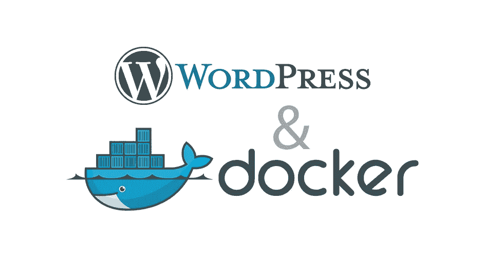
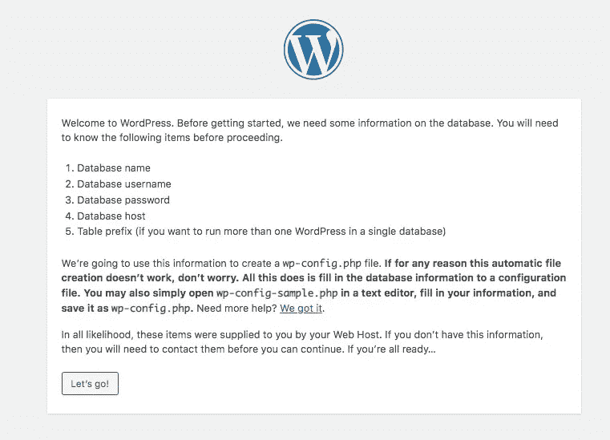
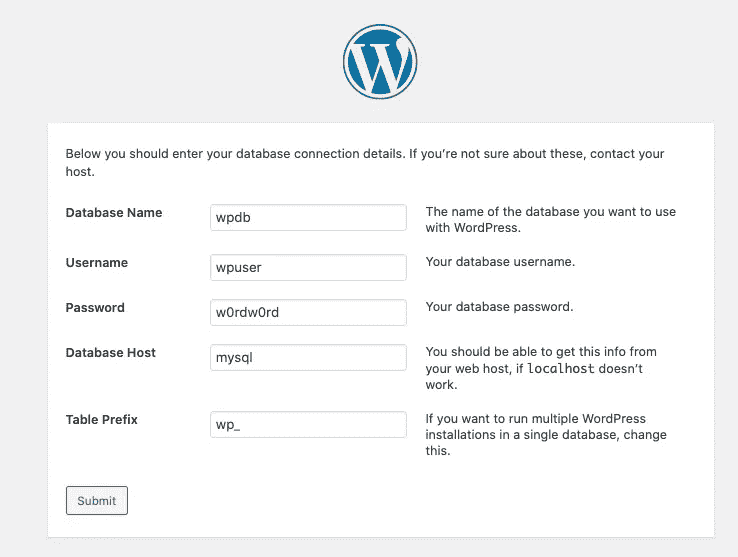
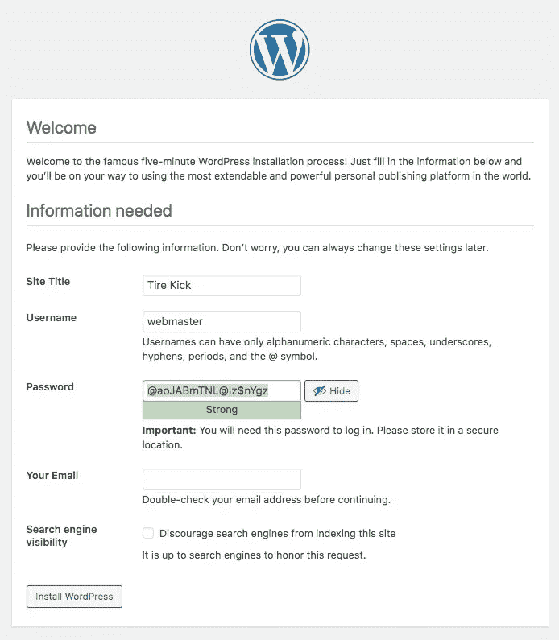

# 带有 Docker 和 Docker Compose 的 Wordpress 本地开发环境在您的笔记本电脑上

> 原文：<https://levelup.gitconnected.com/wordpress-local-development-environment-with-docker-and-docker-compose-on-your-laptop-f4095b67665e>



我们通常在公共互联网服务器上安装 Wordpress，而在本地机器上的安装通常仅限于开发或测试 Wordpress 功能或主题。当你可以直接在你的机器上编辑 Wordpress 文件时，开发周期会短很多，而不是制定一个方法来编辑远程文件。虽然很方便，但如何在你的笔记本电脑上创建一个网站托管环境并不总是很清楚。过去，我们会使用 MAMP(或 Windows 等价物)，这是一个运行 Apache/MySQL/PHP 堆栈的 macOS 原生环境。但是今天我们有了一个不同的工具，Docker，它可以轻松地运行这个堆栈，以及任何其他的堆栈。Docker 很容易在笔记本电脑上运行，所以让我们看看如何使用它来运行本地 Wordpress 开发环境。

在这篇文章中，我们将讨论 Docker 中的一个简单的 Wordpress 部署，它可以用在生产服务器上，但也意味着用于本地 MySQL 开发。它将使用三个 Docker 容器，MySQL 作为数据库，PHPMyAdmin 用于数据库管理，Wordpress 作为应用程序。它会给你对 Wordpress 树的完全控制，而不依赖于 Docker 图像中内置的 Wordpress 实例。

Docker 是一个流行且强大的工具，用于在从 Raspberry Pi 到大型主机的计算机上部署服务。Docker 支持运行*容器化的*应用程序，这意味着应用程序的设置是以 Docker 镜像的形式分发的，其中包含一个配置了一些软件的 Linux 实例。关于 Docker 的更多信息，包括安装指南:[Docker 入门:安装，第一步](https://techsparx.com/software-development/docker/damp/getting-started.html)

由于 Wordpress 站点需要一个 MySQL 数据库，Docker Wordpress 部署需要一个 MySQL 实例。使用 Docker Compose，我们如何设置 Wordpress？另外，我们如何在笔记本电脑上使用 Docker 来支持 Wordpress 开发？

**用一个 Docker 合成文件部署 Wordpress 至少需要两个容器。首先是一个 MySQL 数据库实例，为了持久化，将数据目录装载到容器中。接下来是 Wordpress 容器，配置为访问 MySQL 数据库。**

根据你的需要，你也可以启动其他服务，比如 Redis 或 Nginx。这些也很容易在 Docker 编写文件中配置。但是 MySQL 和 Wordpress 这两个是关键。

**在 Docker 上开发 Wordpress 需要一个数据库管理工具，比如 PHPMyAdmin，以及用程序员编辑器编辑 Wordpress 文件的能力。编辑文件只需要在** `**/var/lib/html**` **将主机目录挂载到 Docker 容器中。**

这篇文章不仅关注使用 Docker 的 Wordpress 部署，还提供了一些关于开发设置的提示。为此，我们将回顾将主机目录装入 Wordpress 容器，以及如何配置 PHPMyAdmin 和 MySQL 实例。

要继续，您需要在您的计算机上安装 Docker 和 Docker Compose。有关建议，请参见:[Docker 入门:安装，第一步](https://techsparx.com/software-development/docker/damp/getting-started.html)

这建立在之前的教程之上，在之前的教程中，我们使用了`docker run`命令来启动 Wordpress、PHPMyAdmin 和 MySQL。请参见:[使用现有的 MySQL 设置 PHPMyAdmin 和 Wordpress Docker 容器](https://techsparx.com/software-development/docker/damp/mysql-phpmyadmin.html)在本教程中，我们将重新讨论这些服务，但是使用一个组合文件。

让我们从创建一个工作目录开始。例如创建一个名为`wordpress-local`的空白目录。在该目录中创建一个名为`docker-compose.yml`的文件。顾名思义，这是一个 YAML 文件，所以最好使用了解 YAML 的程序员编辑器。

还有一个 Github 工作区包含了本教程中显示的 Compose 文件:[https://Github . com/robo geek/docker-WordPress-local-development](https://github.com/robogeek/docker-wordpress-local-development)。

# 用 Docker 合成文件启动 MySQL

了解这一点的最好方法是直接进入，所以让我们从最简单的部分开始，配置一个数据库服务器 MySQL 和一个管理应用程序 PHPMyAdmin。幸运的是，我们已经在[部署 MySQL 中介绍了如何部署 MySQL，以便开始使用 Docker 合成文件](https://techsparx.com/software-development/docker/damp/compose-intro.html)

留给我们这个合成文件:

```
version: '3.8'services:
      mysql:
         image: "mysql/mysql-server:8.0.21"
         container_name: mysql
         command: [ "mysqld",
                     "--character-set-server=utf8mb4",
                     "--collation-server=utf8mb4_unicode_ci",
                     "--bind-address=0.0.0.0",
                     "--default_authentication_plugin=mysql_native_password" ]
         # ports:
         #     - "3306:3306"
         networks:
             - wpnet
         volumes:
             - type: bind
               source: ./database
               target: /var/lib/mysql
         restart: always
         environment:
            MYSQL_ROOT_PASSWORD: "r00tr00t"
            # MYSQL_ROOT_HOST: "%"
            MYSQL_USER: wpuser
            MYSQL_PASSWORD: w0rdw0rd
            MYSQL_DATABASE: wpdbnetworks:
     wpnet:
         driver: bridge
```

这为 MySQL 服务器定义了一个运行容器。稍后我们将把其他容器添加到这个文件中。

`version`声明说要使用 Docker Compose 规范的最新版本。你可以在[https://docs.docker.com/compose/compose-file/](https://docs.docker.com/compose/compose-file/)找到这个文件的文档

`services`部分是我们声明要运行的容器的地方。`networks`部分是声明将要使用的虚拟网络的地方。

该服务名为`mysql`，由 Docker Hub 中的名为`mysql/mysql-server:8.0.21`的 Docker 映像构建而成。

属性覆盖了 MySQL 守护进程的启动方式。我们这样做是为了指定所需的 MySQL 配置设置。这是一种覆盖保存在服务器中的 MySQL 配置文件中的任何设置的方法。

可用于 MySQL 的可用设置记录在[https://dev . MySQL . com/doc/ref man/8.0/en/server-system-variables . html](https://dev.mysql.com/doc/refman/8.0/en/server-system-variables.html)

`default_authentication_plugin`选项强制 MySQL 使用旧的 MySQL 密码，而不是新的`caching_sha2_password`算法。如果没有这个选项，Wordpress 将会失败，并出现以下错误:

```
[24-Sep-2020 19:20:56 UTC] PHP Warning:  mysqli_real_connect(): The server requested authentication method unknown to the client [caching_sha2_password] in /var/www/html/wp-includes/wp-db.php on line 1635 
[24-Sep-2020 19:20:56 UTC] PHP Warning:  mysqli_real_connect(): (HY000/2054): The server requested authentication method unknown to the client in /var/www/html/wp-includes/wp-db.php on line 1635
```

即使看到这个错误也很困难，因为 Wordpress 试图对用户友好，以至于许多错误都被隐藏了。观察到的行为是运行 Wordpress 安装程序时，安装程序会莫名其妙地给出一个错误:*建立数据库连接时出错*。为了诊断错误，我们必须编辑`wp-admin/setup-config.php`，将对`error_reporting`的调用改为`error_reporting( -1 )`。这将导致错误被记录在`/var/log/apache2/error.log`中。一旦你这样做了，上面的错误信息就会出现。前面显示的 MySQL 选项修复了这个错误。

属性指定了容器将使用的任何 Docker 网络。这些网络必须在 Docker 编写文件中或通过`docker network create`命令声明。这种网络是在码头集装箱之间有用的虚拟通信信道。

属性是我们如何将一个目录或者一个文件挂载到一个容器中。在这种情况下，我们需要确保当我们销毁和重新创建容器时，存储在数据库中的数据将继续存在。当容器被破坏时，在容器内创建的任何数据都将蒸发。显然，数据库的数据因此必须存储在容器之外。

在本例中，我们将本地目录`./database`挂载到位于`/var/lib/mysql`的容器中。该目录是 MySQL 存储数据库的默认位置。因此，`./database`目录将最终保存数据库的文件。

`restart`属性表示如果容器中的主进程死亡，要重启容器。

属性让我们定义容器内部的环境变量。MySQL 容器在初始化数据库时使用这些环境变量。

`MYSQL_ROOT_PASSWORD`变量控制名为`root`的 MySQL 用户 ID 的创建，该用户 ID 可以完全访问服务器中的所有内容。由于`root`帐户拥有如此大的权力，我们限制对运行在容器内部的软件的访问。如果需要，`MYSQL_ROOT_HOST`变量让我们指定一个模式匹配字符串，允许主机连接到`root`用户。在这种情况下，`%`模式表示允许从任何地方的任何主机连接到`root`用户。这不是最佳实践，也不是任何人在生产部署中都应该做的。

其他环境变量涉及创建数据库(`wpdb`)、用户 ID ( `dbuser`)和用户密码。

# 在一个组合文件中启动 PHPMyAdmin 和 MySQL

PHPMyAdmin 是管理 MySQL 数据库的优秀工具。这使得它成为 Wordpress 部署的优秀伙伴，可以更好地管理整个系统。

为此，将它添加到定义了`mysql`服务的组合文件中。

```
phpmyadmin:
         image: phpmyadmin/phpmyadmin
         container_name: phpmyadmin
         networks:
             - wpnet
         environment:
             PMA_ARBITRARY: 1
             # PMA_HOST: mysql
             # PMA_USER: root
             # PMA_PASSWORD: r00tr00t
             # PHP_UPLOAD_MAX_FILESIZE: 1G
             # PHP_MAX_INPUT_VARS: 1G
         ports:
             - "8001:80"
```

PHPMyAdmin 容器是从环境变量中配置的，如下所示。这样设置`PMA_ARBITRARY`后，我们将被要求在登录屏幕上提供数据库详情。但是也可以用`PMA_HOST`、`PMA_USER`和`PMA_PASSWORD`进行配置，以预配置它连接到特定的服务器。

为了使用`root`用户 ID 成功登录，MySQL 容器必须用前面显示的`MYSQL_ROOT_HOST`变量初始化。

# 启动数据库容器，并尝试

有了 Docker Compose 文件，我们只需运行`docker-compose`命令来启动文件中的内容。

由于 MySQL 容器初始化数据目录的工作，还会有更多的输出。但是，启动数据库就是这么简单。除非您收到如下错误消息:

```
$ docker-compose up 
Creating network "wordpress-local_wpnet" with driver "bridge"
Creating phpmyadmin ...
Creating mysql ... error
Creating phpmyadmin ... done: bind source path does not exist: /Volumes/Extra/docker/wordpress-local/database 
ERROR: for mysql Cannot create container for service mysql: invalid mount config for type "bind": bind source path does not exist: /Volumes/Extra/docker/wordpress-local/database 
ERROR: Encountered errors while bringing up the project.
```

由于来自 MySQL 的错误信息，这是相当容易理解的。可能那是因为不是 MySQL 错误，而是 Docker 错误。在任何情况下，该消息意味着我们在合成文件中命名的目录不存在。如果是这种情况，只需运行以下命令:

```
$ mkdir database
```

这将创建一个空目录，MySQL 容器将继续初始化该目录中的数据库文件。

关于这个目录还有另外一个考虑。假设您想在创建数据库目录时尝试不同的参数？如果 MySQL 容器在启动时看到一个数据目录，它将不会初始化数据目录，因为显然它不应该初始化一个已经包含数据库文件的目录。但是如果您正在试验新的设置，您需要初始化数据目录。因此，如果这是您所需要的，那么您必须首先删除数据目录，并创建一个空目录，以便 MySQL 容器继续进行初始化。

下一件事是检查创造了什么:

```
$ docker-compose ps 
Name   Command                       State        Ports 
--------------------------------------------------------------------------------- 
mysql /entrypoint.sh mysqld --ch ... Up (healthy) 3306/tcp, 33060/tcp 
phpmyadmin /docker-entrypoint.sh apac ... Up 0.0.0.0:8001->80/tcp 
$ docker ps 
CONTAINER ID IMAGE COMMAND CREATED STATUS PORTS NAMES 
56f4b5ea1f52 phpmyadmin/phpmyadmin "/docker-entrypoint...." 3 minutes ago Up 2 minutes 0.0.0.0:8001->80/tcp phpmyadmin 
1e0f5e21c074 mysql/mysql-server:8.0.21 "/entrypoint.sh mysq..." 23 hours ago Up 2 minutes (healthy) 3306/tcp, 33060/tcp mysql
```

我们可以使用`docker-compose ps`和`docker ps`命令来检查已经部署的系统。`docker-compse`和`docker`都有很多检查和管理 Docker 系统的命令。演示略有不同，似乎中期来看,`docker-compose`命令的功能正在被移植到`docker`命令中。

`docker ps`命令列出了正在运行的容器，我们看到我们的两个容器正在运行。它显示了在合成文件中声明的端口映射。最后一列显示了容器的名称。

下一件事是在容器内部启动一个命令 shell，或者使用以下命令:

```
$ docker exec -it mysql bash
```

或者，我们可以使用这个命令:

```
$ docker-compose exec mysql bash
```

`exec`命令执行容器内部的一个进程。在本例中，我们正在执行典型的 Linux 命令行 shell 】,这将允许我们在容器内部运行命令。同样，我们可以使用`docker`或`docker-compose`命令来完成这项工作。

`-it`标志在交互式终端上执行这个过程。`mysql`参数是容器名。命令行的最后一部分是我们指定要执行的命令的地方，在本例中是`bash`，这样我们就可以得到一个命令 shell。

一旦进入容器，我们可以运行:

```
bash-4.2# mysql -u root -p 
Enter password:  
Welcome to the MySQL monitor.  Commands end with ; or \g. 
Your MySQL connection id is 11 
Server version: 8.0.21 MySQL Community Server - GPL
```

这是在容器内部执行的。我们启动`mysql` CLI 工具，告诉它使用`root`用户登录。指定密码后，我们在 MySQL 命令提示符下结束。

```
mysql> show databases; 
+--------------------+ 
| Database           | 
+--------------------+ 
| information_schema | 
| mysql              | 
| performance_schema | 
| sys                | 
| wpdb               | 
+--------------------+ 
5 rows in set (0.02 sec) mysql> ^DBye 
bash-4.2# mysql -u wpuser -p 
Enter password: 
Welcome to the MySQL monitor. Commands end with ; or \g. 
Type 'help;' or '\h' for help. Type '\c' to clear the current input statement. mysql> show databases; 
+--------------------+ 
| Database           | 
+--------------------+ 
| information_schema | 
| wpdb               | 
+--------------------+ 
2 rows in set (0.00 sec) mysql>
```

我们有大量的 SQL 命令可以在这个提示符下输入。通过这个，我们可以看到我们的`wpdb`数据库已经创建好了。

另一件有用的事情是访问`http://localhost:8001`来使用 PHPMyAdmin 检查数据库。

这样我们就证明了我们有一个正常运行的数据库服务器。下一步是设置 Wordpress 容器。

要关闭数据库服务，请运行:`docker-compose down`

# 启动 Docker 容器来执行 Wordpress

到目前为止，我们已经建立了对软件开发有用的数据库层。我们既有 MySQL 服务器，也有强大的管理工具 PHPMyAdmin。Wordpress 使用 MySQL 来存储内容，我们在这个项目中的下一步是配置 Docker 容器来托管 Wordpress 实例，并告诉该实例使用我们创建的数据库。

安装 Wordpress 的典型指导是从`wordpress.org`下载 tarball，将其解压到 web 服务器目录，然后在浏览器中运行 Wordpress 安装。但是使用 Docker，我们可以简单地向组合文件添加一个新的容器。

在`docker-compose.yml`中，增加本节:

```
wp:
         image: wordpress:php7.4-apache
         container_name: wp
         networks:
             - wpnet
         restart: always
         ports:
             - '4080:80'
         environment:
             PATH: "/usr/local/sbin:/usr/local/mybin:/usr/local/bin:/usr/sbin:/usr/bin:/sbin:/bin"
         volumes:
             - ./logs:/var/log/apache2:rw
             - ./docroot:/var/www/html:rw
             # - ./sites-enabled:/etc/apache2/sites-enabled:rw
             - ./mybin:/usr/local/mybin
```

在 Docker Hub 上你会发现有一个名为`wordpress`的 Docker 图片。这里选择的特定变体被配置为安装 PHP v7.4，并使用 Apache 作为 web 服务器。请随意选择不同的 PHP 版本。但为了这个项目，保留`-apache`部分。

这其中的大部分应该很容易理解。例如，我们已经映射了 HTTP 端口，因此它出现在端口`4080`上。

设置 PATH 环境变量，这样我们可以添加自己的命令在容器中运行。最有趣的是安装可用的 WP-CLI 命令行工具，因为它对 Wordpress 开发非常有用。

`logs`目录被挂载到`/var/log/apache2`上，以便于查看日志。

`docroot`目录挂载为`/var/www/html`。当 Wordpress 容器启动时，它会将 Wordpress 发行版解压到这个目录中。

Wordpress 容器使用基于`/var/www/html`目录的默认虚拟主机配置了 Apache。当这个容器启动时，它在那个目录中寻找 Wordpress 安装。如果那里没有安装 Wordpress，它会将一组原始的 Wordpress 源代码复制到那个目录中。

你可以自己将 Wordpress 发行版解压到这个目录中。如果是这样，Wordpress 容器将不会安装 Wordpress，但会尊重您安装的发行版。

通过确保`/var/www/html`目录被导出到主机文件系统目录，我们完全控制了正在使用的 Wordpress 代码的内容。我们可以安装任何插件，或者任何主题，文件将被保存到`docroot`目录。如果我们正在开发一个自定义主题，或者自定义插件，我们可以直接把源代码放到`docroot/wp-content`中，因为我们在控制中。此外，我们还可以编辑目录层次结构中任何其他文件。

这里有一个选项，注释掉了，就是覆盖内置的`sites-enabled`目录。Apache 使用这个目录保存虚拟主机的配置文件。Wordpress 容器在那个目录中有一个默认的配置文件，这对我们来说已经足够了。但是您可能希望覆盖这种行为，更改配置文件，或者拥有多个虚拟主机。如果这是您想要做的，第一步是挂载这个目录，然后将您想要的配置文件放在那里。除此之外你做什么取决于你自己。

但是许多人认为 Docker 的最佳实践是每个容器服务于一个目的。这意味着每个 Wordpress 站点都有自己的容器。但是您可能会觉得托管多个容器来托管多个站点是重复的。

# 启动 Wordpress 容器，踢轮胎

我们已经为启动 Wordpress 和之前启动的 MySQL 实例做好了一切准备。因为我们已经向组合文件添加了另一个服务，所以我们需要重新启动系统。

如果您还没有这样做，请确保系统已关闭。如前所述，您可以运行`docker-compose down`，服务将会停止。因为我们已经初始化了 MySQL 实例，所以我们可以不去管`database`目录。

要重新启动系统:

```
$ mkdir logs docroot mybin  
$ docker-compose up 
Creating network "compose_wpnet" with driver "bridge" 
Pulling wp (wordpress:php7.4-apache)... 
php7.4-apache: Pulling from library/wordpress 
Digest: sha256:73cfcbf1e511d760d9fc6c4864aeba1f8c856ba2be333a7d342fd76935055e9d 
Status: Downloaded newer image for wordpress:php7.4-apache 
Creating phpmyadmin ... done 
Creating mysql      ... done 
Creating wp         ... done 
Attaching to mysql, phpmyadmin, wp
```

这确保所需的目录已经创建，然后启动 MySQL、PHPMyAdmin 和 Wordpress 服务。

在日志输出中，您应该看到以下内容:

```
wp | WordPress not found in /var/www/html - copying now...
```

这是 Wordpress 容器检测到没有 Wordpress 文件，并下载当前版本的地方。

再次启动后，重新运行以下命令:

```
$ docker-compose ps 
Name Command State Ports 
--------------------------------------------------------------------------------- 
mysql /entrypoint.sh mysqld --ch ... Up (healthy) 3306/tcp, 33060/tcp 
phpmyadmin /docker-entrypoint.sh apac ... Up 0.0.0.0:8001->80/tcp 
wp docker-entrypoint.sh apach ... Up 0.0.0.0:4080->80/tcp
```

你会看到一个`wp`集装箱与`mysql`和`phpmyadmin`集装箱并排运行。另一件要注意的事情是端口 4080 是暴露的，就像在 Compose 文件中所说的那样。

最终您会看到这条消息:

```
wp | Complete! WordPress has been successfully copied to /var/www/html
```

这验证了 Wordpress 发行版已经下载并解压。

关键时刻是在你的浏览器中打开`http://localhost:4080`。根据当前的 Wordpress 设置体验，你将首先被列出一组要使用的语言，然后你将看到以下解释:



这解释了 Wordpress 需要知道你的数据库细节。



这是我们输入数据库细节的地方。这些值是我们在 Docker 合成文件中输入的。

理想情况下，当您单击 Submit 按钮时，您会看到关于正在设置的数据库表等信息。然而，您可能会看到一个错误屏幕，标题为消息*错误建立数据库连接*。

在这篇文章的早些时候，我们谈到了这个错误的一个不可思议的原因。我们已经讨论了如何避免该错误，即初始化数据目录。既然我们已经验证了数据库在工作，那就不是问题了。出现该错误更常见的原因是数据库细节错误。这是您仔细复查您输入的正确值的地方。

另一个常见问题是数据库不可访问。如果您的合成文件与上面显示的相匹配，那就不是这样了。但是让我们讨论如何调试数据库连接。

第一项任务是使用 PHPMyAdmin 并检查数据库服务器。您可以很容易地使用它来验证数据库访问细节是否有效。

第二个是在 Wordpress 容器中启动一个命令 shell:

```
$ docker exec -it wp bash
```

有很多事情可以做，安装 WP-CLI 是最有用的。

```
root@7e4834091a33:/var/www/html# curl -O [https://raw.githubusercontent.com/wp-cli/builds/gh-pages/phar/wp-cli.phar](https://raw.githubusercontent.com/wp-cli/builds/gh-pages/phar/wp-cli.phar)
root@7e4834091a33:/var/www/html# chmod +x wp-cli.phar
root@7e4834091a33:/var/www/html# mv wp-cli.phar /usr/local/mybin/wp
```

这将从 Github 上一个众所周知的位置下载`wp-cli.phar`,使其可执行，并将该文件安装到 PATH 变量中出现的目录中。这意味着我们现在可以运行`wp`命令来检查 Wordpress 的安装。

```
root@7e4834091a33:/var/www/html# wp --allow-root --info 
OS:     Linux 4.19.121-linuxkit #1 SMP Thu Jan 21 15:36:34 UTC 2021 x86_64 
Shell: 
PHP binary:     /usr/local/bin/php 
PHP version:    7.4.16 
php.ini used: 
WP-CLI root dir:        phar://wp-cli.phar/vendor/wp-cli/wp-cli 
WP-CLI vendor dir:      phar://wp-cli.phar/vendor 
WP_CLI phar path:       /var/www/html 
WP-CLI packages dir: 
WP-CLI global config: 
WP-CLI project config: 
WP-CLI version: 2.4.0
```

这个特殊的命令只是告诉您一些状态信息。我们真正需要做的是验证 Wordpress 容器可以访问 MySQL 容器中的数据库。

理论上，我们可以简单地这样做:

```
root@7e4834091a33:/var/www/html# wp --allow-root db cli
/usr/bin/env: 'mysql': No such file or directory
```

但是正如您所看到的，它依赖于没有安装的`mysql`命令。幸运的是，我们可以通过安装 Debian 软件包来轻松解决这个问题。

```
root@7e4834091a33:/var/www/html# apt-get update ... root@7e4834091a33:/var/www/html# apt-get install mariadb-client ... root@7e4834091a33:/var/www/html# wp --allow-root db cli 
Welcome to the MariaDB monitor.  Commands end with ; or \g. 
Your MySQL connection id is 576 
Server version: 8.0.21 MySQL Community Server - GPL Copyright (c) 2000, 2018, Oracle, MariaDB Corporation Ab and others.Type 'help;' or '\h' for help. Type '\c' to clear the current input statement. MySQL [wpdb]> show tables; 
Empty set (0.004 sec) MySQL [wpdb]>
```

Wordpress 容器源自 Debian Linux，因此我们可以访问他们的大型软件包库。没有一个`mysql-client`包，但是 MariaDB 数据库与 MySQL 是即插即用兼容的。因此`mariadb-client`包提供了`mysql`工具的兼容版本。

安装了`mysql`命令后，我们可以使用我们配置的用户 ID 和密码来验证对数据库的访问。

没有显示数据库表，因为我们还没有运行 Wordpress 安装程序。

另一个测试是使用`ping`来查看数据包是否能够到达`mysql`容器:

```
root@7e4834091a33:/var/www/html# ping mysql 
bash: ping: command not found 
root@7e4834091a33:/var/www/html# apt-get install inetutils-ping 
... 
root@7e4834091a33:/var/www/html# ping mysql 
PING mysql (192.168.16.3): 56 data bytes 
64 bytes from 192.168.16.3: icmp_seq=0 ttl=64 time=1.266 ms 
64 bytes from 192.168.16.3: icmp_seq=1 ttl=64 time=0.371 ms 
...
```

和`mysql`命令一样，这个包不是默认安装的，但是很容易带进来。安装后，我们可以 ping 数据库容器，并看到它确实在那里。

一旦你成功地让 Wordpress 连接到数据库，我们就会看到这个屏幕。



这将做一些最后的设置，之后您将进入登录表单。登录后，你会在 Wordpress 仪表盘区域。如果你已经读到这里，你可能已经知道在 Wordpress 仪表盘上做什么了。

您会发现，现在安装程序已经运行，数据库表已经创建。

鉴于你可能知道如何使用 Wordpress，没有必要谈论你能做什么。但是，您可能会安装一个插件或主题，并验证相应的代码是否被添加到了`docroot`目录中。相反，我们来谈谈如何关闭系统并删除所有痕迹。

# 关闭 Wordpress 安装程序，删除数据库

我们已经看到了如何停止已部署的服务:

```
$ docker-compose down 
Stopping wp         ... done 
Stopping mysql      ... done 
Stopping phpmyadmin ... done 
Removing wp         ... done 
Removing mysql      ... done 
Removing phpmyadmin ... done 
Removing network wordpress-local_wpnet
```

这将停止并删除容器，甚至删除已创建的虚拟网络。

也许验证删除和重新创建 Wordpress 部署的能力是有用的，重用已经创建的配置。运行`docker-compose down`删除了容器，但是在本地缓存中还有 Wordpress 图片。

```
$ docker rmi wordpress 
$ docker rmi wordpress:php7.4-apache
```

除了保留在`docroot`目录中的文件，我们已经移除了 Wordpress 容器的痕迹。

```
$ docker-compose up 
Creating network "compose_wpnet" with driver "bridge" 
Pulling wp (wordpress:php7.4-apache)... 
php7.4-apache: Pulling from library/wordpress 
45b42c59be33: Pull complete ... 
Digest: sha256:73cfcbf1e511d760d9fc6c4864aeba1f8c856ba2be333a7d342fd76935055e9d 
Status: Downloaded newer image for wordpress:php7.4-apache 
Creating wp         ... done 
Creating phpmyadmin ... done 
Creating mysql      ... done 
Attaching to mysql, phpmyadmin, wp
```

因为我们已经删除了 Wordpress 容器，所以在启动之前必须下载一个新的副本。但是这次看输出，不会看到它下载 Wordpress。此外，在你的浏览器中访问`http://localhost:4080`，你将会回到 Wordpress。您安装的任何插件或您进行的自定义都将被保留。

这很简单，但是仍然有一个数据库和其他东西占用磁盘空间。

```
$ du -sk * 
194024  database 
4       docker-compose.yml 
56652   docroot 
36      logs 
5440    mybin
```

换句话说，如果你想处理数据库或其他东西，就删除它们。

# 摘要

在本文中，我们学习了如何创建 Docker 编写文件来部署 Wordpress 站点。这至少需要一个 MySQL 数据库实例，但是我们也展示了使用 PHPMyAdmin 的理论，它是一个优秀的数据库管理工具。

我们展示了包含在一个合成文件中的所有内容，但是这是最好的方法吗？使用两个组合文件可能更好，一个用于数据库，另一个用于 Wordpress 实例。这种选择的基本原理是数据库应该保持运行，而不是定期关闭。在这里我们可以很容易地看到关闭和重启 Wordpress 实例。

要将其分成两个文件，请创建两个目录，每个文件一个目录。一个目录中的 Compose 文件管理数据库和 PHPMyAdmin 实例，而另一个管理 Wordpress 服务。必须在命令行声明`wpnet`网络，然后在每个合成文件中，必须声明该网络为`external`。

*最初发表于*[](https://techsparx.com/software-development/docker/damp/wordpress-local.html)**。**