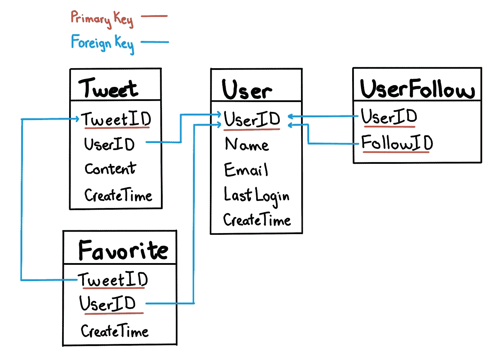

# 完成我对系统设计面试问题的解决方案。

> 原文：<https://levelup.gitconnected.com/work-through-my-solution-to-a-system-design-interview-question-a8ea4b60513b>


图片来自[unsplash.com](https://unsplash.com/)

> TL；博士，*回答一个系统设计面试问题有六个步骤:* 第一步:阐明需求(功能性&非功能性)
> 第二步:定义系统 API
> 第三步:概述高级系统设计
> 第四步:讨论数据库&存储层
> 第五步:讨论核心组件
> 第六步:添加高可用性注意事项并完成设计。

这篇博客是我的“[大型科技公司黑客技术面试 15 天备忘单](https://medium.com/@nhudinhtuan/15-days-cheat-sheet-for-hacking-technical-interviews-at-big-tech-companies-d780717dcec1)”的一部分。在这篇博客中，我们着重于一步一步地解决一个系统设计面试问题。

系统设计面试的目的是评估候选人在设计大型分布式系统方面的经验。应聘者在面试中的表现往往决定了他们的招聘水平。这些面试中的表现通常取决于两个因素:候选人的知识(通过学习或实践经验获得)和候选人在整个面试中推动对话的方式。

以下是我通常用来解决系统设计面试问题的步骤，以确保我的回答系统化。为了更好地演示，我选择了一个常见的面试问题 ***“设计一个类似 Twitter 的社交网络服务”*** ，并展示了如何应用每个步骤来回答这个问题。

# 一般提示:

*   在整个部分中，候选人应该掌握主动权并领导讨论。因此，你应该主动传递信息，并向面试官澄清他们希望你进一步发展的方向。
*   由于系统设计面试问题是开放式和非结构化的，所以用清晰的计划组织他们的解决方案并证明选择的合理性的候选人有更大的成功机会。

# **第一步:需求澄清**

由于给定的问题是模糊的，不可能在 40 分钟内设计出一个涵盖所有角度的系统，你首先应该做的是澄清面试官心目中问题的确切范围。

在*“设计一个类似 Twitter 的社交网络服务”的例子中，*我会问面试官以下问题来阐明需求。

**功能需求:**

*   用户应该能够注册帐户、删除帐户和恢复密码吗？
*   用户应该能够发布新的推文，删除现有的推文，并将推文标记为收藏夹吗？
*   用户应该能够评论推文和回复评论吗？
*   推文应该包含照片、视频、url 链接吗？
*   用户应该能够关注他们的朋友和名人吗？
*   系统应该创建并显示由用户关注的所有人的热门推文组成的时间线吗？
*   系统应该通知用户关注者的新推文吗？
*   系统应该建议用户关注谁吗？
*   用户应该能够运行广告来推广他们的推文吗？
*   系统是否应该过滤违规的推文(比如色情和垃圾邮件)？

根据面试官的目标，要求可能会有不同的方向。对于类似 Twitter 的服务，大多数面试官希望看到:

*   用户应该能够发布新的推文，关注人们。
*   用户应该通过手机应用程序或电子邮件收到关注者的新推文通知。
*   时间线是基于追随者的活动生成的。

**非功能性需求:**

你应该总是假设一个大规模的分布式系统处理成千上万的并发请求，请求延迟低，系统需要大容量存储。您不需要进行非常详细的计算，但对数据大小的大致了解，每秒请求数(rps)对设计决策起着重要作用。您可以从一些假设开始，例如:

*   总用户数为 10 亿，日活跃用户数为 2 亿。
*   1 个用户每天发布 1 条推文并查看 100 条推文。
*   1 条推文最多包含 140 个字符。平均大小为 0.3KB(每个字符两个字节+元数据，例如时间戳、用户 id..)
*   20%的推文包含照片(平均大小为 200KB)，10%的推文包含视频(平均大小为 2MB)。
*   一个名人可能有 1 亿粉丝。
*   时间线的检索应该和其他请求一样快。(延迟小于 200 毫秒)
*   服务具有高可用性。

所有的假设都需要和你的面试官澄清，以确保你们双方都有相同的想法。之后，您需要根据假设计算使用量。

**存储估计:**

*   每天的新推文:2 亿条* 1 = 2 亿条
*   一条推文的平均大小:0.3KB + 20%*200KB + 10%*2MB = 250KB
*   每天存储:200M * 250KB ~= 50 TB /天(5 年约为 91250 TB)
*   在内存中保留 20%的每日数据进行缓存:~= 50TB * 0.2 = 10TB

**带宽估计:**

*   写带宽:每天 50TB ~ = 500 MB/秒
*   读取带宽:~ = 100 倍写入访问~ = 50GB/秒

**流量估算:**

*   写 rps: 200M /天~ = 2.3k/秒
*   读取 RPS:~ = 100 倍读取 RPS ~ = 230k/秒

# 步骤 2:系统 API

当需求明确时，最好定义显示客户端如何与系统对话的系统 API。您可以为您的 API 使用 SOAP、REST APIs 或 Graph APIs。以下是类似 Twitter 服务的 RESTful APIs 示例:

```
**GET /api/users/<username>
GET /api/users/<username>/tweets?page=1&per_page=30
GET /api/users/<username>/followers?page=1&per_page=30
GET /api/users/<username>/followees?page=1&per_page=30
POST /api/users/<username>/tweets
POST /api/users/<username>/followers**
```

面试官可能对这部分感兴趣，会问你处理分页的方式，无限滚动支持。在这篇博客中，我不会详细介绍这一点。

# 步骤 3:高级系统设计

在此步骤中，您将绘制主要组件以及它们之间的连接。在高层次上，系统需要多个应用服务器来服务客户端请求，在它们前面有负载平衡器来分配流量。在后端，它需要能够高效存储数据的数据库服务器。在类似 Twitter 的服务中，对象文件存储对于存储照片和视频也是必要的。


# 第 4 步:数据库和存储

在这一步，您将详细了解系统需要存储哪些信息，以及您希望选择哪种类型的数据库来存储不同类型的数据。

在类似 Twitter 服务的情况下，系统需要存储关于用户、他们的推文、他们最喜欢的推文以及他们关注的人的数据。



**SQL vs NoSQL 数据库**

由于我们的数据对象——用户和 tweets 之间存在一些关系，存储它们的直接方法是使用 MySQL 这样的关系数据库。然而，我们需要处理 2.3k rps 写访问和 230k 读访问，性能将是 SQL 数据库的一个问题。

一种选择是将上述模式存储在分布式键值存储中，以享受 NoSQL 提供的好处(比如 db 级分片)。对于用户和关注者之间的关系，我们可以使用像 [Cassandra](http://cassandra.apache.org/) 这样的宽列数据存储来保存信息,“键”是“用户 ID”,“值”是存储在不同列中的“关注者”列表。这种选择的缺点是难以处理复杂的关系查询，存储冗余数据并且比关系数据库更昂贵。

另一种选择是继续使用关系数据库，并添加数据分片逻辑层以及数据缓存。一些著名的公司，如 Twitter 和脸书，设法使用关系数据库来处理比我们在这个问题中遇到的更大的负载。

**数据分片**

由于我们每天都有大量的新推文，我们的负载非常高，一台数据库服务器无法处理它们，我们需要将数据分布到多台机器上，以便高效地读取/写入数据。有一些分割数据的选项:

*   **基于用户标识的分片:**基于散列用户标识，我们将每个用户映射到一个服务器，在那里存储用户的所有推文、收藏夹、关注等。如果用户(如名人)很热门，这种方法就不能很好地工作，我们最终会在一组服务器上拥有比其他服务器更多的数据和访问。
*   **基于 TweetID 的分片**:基于 TweetID，我们将每条 tweet 映射到一个存储 tweet 信息的服务器。要搜索 tweet，我们必须查询所有服务器，每个服务器都会返回一组 tweet。这种方法解决了热用户的问题，但是增加了延迟，因为我们需要查询所有服务器。
*   **基于 TweetID 的分片&创建时间:**基于创建时间生成 TweetId(比如一个 64 位无符号整数的 TweetID，它有两部分，前 32 位是 unix 时间戳，后 32 位是自动递增序列)。然后，我们基于 TweetId 对数据库进行分片。这种方法类似于第二种方法，我们仍然需要查询所有服务器来搜索 tweets。然而，延迟得到了改善，因为在按创建时间对 tweets 进行排序时，我们不需要单独的时间戳索引(我们可以只基于主键 TweetId)。

**数据库复制**

由于类似 Twitter 的服务是一个读取量很大的系统，所以我们应该为每个数据库碎片设置多个辅助数据库服务器(从服务器)。辅助服务器仅用于读取流量。所有写流量都流向主服务器，然后被复制到辅助服务器。

**数据缓存**

23 万 rps 的读访问是一个非常大的规模，除了复制，我们应该通过在数据库服务器前引入数据代理来缓存热门推文和用户来进一步降低延迟。应用服务器从数据代理查询数据，数据代理在访问数据库之前快速检查缓存中是否有想要的 tweets。

*   **缓存大小:**每日数据的 20%(10TB)是一个很好的起点。当缓存已满，我们希望用更新/更热门的推文替换一条推文时，因此最近最少使用(LRU)是该系统的合理策略。
*   **缓存失效:**我们可以监控数据库中的变化(比如读取 mysql bin 日志)，将变化放入一个消息队列中，设计一个服务来拾取队列消息并清空相关的数据缓存。例如，当 UserId 1234 的用户更改其昵称时，清除所有带有前缀 *uid_1234_** 的缓存。更新可能会有短暂的延迟，但大多数情况下不会有问题。


**对象数据**

推文可能包含媒体(照片和视频)。虽然元数据可以保存在数据库中，但应使用[分布式对象存储](https://en.wikipedia.org/wiki/Object_storage)(如 HDFS 或 S3)来存储照片和视频内容。

# 步骤 5:核心组件讨论

在这一步，您应该挑选一两个关键组件来详细讨论设计。对于类似 Twitter 的服务，有推文管理服务、时间线服务、通知服务……你应该和面试官讨论他们关心哪些组件，不关心哪些组件。出于演示的目的，我选择了时间轴服务。

**时间线生成:**

在一个简单的例子中，时间线应该包含所有追随者的最新帖子。为有很多关注者的用户生成时间线会非常慢，因为系统必须对大量的推文进行查询/合并/排序。因此，系统应该预先生成时间线，而不是在用户加载页面时生成。

应该有专门的服务器不断生成用户的时间表，并将其存储在内存中。每当用户加载应用程序时，系统可以简单地从缓存中提供预先生成的时间线。使用这种方案，用户的时间线不是在加载时编译，而是定期编译，并在用户请求时返回给用户。

对于 10 亿用户，如果我们预先生成他们所有人的时间表，系统需要巨大的内存。此外，通常有很多用户不经常登录，为他们预先生成时间表是一种浪费。改进的一个方法是根据用户的行为和历史日志预先生成时间线。我们可以建立一个简单的机器学习模型来找出用户的登录模式，并预先生成他们的时间表。

**时间线更新:**

如果系统对所有用户一视同仁，那么用户的时间线生成间隔将会很长，并且他的新帖子时间线将会有巨大的延迟。改善这种情况的一个方法是优先考虑有新更新的用户。新推文被添加到消息队列中，时间线生成器服务从队列中提取消息，并为所有关注者重新生成时间线。


**新帖子通知:**向用户发布新帖子有不同的选项。

*   拉模型:客户端可以定期或在需要时手动拉数据。这种方法的问题是更新延迟，因为新信息直到客户端发出拉请求时才会显示。此外，大多数时候拉请求会导致一个空响应，因为没有新的数据，这导致了资源的浪费。
*   推送模式:一旦用户发布了一条推文，系统可以立即向所有关注者推送通知。这种方法的一个可能的问题是，当一个用户有数百万的追随者时，服务器必须同时向许多人推送更新。
*   混合模式:我们可以将拉模式和推模式结合起来。该系统只为那些拥有数百(或数千)名追随者的人推送数据。对于名人，我们可以让关注者拉更新。

# 步骤 6:其他注意事项

在这一步中，您应该检查整个设计并讨论一些潜在的改进。

**DNS:** 应用服务器的实例可能位于不同物理位置的不同数据中心。我们可以添加基于地理位置的策略 DNS，为客户端提供一个物理位置更靠近客户端的服务器 IP 地址。

**CDN:** 内容交付网络(CDN)是代理服务器的全球分布式网络，从更靠近用户的位置提供内容。我们可以通过 CDN 提供 tweet 媒体内容，以改善用户体验。

**可靠性和冗余度:**

我们需要确保服务中没有数据丢失。因此，我们需要存储每个文件的多个副本，这样，如果一个存储服务器出现故障，我们可以从另一个存储服务器上的另一个副本中检索它。同样的原理也可以应用到其他部分。我们可以在系统中运行服务的多个副本，因此，如果一些服务停止运行，系统仍然保持可用和运行。如果在任何时候只需要运行一个服务实例，我们可以运行服务的冗余辅助副本，该副本不为任何流量提供服务，但当主副本出现问题时，它可以在故障转移后接管控制权。

**最终设计**


# 参考资料:

1.  [钻研系统设计面试](https://www.educative.io/courses/grokking-the-system-design-interview)