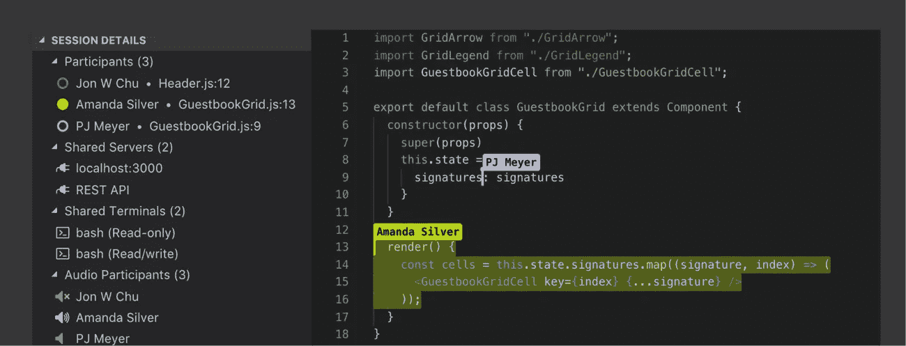
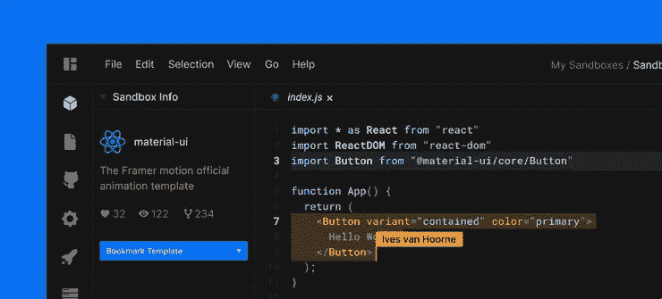

# 呆在家里与你的程序员同事一起工作

> 原文：<https://levelup.gitconnected.com/work-with-your-fellow-programmers-while-staying-at-home-b5596418f689>

## 熟悉协作编码工具和技巧，以便在这段隔离时间内缓解您的编程困难。

在 [Unsplash](https://unsplash.com/t/work-from-home?utm_source=unsplash&utm_medium=referral&utm_content=creditCopyText) 上由 [Austin Distel](https://unsplash.com/@austindistel?utm_source=unsplash&utm_medium=referral&utm_content=creditCopyText) 拍摄的照片

在这个密集编程的时代，交流是开发人员共同努力实现项目成功的基础，软件开发的共生性从未如此明显。然而，随着新冠肺炎病毒的传播，大多数软件开发团队现在被分散并隔离在家中工作。

远程结对编程允许团队保持高度的凝聚力，同时允许他们与新技术进行交互，并开发可以在未来很好使用的实用技能。当人们遵守强制隔离令时，团队需要仔细考虑如何保持合规和相互联系。

*   报道的调查表明，超过 90%的程序员更喜欢结对编程，而不是单独工作。

*   它将帮助开发人员更快地将想法交付到实现阶段

# 您可以使用的前 3 对编程工具

## [Visual Studio 现场分享](https://visualstudio.microsoft.com/services/live-share/)

Visual Studio 实时共享

Live Share 为您提供了共同编辑、共同调试、音频通话、与同行聊天、共享终端、服务器、查看评论等功能。你不需要改变你的工作方式来和别人一起工作。实时共享可满足您和您团队的所有需求

## [原子的电传打字(Beta)](https://teletype.atom.io/#getting-started)

原子电传打字机

Teletype 为共享工作区引入了**实时“门户”**的概念。当主持人打开门户时，他们的活动选项卡将成为共享工作空间。在那里，被邀请的合作者可以加入并实时编辑。当主持人在文件之间移动时，协作者会自动跟随活动选项卡。

## [CodeSandBox](https://codesandbox.io/docs/live)

CodeSandBox

CodeSandbox 上的所有沙盒都是活动的，这意味着您可以与其他人共享您的沙盒，以便就代码进行实时协作。您可以在沙盒中与其他人同时创建、删除、编辑和移动文件和代码，并谈论您的更改。这就像谷歌文档，但编码。

# 有效远程结对编程的技巧

*   使用配对编程技术，如驱动程序/导航程序
*   提出问题，而不是用观点来引导
*   避免打断他人
*   如果你有更好的方法或解决方案，就教他们
*   不要羞于寻求帮助
*   休息一下，你不是一个人在工作

我希望你会发现它们有用！如果你有自己的建议，请在下面的评论中分享。注意安全！