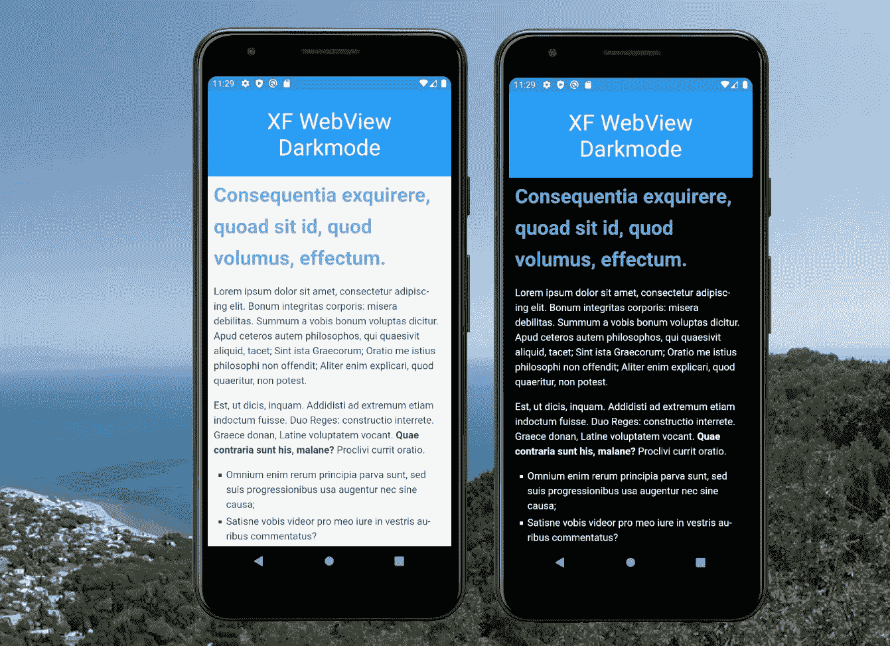
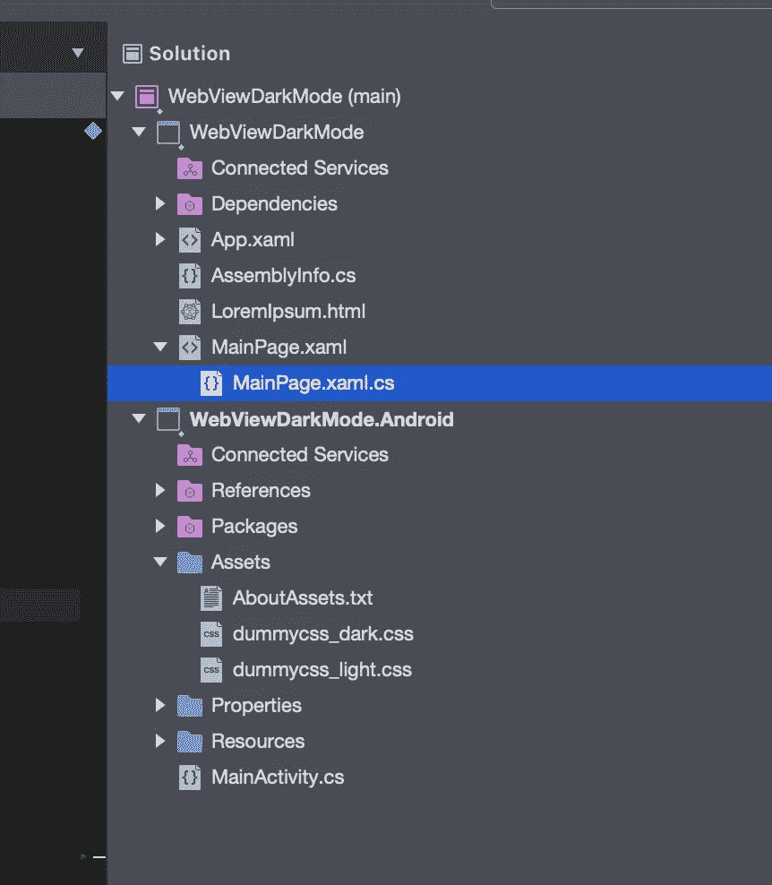

# 强制 Xamarin 的解决方法。表单 WebView 为 Android 上的本地内容使用黑暗模式 CSS

> 原文：<https://levelup.gitconnected.com/workaround-to-force-xamarin-forms-webview-to-use-a-dark-mode-css-for-local-content-on-android-41e18c513bb5>



最近我更新了我的博客阅读器应用程序，以支持黑暗模式较新的 iOS 和 Android 版本的支持。虽然在 iOS 上一切都很顺利，更新已经在 App Store 上发布，但我在 Android 上还有一些工作要做。一个更大的问题:我用来查看帖子的`WebView`没有自动切换到`Xamarin.Forms`的黑暗模式。

## 是什么导致了这个问题？

部分问题在于`WebView`不支持 CSS 查询`prefers-color-scheme`。然而，这在 iOS 上可以正常工作，并且是 Android 特有的问题。你可以[参考 Github 上`Xamarin.Forms`库的这个问题](https://github.com/xamarin/Xamarin.Forms/issues/12551)。

## 工作区

我不确定这个问题是否会被`Xamarin.Forms`团队解决。我尝试使用一些在网络上流行的 Javascript 解决方案来保存一个 CSS 文件。然而最后，我遵循[亲吻原则](https://en.wikipedia.org/wiki/KISS_principle)选择了一种只有`Xamarin.Forms`的方法。

`Xamarin.Forms`有一个工作的[主题检测机制](https://docs.microsoft.com/en-us/xamarin/xamarin-forms/user-interface/theming/system-theme-changes)。基于`Application.Current.RequestedTheme`属性的返回值，我要么加载黑暗模式 CSS 文件，要么加载光明模式 CSS 文件(在我的例子中是默认的)。

运送 CSS 文件很容易，我们只需要将它们添加到 Assets 文件夹，并将构建动作设置为`AndroidAsset`。这导致了 Android 项目中的以下结构:



以这种方式提供的所有文件都可以通过`android_asset`文件 uri 进行访问:

```
<link rel="stylesheet" href="file:///android_asset/dummycss_light.css">
```

现在一切都在 Android 项目中设置好了，让我们转向`Xamarin.Forms`项目。在本文的示例中，我加载了一个本地 html 文件，同时在我的博客阅读器应用程序中动态生成 html。这种想法在两种情况下都是一样的:

```
private async Task SetThemeAndLoadSource()
{
    _html = await LoadHtmlFromFileAsync();

    _html = Application.Current.RequestedTheme == OSAppTheme.Dark ?
            _html.Replace("light", "dark") :
            _html.Replace("dark", "light");

    this.TestWebView.Source = new HtmlWebViewSource() { Html = _html };
}
```

如你所见，我只是覆盖了加载到 HTML 中的 CSS 文件名的明暗部分。这就是这里需要发生的所有“魔法”。还有一点需要补充的是——如果用户在应用程序运行时改变了主题，该怎么办？`Xamarin.Forms`也内置了解决方案——只需处理`RequestedThemeChanged`事件并再次覆盖文件名，然后再次设置`HtmlWebViewSource`:

```
private async void Current_RequestedThemeChanged(object sender, AppThemeChangedEventArgs e)
{
    await SetThemeAndLoadSource();
}
```

## 结论

正如我们大多数人已经习惯的那样，我们有时需要在处理`Xamarin.Forms`时找到一些变通办法。虽然这个问题也可以用一个`WebViewRenderer`中的一堆 Javascript 和一个自定义 CSS 来解决(我试过，但不喜欢它的复杂性)，但是你可以用上面的解决方法在`Xamarin.Forms`中获得可靠的结果。

你可以在 Github 上找到一个可用的[示例。一如既往，我希望这篇文章对你们中的一些人有所帮助。](https://github.com/MSicc/XFWebviewDarkmode)

直到下一个帖子，大家编码快乐！

*原载于 2021 年 4 月 6 日 https://msicc.net**的* [*。*](https://msicc.net/workaround-to-force-xamarin-forms-webview-to-use-a-dark-mode-css-for-local-content-on-android/)