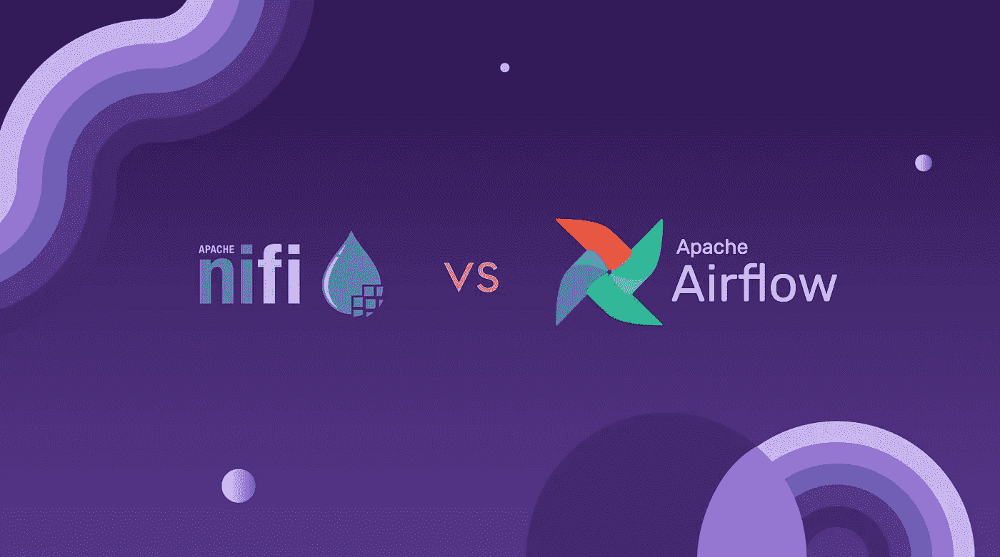
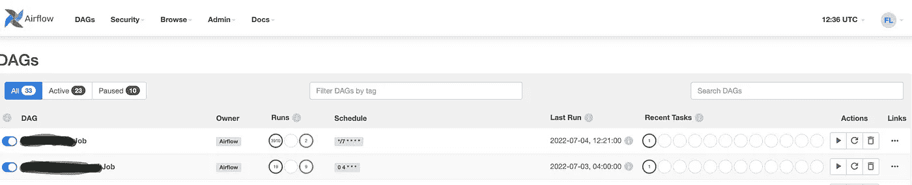
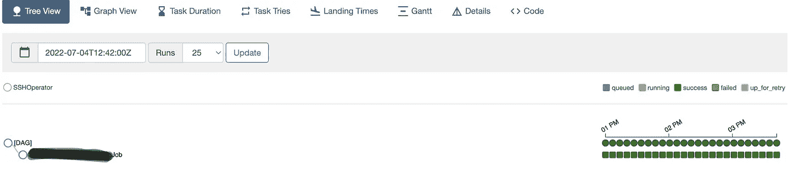
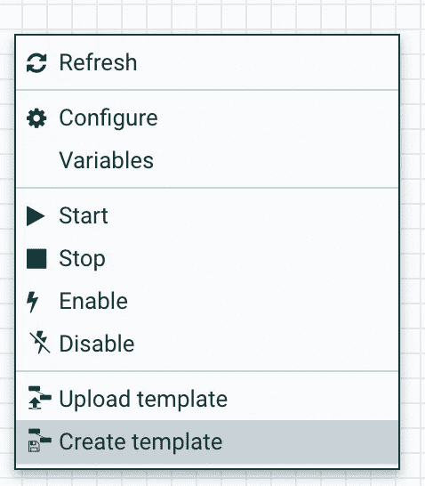
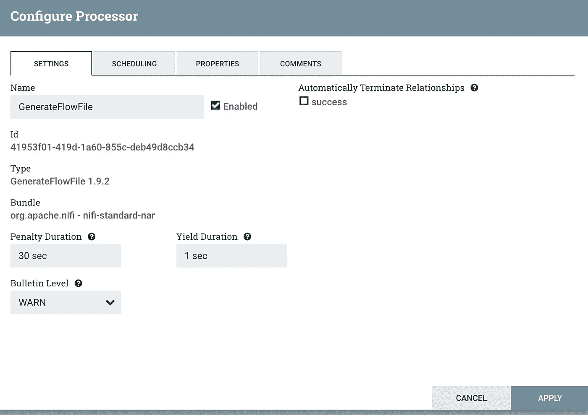
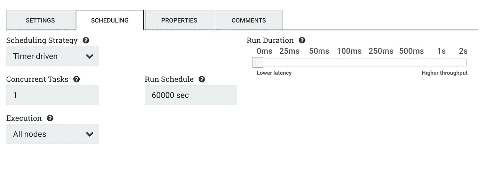
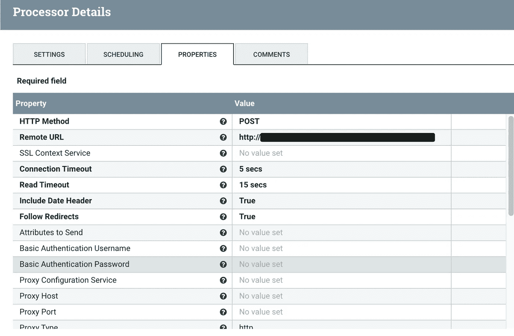
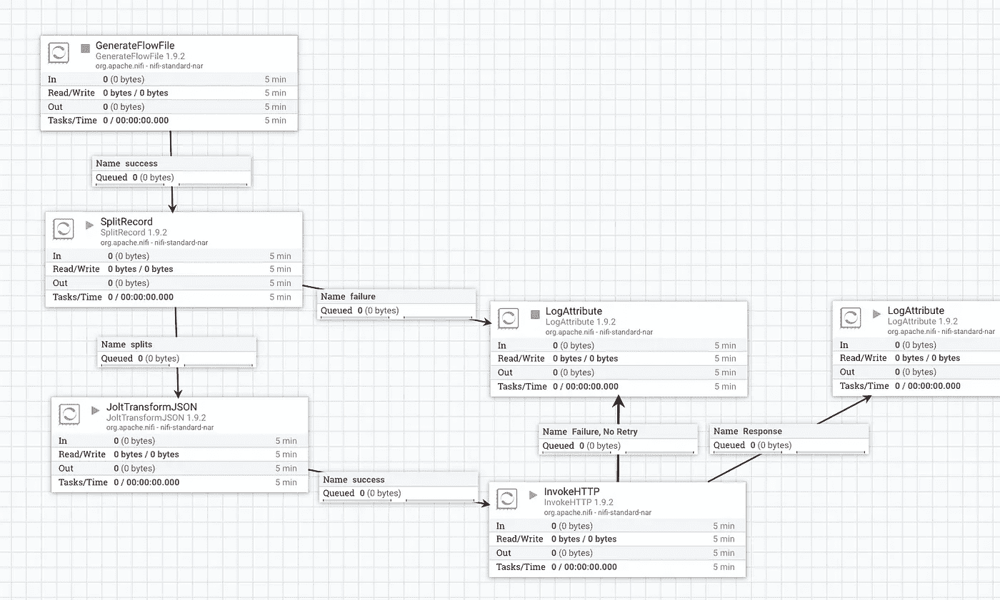

# 工作流(作业)管理工具:Airflow 和 Nifi

> 原文：<https://levelup.gitconnected.com/workflow-job-management-tools-airflow-and-nifi-bc9c0f663054>

图片来源:[https://www.astronomer.io/blog/apache-nifi-vs-airflow/](https://www.astronomer.io/blog/apache-nifi-vs-airflow/)

对于一些批量操作、定期数据更新或其他原因，我们需要计划的任务/作业。如果你在金融部门工作，你会非常熟悉这些流程，比如下班、发工资等。此外，您熟悉它们，它们都是预定的，有特定的时间，当时间到了，它们就会执行。

好吧，我们该怎么做呢？一些工具可以让我们计划、执行和监控我们的工作流程/工作。今天我将提到其中的两个，分别是气流和 Nifi。

气流和 Nifi 是由 Apache 软件基金会开发的。我不会解释它们的特性和功能。如果你想了解更多信息，请点击这里:[气流](https://airflow.apache.org/)， [Nifi](https://nifi.apache.org/)

我想提供我们如何使用配置和截图来满足我们的需求。

# **气流**

首先，我想谈谈一些气流特征，以及我们如何编写脚本。

**DAGs***

在 Airflow 中，一个`DAG`——或者一个有向无环图——是你想要运行的所有任务的集合，以反映它们的关系和依赖的方式组织。

DAG 是在 Python 脚本中定义的，它将 DAG 结构(任务及其依赖项)表示为代码。

**args**:start _ date、owner info、call_back 情况等一些参数。

**dag:** 创建一个 dag，其中包含 id、执行参数、schedule_interval 等信息**。**

我用 schedule_interval="0 0 1 * * "设置了工资支付作业，用于在每月 1 日的 00:00 执行*。关于 schedule_interval 结构的详细信息，可以查看 crontab 网站* [*这里*](https://crontab.guru/#0_0_1_*_*)

**spark_job** :给定一些关于执行环境、jar 位置、class_name 等等的信息。

这个例子在依赖 jar 的情况下执行，但是如果我们可以直接调用 restful API 的话。详情[此处](https://airflow.apache.org/docs/apache-airflow/stable/stable-rest-api-ref.html)。

在开发和部署之后，您可以在气流页面上找到所有 dag 列表。页面上有一些功能，例如:

*   您可以按标签过滤 Dag 或搜索您想要查找的任何 Dag。
*   上次运行信息
*   成功和失败运行总数
*   规定时间
*   最近的任务
*   动作有*开始*、*重新运行、*和*删除*。

气流 UI 上的 DAGs

以下屏幕是由 UI 详细页面拍摄的。您可以重新运行、删除、停止或清理 DAG 作业。此外，你可以看到最后运行。屏幕截图显示的是最近 25 次跑步，但你可以将其更改为 365 次跑步或给出不同的时间。除此之外，您可以在之前开发的代码选项卡中看到您的 python 脚本代码。

DAG 详细用户界面

# **尼菲**

没有 Nifi 的代码。在页面上用*【创建模板】*即可创建，如:

还有，在页面上；

*   您可以更改设置，

*   调度时间和策略，

*   和属性。

在这个例子中，我们执行一个 RestfulAPI，因此我们用所需的参数来配置它。

除此之外，如果你有不同的相互关联的工作，那么你可以把它们相互联系起来。

总之，

你有不同的工具来执行你的任务/工作流程/工作。我们同时使用 Nifi 和气流。与 Nifi 相比，Airflow UI 提供了更多的功能和灵活性。顺便说一下，我们有一个完全迁移到气流的计划。

感谢阅读，

希望有帮助…

参考资料:

 [## 主页

### 没有更多的命令行或 XML 魔术！使用标准 Python 功能创建工作流，包括日期时间…

airflow.apache.org](https://airflow.apache.org/)  [## 概念-气流文件

### Airflow 平台是一个用于描述、执行和监控工作流的工具。在气流中，DAG -或定向…

airflow.apache.org](https://airflow.apache.org/docs/apache-airflow/1.10.12/concepts.html)  [## 气流休息 API

### 编辑描述

airflow.apache.org](https://airflow.apache.org/docs/apache-airflow/stable/stable-rest-api-ref.html)  [## 阿帕奇尼菲

### Apache NiFi 支持强大且可伸缩的数据路由、转换和系统中介逻辑的有向图。

nifi.apache.org](https://nifi.apache.org/)  [## crontab . guru——cron 调度表达式编辑器

### cron 调度表达式的快速简单的编辑器我们创建了 Cronitor，因为 cron 本身不能…

crontab.guru](https://crontab.guru/#0_0_1_*_*)