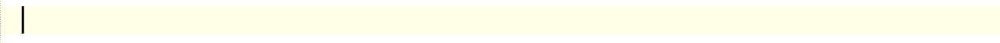

# 工作自动化测试≠良好可靠的测试

> 原文：<https://levelup.gitconnected.com/working-automated-test-good-reliable-test-fe487896cdbe>

## 一个展示低质量和不可靠的自动化测试脚本中常见错误的案例研究。开发一个有效的自动化 UI 测试是不够的。


我十几岁的女儿考特尼在大学放假期间申请了一份临时程序员的工作。面试前(通过 Zoom)，我建议:“*你还有几分钟，为什么不针对公司网站写一个自动化测试？如果他们问起你的测试自动化技能*，你也许可以向他们展示一些相关的东西。她做到了。

在看她写测试的时候，我很高兴她大部分都做得很好，尽管在一些地方需要改进。我发现这实际上是一个很好的案例研究，来说明测试自动化中的一个关键概念:**一个工作测试≠一个好的测试**。

任何人(6 岁以上)都可以在使用记录器时产生一个简单的工作自动化测试。在那个时候它可能会工作，但是在这些条件下它会可靠地工作吗？

*   不同的运行条件，例如，在具有不同屏幕分辨率的另一台机器上
*   一个新的构建，可能会改变一些动态生成的 id
*   影响网页布局的用户界面更改
*   被运行多次

在创建时创建高度可靠的自动化测试脚本的能力将好的测试集(*罕见的*)从平庸的测试集中分离出来。

女儿选择写的测试是“提交查询表”，很常见的一种。


## 1.找到一个更可靠的定位器，以避免只在这个版本上工作

第一个操作是输入名字，其 HTML 如下:


考特尼和我一样，知道测试记录器，但很少使用它们。测试记录器可能会生成工作正常但不良的测试语句:

```
driver.find_element(:id, "firstname-95290f03-f944-4891-86ac-955c7ff63917").send_keys("Wise")
```

原因很简单，在下一次构建时，它的 ID 可能会改变。考特尼选择了`name`定位器，这种情况下最可靠的定位器。

```
driver.find_element(:name, "firstname").send_keys("Wise")
```

好多了。

这里有一个关于效率的注释。她在 TestWise *(你可以在代码 ide 中找到类似的特性)*中使用[片段有效地输入了测试脚本。](http://testwisely.com/testwise/docs/productivity#snippets)



'定义'，Tab，粘贴复制的元素名称，Tab，键入' sk '，Tab，输入' Wise '，Tab

如果你对 Courtney 如何开发自动化测试感兴趣(从她 12 岁开始)，请阅读她的文章:“[设置、开发自动化 UI 测试，并在第一天工作时在 CT 服务器上运行它们](https://zhiminzhan.medium.com/set-up-develop-automated-ui-tests-and-run-them-in-a-ct-server-on-your-first-day-at-work-bd7110c9f677)”。

## 2.使用动态数据避免一次工作

接下来的两个操作是输入“姓氏”和“电子邮件”。没有经验的测试人员会填写一些简单的测试数据。

```
driver.find_element(:name, "lastname").send_keys("Tester")
driver.find_element(:name, "email").send_keys("[a@b.com](mailto:a@b.com)")
```

会有用的。但是如果服务器对唯一性进行了验证，它将在下一次执行时失败。

更好的方法是使用动态数据，比如 [Faker](https://github.com/faker-ruby/faker) 。

```
driver.find_element(:name, "lastname").send_keys(Faker::Name.last_name)
driver.find_element(:name, "email").send_keys(Faker::Internet.email)
```

## 3.间歇性故障:“无法点击‘提交’按钮”

她的测试失败了。当她调试测试步骤时，有时它会通过。


考特尼困惑了一段时间，我想她应该更清楚这一点。由于时间紧迫(为了她即将到来的面试)，我给了她一个提示。

原因是:“提交”按钮的位置正好在浏览器底部边框的边缘，Selenium 可能认为它是“**不可点击的”**。

> 注意:在大多数情况下，Selenium 可以很好地处理点击可见元素的问题，但是也有极端的情况，比如这个例子。在测试我自己用 Ruby on Rails 开发的应用程序时，我从未遇到过这种情况，但偶尔会遇到其他应用程序。我认为这与使用 JavaScript 和 CSS 的方式有关。

一个简单的验证是滚动浏览器窗口，然后重新运行 *click_submit_button* 步骤，使用 TestWise 中的[‘针对当前浏览器运行选定的测试步骤’特性](http://testwisely.com/testwise/docs/debugging#run-selected-test-steps)(您可以在本文中看到一个演示视频:[针对现有浏览器](https://python.plainenglish.io/attach-selenium-python-test-steps-against-an-existing-browser-4395fe8a0998)附加 Selenium 测试步骤)。

## 4.最大化窗口——有效，但不好

了解原因后，Courtney 很快想出了一个解决方案:最大化浏览器窗口。

```
driver.manage().window().maximize
sleep 0.5
driver.find_element(:xpath, "//input[[@value](http://twitter.com/value)='Submit']").click
```

它起作用了，但并不理想。当测试在屏幕分辨率较小的构建代理机器上运行时会发生什么？。

> 我经常看到测试脚本默认最大化浏览器，这往往是不必要的。

## 5.滚动浏览器(修复)—工作正常，但仍不完美

听到我的问题(以上)，Courtney 意识到要用滚动。

```
driver.execute_script("window.scrollTo(0, 500);")
sleep 0.5
driver.find_element(:xpath, "//input[[@value](http://twitter.com/value)='Submit']").click
```

她知道固定滚动(*到 500* )是不好的，并计划在面试后改进它。

## 6.滚动浏览器(相对)—很好

她在面试后优化了测试脚本。

```
elem_submit = driver.find_element(:xpath, "//input[[@value](http://twitter.com/value)='Submit']")
elem_sumbit_y = elem_submit.location.y
driver.execute_script("window.scroll(0, #{elem_sumbit_y - 100 })")
sleep 0.5
elem_submit.click
```

现在测试执行非常**可靠**！

注意:以下不适用于此网站。

```
driver.execute_script("arguments[0].scrollIntoView(true);", elem);
```

正如你所看到的，对于一个非常简单的测试，在一个网页上只有 4 个用户操作，可以有几个版本的工作，但不够完美的测试脚本。

一个完整的测试脚本文件(RSpec 中的 Selenium)

想象一下，将 50 个不可靠的自动化测试扔给 CI 服务器去做" [CI/CD](https://zhiminzhan.medium.com/ci-cd-pipeline-clarified-e738abcc7ab) "，获得绿色构建(通过所有测试)的几率会有多大？这就是为什么大多数软件项目在[敏捷持续测试分级](https://zhiminzhan.medium.com/agileway-continuous-testing-grading-f483a870d2e2)中被评为**0 级**或 **1 级**的原因。

此外，上述测试在执行方面是可靠的，但是不容易维护。所以，这个测试脚本还没有完成，Courtney 仍然需要重构它，以增强它的可读性和可维护性。请阅读我的另一篇文章:“[可维护的自动化测试设计](https://zhiminzhan.medium.com/maintainable-automated-test-design-d325dd13b868)”和即将推出的“[功能测试重构](https://zhiminzhan.medium.com/functional-test-refactoring-598872af9d51)”，或者我的书“[实用的 Web 测试自动化](https://leanpub.com/practical-web-test-automation)”。

如果你喜欢阅读这样的故事，并想支持我成为一名作家，可以考虑[注册成为一名媒体会员。每月 5 美元，你可以无限制地阅读媒体上的故事。如果你用我的链接](https://zhiminzhan.medium.com/membership)注册[，我会赚一小笔佣金。](https://zhiminzhan.medium.com/membership)

*相关阅读:*

*   电子书:[使用 Selenium WebDriver 的实用 Web 测试自动化](https://leanpub.com/practical-web-test-automation)
*   电子书:[实用持续测试:让敏捷/开发运维变得真实](https://leanpub.com/practical-continuous-testing)