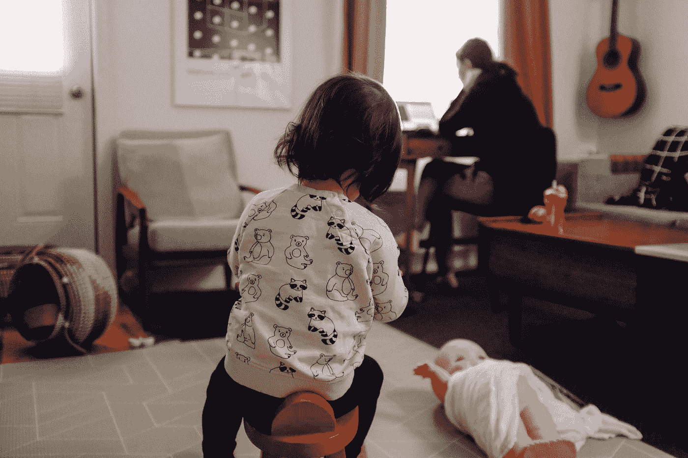

# 在 COVID 下在家工作并不是真正的在家工作

> 原文：<https://levelup.gitconnected.com/working-from-home-under-covid-isnt-really-working-from-home-8706ca908b18>

查尔斯·德鲁维奥在 [Unsplash](https://unsplash.com?utm_source=medium&utm_medium=referral) 上拍摄的照片

我在 IT 行业工作过几种类型的公司，从初创公司到公司企业，他们都声称工作条件“灵活”。就我而言(里程会有所不同)，这从未真正达到预期。

你多少次听到*“是的，你可以在家工作！只要确保你提前让团队知道，并且你的 PO 接受它"*。这是弹性工作制吗？我不这么认为。

## WFH 预 COVID

对我来说，我会安排一天去做我想做的事情。我会清空我的日程表，不参加任何会议。我会醒来，拿起一杯咖啡，在最少干扰的情况下埋头苦干。我不担心公共交通；我有世界上所有的时间！

第二天，我可以大摇大摆地走进办公室，站起来宣布我在家里度过了多么富有成效的一天，当我在棋盘上移动我的卡片时，和 scrum master 打招呼。

听起来不错吧？

## COVID 期间的 WFH

事实证明，我的单身 WFH 日并不适合全职工作。我无法清空我的日程表——如果说有什么不同的话，那就是我的日程安排得更满了！

我的伴侣和女儿现在同时在家。一直都是！必须设定界限，保持期望，但我们都知道家庭生活是不稳定的。公司需要意识到这一点，我认为，我与我目前雇主的个人经历可能是最好的。在团队视频通话中看到孩子、合作伙伴和宠物并不罕见，这种情况被接受到几乎是鼓励的程度，这是很棒的。

> 当每个人都在家工作时，没有人在家工作。

我们都在同样的条件下工作；不同的人在用不同的方式处理它。每个人都必须拨入，视频会议比电话会议好一百万倍——请尽量开着摄像机！将反馈带给团队确实很有帮助。

可能我所面临的最大挑战之一就是设定界限和能够放下工作。我通常会利用通勤时间来做这件事，在上下班的路上听播客或阅读媒体文章。现在，只要走出空房间，走进休息室，就很容易再次收到一封电子邮件。

有些人喜欢这种扩展的 WFH 安排，而有些人绝对受不了。就我个人而言，我真的很享受额外的家庭时间，同时，我也很怀念在城市工作的社交生活。

## 后 COVID 可能会是什么样子

COVID 推出后的计划将很有意思，我们已经证明，当我们都在家工作时，我们可以在家工作，当我们开始回到办公室时，会是什么样子？

办公室里有合适的技术让在家工作的同事参加会议吗？如果您是技术人员，有没有一种数字白板体验可以帮助打破这些障碍？有人知道远程结对编程吗？

我希望我们能够继续以真正灵活的安排开展工作；我相信我们有技术和工具来实现它。一家公司可能需要多投资一点才能达到这一标准，但同时通过维持更小的办公室占地面积来支持更灵活和潜在的远程工作人员，从而节省资金。

就个人而言，这次经历让我和我的家人努力思考工作与生活的平衡，以及我们住在哪里才能支持在城市工作。我们已经决定搬出墨尔本，搬到离维多利亚的冲浪海岸更近的地方，打算用更多的 WFH 日来抵消通勤带来的工作/生活平衡。

约翰·穆切特在 [Unsplash](https://unsplash.com?utm_source=medium&utm_medium=referral) 上拍摄的照片