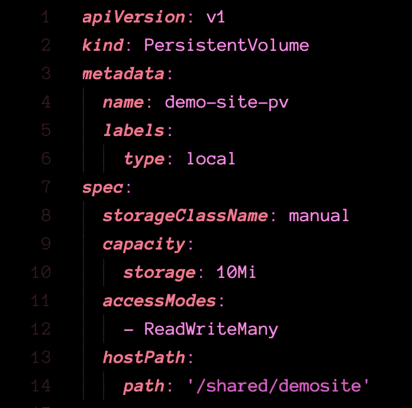
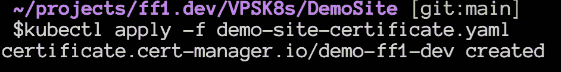
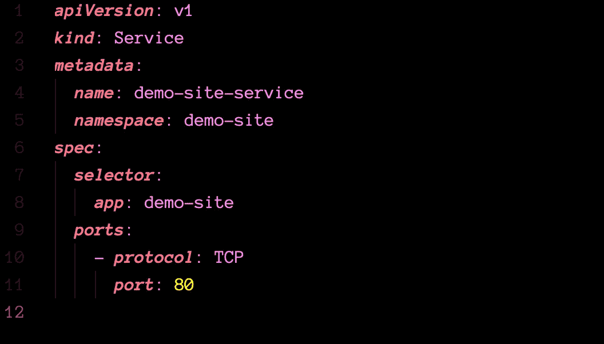
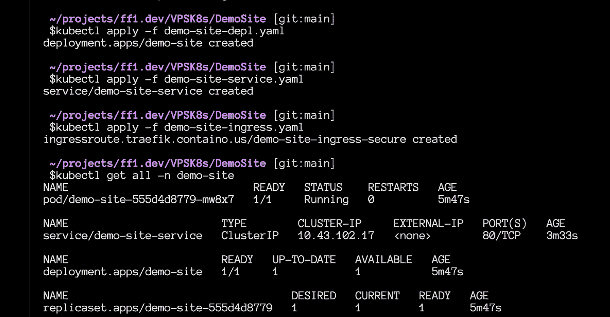

# 为你的个人项目工作，每月 5 欧元

> 原文：<https://levelup.gitconnected.com/working-kubernetes-for-your-personal-projects-for-5-euros-month-badb0d648c2c>

## 如何使用廉价的 VPS 运行单节点 Kubernetes 集群，为您的项目提供足够的资源。


不要误解我，我仍然相信树莓派集群是学习 Kubernetes 最好玩的方式之一。我仍然推荐，如果你想[学习如何用 Kubernetes 创建你自己的集群，你可以点击这个链接](https://medium.com/swlh/yet-another-raspberry-pi-k8s-cluster-ea05fb48e9a8)查看我的第一篇文章。

不过，过一会儿，您会希望将您的 Kubernetes 集群暴露给家庭网络之外的外部世界。

有几种方法可以允许入站连接进入您的本地网络并访问您的家庭实验室，但也有一大串为什么这不是一个好主意的理由。

主要的替代方案是使用云提供商管理的解决方案。AK，EKS，等等。问题是:这些服务对小项目来说太贵了。

一段时间以来，我一直在尝试在一些廉价的虚拟处理器上运行 k8s 集群，今天我将在这里描述我的成功经验。

## 不是所有的 VP 都一样。

除了价格和资源信息(很容易在提供商的页面上找到)之外，还有隐藏的配置和限制，它们可能会破坏您的集群安装。

不幸的是，没有简单的方法来解决这个问题，这个过程更多的是在试错的层面上。

我尝试了 3 个 VPS 服务，价格差不多，只有最后一个创建了 Kubernetes 集群:Contabo。

大约花 7 美元，你就可以得到一个配有 4 个 vCPU、8GB 内存和 50GB NVMe 磁盘的 VPS(可以用同样价格的 200GB 固态硬盘代替)。

有一些缺点，因为服务器在德国(你可以支付额外的费用让服务器在美国)。并且以太网连接对于当前的世界标准(100MB)来说很慢

对我来说，这种权衡行得通，也许对你也适用。

## 选择正确的 Kubernetes 发行版

有几种安装 k8s 的方法，从通过 kubeadm 手动安装到一些“发行版”安装你需要的一切甚至更多。
如果你看了我的文章，你可能已经知道我的选择:K3s。

我真的很喜欢他们所做的，创建一个定制的 Kubernetes 安装 slim，只有你需要的资源，同时足够灵活，如果你想改变部分。牧场主的人真了不起。

我还在这个服务器上成功地测试了 kubeadm 和 microk8s，所以不要担心，其他选项也可以在那里工作。

## 这个计划

这里的最终目标是拥有一个工作的单节点 k8s 集群，带有 cert-manager(使用加密)，一个使用自定义持久卷(主机映射)的简单网站。

要跟进，你只需要一个域名和一台服务器。

让我们开始吧

## 安装 K3s

琐碎的安装在这里，我们使用默认值，包括 Traefik。新的 K3s 现在包括 Traefik 2，所以，没有理由安装没有它，以后再添加。

ssh 登录到您的服务器后，您只需执行以下命令:

```
curl -sfL [https://get.k3s.io](https://get.k3s.io) | sh -
```


K3s 安装

在离开 ssh 之前，我们只需要复制 Kubernetes 配置，然后就可以通过 kubectl 远程访问它

K3 安装将配置存储在/etc/rancher/k3s 文件夹中。

让我们检查一下:

```
cat /etc/rancher/k3s/k3s.yaml
```

如果您的本地机器中没有任何其他的 Kubernetes 配置，那么您只需要将它复制到您的~/中。kube 文件夹将服务器地址从 127.0.0.1 更改为您的 VPS IP。

如果您的本地机器中已经有一个 k8s 配置，您需要手动将这个配置文件中的值复制到右边，或者您可以使用我在这里描述的命令。

最后一件事，在退出 ssh 终端之前，确保创建共享文件夹:/shared/demosite，并在那里放一些 index.html。可能是由以下命令创建的单个文本:

```
sudo mkdir /shared/demosite
echo "demosite, testing..." > /shared/demosite/index.html
```

现在，为了测试集群配置，退出 ssh 连接并从本地机器上运行 kubectl get nodes


kubectl 获取节点

## 持久卷

这在这里并不必要，但是因为您将来在任何严肃的工作中都需要它，所以让我们将其配置为“概念验证”

要在 Kubernetes 中使用卷，您需要 2 个配置:持久卷和声明(PVC)。在更高级的情况下，您可以使用存储类来提交您的申请并自动创建 PV。我在关于 NFS 配置的文章中解释了更多，你可以在这里看到它[。](/how-to-use-nfs-in-kubernetes-cluster-storage-class-ed1179a83817)

本文使用的所有 YAML 文件都可以在 GitHub 中找到:【https://github.com/fabiofernandesx/VPS-K8s】T4

让我们从名称空间开始，将所有内容隔离在特定的名称空间中总是一个好的做法，这样更有条理，而且只需一个命令就可以非常容易地删除所有内容。


命名空间 yaml


命名空间

然后让我们创建 PV



演示网站 pv.yaml


聚氯乙烯呢


演示网站-pvc.yaml


检查是否所有的东西都在那里并且在这里完成。


## 办理证件

部署我们网站前的最后一步。我想带着专业的感觉部署它，而且，现在没有理由部署任何没有安全性的东西。

我们将在这里使用 let's encrypt，但是我将在我们的集群中安装一个 CertManager 服务，而不是直接使用它。这样做有一些好处，但其中之一是您的证书作为机密存储在集群中，而不是存储在本地磁盘中。

那么，我们开始吧。

我将直接从 GitHub 的项目中应用 YAML，这取决于您何时阅读它，版本可能会有所不同:

```
kubectl apply -f https://github.com/jetstack/cert-manager/releases/download/v1.6.1/cert-manager.yaml
```

这将在我们的集群中创建一些东西，请耐心等待，等待一切完成后再继续。


您可以使用以下命令检查一切是否都在运行:

```
kubectl get all -n cert-manager
```


下一步是告诉 CertManager 我们希望使用 Let's Encrypt 来生成证书。为此，我们需要在集群中创建一个不同的对象，即 ClusterIssuer:


在这个文件中，您唯一需要更改的是“让我们加密”的电子邮件，其他的都准备好了。


您可以使用以下命令验证发行者:

```
kubectl get clusterissuers
```

现在，让我们为我们的演示站点创建一个证书

为了让它工作，你需要你的域名指向你的 VPS IP，理想情况下，任何子域都应该重定向到这个 IP。

我将在这里使用我的开发域(ff1.dev ),并仅为这个示例创建一个子域(https://demo.ff1.dev)

这是 YAML 的档案:


同样，在应用此配置之前，请等待您的域/子域指向 VPS IP 地址。



您可以使用下面的命令检查证书(就绪状态应该从 False 变为 True):

```
kubectl get certificates -n demo-site
```


## 部署网站

最后，准备好持久性卷和证书，让我们部署我们的网站。为此，我们需要再应用 3 个文件:

*   部署
*   服务
*   进入

让我们从部署文件开始


这里没有什么特别的，一个使用我们之前创建的持久卷声明的 Nginx 容器的一个副本的部署配置。

服务文件，再一次，没有什么特别的，普通的和旧的 TCP 服务到我们的集群:



最后是入口文件来完成所有的工作。小心主机名中的`(反斜杠),它不是单引号


应用一切并验证它是否运行无误:



就是这样…您的网站应该可以通过浏览器访问:

