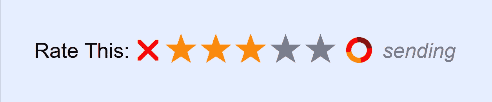

# 首先在没有 JavaScript 的情况下工作可选择的“评级星”,然后用脚本增强它。

> 原文：<https://levelup.gitconnected.com/working-selectable-rating-stars-without-javascript-first-then-enhance-it-with-scripting-f9d61876c850>



在 <fieldset>
<legend>Rate This:</legend>
<input type="radio" name="rating" id="toggle_rating_5" value="5">
<label for="toggle_rating_5">
<span>5 Stars</span>
</label><br>
<input type="radio" name="rating" id="toggle_rating_4" value="4">
<label for="toggle_rating_4">
<span>4 Stars</span>
</label><br>
<input type="radio" name="rating" id="toggle_rating_3" value="3">
<label for="toggle_rating_3">
<span>3 Stars</span>
</label><br>
<input type="radio" name="rating" id="toggle_rating_2" value="2">
<label for="toggle_rating_2">
<span>2 Stars</span>
</label><br>
<input type="radio" name="rating" id="toggle_rating_1" value="1">
<label for="toggle_rating_1">
<span>1 Stars</span>
</label><br>
<input type="radio" name="rating" id="toggle_rating_0" value="0">
<label for="toggle_rating_0">
<span>0 Stars</span>
</label>
<!-- .ratingStars --></fieldset>
<div class="submitsAndHiddens">
<button>Submit</button>
<!-- .submitsAndHiddens --></div>
</form>

当然，它必须是一个表单，以便用户可以提交更改。作为单选按钮集，只能选择一个。**所有的**表单都应该在用户可以更改的任何输入周围有`<fieldset>`，这实际上给了我们一个很好的父元素，我们可以使用它在增强时快速`querySelectorAll`我们的脚本钩子输入，以及选择器驱动的样式。*后者是为了让我们不必在标记上浪费无休止的无意义的类。*

在任何用户交互`<fieldset>`之后，我总是把我的提交/重置/隐藏按钮放在一个`DIV`中。更容易设计风格，在语义上更有意义。

`<span>`在那里，所以我们可以使用绝对定位来伪造它们像工具提示一样的行为。当 CSS 被禁用、阻止或完全不相关时，它们表现为普通文本。

它们从高到低排列，因此我们可以使用“任意兄弟组合子”来选择后面的样式元素。

当然，要在同一个页面上有多个这样的实例，您需要确保任何新的实例在所有输入上都有不同的名称，并且每个输入都有不同的 ID。

因此我们以此为基线。如果你了解 HTML 或可访问性，你就会知道这基本上是搜索引擎、盲文阅读器、屏幕阅读器和其他非屏幕设备将使用的:

[https://cut code down . com/for _ others/medium _ articles/rating stars/rating stars . no style . html](https://cutcodedown.com/for_others/medium_articles/ratingStars/ratingStars.noStyle.html)

# CSS 是奇迹发生的地方

对于我们的风格，我们首先要做的是隐藏`<input>`。当我们在那里时，我们应该继续隐藏`<span>`,不幸的是，由于黑帽 SEO 垃圾搜索引擎和许多屏幕阅读器会处理可见性:隐藏；或者显示:无；作为内容，他们应该忽略的怀疑是被称为“内容伪装”的低俗伎俩。为此，使用绝对定位来隐藏东西是我们在这里应该使用的首选方法。

```
.ratingStars input,
.ratingStars span {
  position:absolute;
  left:-999em;
}
```

接下来，我们将希望它们都在同一行上。显示器:flex 是实现这一点的最简单的方法。我把行高设得很高，这样我们的星星就可以放大而不会出现对齐问题。

```
.ratingStars {
  display:flex;
  align-items:center;
  justify-content:left;
  line-height:2em;
}
```

设计传奇“曾经”很难，人们曾经经历过各种疯狂的考验，试图让它有所作为。结果是，如果你浮动你的图例，它会弹出来，去掉浏览器控制的填充和放置，我们通常无法控制。

```
.ratingStars legend {
  float:left;
}
```

*哦，边注。我假设正在使用复位，所以* `fieldset` *被设置为* `border:none;` *和零填充/余量。如果你不使用重置，请添加它！*

我们还需要隐藏 BR，当 CSS 不可用时，它使一切变得漂亮。如果我们对它们进行绝对定位，除了 Firefox，它会打乱所有东西的排列，所以我们会`display:none;`在这种情况下没问题。

```
.ratingStars br {
  display:none;
}
```

现在我们需要颠倒标签的视觉顺序，让它们从低到高；从高到低的源代码顺序，所以我们可以使用任何兄弟组合符。最快的方法就是让它们正确浮动。我们不需要担心浮点清除，因为父节点`<fieldset>`在 flex 容器中。我们还需要定位:相对的；放置我们的`tooltip` < span >时悬停，当然还有想要的颜色。

```
.ratingStars label {
  position:relative;
  float:right;
  color:#0007;
}
```

对于明星我们可以使用一个`:before`生成的内容。增大字体大小，然后设置行高，使它们在视觉上居中。遗憾的是，大多数 utf-8 特殊字符不与文本对齐，而是与完整的字形高度(行高)对齐。因此，我们需要一根短于行高的头发来使它们正确。*又忘了* `vertical-align:middle;` *那就更破了。*

```
.ratingStars label:before {
  content:"\2605";
  font-size:2em;
  line-height:0.9em;
  vertical-align:top;
}
```

\2605 是 UTF-8 的“黑星”字符。

“最后一个”我们其实不想成为明星，因为它意味着零明星。解决方案？请使用取消 X。它在 2em 看起来太大了，所以只需缩小它并调整行高来对齐它。同样，我也将使它总是红色的，以便突出。:last-of-type 伪类让我们可以轻松地获取它。

```
.ratingStars label:last-of-type:before {
  content:"\1F5D9";
  font-size:1.5em;
  line-height:1.2em;
  color:#F00;
}
```

为了区分悬停和选中，我们只需将:选中与:悬停分开。

```
.ratingStars input:checked ~ label {
  color:#F80;
}.ratingStars input:hover ~ label {
  color:#F00;
}
```

这就是我们真正的魔力。通过简单地使用:checked 和:hover 和“任意兄弟组合符”,我们立即得到两个额外的颜色状态。有趣的是——也是许多人不知道的——这种关系的标签有多深。不仅点击`<label>`和点击`<input>`是“为了”谁的 ID 是一样的，它也适用于悬停。悬停在`<label>`上与悬停在`<input>`上是一样的，这让我们将每个状态的选择器数量减少到一个。

对于替代/键盘导航，也应设置一个`:focus`状态。这也将让我们清楚地突出显示最后点击的是哪一个。每边一个简单的文字阴影可以完成我们的脏活。

```
.ratingStars input:focus + label:before {
  text-shadow:
    -1px -1px 0 #800,
    -1px 1px 0 #800,
    1px 1px 0 #800,
    1px -1px 0 #800; 
}
```

最后，我们需要设计工具提示的样式。首先，容器`<span>`需要放置在我们希望它显示的顶部，固定宽度以适应文本，对齐，`transform:translateX(-50%);`通常的“技巧”是将跨度本身置于我们的位置中心，然后是通常的样式。

```
.ratingStars label span {
  top:2em;
  width:6em;
  text-align:center;
  transform:translateX(-50%);
  background:#FFF;
  border:1px solid #0006;
  border-radius:0.5em;
  color:#000;
}
```

然后为悬停状态显示它:

```
.ratingStars input:hover + label span {
  left:50%;
}
```

因为我们使用的是“左”而不是`display:none;`，如果需要的话，你可以很容易地用 CSS 动画来扩展它。

最后，填充`.submitsAndHiddens`区域，让它看起来更漂亮。在大多数字体中，0.3em 大约是一个空格宽度。

```
.ratingStars .submitsAndHiddens {
  padding-left:0.4em;
}
```

除了重置之外，这就是实现这一点的全部 CSS。

CSS 舞台现场演示在此:
[https://cutcodedown . com/for _ others/medium _ articles/rating stars/rating stars . nojs . html](https://cutcodedown.com/for_others/medium_articles/ratingStars/ratingStars.noJS.html)

# 现在我们可以用 JavaScript 来增强它！

再说一次，JavaScript 本身并不违反可访问性，地狱 WCAG 2 甚至不再列出它。**但是**编写脚本来避免优雅的退化仍然很重要，这就是为什么我们首先尽可能不使用 JavaScript 来实现。我们需要它做的事情的 99%现在已经编码了！我们的 JS 要做的唯一一件事就是把它换成 ajax 提交，而不是普通的提交。

首先，让我们把生活中的一切都包装起来，把“文档”作为“d”传递给表达式，这样我们就不用输入“文档”了。遍布这该死的东西。它隔离了范围，加速了对文档的访问，等等。*如果这种技术对谷歌来说足够好，对我来说也足够好。*

```
(function(d) {
  // our code will go here
})(document);
```

因为这将使用 AJAX，而不是为我们都应该知道如何做的事情创建一个完整的服务器端案例，所以我将在顶部实现一个“live”标志，如果我们不是 live，它将跳过发送 AJAX。

```
var live = false;
```

接下来我们需要遍历所有的`form.ratingStars`来应用我们的各种事件、类等。在其中，我们需要提取所有的输入，并同样地挂钩它们。

```
for (var form of d.getElementsByClassName('ratingStars')) {
  form.addEventListener('submit', ratingChange, false);
  form.classList.add('ratingStarsScripted');
  form.lastElementChild.appendChild(
    d.createElement('div')
  ).className = 'ratingStarsProgress';
  for (var input of form.getElementsByTagName('input')) {
    input.addEventListener('change', ratingChange, false);
  }
}
```

很简单。我们将表单的“submit”和输入的“change”事件挂钩为一个 submit 函数。然后，我们向表单添加一个类，这样 CSS 就可以知道表单是活动的，并做出适当的更改，比如删除 submit 按钮。在窗体的内部。submitsAndHiddens——我们的最后一个元素子元素——我们添加了一个 DIV，可以在其中添加“发送”或“接受”这样的消息，或许还有一个 CSS 动画？

通过类名进行循环的好处是，这个脚本可以在同一个页面上处理多个这样的表单。你不仅限于一个。可重用性，非常重要！

因为我们使用相同的事件处理程序，所以我们需要确保当输入确实“改变”了 currentTarget 时，我们得到了表单。很多人会将表单硬编码到输入中，或者作为一个变量…我？我只是在散步。

```
function findParentTag(node, tagName) {
  // force case since XHTML and HTML use different cases for tagName
  tagName = tagName.toLowerCase();
  do {
    if (tagName === node.tagName.toLowerCase()) return node;
  } while (node = node.parentNode);
} // findParentTag
```

上面的“DOM Walker”还检查传递给它的元素，因此我们可以自由地传递表单，简化了我们在“节点”何时成为表单以及何时成为表单内部的输入之间的逻辑。do/while，又名“帕斯卡逻辑”…派上了用场。不管有多少迂腐的无知之人会愤怒地说“永远不要用它！”。不开玩笑，这样的小丑就在外面。他们中的很多人写“linters ”,抱怨 switch dropthrough、yodish 和其他各种完美的代码。

我还添加了小写检查，以防我们遇到 XML 情况，其中`Element.tagName`以大写而不是小写结束。

接下来是我们的 ratingSubmit 处理程序，用于提交和更改。让我们把这个分成几块。

```
function ratingChange(event) {

    if (event.eventType === 'submit') event.preventDefault();
```

我们不想阻止改变，只是提交…非常简单。

```
var form = findParentTag(event.currentTarget, 'form');
form.classList.add('ratingStarsSending');
```

我们的 DOM walker 获取表单，不管它是`event.currentTarget`还是它的父表单。然后我们添加一个类来告诉 CSS“发送已经开始”,然后它将执行重要的任务来显示我们的动画和状态。

对于动态 XML 状态，这几乎是一个普通的 AJAX 发送。

```
if (live) {

  var
    ajax = new XMLHttpRequest(),
    data = new FormData(form);

  /*
    Let the server know this is an ajax request, not a pageload.
    This way we can use the same URI
  */
  data.set('ajax', 1);

  ajax.onreadystatechange = function(event) {
    ratingAjaxStateChange(ajax);
  };
  ajax.open('post', form.action);
  ajax.send(data);
```

如果你知道如何使用`XMLHttpRequest`和`FormData`，这对你来说应该不是什么新鲜事。不，我不会使用 derpy 的“获取”承诺废话。 *我，我喜欢错误检查和处理 200 以外的状态代码的能力，而不是只是去永不永不着陆！*

因为我经常使用状态代码而不是发送响应数据，所以更是如此。

我将事件包装在一个匿名中，以确保 AJAX 被传递给我们的函数，而不会将所述函数加入代码的这一部分。很好，因为这意味着我们可以再次拥有多个代码实例，而不会互相干扰。

这也很方便，因为我们希望在非实时测试中重用该处理程序:

```
 } else {
      /* fake it for testing*/
      setTimeout(function() {
      ratingAjaxStateChange({
        readyState : 4,
        status : 200
      });
    }, 500);
  }

} // ratingChange
```

在这里，我们只是使用一个超时，并伪造 ajax 对象来调用相同的例程。

所述程序是简单的:

```
function ratingAjaxStateChange(ajax) {
  if (ajax.readyState == 4) {
    form.classList.remove('ratingStarsSending');
    if (ajax.status == 200) {
      // handle the success.
    } else console.warn(
      'ratingAjaxStateChange - Unhandled Status Code ' + ajax.status
    );
  }
} // ratingAjaxStateChange
```

在生产中，我会在错误状态处理方面做更多的工作，但是对于演示来说，这已经足够了。不管成功还是失败，我们都要调用那个类。将我们的报告 DIV 的 textContent 改为 pass/fail 可能是值得的，但是现在这样就可以了。

最后，我们需要 CSS 来使它变得纯净。既然这个 CSS 只是 JavaScript，为什么我们不浪费时间把它发送到没有脚本的页面，而是把它放在脚本中呢？JS 中的 CSS 很方便，但是您必须知道何时使用它，何时不使用它。

```
 d.head.appendChild(d.createElement('style')).textContent = `

    .ratingStarsScripted .submitsAndHiddens button {
      display:none;
    }

    .ratingStarsProgress {
      color:#0007;
      opacity:0;
      transition:opacity 0.5s;
    }

    .ratingStarsProgress:after {
      content:"approved";
      padding-left:0.5em;
      font-style:italic;
    } .ratingStarsProgress:before {
      content:"";
      display:inline-block;
      position:relative;
      top:0.25em;
      width:0.75em;
      height:0.75em;
      animation:spin 0.5s linear infinite;
      border-radius:50%;
      border:0.25em solid;
      border-color:#F80 #F00 #800;
    }

    .ratingStarsSending .ratingStarsProgress {
      opacity:1;
      transition:opacity 0s;
    }

    .ratingStarsSending .ratingStarsProgress:after {
      content:"sending";
    } [@keyframes](http://twitter.com/keyframes) spin {
      100% { transform:rotate(0deg) }
      0% { transform:rotate(360deg) }
    }

  `;
```

起初，我对反斜杠不感兴趣，但是它们对于 CSS-in-JS 来说很好，所以你不必在每一行都加上反斜杠。

为了分解它，首先我们隐藏提交按钮。Durr…对于我们的进度 DIV，我们为文本设置了一个漂亮的灰色透明度，不透明度为 0，所以它是隐藏的，还有一个淡出过渡。

我通过`:after` 的生成内容添加“批准”文本作为默认状态。当我们的班级在场时，我们将其改为“发送”。

用`:before`我们可以制作一个简单的圆形边框，在边框上设置一些颜色，并用 CSS 动画旋转它。使用 position:relative 我们可以向下摆动动画使其对齐，因为行高或其他类似的技巧会引起一些麻烦。手动就行了。

Boom，AJAX 状态指示器，所有脚本要做的就是打开和关闭一个类。90%以上的时间你看到 JavaScript 为动画做计算，你看到的是垃圾过时的代码。也有例外，但在任何现代网站上应该很少。

工作演示在这里:
https://cutcodedown . com/for _ others/medium _ articles/rating stars/rating stars。JSEnhancement.html

# 现场演示和来源

所有的演示和代码都可以在这里找到:
[https://cutcodedown . com/for _ others/medium _ articles/rating stars/](https://cutcodedown.com/for_others/medium_articles/ratingStars/)

包括一个供人们玩耍的完整的资源库。请注意它的三个不同阶段，没有 CSS，有 CSS 但没有 JS，以及完整的脚本增强版本。

# 利弊

一如既往，先说它有什么问题。

## 不足之处

*   由于对通过 for/id 的输入/标签配对的依赖和额外的跨度，标记可能感觉有点沉重。这也使得创建多个实例变得更加困难，因为您需要确保所有不同的集合都有不同的名称和 id。
*   作为编码，这目前有零 IE 支持，虽然它确实优雅地降级在上述浏览器可接受的。这是可以调整的，但是这些天 IE 和基于查克拉的 edge 都到了生命的终点？不值得修复，我只会在这些平台上屏蔽 CSS 和 JS。
*   未在 OSX 或 Safari 上测试。目前，我的机器库存中没有这种价格过高的垃圾。

## 优势

*   适当的语义标记，以便替代导航和非屏幕用户不会被冷落。保持基本的可访问性。
*   可以为非脚本用户实现该功能，即使这意味着触发页面加载。
*   脚本增强功能可以选择性地阻止页面加载，让我们两全其美。
*   关注点的分离得到了维护，即使加载某种样式的脚本可能看起来不是这样。说 CSS 只是给脚本用的，那为什么在可能用不到的时候发给所有用户呢？
*   跨多个页面使用，其中大部分可以缓存在同一个样式表和脚本中。
*   脚本挂钩使用现有的`<form>`中的`action=””`
*   适用于所有现代浏览器。*(基本上都是壁虎和类 Chrome。我不再认为 Safari 像 webkit 一样现代，而是像牛奶一样老化！)*

# 结论

制作用户界面的“渐进增强”方法在可访问性和易用性方面总是有回报的。您最终需要更少的脚本，并且不管 CSS 是否相关或者 JS 是否存在，页面都可以工作。

CSS 和 JavaScript 的进步无疑使整个过程变得更加容易，过去需要几十行 JavaScript 代码的许多事情现在可以由 CSS 处理，而不需要任何 JS……当需要/保证/期望脚本时，只需进行类交换并让 CSS 做真正的工作就容易多了。