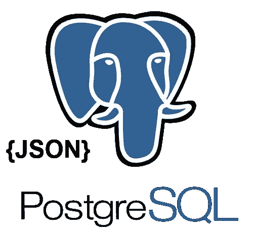
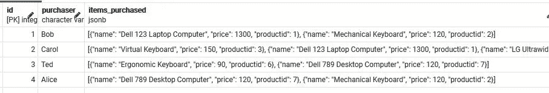
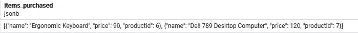
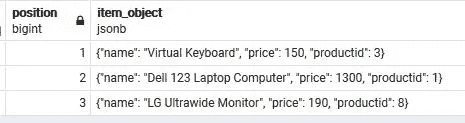
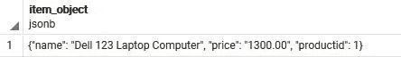
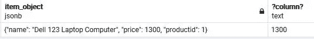
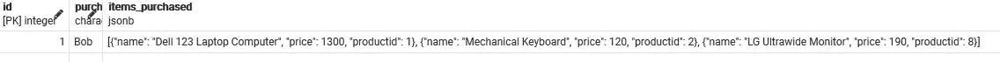
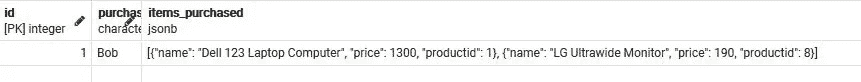
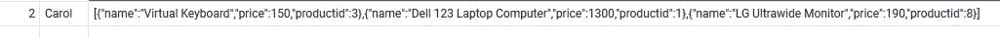
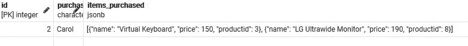

# 在 PostgreSQL 中使用 JSONB 对象数组

> 原文：<https://levelup.gitconnected.com/working-with-a-jsonb-array-of-objects-in-postgresql-d2b7e7f4db87>

## 数据库提示

## 从数组中获取、添加和移除 JSON 对象



来源:PostgreSQL Wiki

在我的[上一篇文章](/how-to-query-a-json-array-of-objects-as-a-recordset-in-postgresql-a81acec9fbc5)中，我们关注于将包含一个对象数组的 PostgreSQL jsonb 列转换成一个记录集，这样就可以用关系方式查询它。

# 我们将做什么

在本文中，我想继续使用包含一组对象的 jsonb 专栏，

*   获取数组中的所有对象。
*   按数组中的位置从数组中获取特定对象。当位置已知时，当我们必须发现它时。
*   向数组中添加一个 json 对象。
*   从数组中移除特定对象。
*   增加了 2021 年 1 月 5 日—索引

> 我们不仅会研究查询技术，还会将它们视为 API 端点，以及它们对前端(比如说 PERN 堆栈)的意义。

**样本数据**

我们在 jsonb 列中的示例数据看起来与此类似，

```
[{
  "productid": 3,
  "name": "Virtual Keyboard",
  "price": 150}, {
  "productid": 1,
  "name": "Dell 123 Laptop Computer",
  "price": 1300},
 {
  "productid": 8,
  "name": "LG Ultrawide Monitor",
  "price": 190}
]
```

*这可能代表客户购买的产品。我们想添加新的购买，获得所有项目购买，获得一个特定的项目购买和删除一个项目购买。*

在上一篇文章中，我们使用了 **jsonb_to_recordset()** 函数。

> 在本文中，我们将广泛使用 **jsonb_array_elements()函数。**

# 假设

我假设你有 [PostgreSQL](https://www.postgresql.org/) 和类似 [pgAdmin](https://www.pgadmin.org/) 的东西。

# 我们开始吧！

## 构建我们的数据

1.  打开 **pgAdmin** 并根据需要创建一个数据库。
2.  右击数据库名称并选择**查询工具**。
3.  运行下面的代码片段来创建一个简单的表，该表有一个 id、购买者姓名和一个存储 json 对象数组的 ***jsonb 列，该数组将存储购买的商品。***

```
CREATE TABLE public.purchases
(
    id   serial PRIMARY KEY,
    purchaser varchar(50),
    items_purchased jsonb
);
```

4.运行下面的代码片段，将四条记录插入到表中。

```
INSERT INTO purchases (purchaser,items_purchased) VALUES ('Bob',
'[{
  "productid": 1,
  "name": "Dell 123 Laptop Computer",
  "price": 1300},
 {
  "productid": 2,
  "name": "Mechanical Keyboard",
  "price": 120}
]');INSERT INTO purchases (purchaser,items_purchased) VALUES('Carol',
'[{
  "productid": 3,
  "name": "Virtual Keyboard",
  "price": 150}, {
  "productid": 1,
  "name": "Dell 123 Laptop Computer",
  "price": 1300},
 {
  "productid": 8,
  "name": "LG Ultrawide Monitor",
  "price": 190}
]');INSERT INTO purchases (purchaser,items_purchased) VALUES ('Ted',
'[{
  "productid": 6,
  "name": "Ergonomic Keyboard",
  "price": 90},
 {
  "productid": 7,
  "name": "Dell 789 Desktop Computer",
  "price": 120}
]');INSERT INTO purchases (purchaser,items_purchased) VALUES('Alice',
'[{
  "productid": 7,
  "name": "Dell 789 Desktop Computer",
  "price": 120},
 {
  "productid": 2,
  "name": "Mechanical Keyboard",
  "price": 120}
]');
```

5.要查看我们的数据，请运行下面的查询。

```
SELECT * FROM purchases;
```



具有 jsonb 列的购买项目的购买

# 我们的疑问

## 获取为某个帐户购买的所有商品

这是最简单的查询。

1.  运行以下查询以获取 Ted 购买的所有商品。

```
SELECT items_purchased FROM purchases
WHERE id=3
```



json 对象的数组

## 前端

考虑到这是一个 API 端点结果，这对于前端开发人员使用 Array.map()、Array.filter()或 Array.forEach()和其他操作进行前端处理来说是完美的。

## 获取为帐户购买的特定商品

根据要求，我们有几种选择。

看看 Carol，id=2，我们看到她已经购买了，

```
[
    {
        "name": "Virtual Keyboard",
        "price": 150,
        "productid": 3
    },
    {
        "name": "Dell 123 Laptop Computer",
        "price": 1300,
        "productid": 1
    },
    {
        "name": "LG Ultrawide Monitor",
        "price": 190,
        "productid": 8
    }
]
```

1.  让我们从运行下面的查询开始，检查我们得到的结果。

```
SELECT arr.position,arr.item_object
FROM purchases,
**jsonb_array_elements(items_purchased) with ordinality arr(item_object, position)** 
WHERE id=2;
```



取出每个 json 对象及其在数组中的序号位置

这为我们提供了每个 json 对象(购买的商品)及其在数组中的序号位置。

**jsonb _ array _ elements(items _ purchased)带序数 arr(item_object，position)**

*   我们传递给 **jsonb_array_elements** 带有对象数组的 jsonb 列。这将数组分解成单独的 json 对象。
*   我们用普通的包括了**。这告诉 PostgreSQL 包括序号位置。*注意这是从 1 开始的。但是处理数组的时候，从 0 开始。***
*   “arr”这个名称是任意的。
*   名称“item_object”是任意的，在我们的例子中引用了一个 purchase json 对象。
*   **位置**这个词是一个关键词。
*   我们可以通过使用语法 arr.position 和 arr.item_object 来访问位置和 item_object。*我们实际上不需要包含“arr”前缀，我们可以只使用 position 和 item_object。*

*更多关于 jsonb_to_array()的内容可以在* [*这里找到*](https://www.postgresql.org/docs/12/functions-json.html) *。*

现在我们看到了数据是如何转换的，如果我们希望 Carol 购买第二件商品，我们只需创建一个 Where 子句，指定数组中的序号位置。

2.如果我们知道数组中的序号位置，我们可以在 Where 子句中指定它。

运行下面的查询，只获取 Carol 购买的第二件商品，id=2。

```
**SELECT arr.item_object**
FROM purchases,jsonb_array_elements(items_purchased) with ordinality arr(item_object, position) 
WHERE id=2 and **arr.position=2;**
```



购买的第二件物品

3.如果我们不知道位置，但是我们知道 productid(或任何键),我们可以使用一个子查询来查找序号位置。

运行下面的查询，产生与上面相同的结果。

```
SELECT arr.item_object
FROM purchases,jsonb_array_elements(items_purchased) with ordinality arr(item_object, position) 
WHERE id=2 and arr.position=**Cast((select arr.position  FROM purchases, jsonb_array_elements(items_purchased) with ordinality arr(item_object, position) 
WHERE id=2 and arr.item_object->>'productid' = '1') as int)**
```

*   --> >操作符将以文本形式返回包含在 item_object 中的键值(productid)。这就是为什么我们使用“1 ”,即使 productid 是一个数字。
*   即使序数位置是一个 bigint，我们也必须将其转换为 int 或 bigint。

## 前端

考虑到这是一个 API 端点结果，这对前端开发人员来说是完美的。我们得到了一个干净漂亮的 json 对象，他们可以操作或显示它。

4.作为奖励，我们将结合我上一篇文章中的一项技术，以获得 Carol 购买的最高价格物品，id=2。

```
SELECT arr.item_object,arr.item_object->>'price'
FROM purchases,
jsonb_array_elements(items_purchased) with ordinality arr(item_object, position) 
WHERE id=2
and arr.item_object->>'price' = Cast((Select max(item_prices.price) as p
FROM purchases,jsonb_to_recordset(purchases.items_purchased) as item_prices(price int)
WHERE id=2) as varchar);
```

我在 Select 子句中包含了" arr . item _ object '--> > ' price '，这样我们可以看到返回的数据类型是 text。因此需要 Cast()函数。



价格最高的项目

在我之前的文章中没有解释太多，jsonb_to_recordset()函数允许我们将数据提取到关系列中，我们可以根据关系列进行查询。

*更多关于 jsonb 的操作符可以在这里找到*[](https://www.postgresql.org/docs/12/functions-json.html)**。**

## *向帐户添加新购买的商品*

*如果我们查看 Bob 的购买情况，我们会发现他购买了，*

```
*[
    {
        "name": "Dell 123 Laptop Computer",
        "price": 1300,
        "productid": 1
    },
    {
        "name": "Mechanical Keyboard",
        "price": 120,
        "productid": 2
    }
]*
```

*鲍勃打算购买一台显示器。*

```
*{
        "name": "LG Ultrawide Monitor",
        "price": 190,
        "productid": 8
}*
```

1.  *运行以下查询，向 id=1 的 Bob 的 items_purchased 数组中添加一项采购。*

```
*UPDATE purchases SET items_purchased = items_purchased || 
'{"name": "LG Ultrawide Monitor",
        "price": 190,
        "productid": 8}' ::jsonb
WHERE id=1;*
```

*鲍勃现在购买了一台显示器。*

**

*鲍勃新买的东西*

*这里我们使用了连接操作符||，将一个 jsonb 对象连接到数组上。*

## *前端*

*考虑到这是一个 API 端点，这是 HTTP 补丁请求的完美用途。前端发送补丁请求和要添加到主体中的 json 对象。*

*2.**特例—** 没有现有购买。如果 items_purchased 为 null，我们需要使用一个额外的函数 COALESCE。*

```
*UPDATE purchases SET items_purchased = **COALESCE**(items_purchased, '[]'::jsonb) ||
'{"name": "LG Ultrawide Monitor",
        "price": 190,
        "productid": 8}' ::jsonb
WHERE id=1;*
```

> *在查询数据时，我们经常使用`COALESCE`函数来用默认值代替空值*

*在我们的例子中，我们替换空数组，然后连接*,因为不能连接到 null。**

*更多关于 COALESCE 的信息可以在[这里](https://www.postgresqltutorial.com/postgresql-coalesce/)找到。*

## *从帐户中删除购买*

***重要提示**:之前我们使用“with ordinality”来获取数组中的“位置”。当使用 jsonb_array_elements()函数时，这很好。但是需要注意的是，虽然这个顺序值从数字 1 **开始，但是 jsonb 对象数组从 0 开始。***

1.  *当数组中的位置已知时，这就像使用'-'操作符一样简单。*

*文档中的“-”操作符描述在我看来有点模糊。*

> *从左操作数中删除键/值对或*字符串*元素。键/值对基于它们的键值进行匹配。*

*鲍勃归还了他的机械键盘。让我们从他的 items_purchased 中删除项目 2。首先查询 Bob 的商品，看他有三个，然后删除商品 2。*

```
*SELECT * FROM purchases where id=1;*
```

**

*鲍勃有三样东西*

**项编号 2，机械键盘，位于* ***数组位置 1*** *。**

```
*UPDATE purchases SET items_purchased = items_purchased - 1
WHERE id=1;*
```

**

*没有项目编号 2 或数组位置 1 的 Bob*

*不知道位置怎么办？也许 productid 是已知的。一个以前用过的查询帮助了我们。*

*下面的查询给出了 Dell 123 笔记本电脑的序号位置，productid=1，Carol 的序号位置，id=2。*

```
*SELECT position FROM purchases, jsonb_array_elements(items_purchased) with ordinality arr(item_object, position) 
WHERE id=2 and item_object->>'productid' = '1';*
```

*这将返回数字 2，因为 Carol 的 Dell 123 笔记本电脑位于阵列的第二个位置。然而，如果我们用它来帮助我们删除一个项目，它将删除第三个项目，因为，正如在上面的注释中提到的，数组位置从 0 开始。解决方法很简单，只需使用位置-1*

*2.查找该项在数组中的位置，然后移除该项。*

**

*卡罗尔。戴尔 123 笔记本电脑位于序号位置 2，但阵列位置 1。*

```
*UPDATE purchases SET items_purchased = items_purchased - 
**Cast**((**SELECT position - 1** FROM purchases, jsonb_array_elements(items_purchased) with ordinality arr(item_object, position) 
WHERE id=2 and **item_object->>'productid' = '1'**) as int)
WHERE id=2;*
```

**

*没有 productid=1 的 Carol。它的序号位置是 2，但数组位置是 1。*

*   *我们使用 a 查询来查找 Carol 的 items_purchased 中 productid=1 的位置。这将返回序号位置 2。因此，我们使用 position-1 来获取数组位置 1。*
*   *即使序数位置是一个 bigint，我们也必须将其转换为 int 或 bigint。*
*   *还记得-> >返回一个字符串，所以在 item_object->>'productid' = '1 '中，我们与字符串版本的 productid 进行比较，即使它在 json 中是一个数字。*

# *索引*

*基于读者提出的几个问题，我在 JSON 中添加了索引 items_purchased 列和一个键值。*

## *为列编制索引*

```
*CREATE INDEX idx_purchases ON public.purchases (items_purchased);*
```

*这将创建一个 btree 索引。*

## *索引 JSONB 列中的键*

*对于一个特定的键**，这里命名为**，在现场使用时，*

```
*CREATE INDEX idx_purchases_name
 ON public.purchases 
 ((items_purchased ->> ‘name’));*
```

*这将在 name 上创建一个 btree 索引。*

*在我们的小数据集中，当你进行解释分析时，你可能看不到正在使用的索引。*

> *当在`SELECT`查询中使用索引时，首先从索引中获取请求行的位置(而不是直接从表中获取)。然后，请求的行(总数的子集)实际上是从表中获取的。这是一个分两步走的过程。给定足够多的请求行(比如 id 大于 10 的所有文章)，直接从表中获取所有这些行实际上比通过额外的步骤向索引查询这些行的位置，然后从表中获取这些特定的行更有效。如果行的百分比小于表中所有行的 5-10%,则使用存储在索引中的信息的好处超过了额外的中间步骤。*

*全篇[此处](https://thoughtbot.com/blog/why-postgres-wont-always-use-an-index)。*

# *结论*

*概括一下。在本文中，我们继续了前一篇文章[中所做的工作，将 jsonb 对象数组作为记录集](/how-to-query-a-json-array-of-objects-as-a-recordset-in-postgresql-a81acec9fbc5)进行查询，增加了**获取**特定数组对象、**添加**新数组对象和**移除**数组对象的能力。*

*PostgreSQL 有许多用于 JSON 数据的函数和操作符，我们将在以后的文章中探讨其中的一些。*

*我每天都在使用它们，因为我为一个 PERN 栈构建了一个 RESTful API。*

*如果您觉得这很有用，[开始探索 json、jsonb 和 JSON 的其他操作符和函数](https://www.postgresql.org/docs/12/functions-json.html)，以及 PostgreSQL 中可用的常规 SQL 操作。*

***感谢您的阅读和编码！***

**想看就看，加入 Medium 帮我继续写**

*[](https://bobtomlin-70659.medium.com/membership) [## 通过我的推荐链接加入灵媒——重力井(罗伯·汤姆林)

### 作为一个媒体会员，你的会员费的一部分会给你阅读的作家，你可以完全接触到每一个故事…

bobtomlin-70659.medium.com](https://bobtomlin-70659.medium.com/membership) 

你也可以享受，

[](/working-with-the-array-data-type-in-postgresql-1e6fecdb51fe) [## 在 PostgreSQL 中使用数组数据类型

### 创建、获取、修改、添加和删除数组中的数据

levelup.gitconnected.com](/working-with-the-array-data-type-in-postgresql-1e6fecdb51fe) [](/creating-a-data-pagination-function-in-postgresql-2a032084af54) [## 在 PostgreSQL 中创建数据分页函数

### 使用 LIMIT、OFFSET 和 FETCH NEXT 运算符。

levelup.gitconnected.com](/creating-a-data-pagination-function-in-postgresql-2a032084af54) [](/how-to-query-a-json-array-of-objects-as-a-recordset-in-postgresql-a81acec9fbc5) [## 如何在 PostgreSQL 中将 JSONB 对象数组作为记录集进行查询

### 使用 jsonb_to_recordset()函数将对象数组转换为行

levelup.gitconnected.com](/how-to-query-a-json-array-of-objects-as-a-recordset-in-postgresql-a81acec9fbc5) [](https://medium.com/javascript-in-plain-english/querying-sql-server-in-node-js-using-async-await-5cb68acf2144) [## 使用 Async/Await 在 Node.js 中查询 SQL Server

### 一种更简洁的数据库查询方式

medium.com](https://medium.com/javascript-in-plain-english/querying-sql-server-in-node-js-using-async-await-5cb68acf2144) [](https://medium.com/javascript-in-plain-english/how-to-download-files-from-an-amazon-s3-bucket-to-a-sql-server-rds-a6d20f3b9014) [## 将 AWS S3 中的文件下载到 SQL Server RDS

### 并将内容大容量装载到一个表中

中等。](https://medium.com/javascript-in-plain-english/how-to-download-files-from-an-amazon-s3-bucket-to-a-sql-server-rds-a6d20f3b9014) 

# 分级编码

感谢您成为我们社区的一员！升级正在改变技术招聘。 [**在最好的公司**找到你最完美的工作](https://jobs.levelup.dev/talent) **。**

[](https://jobs.levelup.dev/talent) [## 提升——改变招聘流程

### 🔥让软件工程师找到他们热爱的完美角色🧠寻找人才是最痛苦的部分…

作业. levelup.dev](https://jobs.levelup.dev/talent)*