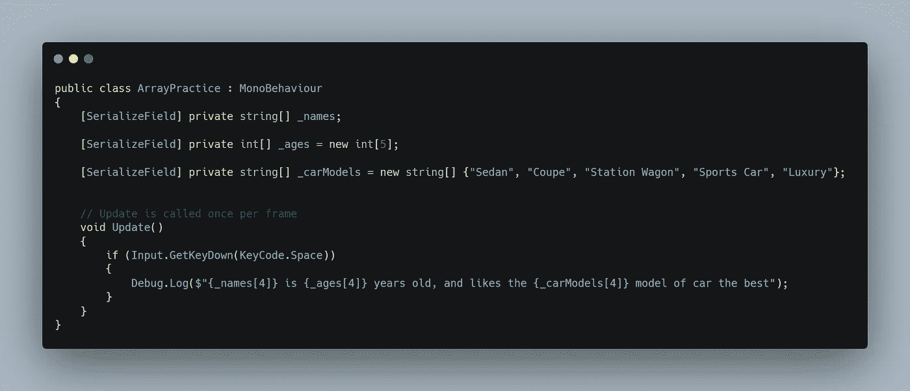

# 使用数组第 1 部分:基础知识

> 原文：<https://levelup.gitconnected.com/working-with-arrays-part-1-the-basics-91ca58db00c6>

什么是数组，它有什么用处？一个**数组**是一种**变量**，它可以为**相同的数据类型**保存**多个值**。当你有变量引用名字、年龄、物品等时，它们是有用的。，否则您可能会为每个不同的值创建数百个单独的变量。

这里的每个数组变量都显示了一种不同的方式来**声明**数组，纯粹是为了教育价值。第一个用于**名称**的数组例子可以说是在 **Unity** 中使用数组的最常见方式。数组的**大小**和**内容**都可以在**检查器**中寻址。采用这种方式的主要问题是，没有什么是硬编码的，所以所有的值都存在 Unity 的 inspector *(经常保存)*中。第二个数组为**age**，声明了一个包含 **5 个元素**的数组。虽然这可以添加到**检查器**中，但是它有一个相似的堕落。硬编码的值只适用于 5 个元素，所以其他任何东西都与 Unity 的 inspector 和**保存**您的工作密切相关！**汽车型号**的最终数组将这些值硬编码到脚本中。所有信息都将保留在 Unity 之外的脚本中。通常，我需要调整代码来改变数组大小和相应的值，但是使用**序列化字段**使我能够在 Unity 的 inspector 中覆盖这些值。

左图显示了在 Unity 中打开上述脚本时检查器的样子，右图显示了我在检查器中所做的更改。只有**汽车型号**的最后一个数组具有**提供的所有**信息，因为它是**脚本**中的**硬编码**。

为了访问**并将**这些值打印到**控制台**中，可以在一些**方括号**内键入与期望的**值**相对应的**元件编号**。对于**名【0】**，*里基*会打印*(元素 0)* 。**Ages【3】**将打印 *3* 作为元素 3，**car models【4】**将打印*豪华型*汽车选项。

这是控制台打印输出。

作为一个**挑战**，我需要打印出每个数组的最后一个元素**，因为它们与同一个角色相关联。我在这里使用**字符串插值**在一些文本之间插入数组名，以及我想要打印出来的相应元素编号。对于奖励积分，当按下**键**时，将打印出**空格**键。**

这是打印结果，显示了所有**元素 4** 的选择。

作为额外的**挑战**，我的任务是**随机选择**选中的孩子，并打印出与**对应的**元素编号相关的值。为此，我创建了一个名为 **randomKid** 的局部 **int** 变量。这个用**随机。范围**在零(最小值)和 **names.length** 之间，为指定数组中的最大值。*人名。Length 将保持最大值与 names 数组中值的个数相同！*

当我按下空格键时，这里有一个随机值打印到控制台的剪辑！

这是我随机挑选的孩子的打印结果！

在我的下一篇文章中，我将处理一些更高级的数组技术，并努力完成更多的挑战。感谢阅读！