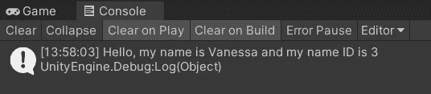

# 使用数组第二部分:For 和 Foreach 循环

> 原文：<https://levelup.gitconnected.com/working-with-arrays-part-ii-for-and-foreach-loops-cc4fd1499e8c>

在本文中，我将更深入地研究数组，稍后展示一个在数组中使用循环来做有趣事情的实际应用。首先，我创建了两个**数组变量**。一个是保存**名字**的**字符串类型**，另一个是保存相应 **nameID 号**的 **int 类型**。

在**保存**之后，我利用 Unity 的**检查器**添加剩余的数组数据。每个**名称**将有一个对应的**名称 ID** ，而每个名称和 ID 都有一个对应的**元素**编号。

在本例中，当按下**空格**键时，循环的**将针对**名称 ID 数组**中存储的每个不同值运行一次。对于 for 循环的每个实例，两个**调试**消息被发送到控制台。第一条消息使用**名称索引**变量，在循环通过每个循环时发送**当前名称 ID** 。第二条消息使用相同的**名称索引**变量从**名称数组**发送**当前名称**。随着循环的进行，所有的姓名和姓名 ID 都被打印到控制台上。**

*在 for 循环中使用变量名"* ***i*** *"是标准的做法，因为它是一个* ***int 索引值*** *。为了我自己的清晰和理解，我选择使用****names index****作为一个更具体的变量名来表示我正在进行的工作。*

下面是上面代码的结果。每个**名称 ID** 数字在它所代表的**名称**之前打印出来。

要打印特定的名称，可以使用名称索引来检查它是否等于相应的 ID 号。在这种情况下，我检查 **3** 的编号 ID。这是 Vanessa 的姓名 ID，因此当发送到控制台时会打印她的姓名。

下面是上面代码的打印结果。

搜索也可以采用一个字符串参数，所以这里我简单地将 **3** 改为*“Tabitha”*，并再次运行代码。

现在 Tabitha 和她相应的名字 ID 打印到控制台。

Unity 赋予用户使用 **foreach** 循环的特殊能力。它的功能类似于 for 循环，只是语法更清晰，结果更容易理解。首先，使用 **foreach 关键字**。那么**变量**可以被用作一个**通用数据类型**的声明。使用时, **var** 变量将检查它正在寻找的数组的数据类型，并相应地进行匹配。所以，我在这里整理名字的时候，用词非常直接。对于 names 数组中的每个名称，打印出当前名称。

这是数组中名称的打印输出。

这里 **foreach** 循环检查*“Simon”*的**字符串值**，如果找到，则将 Simon 的名字打印到控制台。

你好，西蒙！

在下一个例子中，**名称**存储在它自己的**类**中。该类可以使用**系统。可连载**，每个名字都有一个 **ID** ，一个**名字**和一个**年龄**。然后，Name 类可以组成一个名称数组，并被赋予一个变量名 *(nameGenerator)* 。

保存并返回 Unity 后，**检查器**显示所有新添加的空间，我需要在那里填写数据。

这是输入数据后的个人统计数据。

一个 **foreach** 循环现在可以检查**名称生成器**数组，并将所有的**名称**打印到控制台，并带有它们对应的 **ID** 和**年龄**。

下面是运行中脚本。

举个实际的例子，让我们在通过数组访问一些游戏对象后，改变它们的**颜色**。我从一个叫做*球体*的**游戏对象数组**开始。

回到 Unity，我在场景视图中制作了三个简单的球体**游戏物体**并把它们隔开。

你好小悬浮球！

然后我将它们添加到**检查器**中的**球体数组**中。它们可以简单地从场景视图中拖进来。

现在，当按下**空格键**时， **foreach** 循环将遍历数组并访问每个球体游戏对象。每个球体都有一个对其**网格渲染器**的 **GetComponent** 调用，随后将材质**颜色**设置为*蓝色*。

当我按下空格键时，这些球会变成蓝色！

我被要求将这个 **foreach** 循环转换成循环的**。我决定通过添加一个**颜色数组**来进一步挑战自己，当我按下空格键时，它将随机改变球体的颜色。I **硬编码**一些颜色值到颜色数组中。当按下**空格键**时，我使用一个局部变量 **randomColor** 在**零** *(min)* 和**数组** *(max)中的**颜色数量**之间随机化一个数值。***

正如这里所看到的，每当我按下空格键时，球体会变成随机的颜色。

我该如何让每个球都变成随机的颜色呢？嗯，都是操作顺序的问题。我将 **randomColor int 变量**移动到循环的**中，这样在循环运行时它也会被调用来改变每个球体的颜色。**

这是一个随机变色球体的样本！

