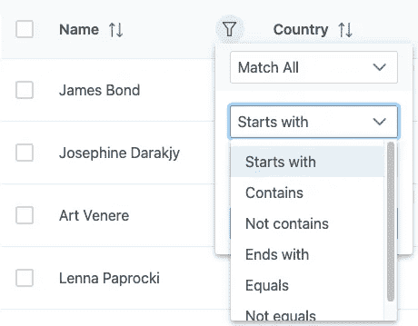
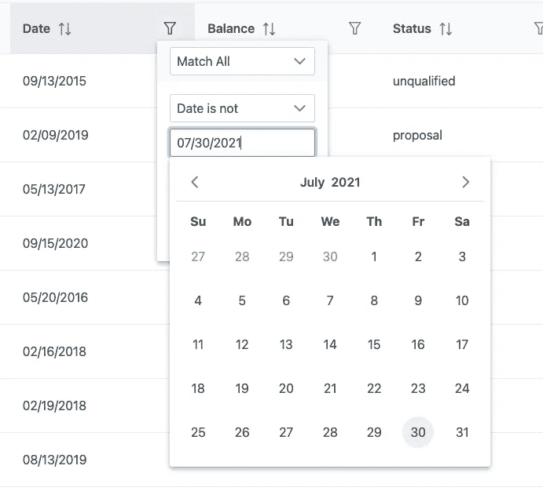

# 使用漂亮的原始数据表过滤器菜单

> 原文：<https://levelup.gitconnected.com/working-with-beautiful-primeng-data-table-filter-menu-4d318f40069e>

在以前的文章中，我们已经讨论了如何创建一个原始数据表，并检查了如何动态呈现数据表。我们已经讨论了如何用 Angular 实现一个[服务器端分页主数据表。](https://medium.com/coding-in-depth/server-side-pagination-using-ng-prime-data-table-in-angular-5ffb082da138)在这里，我们将讨论令人敬畏的新 PrimeNG 过滤器控制。这些控件不仅漂亮，而且提供了许多功能。我们还可以使用过滤器服务定制过滤器。


由[纳吉布·卡利尔](https://unsplash.com/@nkalil?utm_source=medium&utm_medium=referral)在 [Unsplash](https://unsplash.com?utm_source=medium&utm_medium=referral) 上过滤照片

灌注中有三种类型的过滤器:

1.  菜单过滤器
2.  自定义过滤器
3.  全局过滤器

在接下来的故事中，我们还将讨论如何应用这些过滤器:

1.  从模板应用过滤器
2.  从组件应用过滤器
3.  对页面加载应用过滤器

为了更好地理解代码，请在此处附加 stackblitz 项目

# 过滤器菜单—文本、日期和数字

过滤器菜单有多种口味。简单的`type`是`text`，它提供了`start With, End width, Contains, equals, not Equal, and Not contains`选项。我们可以在同一列中添加更多的规则。您可以看到一个加号按钮作为添加角色。您可以通过将`showAddButton`添加为 false 来关闭添加角色选项。下面是文本过滤器的代码块。

```
<p-columnFilter type=”text” field=”name” display=”menu” [showAddButton]="false" class=”p-ml-auto”></p-columnFilter>
```

下面是它渲染到 UI 时的截图。



另一个菜单选项类型是日期。日期菜单选项提供了与日期`is, not, before and after`的比较。在`text`中，显示完整的日历以选择日期值。

```
<p-columnFilter type=”date” field=”date” display=”menu”></p-columnFilter>
```

下面是它渲染到 UI 时的截图。



第三种类型的过滤器是使用数字数据类型。数值字段接受货币类型。

```
<p-columnFilter type=”numeric” field=”balance” display=”menu” currency=”USD” class=”p-ml-auto”></p-columnFilter>
```

# 过滤器菜单—自定义过滤器

我们可以创建不同类型的自定义过滤器。也就是说，我们可以创建一个由`name`和`image`组成的类型`Assignee`。下面是 Assignee 类型的界面。

```
export interface Assignee {name: string;image?: string;}
```

现在，在组件中定义一组受托人。受托人必须由姓名和图像组成。

```
this.assignee = [{name: “Amy Elsner”, image: ‘amyelsner.png’},];
```

现在在模板中，我们可以使用`matchMode``in``p-columnFilter`。还设置了`p-columnFilter field="assignee"`

```
<p-columnFilter field=”assignee” matchMode=”in” display=”menu” [showMatchModes]=”false” [showOperator]=”false” [showAddButton]=”false” class=”p-ml-auto”>...</p-columnFilter>
```

有两部分的模板标题和我们希望如何显示过滤器。这两部分可以很容易地包装在 ng 模板中。

报头可以写成:

```
<ng-template **pTemplate=”header”>**<div class=”p-px-3 p-pt-3 p-pb-0"><span class=”p-text-bold”>Assignee</span></div></ng-template>
```

过滤器可以写成:

```
<ng-template **pTemplate="filter"** let-value let-filter="filterCallback"><p-multiSelect [ngModel]="value" [options]="assignee" placeholder="Any" (onChange)="filter($event.value)" optionLabel="name"><ng-template let-option pTemplate="item"><div class="p-multiselect-representative-option"><span class="p-ml-1">{{option.name}}</span></div></ng-template></p-multiSelect></ng-template>
```

# 自定义过滤器

我们可以创建一个自定义过滤器，并完全配置匹配模式。`FilterService`提供了一堆函数并注册到函数中，并将其用作自定义匹配模式。从`primeng api`进口`FilterService`。

```
import {FilterService} from ‘primeng/api’;
```

在构造函数中注册过滤器服务，然后使用 ngOnInit 中的 Register 函数来定义过滤器的工作方式。下面是 ngOnInit 的代码片段。

```
ngOnInit() {const customFilterName = “custom-equals”;this.filterService.register(customFilterName,(value, filter): boolean => {if (filter === undefined || filter === null || filter.trim() === “”) {return true;}if (value === undefined || value === null) {return false;}return value.toString() === filter.toString();});}
```

在模板中设置`matchModeOptions`作为自定义过滤器。这里有两件事非常重要，第一个是 T4，它是 T5 的数组，第二个是 T6，它是 T7

```
<p-columnFilter type=”text” [field]=”col.field” **[matchModeOptions]=”matchModeOptions”****[matchMode]=”’custom-equals’”**>
</p-columnFilter>
```

# 全局过滤器

有时使用全局过滤器作为通配符进行搜索非常重要。全局筛选器可应用于所有列或某些特定列。可以使用`globalFilterFields`属性应用全局过滤器。

```
[globalFilterFields]=”[‘name’,’country.name’,’assignee.name’,’status’]”
```

# 从角度分量设置启动过滤器(以编程方式)

在许多情况下，我们希望加载已经过滤但包含所有数据集的数据。在这些场景中，我们可以从角度分量设置过滤器。创建`p-table`元素并添加元素引用作为`#dt`。

```
<p-table **#dt** [value]=”customers” ...></p-table>
```

在组件访问视图子元素中。`this.table.filters`负责在数据最初加载到表中时设置过滤器。

```
**@ViewChild(‘dt’) table: Table;**ngOnInit() {this.customerService.getCustomersLarge().then(customers => {this.customers = customers;console.log(this.customers[0])this.loading = false;//The below line can be used as filter when data loads**this.table.filters['country.name'] = [{value: "United", matchMode: "startsWith", operator: "and"}];**});}
```

类似地，使用全局过滤器函数以编程方式使用全局过滤器。

```
this.dataTable.filterGlobal('searchKey', 'contains');
```

我们已经创建了一个演示项目，这是从原始分叉。但是，该示例中有显著的变化。stackblitz 的例子非常有效。很少的代码行被注释来展示演示，你可以取消注释，看看过滤器是如何应用的。

所以请使用最新的过滤器！！！