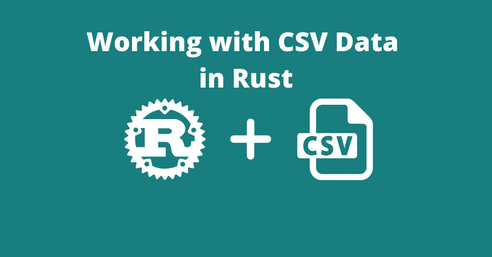
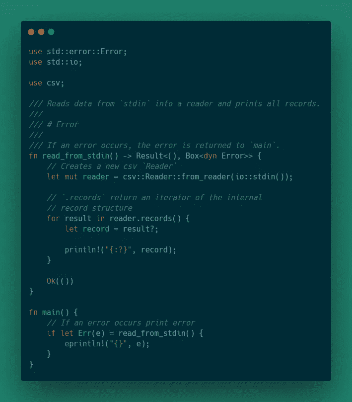
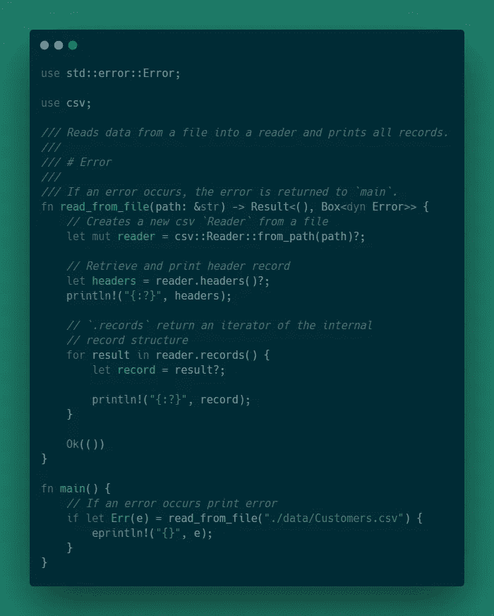
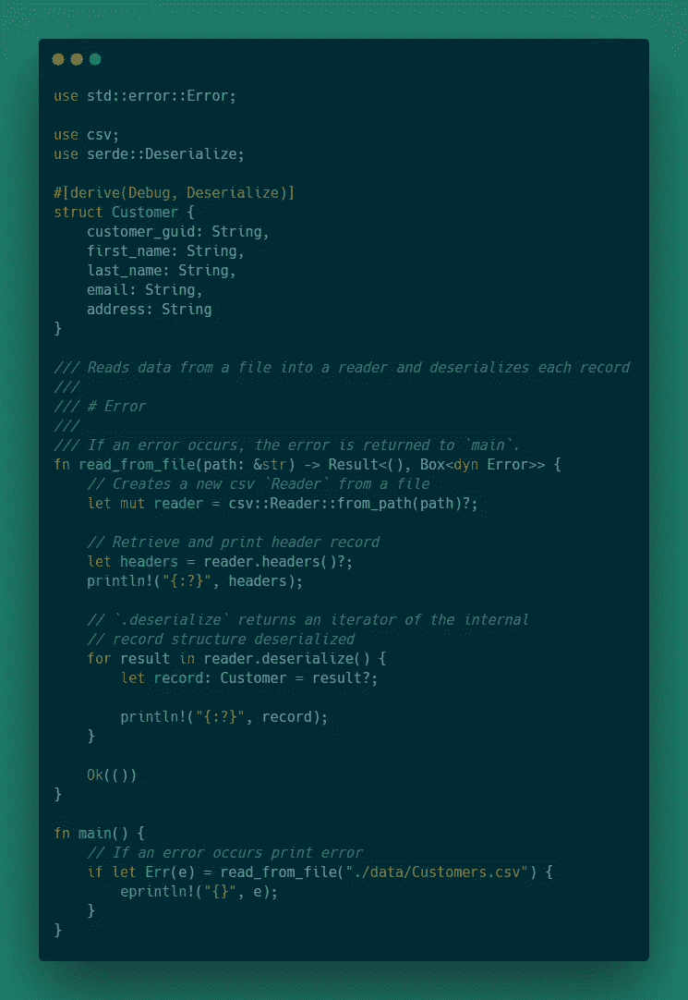
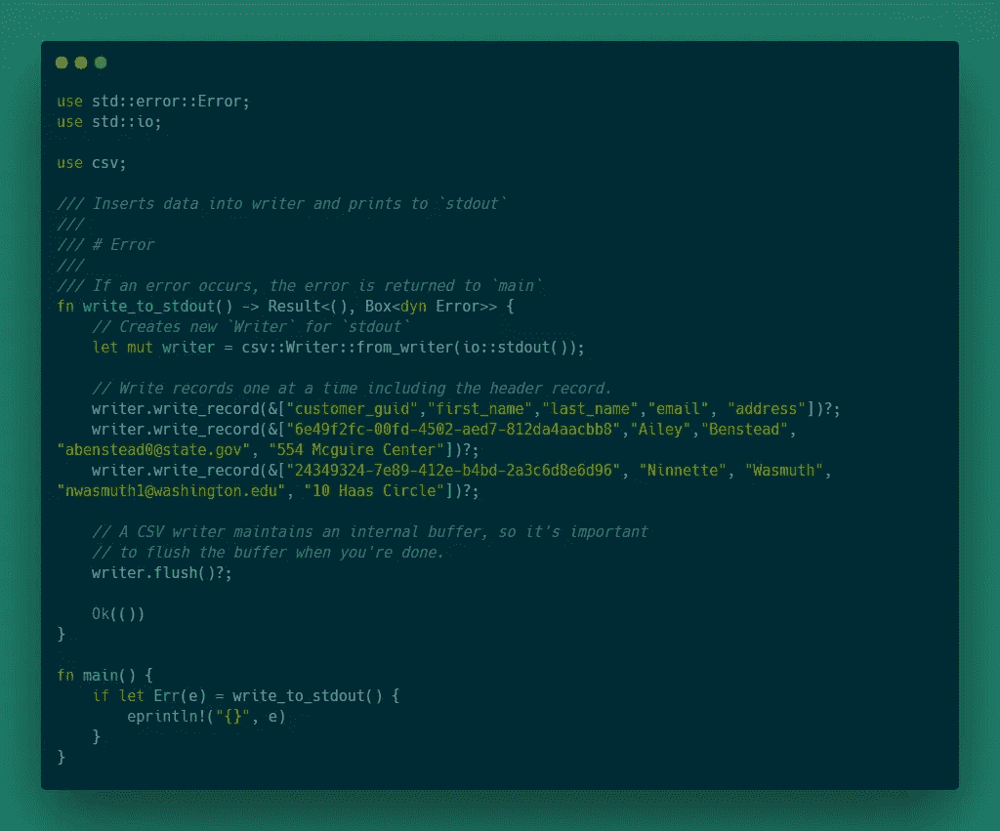
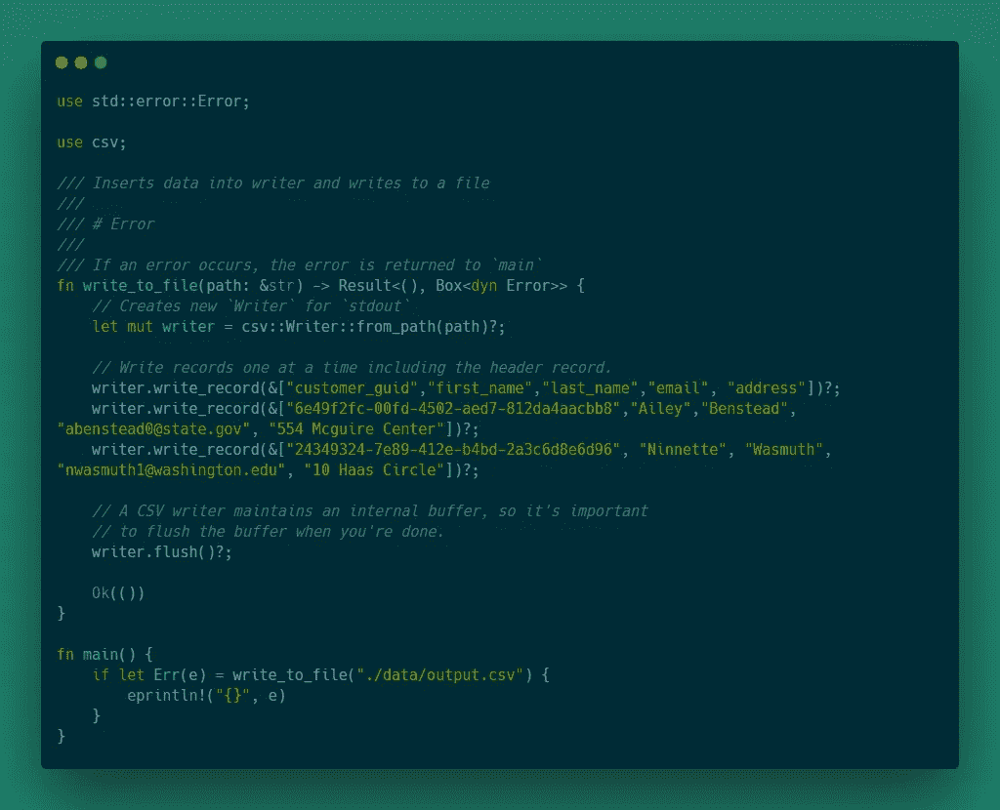
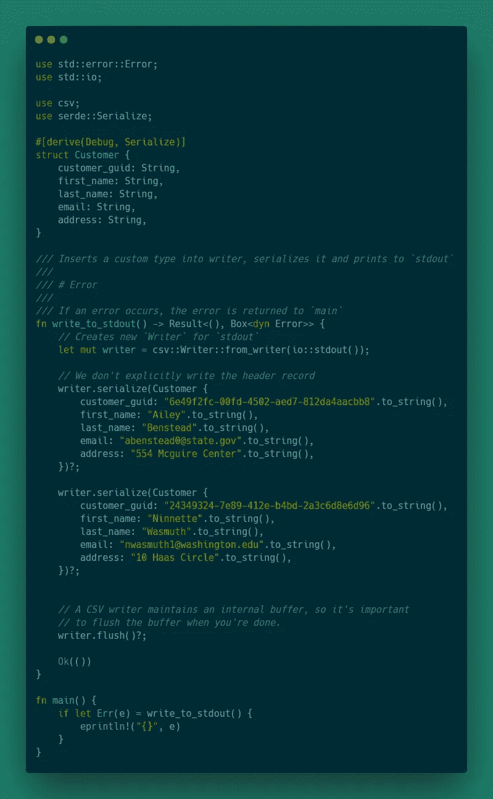

# 在 Rust 中使用 CSV 数据

> 原文：<https://levelup.gitconnected.com/working-with-csv-data-in-rust-7258163252f8>



CSV 文件格式是存储表格数据的一种非常常用的方法。本文涵盖了读取和写入 CSV 文件的基础知识，使用 Serde 库对 CSV 数据进行反序列化，最后给出了一个数据聚合示例。

# 介绍

产生这篇文章的想法是因为我需要一种快速便捷的方法来处理 CSV 格式的数据。一种选择是编写自己的库，但我觉得这不是一个方便的解决方案。所以，经过一番研究，我决定使用由安德鲁·格兰特创作的 csv 机箱。我选择这个板条箱是因为 API 相当简单，而且对我来说最重要的是，文档非常全面。

# 设置

要使用这个机箱，只需使用`cargo new`创建一个新的 Rust 项目，并将其添加到`Cargo.toml`文件中的`[dependencies]`下:

```
csv = "1.1"
```

此外，本文部分内容将利用 Serde 的自定义派生功能，所以继续添加:

```
serde = { version = "1", features = ["derive"] }
```

# 数据源

本文中的所有数据都是从 [Mockaroo](https://mockaroo.com/) 生成的，这是一个免费的模拟数据服务，非常灵活，易于使用和共享。我将使用的模式可以在以下链接中找到:

> *关于* `*Order*` *模式的一个快速注释。它与* `*Customer*` *模式有一个外键关系。要在 Mockaroo 站点上进行设置，首先创建* `*Customer*` *模式，将其下载为 csv 文件，将 csv 文件上传为数据集，然后您可以创建* `*Order*` *模式。*

# 读取 CSV 数据

`csv`机箱提供了一个`Reader`结构，用于将原始 CSV 数据转换为标准 Rust 类型。`Reader`具有从输入流或文件中读取数据，并使用 Serde 将数据反序列化为定制结构的功能。

## 从`stdin`读取

从`stdin`读取可能不是一个常见的用例，除非您将 CSV 数据传递给命令行应用程序。为了从`stdin`中读取，机箱提供了一个名为`from_reader`的功能。这个方法适用于任何实现 trait 的类型，这意味着您可以从一个字节数组读入一个`Reader`。以下示例显示了如何从`stdin`读取 CSV 数据:

[*/src/bin/CSV _ read _ stdin . RS*](https://github.com/andrewleverette/rust_csv_examples/blob/master/src/bin/csv_read_stdin.rs)



一旦该代码被编译，就可以通过向它传递下载的 CSV 文件来调用它。例如，我使用`cargo build --release`编译了上面的代码，并能够通过在终端中键入以下代码来运行它:

```
./target/release/read_csv_stdin < data/Customers.csv
```

输出将如下所示:

```
StringRecord(["26fa5a49-5194-40eb-8faf-219c9fff831e", "Arline", "Jardine", "ajardine0@vimeo.com", "61635 Dawn Hill"]) StringRecord(["708fcc04-e387-47e3-b85d-99ccd4e18320", "Baillie", "Pierri", "bpierri1@people.com.cn", "70540 Gerald Way"]) StringRecord(["9a8ffa76-0280-4754-b75c-4de7508cdd67", "Jenda", "Print", "jprint2@umn.edu", "928 Bluestem Parkway"]) StringRecord(["c5b4b822-2b59-435f-a697-6f1d4bbb0684", "Lucia", "Rhucroft", "lrhucroft3@techcrunch.com", "212 Schiller Pass"]) StringRecord(["f266b61e-534f-483b-9f70-0029b7424aa8", "Sybila", "Valdes", "svaldes4@google.com.au", "2 Gateway Avenue"])
```

你可能已经注意到了一点，那就是`.records()`不包括标题行。该方法跳过第一行，因为默认情况下它被解释为标题记录。`Reader`结构有一个名为`.headers()`的独立方法来检索标题记录。

## 从文件中读取

从文件中读取可能是`Reader`结构最常见的用例。crate 提供了一个名为`from_path`的方法，它从 CSV 数据文件路径创建一个`Reader`。从文件中读取的代码看起来与从`stdin`中读取的代码非常相似。以下示例显示了如何从文件中读取 CSV:



## 和 Serde 一起阅读

这个机箱的一个便利特性是支持 Serde，它提供了读取 CSV 数据并将其反序列化为自定义 Rust 数据类型的功能。例如，原始的`Customer`数据看起来像这样

```
customer_guid,first_name,last_name,email,address 26fa5a49-5194-40eb-8faf-219c9fff831e,Arline,Jardine,ajardine0@vimeo.com,61635 Dawn Hill
```

-可以反序列化为 Rust 结构，如下所示:

```
struct Customer {
    customer_guid: String,
    first_name: String,
    last_name: String,
    email: String,
    address: String
}
```

而不是像前面的例子那样使用`.records`方法。`Reader`结构提供了另一个名为`.deserialize`的方法，在每个反序列化的记录上创建一个迭代器。以下示例显示了如何读取 CSV 数据并将其反序列化为 Rust 类型:

【T21*/src/bin/CSV _ read _ serde . RS*



需要注意的一件重要事情是，反序列化数据会带来一些固有的开销。如果将前两个例子与这个例子进行比较，您会发现反序列化数据会更慢。

## 用 Serde 处理无效数据

前面的例子都假设了相当干净的数据。然而，CSV 文件格式不强制这样的假设。因此，如果我们试图反序列化无法转换为声明类型的数据，那么将会出现错误。

例如，对于 Orders 模式，Rust 结构可能如下所示:

那么我们假设有一条记录是这样的:

```
order_guid,customer_guid,order_date,total 02a771c1-9885-40d6-9acc-75cd108e9218,022d6000-b4da-412b-ba7c-cd0dbf868af9,4/16/2020,Null
```

当 Serde 试图反序列化`Null`值时，将会出现如下所示的错误:

```
CSV deserialize error: record 1 (line: 2, byte: 42): field 3: invalid float literal
```

为了解决这个问题，crate 提供了一个助手函数，可以应用于`Option`字段，告诉 Serde 在出现错误时将值转换为`None`。添加该功能如下所示:

```
#[derive(Debug, Deserialize)]
struct Order {
    order_guid: String,
    customer_guid: String,
    order_date: String,

    #[serde(deserialize_with = "csv::invalid_option")]
    total: Option<f64>
}
```

除了`invalid_option` helper 方法，其余的代码与前面的例子完全相同。

# 写入 CSV 数据

写 CSV 数据比读它更简单，因为您对输出有更多的控制。机箱提供了一个`Writer`结构，它与`Reader`结构的接口非常相似。`Writer`结构提供了写入`stdout`、写入文件以及将 Rust 类型序列化为 CSV 数据的功能。

## 写入`stdout`

一个简单的用例可能是将 CSV 数据写入`stdout`，以便它可以通过管道进入另一个应用程序。为了写入`stdout`，crate 提供了`from_writer`方法来创建一个配置为写入`stdout`的`Writer`结构。一旦创建了`Writer`结构，就通过调用`Writer`实例上的`write_record`方法来添加记录。以下显示了如何将 CSV 数据写入`stdout`:

[*/src/bin/CSV _ write _ stdout . RS*](https://github.com/andrewleverette/rust_csv_examples/blob/master/src/bin/csv_write_stdout.rs)



由于这只是写到`stdout`，程序可以这样调用:

```
./target/release/csv_write_stdout
```

或者，您可以通过管道进入这样一个文件:

```
/target/release/csv_write_stdout > test.csv
```

## 写入文件

写入 CSV 数据的另一个用例是写入文件。`csv` crate 提供了`from_path`方法来创建一个`Writer`结构以写入给定的文件。除了`from_path`方法，这个例子和写`stdout`是一样的。

[*/src/bin/CSV _ write _ file . RS*](https://github.com/andrewleverette/rust_csv_examples/blob/master/src/bin/csv_write_file.rs)



## 用 Serde 写作

类似于`Reader`结构，`Writer`结构支持使用 Serde 将 Rust 类型的数据序列化为 CSV 记录。这个例子重用了前面的`Customer`模式，并将`Customer`的实例转换成 CSV 数据。

[*/src/bin/CSV _ write _ serde . RS*](https://github.com/andrewleverette/rust_csv_examples/blob/master/src/bin/csv_write_serde.rs)



与其他写入示例相比，本示例的主要区别在于使用了`serialize`方法而不是`write_record`方法来写入数据。

# CSV 聚合

处理 CSV 数据时，一个常见的用例是读取 CSV 文件，处理数据，然后将结果写回文件。此示例读取两个 CSV 文件，执行内部联接，然后将结果写入文件。由于这个例子比其他的要长，我只想强调几个部分，但是源代码可以在[这里](https://github.com/andrewleverette/rust_csv_examples/blob/master/src/bin/csv_aggregation.rs)找到。

我决定做的第一件事是定义一个结构来保存标题和记录，使执行聚合稍微容易一些。这个结构看起来像这样:

```
#[derive(Debug)]
struct DataSet {
    /// Header row of CSV file
    headers: StringRecord,

    /// Records from CSV file
    records: Vec<StringRecord>,
}
```

`StringRecord`类型是定义记录的`csv`箱中的结构。在读取和写入 CSV 数据时，在`DataSet`中使用这种类型便于与`Reader`和`Writer`内部集成。

为了连接这两个数据集，我将使用排序合并连接算法。基本上，它对给定列上的两个数据集进行排序，然后扫描两个数据集寻找匹配。当发现匹配时，它将两个数据集中的记录合并成一个记录，并将其添加到一个新的数据集中。

因为我有一个保存记录的自定义结构，所以我可以添加一个带有函数的`impl`块来对数据集中的记录进行排序。

```
/// Sort data records by the given index.
///
/// # Errors
///
/// An error occurs if the index is out of bounds
fn sort_by_index(&mut self, index: usize) -> Result<(), Box<dyn Error>> {
    if index >= self.headers.len() {
        Err(Box::new(IndexError(format!(
            "Index '{}' out of bounds",
            index
        ))))
    } else {
        self.records.sort_by(|a, b| a[index].cmp(&b[index]));
        Ok(())
    }
}
```

一旦两个数据集都被排序了，我就可以把它们连接起来。内部连接方法的核心逻辑如下所示:

```
let mut left_cursor = 0;
let mut right_cursor = 0;

while left_cursor < self.records.len() && right_cursor < right.records.len() {
    // If two fields match, merge fields into a single record
    // and add to records vector
    // If they don't match and the left value is less then right value advance the left cursor
    // else advance the right cursor
    if self.records[left_cursor][left_index] == right.records[right_cursor][right_index] {
        let record = StringRecord::from(
            self.records[left_cursor]
                .iter()
                .chain(right.records[right_cursor].iter())
                .collect::<Vec<&str>>(),
        );

        records.push(record);

        // Since data sets are sorted
        // Advance cursor through right data set to
        // see if there are matches
        let mut k = right_cursor + 1;
        while k < right.records.len()
            && self.records[left_cursor][left_index] == right.records[k][right_index]
        {
            let record = StringRecord::from(
                self.records[left_cursor]
                    .iter()
                    .chain(right.records[k].iter())
                    .collect::<Vec<&str>>(),
            );

            records.push(record);

            k += 1;
        }

        left_cursor += 1;
    } else if self.records[left_cursor][left_index]
        < right.records[right_cursor][right_index]
    {
        left_cursor += 1;
    } else {
        right_cursor += 1;
    }
}
```

排序合并算法是有效连接数据集的众多算法之一。如果你想阅读更多关于这些类型的算法，我发现[这篇](http://blog.felipe.rs/2019/01/29/demystifying-join-algorithms/)文章是一个很好的起点。

# 回顾

总的来说，我认为`csv` crate 非常容易使用，当我想要一个快速的 CSV 解析库时，它是我的第一选择。板条箱受益于记录良好的源代码和更详细的教程文档。Rust 社区似乎也有同样的感觉，因为这个板条箱已经被下载了超过 300 万次。

# 谢谢

感谢阅读！如果你想联系或想提供反馈，请随时通过 [LinkedIn](https://www.linkedin.com/in/andrewleverette/) 联系我。

*原载于 2020 年 6 月 30 日*[*https://andrewleverette . github . io*](https://andrewleverette.github.io/working-with-csv-data/)*。*

