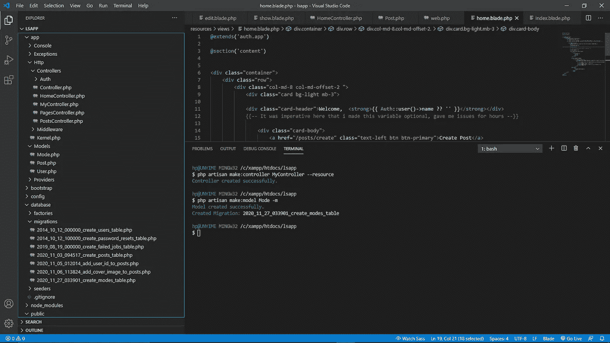

# 在 Laravel 8.x 中使用数据库

> 原文：<https://levelup.gitconnected.com/working-with-databases-in-laravel-8-x-de00730f7198>


**你将学到什么:**

*   创建数据库
*   向数据库中添加表
*   向表中添加数据
*   显示表格数据

**先决条件:**

在您使用的系统上安装以下软件:

XAMPP

设计者

Visual Studio 代码(或任何带终端的代码编辑器)

# 创建数据库

打开你的 XAMPP，开始运行 **Apache 和 MySQL** ，然后在你的浏览器中输入 localhost/phpmyadmin/简单！对于不熟悉 XAMPP 的人来说。好消息是，这就是我们在那里需要做的。


# 向数据库添加表(迁移)

此时，如果您还没有建立一个 Laravel 项目，请继续创建。您可以这样做(*假设安装了 Composer*)，方法是转到您的终端，在 xampp 目录的 htdocs 中运行(*注意:您的 XAMPP 目录默认安装在您的 Windows 中，即 C:/* )。

```
composer create-project laravel/laravel projectname
```

这将安装你现在使用 Laravel 需要的所有东西。我们还不打算启动我们的项目。

在代码编辑器中打开您的项目文件夹，然后在集成终端中打开(对于 VS 代码是 Ctrl+` )

运行命令:

```
php artisan make:controller ControllerName — resource
```

是的，使用 PascalCase 作为控制器名称，如上所示。这样做的目的是创建一个控制器，允许您以不同的方式处理数据库。另外，您创建的控制器可以在 app>Http>Controllers 中找到



您需要运行的第二个命令是:

```
php artisan make:Model -m
```

你可以用“模特”来代替你选择的任何词，如帖子、门票、剧集等。这样做的目的是创建一个供使用的模型，而-m 在数据库>迁移文件夹中为我们创建一个迁移。对于与数据库的通信来说，迁移将非常方便。

*(你也可以在你常用的命令面板中运行我将要输入的命令，在你的编辑器中感觉更好)。*

再走几步…

打开迁移并添加希望表接收的列:

您的数据库将有一个像这样的名称

```
2020_11_17_create_model_table
```

*(它写日期，然后，在模型中将是您的表的名称)*

将这行代码添加到您的公共函数中

```
public function up(){Schema::create(‘episodes’, function (Blueprint $table) {$table->id();$table->string(‘name’);$table->mediumText(‘body’);$table->timestamps();});}
```

**说明:**

这些是数据类型 id、字符串和介质文本。还有其他类型的电子邮件，密码等检查 laravel 表列类型[这里](https://laravel.com/docs/8.x/migrations#creating-tables)。

然后在应用程序>提供商中打开你的 AppServiceProvider.php 文件，然后添加这一行:

```
use Illuminate\Support\Facades\Schema;
```

然后在它的引导函数中添加这个

```
public function boot(){Schema::defaultStringLength(191);}
```

这将设置字符串的默认长度。

**最后一步:**

找到一个. env 文件，打开它并编辑以下内容:

```
DB_DATABASE= yourdatabasenameDB_USERNAME=rootDB_PASSWORD=
```

如果你第一次使用 XAMPP，你的用户名是 root，你的密码是空的，但是如果你改变了这个，添加相应的值。

然后在您的终端运行:

```
php artisan migrate
```

# 向表中添加数据(修补)


拉勒维尔·廷克

因此，通常我们需要将数据放入表中，我们通常必须使用 phpmyadmin 或收集表单数据。*在此了解如何在 Laravel 中创建表单*

然而，如果你只是想添加虚拟数据来测试你的数据库，Laravel 给了我们修补程序。

要访问它，只需在您的终端中运行:

```
php artisan tinker
```

要检查表运行中有多少数据值

```
App\Models\Model::count();
```

这里的“模型”是您之前使用 php artisan make:model 创建的模型。这将返回表中的数据值。为了这个新时代。应该在 0。

好了，为了添加数据，我们将创建一个新的实例，并将其链接到一个变量，例如，

```
$var = new App\Models\Model();
```

*{与之前的型号相同，并使用反斜杠，如图所示)*

还记得我们创建了名为 title 和 body 的表列，让我们向其中添加数据，运行:

```
$var->title = ‘Arthur’;$var->body = ‘Arthur is the King Of Camelot’;
```

要保存:

```
$var->save();
```

检查您的 phpmyadmin，您应该在您的表中看到数据。

# 获取数据库数据(雄辩的对象关系映射器)

为此，Laravel 使用了雄辩的对象关系映射器，这使得获取数据库数据相对容易。

首先在你的控制器顶部添加这一行

```
use App\Models\Model;
```

确保将模型重命名为您的模型的名称。

还记得我们之前创建的控制器吗？找到控制器(app>Http>Controllers ),然后在它的索引函数中为您的模型分配一个变量(记住您的模型链接到一个迁移)

```
Example $var = Model::all();
```

我建议一个你能记住的变量。然后返回包含变量的页面索引。要了解这方面的更多信息，请阅读 Laravel Routing。

整个函数可能看起来像:

```
public function index(){$var = Model::all();return view(‘pages.index’)->with(‘episodes’, $episodes);}
```

【Index.blade.php 

您可以选择遍历列数据并显示它们，或者只获取第一个数据。

例子

```
@section(‘content’)<div>{{$variable->title}}</div>
```

当获取数据，然后调用我们在控制器中创建的链接到模型的变量时，双花括号非常重要。请再次记住，该模型与包含表数据的迁移相关联。调用变量后，使用'--> '并调用表中的列名。

环

```
@if(count($var) > 0) @foreach($var as $vars) <h3 class=”card-title”> {{$vars->name}} </h3> @endforeach @else<p>Custom Error Message if database is empty</p>@endif
```

## **用条件检索数据**

Laravel 允许您像使用 SQL 一样检索数据，更酷的是，您可以使用 SQL。

假设我想从我的表中按标题列以升序接收数据。我会用这个

```
$episodes = Episode::orderBy(‘title’, ‘asc’)->get();
```

这看起来非常类似于 SQL 方法。

## **使用 SQL**

将这一行添加到控制器的顶部

```
use DB;
```

然后，您可以编写 SQL 函数，如

```
$var = DB::select(‘SELECT * FROM dbname’);
```

# **分页**

在你的控制器中用 index 函数代替 get，使用 paginate->(5)。这主要用在你循环的时候，所以在你 index.blade.php 的 foreach 语句后面加上 This 然后在 foreach 后面加上分页链接，加上

```
{{$vars->links()}}
```

这个数字告诉数据库每页发送多少数据

## **使用引导程序**

然而对我来说，我的分页按钮几乎总是坏的，所以一个解决方法是在你的控制器中使用 simplePaginate->()。

这变得非常冗长，所以我将在第二部分中讨论在 Laravel 中修改表列。

如果您有任何问题或建设性的反馈，请让我知道